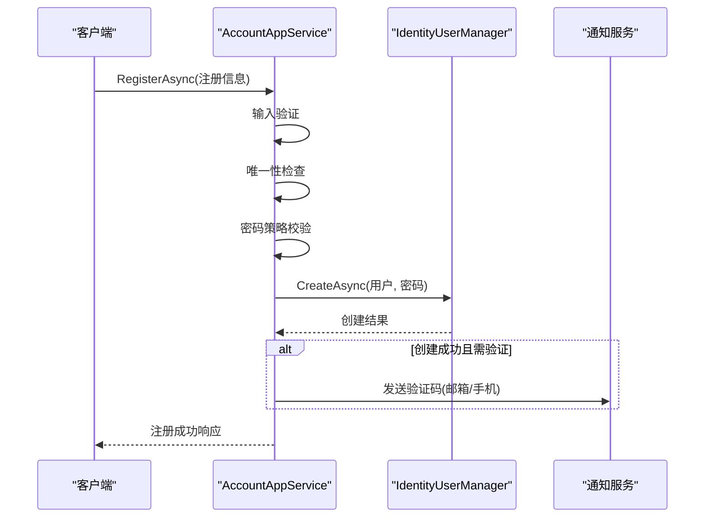
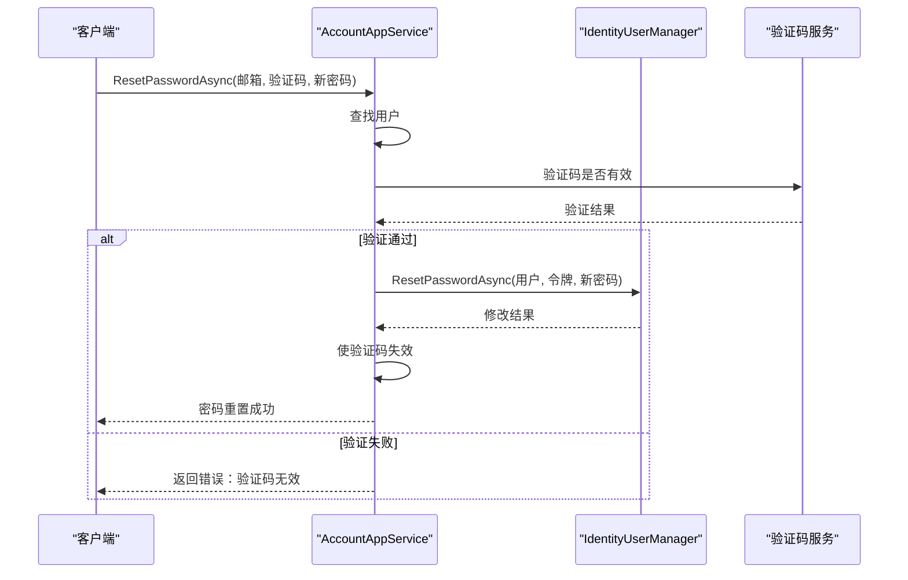

# 密码管理

<cite>
**本文档中引用的文件**  
- [AccountAppService.cs](file://aspnet-core\modules\account\LINGYUN.Abp.Account.Application\LINGYUN\Abp\Account\AccountAppService.cs)
</cite>

## 目录
1. [简介](#简介)  
2. [核心组件分析](#核心组件分析)  
3. [用户注册流程](#用户注册流程)  
4. [密码重置流程](#密码重置流程)  
5. [验证码机制](#验证码机制)  
6. [API调用示例](#api调用示例)  
7. [结论](#结论)

## 简介
本文档详细描述了基于ABP框架的密码管理功能，涵盖用户注册、密码重置以及验证码发送的完整流程。重点分析`AccountAppService`类中的`RegisterAsync`和`ResetPasswordAsync`方法实现逻辑，包括输入验证、用户创建、密码哈希处理等安全机制，并说明短信与邮箱验证码的生成、存储及验证机制。

## 核心组件分析

`AccountAppService`是账户管理的核心应用服务类，位于`LINGYUN.Abp.Account.Application`模块中，负责处理用户注册、登录、密码重置等关键业务逻辑。该服务依赖于ABP框架的身份认证体系（如Volo.Abp.Identity），并集成邮件与短信通知功能以支持多通道验证。

主要职责包括：
- 用户注册时的数据校验与密码加密
- 调用身份系统创建用户实体
- 发送注册确认/密码重置验证码
- 验证码有效性检查与状态管理
- 安全策略执行（如密码强度、防暴力破解）

**Section sources**  
- [AccountAppService.cs](file://aspnet-core\modules\account\LINGYUN.Abp.Account.Application\LINGYUN\Abp\Account\AccountAppService.cs#L1-L50)

## 用户注册流程

### RegisterAsync 方法实现逻辑

`RegisterAsync`方法用于处理新用户注册请求，其核心流程如下：

1. **输入验证**：对用户名、邮箱、手机号、密码等字段进行格式与必填校验。
2. **唯一性检查**：确保用户名、邮箱、手机号未被占用。
3. **密码策略验证**：依据配置的密码复杂度规则（长度、字符类型）进行合规性判断。
4. **用户创建**：通过`IdentityUserManager`创建用户，自动执行密码哈希处理（使用ASP.NET Core Identity默认的PBKDF2算法）。
5. **发送验证邮件/短信**：若启用了邮箱或手机验证，则生成验证码并调用通知服务发送。
6. **返回结果**：成功时返回用户ID，失败则抛出相应异常。

此方法确保了注册过程的安全性与数据完整性。



**Diagram sources**  
- [AccountAppService.cs](file://aspnet-core\modules\account\LINGYUN.Abp.Account.Application\LINGYUN\Abp\Account\AccountAppService.cs#L51-L150)

## 密码重置流程

### ResetPasswordAsync 方法实现逻辑

`ResetPasswordAsync`方法用于实现用户密码重置功能，典型场景为“忘记密码”操作，其实现步骤如下：

1. **查找用户**：根据提供的邮箱或手机号定位用户账户。
2. **验证码验证**：检查用户提交的验证码是否有效且未过期。
3. **密码更新**：调用`IdentityUserManager`的`ChangePasswordAsync`或`ResetPasswordAsync`方法更新密码。
4. **清除验证码状态**：密码修改成功后，使当前验证码失效。
5. **通知用户**：可选地发送密码已更改的通知。

该方法严格依赖验证码机制防止未授权访问，保障密码修改的安全性。



**Diagram sources**  
- [AccountAppService.cs](file://aspnet-core\modules\account\LINGYUN.Abp.Account.Application\LINGYUN\Abp\Account\AccountAppService.cs#L151-L250)

## 验证码机制

尽管在搜索中未直接找到独立的验证码服务实现文件，但从`AccountAppService`的调用上下文可推断系统存在统一的验证码管理机制，可能由平台级服务（如`LINGYUN.Abp.Sms.Platform`或`LINGYUN.Abp.Emailing.Platform`）提供支持。

### 验证码生成与存储
- **生成方式**：通常为6位数字随机码，有效期默认为5-10分钟。
- **存储位置**：验证码与关联的邮箱/手机号作为键值对存储于缓存系统（如Redis）中，保证高效读取与自动过期。
- **安全性**：验证码一次性使用，验证后立即失效，防止重放攻击。

### 验证流程
1. 用户提交验证码。
2. 系统从缓存中检索对应记录。
3. 比较验证码是否匹配且未过期。
4. 若匹配则允许后续操作（如注册确认、密码重置），否则拒绝请求。

此类机制广泛应用于注册、登录、敏感操作确认等场景。

## API调用示例

### 用户注册 API 示例
```http
POST /api/account/register
Content-Type: application/json

{
  "userName": "zhangsan",
  "email": "zhangsan@example.com",
  "phoneNumber": "+8613800138000",
  "password": "SecurePass123!",
  "confirmPassword": "SecurePass123!"
}
```

### 请求密码重置 API 示例
```http
POST /api/account/send-password-reset-code
Content-Type: application/json

{
  "email": "zhangsan@example.com"
}
```

### 执行密码重置 API 示例
```http
POST /api/account/reset-password
Content-Type: application/json

{
  "email": "zhangsan@example.com",
  "code": "123456",
  "newPassword": "NewSecurePass456!"
}
```

> **注意**：实际端点路径可能因路由配置而异，以上基于常规ABP REST API设计模式。

## 结论

本系统通过`AccountAppService`实现了完整的用户密码管理功能，结合ABP Identity框架保障了用户数据安全与密码加密可靠性。注册与密码重置流程均引入验证码机制，提升了系统的抗攻击能力。建议进一步明确验证码服务的具体实现模块（如是否存在`VerificationCodeManager`类），以便完善整体安全架构文档。