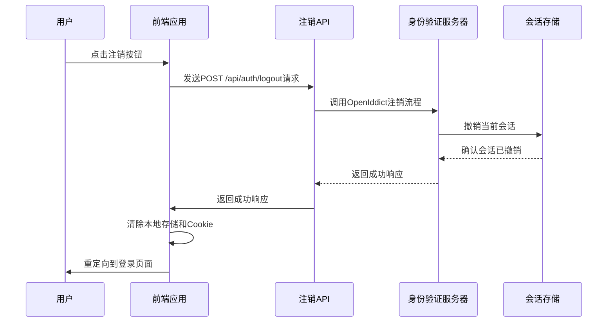
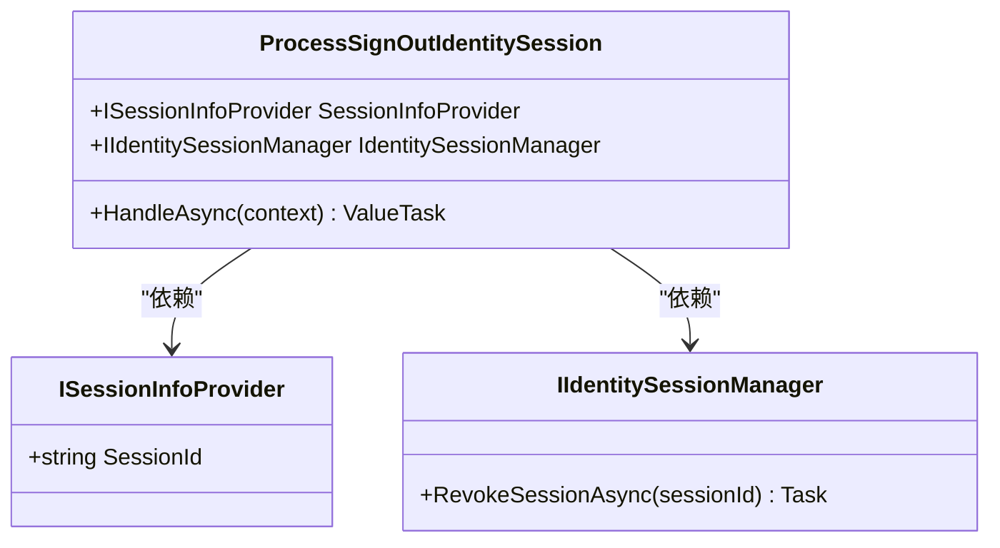
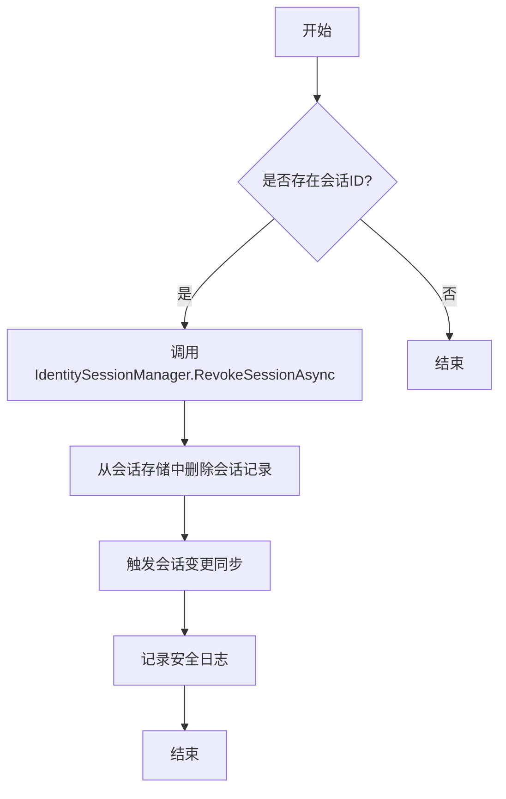
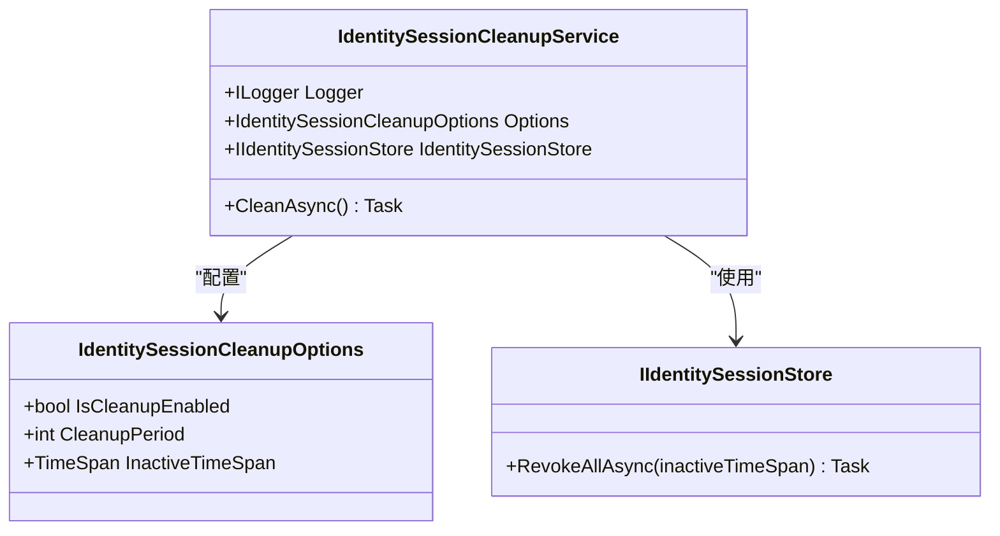

# 注销流程

<cite>
**本文档引用的文件**
- [ProcessSignOutIdentitySession.cs](file://aspnet-core\modules\openIddict\LINGYUN.Abp.OpenIddict.AspNetCore.Session\LINGYUN\Abp\OpenIddict\AspNetCore\Session\ProcessSignOutIdentitySession.cs)
- [logout.post.ts](file://apps\vben5\apps\backend-mock\api\auth\logout.post.ts)
- [login.vue](file://apps\vben5\apps\app-antd\src\views\_core\authentication\login.vue)
- [IdentitySessionCleanupService.cs](file://aspnet-core\modules\identity\LINGYUN.Abp.Identity.Domain\LINGYUN\Abp\Identity\Session\IdentitySessionCleanupService.cs)
- [IdentitySessionStore.cs](file://aspnet-core\modules\identity\LINGYUN.Abp.Identity.Domain\LINGYUN\Abp\Identity\Session\IdentitySessionStore.cs)
</cite>

## 目录
1. [简介](#简介)
2. [注销流程概述](#注销流程概述)
3. [核心组件分析](#核心组件分析)
4. [后端处理逻辑](#后端处理逻辑)
5. [前端实现机制](#前端实现机制)
6. [会话清理与安全日志](#会话清理与安全日志)
7. [租户Cookie清除机制](#租户cookie清除机制)
8. [安全最佳实践](#安全最佳实践)
9. [结论](#结论)

## 简介
本文档详细描述了ABP框架中用户注销流程的完整实现。重点阐述了用户发起注销请求后的处理过程，包括会话清理、安全日志记录和重定向逻辑。文档深入分析了`LogoutModel`如何与`SignInManager`协作完成用户登出操作，解释了租户Cookie的清除机制，并提供了防止CSRF攻击等安全最佳实践建议。

## 注销流程概述
用户注销流程是一个多层协同工作的过程，涉及前端界面交互、API调用、身份验证服务器处理以及数据库会话状态更新。当用户点击"注销"按钮时，系统将执行一系列安全操作来终止当前会话并清理相关资源。



**图示来源**
- [logout.post.ts](file://apps\vben5\apps\backend-mock\api\auth\logout.post.ts)
- [ProcessSignOutIdentitySession.cs](file://aspnet-core\modules\openIddict\LINGYUN.Abp.OpenIddict.AspNetCore.Session\LINGYUN\Abp\OpenIddict\AspNetCore\Session\ProcessSignOutIdentitySession.cs)

## 核心组件分析
注销功能的核心由多个关键组件构成，这些组件协同工作以确保安全可靠的会话终止。

### LogoutModel与SignInManager协作
在ABP框架中，虽然没有显式的`LogoutModel`类，但通过`ProcessSignOutIdentitySession`处理器实现了类似的功能。该处理器作为OpenIddict服务器事件的处理程序，负责在用户请求注销时终止会话。



**图示来源**
- [ProcessSignOutIdentitySession.cs](file://aspnet-core\modules\openIddict\LINGYUN.Abp.OpenIddict.AspNetCore.Session\LINGYUN\Abp\OpenIddict\AspNetCore\Session\ProcessSignOutIdentitySession.cs)

## 后端处理逻辑
后端注销逻辑主要由OpenIddict框架和自定义会话管理服务共同实现。

### OpenIddict注销处理器
`ProcessSignOutIdentitySession`类是注销流程的核心处理器，它监听OpenIddict的`ProcessSignOutContext`事件，在用户请求注销时执行会话撤销操作。



**图示来源**
- [ProcessSignOutIdentitySession.cs](file://aspnet-core\modules\openIddict\LINGYUN.Abp.OpenIddict.AspNetCore.Session\LINGYUN\Abp\OpenIddict\AspNetCore\Session\ProcessSignOutIdentitySession.cs)
- [IdentitySessionStore.cs](file://aspnet-core\modules\identity\LINGYUN.Abp.Identity.Domain\LINGYUN\Abp\Identity\Session\IdentitySessionStore.cs)

## 前端实现机制
前端注销功能通过Vue.js组件和API调用实现，确保用户界面与后端服务的无缝集成。

### 前端注销API
前端通过调用特定的API端点来触发注销流程，同时处理相关的Cookie和本地存储清理。

```typescript
// apps/vben5/apps/backend-mock/api/auth/logout.post.ts
import {
  clearRefreshTokenCookie,
  getRefreshTokenFromCookie,
} from '~/utils/cookie-utils';

export default defineEventHandler(async (event) => {
  const refreshToken = getRefreshTokenFromCookie(event);
  if (!refreshToken) {
    return useResponseSuccess('');
  }

  clearRefreshTokenCookie(event);

  return useResponseSuccess('');
});
```

**代码片段来源**
- [logout.post.ts](file://apps\vben5\apps\backend-mock\api\auth\logout.post.ts)

### 前端登录组件
登录组件不仅处理登录逻辑，还包含与认证状态相关的各种功能，包括可能的注销操作触发。

**代码片段来源**
- [login.vue](file://apps\vben5\apps\app-antd\src\views\_core\authentication\login.vue)

## 会话清理与安全日志
系统提供了自动化的会话清理机制和完整的安全日志记录功能。

### 会话清理服务
`IdentitySessionCleanupService`负责定期清理不活跃的用户会话，维护系统的安全性和性能。



**图示来源**
- [IdentitySessionCleanupService.cs](file://aspnet-core\modules\identity\LINGYUN.Abp.Identity.Domain\LINGYUN\Abp\Identity\Session\IdentitySessionCleanupService.cs)
- [IdentitySessionCleanupOptions.cs](file://aspnet-core\modules\identity\LINGYUN.Abp.Identity.Domain\LINGYUN\Abp\Identity\Session\IdentitySessionCleanupOptions.cs)

## 租户Cookie清除机制
系统在注销过程中会彻底清除与租户相关的所有Cookie，确保多租户环境下的安全性。

### Cookie清除流程
1. 获取当前用户的刷新令牌Cookie
2. 验证令牌存在性
3. 调用`clearRefreshTokenCookie`函数清除Cookie
4. 确认清除操作完成

此机制确保即使在多租户架构下，用户注销后也不会留下任何可被利用的身份信息。

**代码片段来源**
- [logout.post.ts](file://apps\vben5\apps\backend-mock\api\auth\logout.post.ts)

## 安全最佳实践
为确保注销流程的安全性，系统实施了多项最佳实践措施。

### CSRF防护
尽管当前实现中未显式展示CSRF令牌处理，但在生产环境中应确保：
- 在注销请求中包含CSRF令牌验证
- 使用SameSite Cookie属性防止跨站请求伪造
- 实施严格的CORS策略

### 会话固定攻击防护
通过以下方式防止会话固定攻击：
- 注销时彻底清除服务器端会话记录
- 生成新的会话ID进行重新认证
- 设置适当的Cookie安全属性（HttpOnly, Secure）

### 安全日志记录
系统自动记录所有注销事件，包括：
- 用户ID
- 会话ID
- 时间戳
- IP地址
- 设备信息

这些日志可用于审计和异常行为检测。

## 结论
本文档全面介绍了ABP框架中的用户注销流程。通过分析前后端组件的协同工作，我们了解了从用户点击注销按钮到完全终止会话的完整过程。系统通过OpenIddict框架、自定义会话管理服务和前端API的紧密配合，实现了安全可靠的用户登出功能。建议在实际部署时加强CSRF防护和安全日志监控，以进一步提升系统的整体安全性。