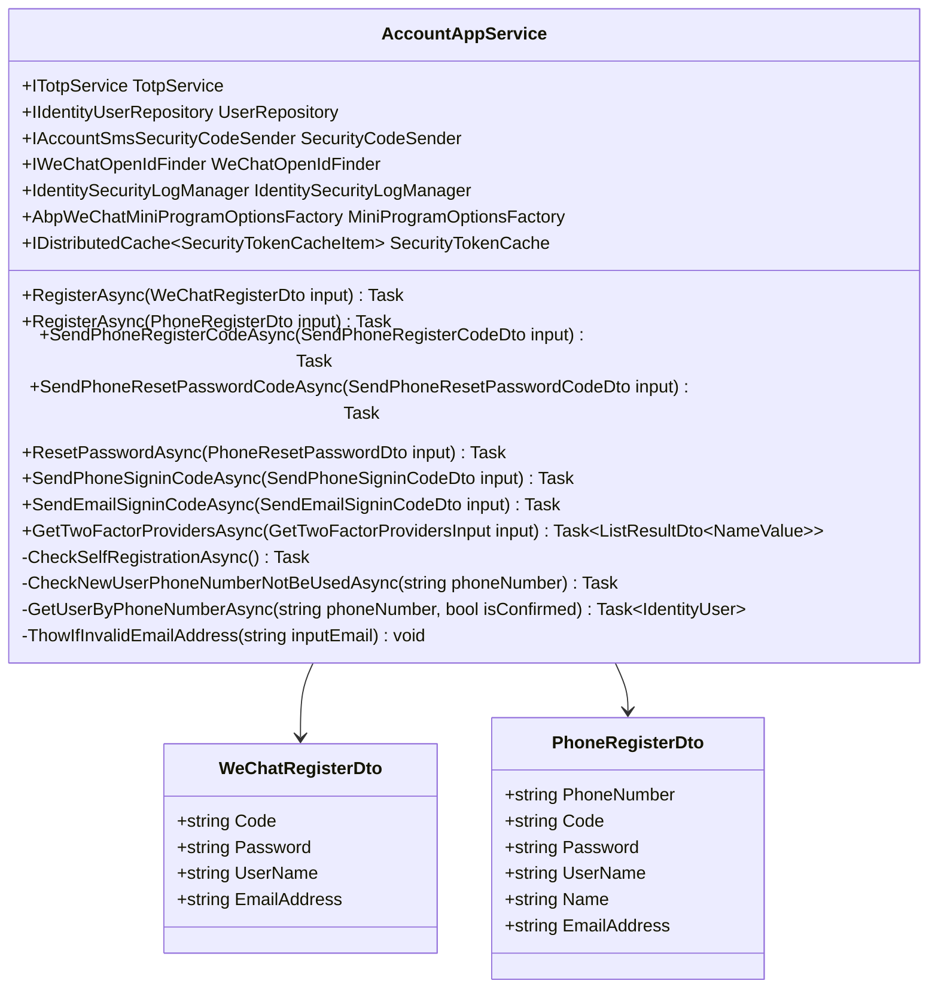

# 登录流程详细文档

<cite>
**本文档中引用的文件**
- [Login.cshtml.cs](file://aspnet-core/modules/account/LINGYUN.Abp.Account.Web/Pages/Account/Login.cshtml.cs)
- [AccountAppService.cs](file://aspnet-core/modules/account/LINGYUN.Abp.Account.Application/LINGYUN/Abp/Account/AccountAppService.cs)
- [WeChatTokenExtensionGrant.cs](file://aspnet-core/modules/openIddict/LINGYUN.Abp.OpenIddict.WeChat/LINGYUN/Abp/OpenIddict/WeChat/WeChatTokenExtensionGrant.cs)
- [Login.vue](file://apps/vue/src/views/sys/login/Login.vue)
- [LoginForm.vue](file://apps/vue/src/views/sys/login/LoginForm.vue)
- [useLogin.ts](file://apps/vue/src/views/sys/login/useLogin.ts)
- [AccountSettingDefinitionProvider.cs](file://aspnet-core/services/LY.MicroService.BackendAdmin.HttpApi.Host/Settings/AccountSettingDefinitionProvider.cs)
- [AccountController.cs](file://aspnet-core/modules/account/LINGYUN.Abp.Account.HttpApi/LINGYUN/Abp/Account/AccountController.cs)
- [WeChatRegisterDto.cs](file://aspnet-core/modules/account/LINGYUN.Abp.Account.Application.Contracts/LINGYUN/Abp/Account/Dto/WeChatRegisterDto.cs)
</cite>

## 目录
1. [简介](#简介)
2. [项目结构概览](#项目结构概览)
3. [核心组件分析](#核心组件分析)
4. [架构概览](#架构概览)
5. [详细组件分析](#详细组件分析)
6. [登录流程详解](#登录流程详解)
7. [多因素认证处理](#多因素认证处理)
8. [第三方登录集成](#第三方登录集成)
9. [性能考虑](#性能考虑)
10. [故障排除指南](#故障排除指南)
11. [结论](#结论)

## 简介

本文档详细介绍了 abp-next-admin vben5 项目中的登录流程实现机制。该系统支持多种登录方式，包括基于密码的传统登录、手机号验证码登录、二维码登录以及第三方登录（如微信）。整个登录系统采用分层架构设计，从前端界面到后端服务再到数据库存储，形成了完整的身份验证体系。

## 项目结构概览

登录功能主要分布在以下几个关键模块中：

**图表来源**
- [Login.cshtml.cs](file://aspnet-core/modules/account/LINGYUN.Abp.Account.Web/Pages/Account/Login.cshtml.cs#L1-L50)
- [AccountAppService.cs](file://aspnet-core/modules/account/LINGYUN.Abp.Account.Application/LINGYUN/Abp/Account/AccountAppService.cs#L1-L50)

## 核心组件分析

### 前端登录组件

前端登录系统由多个 Vue 组件组成，形成完整的登录界面：

- **Login.vue**: 主登录容器组件，负责整体布局和状态管理
- **LoginForm.vue**: 密码登录表单组件，处理用户名密码验证
- **useLogin.ts**: 登录状态和表单验证逻辑管理
- **各种登录模式组件**: 支持手机号登录、二维码登录、第三方登录等

### 后端登录模型

后端采用 ASP.NET Core 的页面模型模式，核心类包括：

- **LoginModel**: 主要的登录处理类，继承自 AccountPageModel
- **PasswordLoginInputModel**: 密码登录输入模型
- **PhoneLoginInputModel**: 手机号登录输入模型
- **QrCodeLoginInputModel**: 二维码登录输入模型

**章节来源**
- [Login.cshtml.cs](file://aspnet-core/modules/account/LINGYUN.Abp.Account.Web/Pages/Account/Login.cshtml.cs#L25-L100)
- [LoginForm.vue](file://apps/vue/src/views/sys/login/LoginForm.vue#L1-L50)

## 架构概览

登录系统采用分层架构设计，确保职责分离和可维护性：

**图表来源**
- [Login.cshtml.cs](file://aspnet-core/modules/account/LINGYUN.Abp.Account.Web/Pages/Account/Login.cshtml.cs#L80-L120)
- [AccountAppService.cs](file://aspnet-core/modules/account/LINGYUN.Abp.Account.Application/LINGYUN/Abp/Account/AccountAppService.cs#L40-L80)

## 详细组件分析

### LoginModel 类分析

LoginModel 是登录流程的核心控制器，负责处理所有类型的登录请求：

**图表来源**
- [Login.cshtml.cs](file://aspnet-core/modules/account/LINGYUN.Abp.Account.Web/Pages/Account/Login.cshtml.cs#L25-L150)

### AccountAppService 类分析

AccountAppService 提供了账户相关的业务逻辑，特别是手机号和微信登录：

**图表来源**
- [AccountAppService.cs](file://aspnet-core/modules/account/LINGYUN.Abp.Account.Application/LINGYUN/Abp/Account/AccountAppService.cs#L20-L60)
- [WeChatRegisterDto.cs](file://aspnet-core/modules/account/LINGYUN.Abp.Account.Application.Contracts/LINGYUN/Abp/Account/Dto/WeChatRegisterDto.cs#L1-L28)

**章节来源**
- [Login.cshtml.cs](file://aspnet-core/modules/account/LINGYUN.Abp.Account.Web/Pages/Account/Login.cshtml.cs#L25-L200)
- [AccountAppService.cs](file://aspnet-core/modules/account/LINGYUN.Abp.Account.Application/LINGYUN/Abp/Account/AccountAppService.cs#L20-L100)

## 登录流程详解

### 密码登录流程

密码登录是最传统的登录方式，流程如下：

**图表来源**
- [Login.cshtml.cs](file://aspnet-core/modules/account/LINGYUN.Abp.Account.Web/Pages/Account/Login.cshtml.cs#L80-L150)

### 手机号验证码登录流程

手机号验证码登录提供了更便捷的登录体验：

**图表来源**
- [AccountAppService.cs](file://aspnet-core/modules/account/LINGYUN.Abp.Account.Application/LINGYUN/Abp/Account/AccountAppService.cs#L300-L350)

### 微信登录流程

微信登录支持小程序和公众号两种场景：

**图表来源**
- [WeChatTokenExtensionGrant.cs](file://aspnet-core/modules/openIddict/LINGYUN.Abp.OpenIddict.WeChat/LINGYUN/Abp/OpenIddict/WeChat/WeChatTokenExtensionGrant.cs#L60-L120)

**章节来源**
- [Login.cshtml.cs](file://aspnet-core/modules/account/LINGYUN.Abp.Account.Web/Pages/Account/Login.cshtml.cs#L150-L250)
- [AccountAppService.cs](file://aspnet-core/modules/account/LINGYUN.Abp.Account.Application/LINGYUN/Abp/Account/AccountAppService.cs#L40-L100)

## 多因素认证处理

系统支持多种多因素认证方式，包括：

### 双因子认证流程

### 支持的双因子提供商

系统支持以下双因子提供商：
- **电话号码**: 使用短信验证码
- **电子邮件**: 使用邮件验证码
- **TOTP**: 时间基础一次性密码

**章节来源**
- [Login.cshtml.cs](file://aspnet-core/modules/account/LINGYUN.Abp.Account.Web/Pages/Account/Login.cshtml.cs#L100-L120)
- [AccountAppService.cs](file://aspnet-core/modules/account/LINGYUN.Abp.Account.Application/LINGYUN/Abp/Account/AccountAppService.cs#L350-L400)

## 第三方登录集成

### 微信登录集成

系统集成了微信登录功能，支持小程序和公众号：

**图表来源**
- [WeChatTokenExtensionGrant.cs](file://aspnet-core/modules/openIddict/LINGYUN.Abp.OpenIddict.WeChat/LINGYUN/Abp/OpenIddict/WeChat/WeChatTokenExtensionGrant.cs#L25-L50)

### 其他第三方登录

系统还支持其他第三方登录方式：
- **QQ登录**: 通过 LINGYUN.Abp.Authentication.QQ 模块
- **工作微信登录**: 通过 LINGYUN.Abp.Identity.WeChat.Work 模块
- **OpenIddict集成**: 支持标准OAuth2/OpenID Connect协议

**章节来源**
- [WeChatTokenExtensionGrant.cs](file://aspnet-core/modules/openIddict/LINGYUN.Abp.OpenIddict.WeChat/LINGYUN/Abp/OpenIddict/WeChat/WeChatTokenExtensionGrant.cs#L1-L100)

## 性能考虑

### 缓存策略

系统采用了多层次的缓存策略来提升性能：

1. **分布式缓存**: 用于存储验证码、安全令牌等临时数据
2. **动态声明缓存**: 减少用户权限重新计算的开销
3. **会话缓存**: 管理用户会话状态

### 并发控制

系统支持多种并发登录策略：
- **无限制**: 允许同时多个设备登录
- **同类型设备限制**: 限制同类型设备的登录数量
- **全部设备登出**: 当新设备登录时，旧设备自动登出

### 安全优化

- **验证码防刷**: 通过缓存机制防止验证码重复发送
- **密码强度验证**: 前端和后端双重验证
- **SQL注入防护**: 使用参数化查询
- **XSS防护**: HTML实体编码输出

## 故障排除指南

### 常见登录问题

1. **验证码发送失败**
   - 检查短信服务配置
   - 验证手机号格式
   - 确认缓存服务可用性

2. **微信登录失败**
   - 验证微信应用配置
   - 检查网络连接
   - 确认回调地址正确

3. **双因子认证问题**
   - 检查TOTP时间同步
   - 验证设备兼容性
   - 确认应用权限

### 日志分析

系统提供了详细的日志记录：
- **安全事件日志**: 记录所有登录尝试
- **错误日志**: 详细记录异常信息
- **审计日志**: 追踪用户操作历史

**章节来源**
- [AccountAppService.cs](file://aspnet-core/modules/account/LINGYUN.Abp.Account.Application/LINGYUN/Abp/Account/AccountAppService.cs#L200-L250)

## 结论

abp-next-admin vben5 的登录系统是一个功能完善、架构清晰的身份验证解决方案。它支持多种登录方式，具备良好的扩展性和安全性。通过合理的分层设计和模块化架构，系统能够满足不同场景下的登录需求，同时保持代码的可维护性和可扩展性。

系统的亮点包括：
- **多样化登录方式**: 支持密码、手机号、二维码、第三方等多种登录方式
- **完善的多因素认证**: 提供灵活的双因子认证机制
- **强大的第三方集成**: 易于扩展的第三方登录支持
- **高性能设计**: 采用缓存和优化策略提升系统性能
- **安全保障**: 多层次的安全防护措施

通过本文档的详细介绍，开发者可以深入理解登录系统的实现原理，并根据具体需求进行定制和扩展。