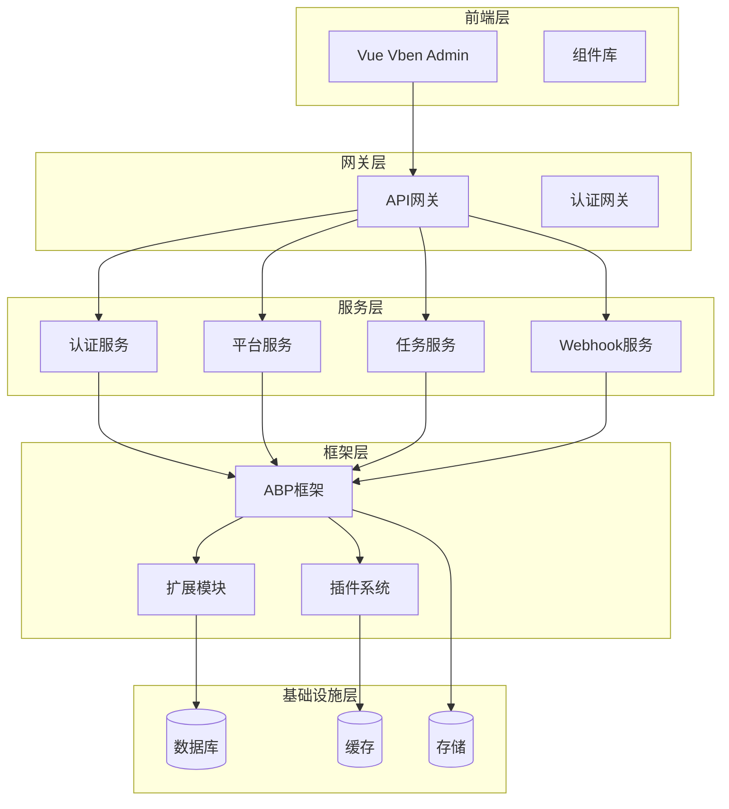
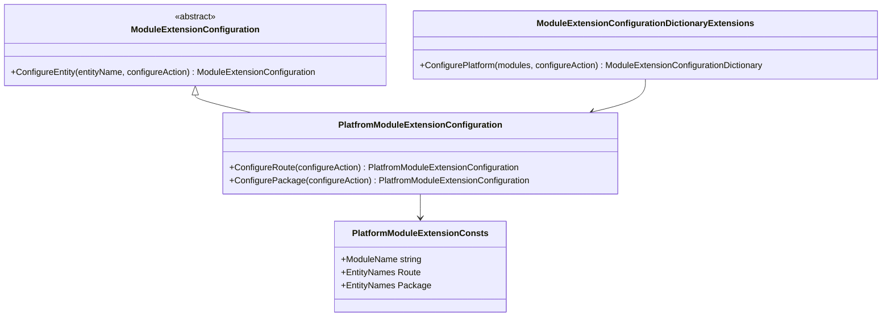
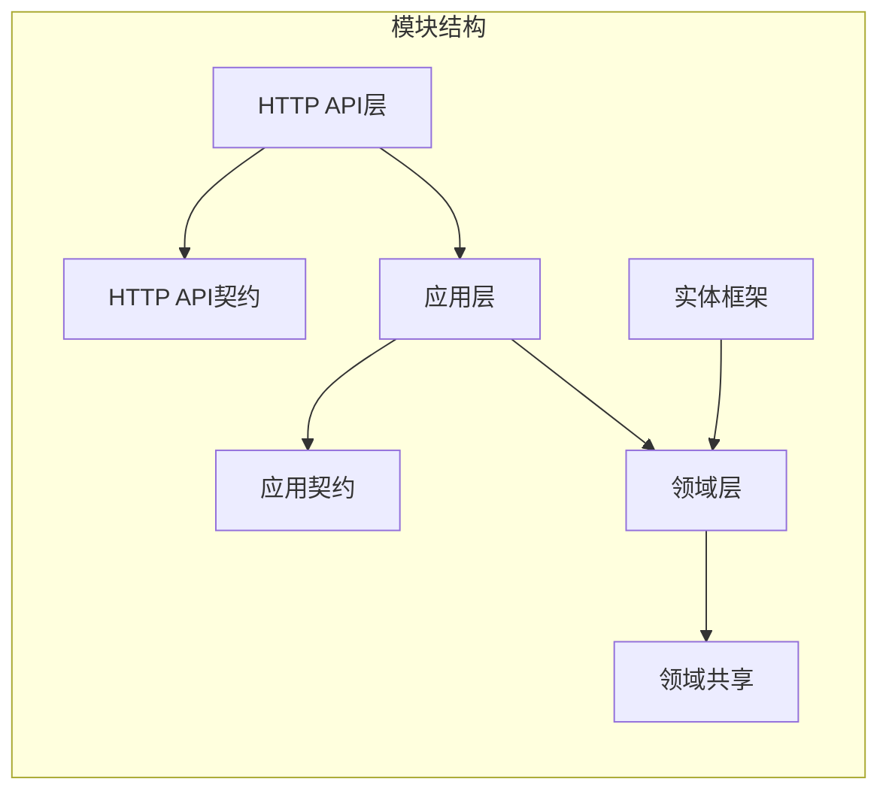
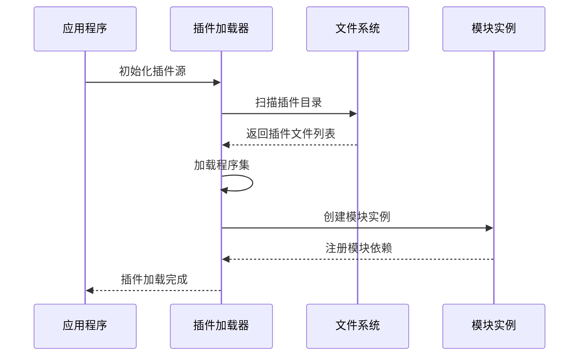
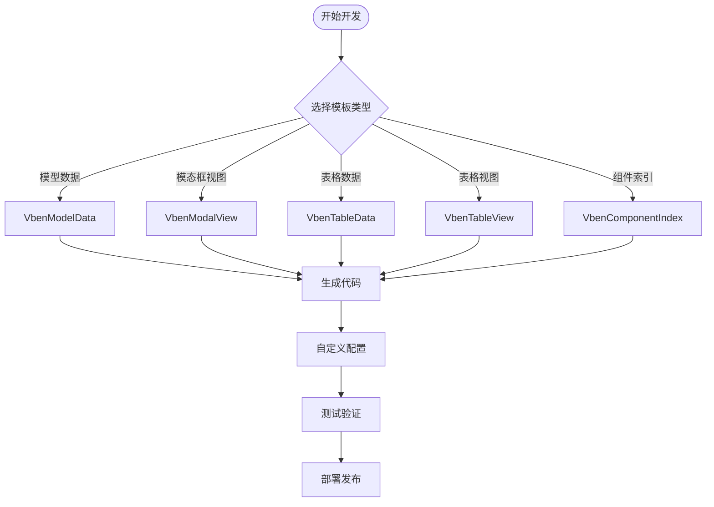
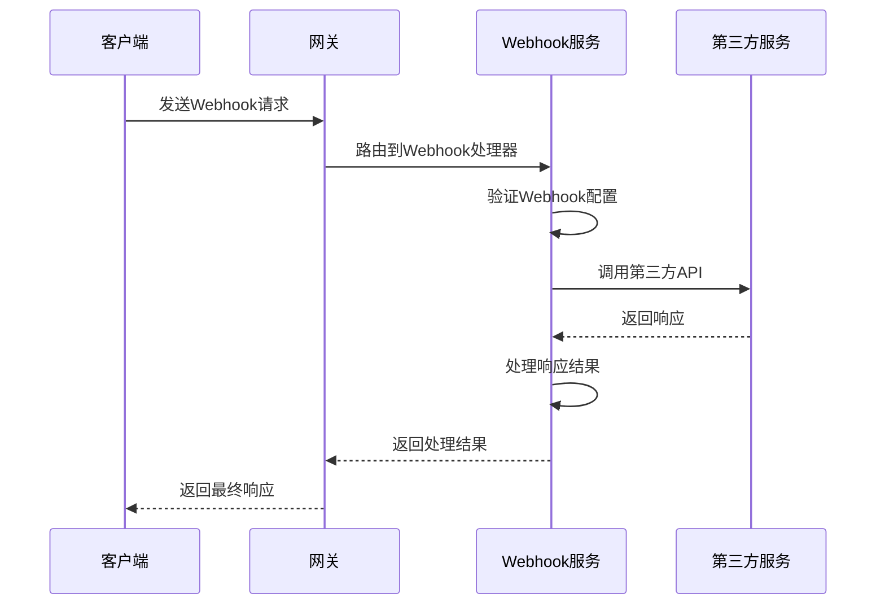

# 扩展开发

<cite>
**本文档中引用的文件**
- [Program.cs](file://aspnet-core/services/LY.MicroService.WebhooksManagement.HttpApi.Host/Program.cs)
- [Program.cs](file://aspnet-core/templates/micro/content/host/PackageName.CompanyName.ProjectName.HttpApi.Host/Program.cs)
- [PlatfromModuleExtensionConfiguration.cs](file://aspnet-core/modules/platform/LINGYUN.Platform.Domain.Shared/LINGYUN/Platform/ObjectExtending/PlatfromModuleExtensionConfiguration.cs)
- [PlatformModuleExtensionConfigurationDictionaryExtensions.cs](file://aspnet-core/modules/platform/LINGYUN.Platform.Domain.Shared/LINGYUN/Platform/ObjectExtending/PlatformModuleExtensionConfigurationDictionaryExtensions.cs)
- [SaasModuleExtensionConfiguration.cs](file://aspnet-core/modules/saas/LINGYUN.Abp.Saas.Domain.Shared/LINGYUN/Abp/Saas/ObjectExtending/SaasModuleExtensionConfiguration.cs)
- [VbenScriptTemplateDefinitionProvider.cs](file://aspnet-core/framework/cli/LINGYUN.Abp.Cli/LINGYUN/Abp/Cli/UI/Vben/VbenScriptTemplateDefinitionProvider.cs)
- [WebhookHttpClientExtensions.cs](file://aspnet-core/framework/pushplus/LINGYUN.Abp.PushPlus/LINGYUN/Abp/PushPlus/Channel/Webhook/WebhookHttpClientExtensions.cs)
- [MicroServiceApplicationsSingleModule.cs](file://aspnet-core/services/LY.MicroService.Applications.Single/MicroServiceApplicationsSingleModule.cs)
- [ObjectExtending](file://aspnet-core/modules/platform/LINGYUN.Platform.Domain.Shared/LINGYUN/Platform/ObjectExtending/)
- [TemplateDefinitionProvider.cs](file://aspnet-core/framework/cli/LINGYUN.Abp.Cli/LINGYUN/Abp/Cli/UI/Vben/VbenScriptTemplateDefinitionProvider.cs)
</cite>

## 目录
1. [简介](#简介)
2. [项目结构概览](#项目结构概览)
3. [核心扩展机制](#核心扩展机制)
4. [模块扩展开发](#模块扩展开发)
5. [插件系统架构](#插件系统架构)
6. [自定义模块开发](#自定义模块开发)
7. [第三方服务集成](#第三方服务集成)
8. [最佳实践和注意事项](#最佳实践和注意事项)
9. [性能考虑](#性能考虑)
10. [故障排除指南](#故障排除指南)
11. [总结](#总结)

## 简介

ABP Next Admin 是一个基于 ABP 框架构建的企业级应用开发平台，提供了强大的扩展开发能力。本文档旨在为开发者提供在现有系统基础上进行功能扩展的完整指南，包括创建自定义模块、开发插件和集成第三方服务的方法。

该平台采用模块化架构设计，支持动态加载和扩展，允许开发者轻松地添加新功能而不影响核心系统的稳定性。通过遵循本文档提供的指导原则和最佳实践，开发者可以高效地实现业务需求扩展。

## 项目结构概览

ABP Next Admin 项目采用分层模块化架构，主要分为以下几个层次：



**图表来源**
- [MicroServiceApplicationsSingleModule.cs](file://aspnet-core/services/LY.MicroService.Applications.Single/MicroServiceApplicationsSingleModule.cs#L70-L204)

**章节来源**
- [MicroServiceApplicationsSingleModule.cs](file://aspnet-core/services/LY.MicroService.Applications.Single/MicroServiceApplicationsSingleModule.cs#L1-L300)

## 核心扩展机制

### 对象扩展机制

ABP 框架提供了强大的对象扩展机制，允许开发者在不修改原始类的情况下扩展实体属性。这是扩展开发的核心机制之一。



**图表来源**
- [PlatfromModuleExtensionConfiguration.cs](file://aspnet-core/modules/platform/LINGYUN.Platform.Domain.Shared/LINGYUN/Platform/ObjectExtending/PlatfromModuleExtensionConfiguration.cs#L1-L25)
- [PlatformModuleExtensionConfigurationDictionaryExtensions.cs](file://aspnet-core/modules/platform/LINGYUN.Platform.Domain.Shared/LINGYUN/Platform/ObjectExtending/PlatformModuleExtensionConfigurationDictionaryExtensions.cs#L1-L18)

### 扩展配置示例

以下是一个典型的模块扩展配置示例：

```csharp
// 平台模块扩展配置
public class PlatfromModuleExtensionConfiguration : ModuleExtensionConfiguration
{
    public PlatfromModuleExtensionConfiguration ConfigureRoute(
        Action<EntityExtensionConfiguration> configureAction)
    {
        return this.ConfigureEntity(
            PlatformModuleExtensionConsts.EntityNames.Route,
            configureAction
        );
    }

    public PlatfromModuleExtensionConfiguration ConfigurePackage(
        Action<EntityExtensionConfiguration> configureAction)
    {
        return this.ConfigureEntity(
            PlatformModuleExtensionConsts.EntityNames.Package,
            configureAction
        );
    }
}
```

**章节来源**
- [PlatfromModuleExtensionConfiguration.cs](file://aspnet-core/modules/platform/LINGYUN.Platform.Domain.Shared/LINGYUN/Platform/ObjectExtending/PlatfromModuleExtensionConfiguration.cs#L1-L25)

## 模块扩展开发

### 扩展模块结构

每个扩展模块都遵循标准的 ABP 模块结构，包含以下核心组件：



### 扩展模块开发流程

1. **创建模块项目**：按照 ABP 模块规范创建新的模块项目
2. **定义扩展配置**：创建扩展配置类和字典扩展方法
3. **注册模块依赖**：在主模块中注册扩展模块
4. **实现业务逻辑**：在应用层和服务层实现具体功能
5. **配置数据访问**：设置实体框架和数据库迁移

### 扩展配置字典扩展

```csharp
public static class PlatformModuleExtensionConfigurationDictionaryExtensions
{
    public static ModuleExtensionConfigurationDictionary ConfigurePlatform(
        this ModuleExtensionConfigurationDictionary modules,
        Action<PlatfromModuleExtensionConfiguration> configureAction)
    {
        return modules.ConfigureModule(
            PlatformModuleExtensionConsts.ModuleName,
            configureAction
        );
    }
}
```

**章节来源**
- [PlatformModuleExtensionConfigurationDictionaryExtensions.cs](file://aspnet-core/modules/platform/LINGYUN.Platform.Domain.Shared/LINGYUN/Platform/ObjectExtending/PlatformModuleExtensionConfigurationDictionaryExtensions.cs#L1-L18)

## 插件系统架构

### 插件加载机制

ABP Next Admin 支持动态插件加载，允许在运行时加载和卸载模块。插件系统基于 ASP.NET Core 的模块化架构。



**图表来源**
- [Program.cs](file://aspnet-core/services/LY.MicroService.WebhooksManagement.HttpApi.Host/Program.cs#L40-L50)

### 插件配置示例

以下是插件加载的标准配置方式：

```csharp
// 搜索 Modules 目录下所有文件作为插件
var pluginFolder = Path.Combine(Directory.GetCurrentDirectory(), "Modules");
DirectoryHelper.CreateIfNotExists(pluginFolder);
options.PlugInSources.AddFolder(
    pluginFolder,
    SearchOption.AllDirectories);
```

**章节来源**
- [Program.cs](file://aspnet-core/services/LY.MicroService.WebhooksManagement.HttpApi.Host/Program.cs#L40-L50)
- [Program.cs](file://aspnet-core/templates/micro/content/host/PackageName.CompanyName.ProjectName.HttpApi.Host/Program.cs#L35-L45)

## 自定义模块开发

### CLI 工具模板系统

ABP Next Admin 提供了强大的 CLI 工具，支持自动生成各种类型的模板代码。



**图表来源**
- [VbenScriptTemplateDefinitionProvider.cs](file://aspnet-core/framework/cli/LINGYUN.Abp.Cli/LINGYUN/Abp/Cli/UI/Vben/VbenScriptTemplateDefinitionProvider.cs#L10-L35)

### 模板定义提供者

```csharp
public class VbenScriptTemplateDefinitionProvider : TemplateDefinitionProvider
{
    public override void Define(ITemplateDefinitionContext context)
    {
        context.Add(CreateCliTemplates());
    }

    private static TemplateDefinition[] CreateCliTemplates()
    {
        return new[]
        {
            new TemplateDefinition(
                "VbenModelData",
                typeof(DefaultResource),
                L("Templates:VbenModelData")
            ).WithVirtualFilePath("/LINGYUN/Abp/Cli/UI/Vben/Templates/VbenModelDataScript.tpl", true),
            // 更多模板定义...
        };
    }
}
```

**章节来源**
- [VbenScriptTemplateDefinitionProvider.cs](file://aspnet-core/framework/cli/LINGYUN.Abp.Cli/LINGYUN/Abp/Cli/UI/Vben/VbenScriptTemplateDefinitionProvider.cs#L1-L50)

## 第三方服务集成

### Webhook 集成示例

ABP Next Admin 提供了完整的 Webhook 集成功能，支持与第三方服务的无缝对接。



**图表来源**
- [WebhookHttpClientExtensions.cs](file://aspnet-core/framework/pushplus/LINGYUN.Abp.PushPlus/LINGYUN/Abp/PushPlus/Channel/Webhook/WebhookHttpClientExtensions.cs#L35-L70)

### HTTP 客户端扩展

```csharp
public async static Task<string> GetCreateWebhookContentAsync(
    this HttpClient httpClient,
    string accessKey,
    string webhookCode,
    string webhookName,
    PushPlusWebhookType webhookType,
    string webhookUrl,
    CancellationToken cancellationToken = default)
{
    var requestMessage = new HttpRequestMessage(
        HttpMethod.Post,
        "/api/open/webhook/add");

    var requestBody = _createWebhookTemplate
        .Replace("$webhookCode", webhookCode)
        .Replace("$webhookName", webhookName)
        .Replace("$webhookType", ((int)webhookType).ToString())
        .Replace("$webhookUrl", webhookUrl);

    requestMessage.Content = new StringContent(requestBody, Encoding.UTF8, "application/json");
    requestMessage.Headers.TryAddWithoutValidation("access-key", accessKey);

    var httpResponse = await httpClient.SendAsync(requestMessage, cancellationToken);
    return await httpResponse.Content.ReadAsStringAsync();
}
```

**章节来源**
- [WebhookHttpClientExtensions.cs](file://aspnet-core/framework/pushplus/LINGYUN.Abp.PushPlus/LINGYUN/Abp/PushPlus/Channel/Webhook/WebhookHttpClientExtensions.cs#L35-L70)

## 最佳实践和注意事项

### 模块设计原则

1. **单一职责原则**：每个模块应该专注于特定的功能领域
2. **松耦合设计**：模块之间通过接口通信，避免直接依赖
3. **可扩展性**：设计时要考虑未来的功能扩展需求
4. **向后兼容**：新版本应该保持对旧版本的兼容性

### 性能优化建议

1. **延迟加载**：只在需要时加载模块和相关资源
2. **缓存策略**：合理使用缓存减少重复计算和数据库查询
3. **异步处理**：对于耗时操作使用异步模式
4. **资源池化**：对频繁使用的资源进行池化管理

### 安全考虑

1. **输入验证**：对所有外部输入进行严格验证
2. **权限控制**：实施细粒度的权限控制机制
3. **数据加密**：敏感数据应该进行加密存储和传输
4. **日志审计**：记录关键操作以便审计和问题追踪

### 兼容性保证

1. **版本管理**：明确模块版本号和兼容性矩阵
2. **接口稳定性**：保持公共接口的稳定性
3. **迁移指南**：提供详细的升级和迁移指南
4. **测试覆盖**：确保充分的单元测试和集成测试

## 性能考虑

扩展开发过程中需要特别注意性能影响，特别是在以下方面：

### 内存管理
- 合理使用对象生命周期
- 避免内存泄漏和循环引用
- 使用对象池减少垃圾回收压力

### 并发处理
- 实施适当的并发控制机制
- 避免死锁和竞态条件
- 使用异步编程模式提高响应性

### 数据库优化
- 设计合理的数据库索引
- 实施查询优化策略
- 使用连接池管理数据库连接

## 故障排除指南

### 常见问题及解决方案

1. **模块加载失败**
   - 检查程序集依赖关系
   - 验证模块配置正确性
   - 查看应用程序日志

2. **插件冲突**
   - 检查模块版本兼容性
   - 验证命名空间冲突
   - 清理临时文件和缓存

3. **性能问题**
   - 分析内存使用情况
   - 检查数据库查询效率
   - 监控网络请求延迟

### 调试技巧

1. **启用详细日志**：配置日志级别获取更多调试信息
2. **使用断点调试**：在关键位置设置断点进行跟踪
3. **性能分析**：使用性能分析工具识别瓶颈
4. **单元测试**：编写全面的单元测试验证功能

**章节来源**
- [Program.cs](file://aspnet-core/services/LY.MicroService.WebhooksManagement.HttpApi.Host/Program.cs#L1-L74)

## 总结

ABP Next Admin 提供了一个强大而灵活的扩展开发平台，通过模块化架构、对象扩展机制、插件系统和丰富的模板工具，开发者可以高效地实现各种业务功能扩展。

关键要点包括：

1. **模块化设计**：遵循 ABP 框架的模块化规范
2. **扩展机制**：利用对象扩展和配置字典实现功能增强
3. **插件系统**：支持动态加载和卸载模块
4. **模板工具**：使用 CLI 工具快速生成代码模板
5. **最佳实践**：遵循设计原则和安全规范

通过遵循本文档提供的指导原则和最佳实践，开发者可以创建高质量、高性能且易于维护的扩展模块，从而充分发挥 ABP Next Admin 平台的扩展能力。