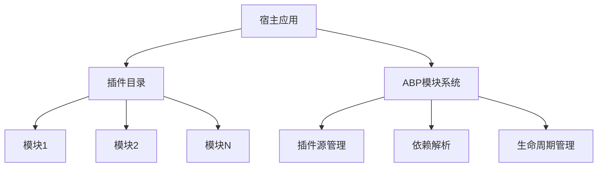
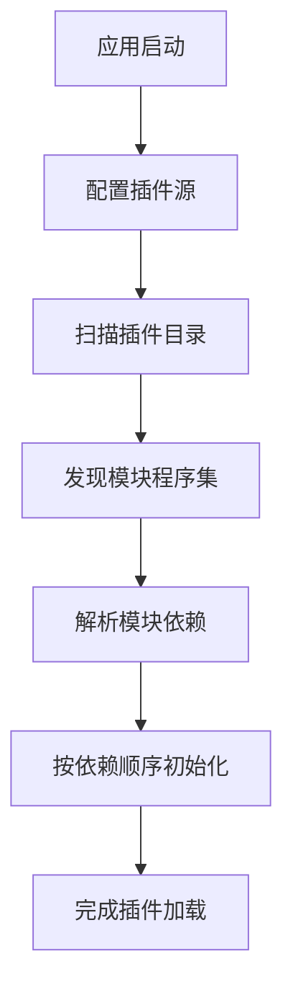
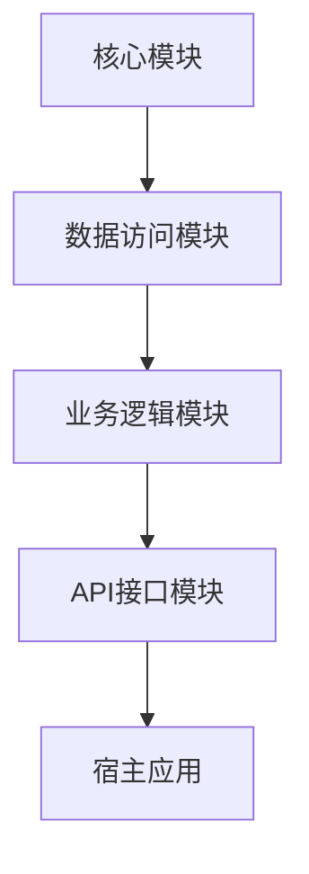
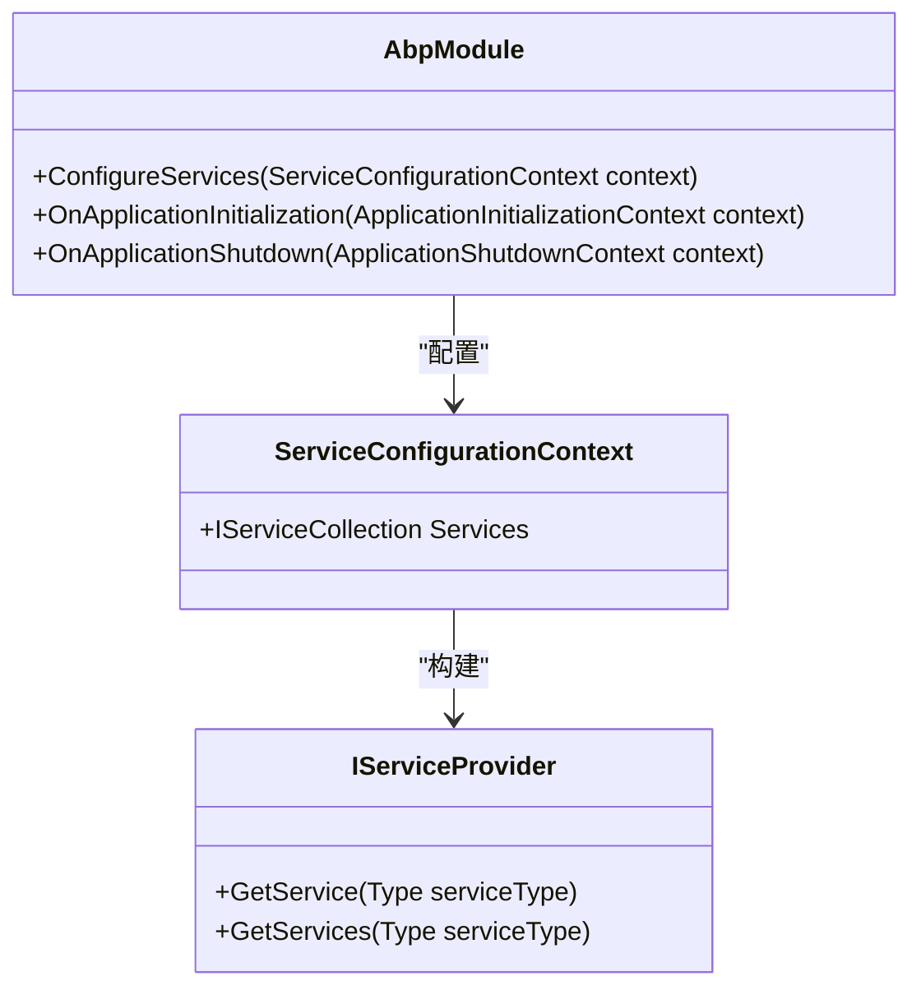
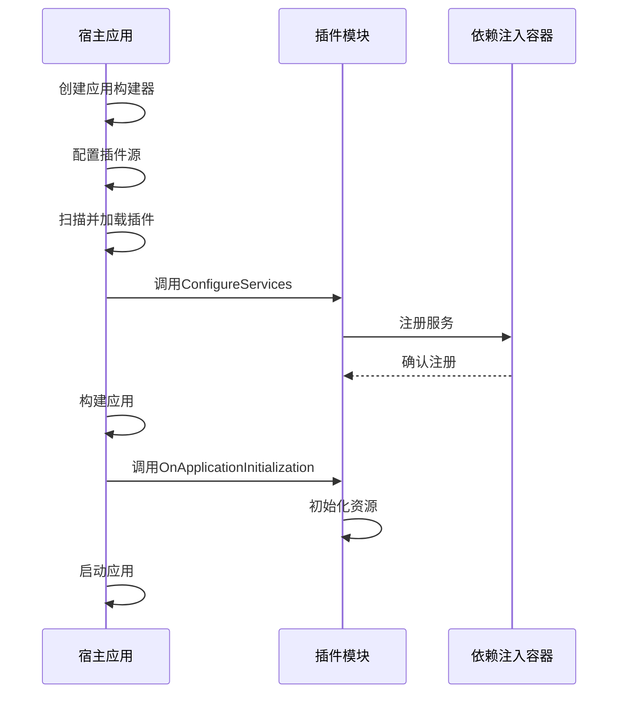

# 插件加载机制

<cite>
**本文档引用的文件**
- [Program.cs](file://aspnet-core/services/LY.MicroService.Applications.Single/Program.cs)
- [MicroServiceApplicationsSingleModule.cs](file://aspnet-core/services/LY.MicroService.Applications.Single/MicroServiceApplicationsSingleModule.cs)
- [AbpCommonModule.cs](file://aspnet-core/framework/common/LINGYUN.Abp.Core/AbpCommonModule.cs)
- [DirectoryHelper.cs](file://aspnet-core/framework/common/Volo.Abp.IO/DirectoryHelper.cs)
</cite>

## 目录
1. [项目结构](#项目结构)
2. [插件发现与加载](#插件发现与加载)
3. [模块化加载策略](#模块化加载策略)
4. [依赖注入集成](#依赖注入集成)
5. [生命周期同步机制](#生命周期同步机制)
6. [热加载与动态更新](#热加载与动态更新)
7. [配置与注册](#配置与注册)
8. [总结](#总结)

## 项目结构

该项目采用模块化架构，核心插件机制通过ABP框架的模块系统实现。主要结构包括：

- **aspnet-core**: 包含框架核心组件、迁移脚本、模块和微服务
- **modules**: 各功能模块，如账户、审计、缓存管理等
- **services**: 主要服务应用，如应用程序单实例、认证服务器等
- **gateways**: 网关服务
- **starter**: 启动脚本集合



**图示来源**
- [Program.cs](file://aspnet-core/services/LY.MicroService.Applications.Single/Program.cs#L31-L75)

**本节来源**
- [Program.cs](file://aspnet-core/services/LY.MicroService.Applications.Single/Program.cs#L31-L75)

## 插件发现与加载

插件发现与加载机制基于ABP框架的插件系统，通过在宿主应用启动时配置插件源来实现。

### 插件发现

插件发现通过`PlugInSources.AddFolder`方法实现，该方法将指定目录下的所有程序集作为插件源：

```csharp
var pluginFolder = Path.Combine(Directory.GetCurrentDirectory(), "Modules");
DirectoryHelper.CreateIfNotExists(pluginFolder);
options.PlugInSources.AddFolder(pluginFolder, SearchOption.AllDirectories);
```

此代码在`Program.cs`中配置，将当前目录下的"Modules"文件夹设置为插件目录，并递归搜索所有子目录中的程序集。

### 插件加载

插件加载由ABP框架自动完成，当应用启动时，框架会扫描所有配置的插件源，加载其中的模块。加载过程包括：

1. 扫描插件目录中的所有程序集
2. 查找继承自`AbpModule`的模块类
3. 按照依赖关系排序模块
4. 依次初始化每个模块



**图示来源**
- [Program.cs](file://aspnet-core/services/LY.MicroService.Applications.Single/Program.cs#L31-L75)

**本节来源**
- [Program.cs](file://aspnet-core/services/LY.MicroService.Applications.Single/Program.cs#L31-L75)

## 模块化加载策略

模块化加载策略通过ABP框架的模块系统实现，确保各个功能模块能够独立开发、测试和部署。

### 模块定义

每个模块通过继承`AbpModule`类来定义，例如：

```csharp
public class MicroServiceApplicationsSingleModule : AbpModule
{
    // 模块配置
}
```

### 模块依赖

模块之间的依赖关系通过`DependsOn`特性声明：

```csharp
[DependsOn(typeof(AbpAuditLoggingEntityFrameworkCoreModule))]
public class MicroServiceApplicationsSingleModule : AbpModule
{
    // 模块实现
}
```

### 加载顺序

模块加载顺序由依赖关系决定，ABP框架会自动解析依赖图并按拓扑排序加载模块。



**图示来源**
- [MicroServiceApplicationsSingleModule.cs](file://aspnet-core/services/LY.MicroService.Applications.Single/MicroServiceApplicationsSingleModule.cs#L167-L204)

**本节来源**
- [MicroServiceApplicationsSingleModule.cs](file://aspnet-core/services/LY.MicroService.Applications.Single/MicroServiceApplicationsSingleModule.cs#L167-L204)

## 依赖注入集成

插件系统与ABP框架的依赖注入容器深度集成，确保插件中的服务能够正确注册和解析。

### 服务注册

在模块的`ConfigureServices`方法中注册服务：

```csharp
public override void ConfigureServices(ServiceConfigurationContext context)
{
    context.Services.AddTransient<IMyService, MyService>();
}
```

### 依赖解析

ABP框架的依赖注入容器会自动解析插件中的依赖关系，包括跨插件的依赖。

### 生命周期管理

支持多种服务生命周期：
- **Singleton**: 单例模式，整个应用生命周期内只创建一次
- **Scoped**: 作用域模式，每个请求创建一次
- **Transient**: 瞬态模式，每次请求都创建新实例



**图示来源**
- [AbpCommonModule.cs](file://aspnet-core/framework/common/LINGYUN.Abp.Core/AbpCommonModule.cs#L0-L6)

**本节来源**
- [AbpCommonModule.cs](file://aspnet-core/framework/common/LINGYUN.Abp.Core/AbpCommonModule.cs#L0-L6)

## 生命周期同步机制

插件与宿主应用的生命周期通过ABP模块系统的生命周期事件实现同步。

### 初始化阶段



### 关闭阶段

当应用关闭时，会按相反顺序调用`OnApplicationShutdown`方法，确保资源正确释放。

###