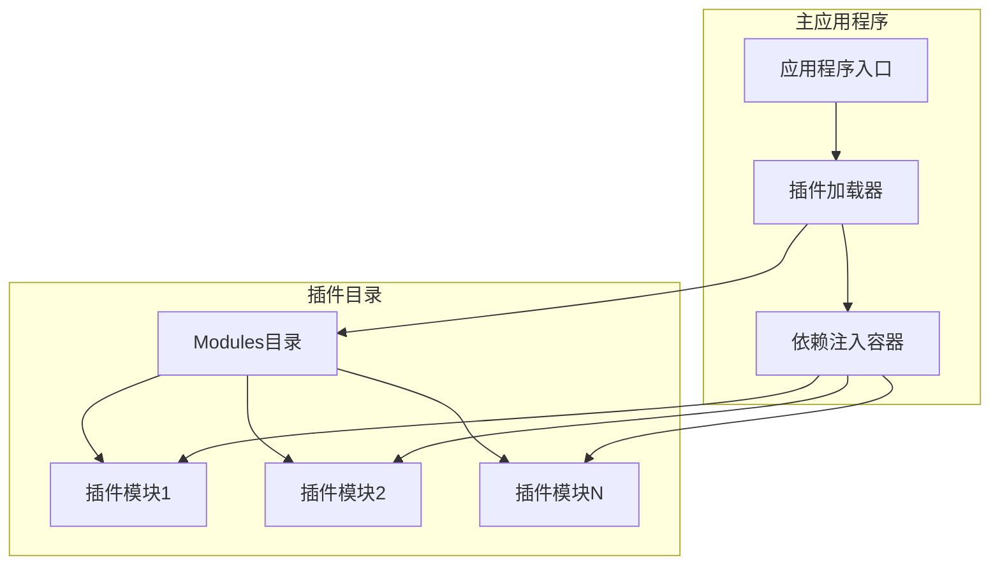
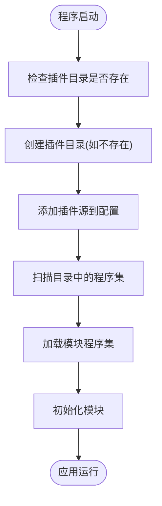
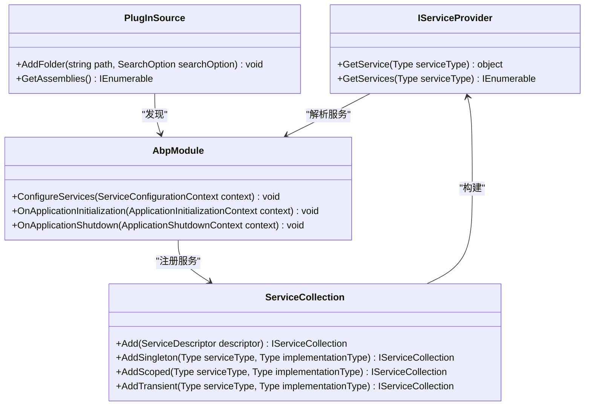
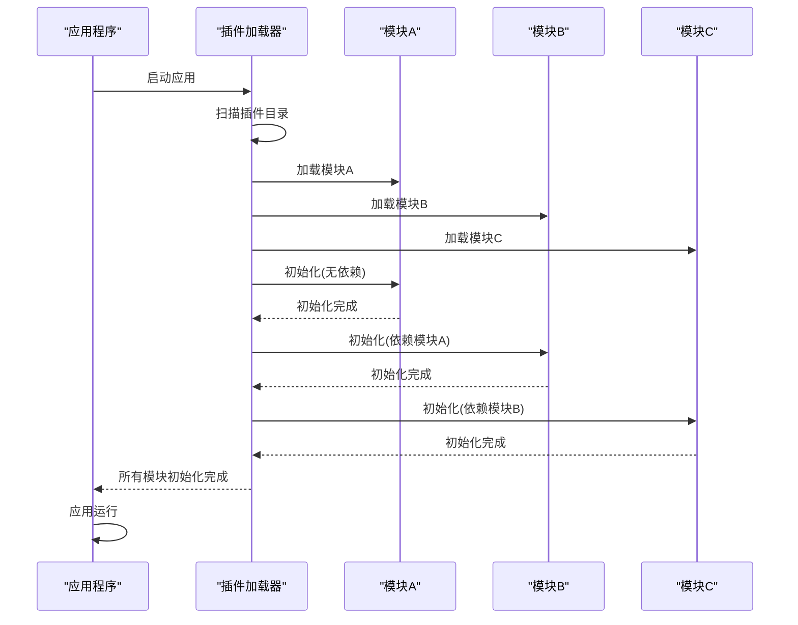

# 插件加载策略

<cite>
**本文档引用的文件**  
- [Program.cs](file://aspnet-core/services/LY.MicroService.AuthServer/Program.cs)
- [Program.cs](file://aspnet-core/services/LY.MicroService.IdentityServer/Program.cs)
- [Program.cs](file://aspnet-core/services/LY.MicroService.LocalizationManagement.HttpApi.Host/Program.cs)
- [Program.cs](file://aspnet-core/services/LY.MicroService.WorkflowManagement.HttpApi.Host/Program.cs)
- [Program.cs](file://aspnet-core/services/LY.MicroService.WebhooksManagement.HttpApi.Host/Program.cs)
- [Program.cs](file://aspnet-core/services/LY.MicroService.Applications.Single/Program.cs)
- [Program.cs](file://aspnet-core/templates/micro/content/host/PackageName.CompanyName.ProjectName.HttpApi.Host/Program.cs)
- [Program.cs](file://aspnet-core/gateways/internal/LINGYUN.MicroService.Internal.ApiGateway/src/LINGYUN.MicroService.Internal.ApiGateway/Program.cs)
- [MicroServiceApplicationsSingleModule.cs](file://aspnet-core/services/LY.MicroService.Applications.Single/MicroServiceApplicationsSingleModule.cs)
</cite>

## 目录
1. [引言](#引言)
2. [插件加载架构](#插件加载架构)
3. [程序集加载器工作原理](#程序集加载器工作原理)
4. [依赖注入容器集成](#依赖注入容器集成)
5. [模块初始化顺序控制](#模块初始化顺序控制)
6. [热加载实现机制](#热加载实现机制)
7. [插件版本管理与冲突解决](#插件版本管理与冲突解决)
8. [配置文件控制加载行为](#配置文件控制加载行为)
9. [错误处理与回滚机制](#错误处理与回滚机制)
10. [总结](#总结)

## 引言
本项目基于ABP框架构建，采用模块化设计，通过插件化架构实现功能的动态加载和扩展。系统通过在运行时从指定目录加载程序集，实现了灵活的模块管理机制。这种设计允许在不重新编译主应用程序的情况下添加、更新或移除功能模块，极大地提高了系统的可维护性和扩展性。

## 插件加载架构
系统采用基于目录扫描的插件加载机制，将插件程序集放置在特定目录中，由主应用程序在启动时自动发现并加载。这种架构设计实现了模块与主应用的解耦，支持动态扩展和热更新。



**图源**  
- [Program.cs](file://aspnet-core/services/LY.MicroService.AuthServer/Program.cs#L36-L61)
- [Program.cs](file://aspnet-core/services/LY.MicroService.IdentityServer/Program.cs#L36-L60)

## 程序集加载器工作原理
程序集加载器通过ABP框架提供的插件源机制实现，主要工作流程如下：

1. 在应用程序启动时确定插件目录路径
2. 创建插件目录（如果不存在）
3. 将目录添加到插件源中，设置递归搜索选项
4. 框架自动扫描目录中的所有程序集文件
5. 加载并初始化发现的模块



**图源**  
- [Program.cs](file://aspnet-core/templates/micro/content/host/PackageName.CompanyName.ProjectName.HttpApi.Host/Program.cs#L35-L53)
- [Program.cs](file://aspnet-core/gateways/internal/LINGYUN.MicroService.Internal.ApiGateway/src/LINGYUN.MicroService.Internal.ApiGateway/Program.cs#L35-L72)

## 依赖注入容器集成
插件系统与依赖注入容器深度集成，确保插件模块中的服务能够被正确注册和解析。当插件被加载时，其模块类中的依赖注入配置会自动应用到主应用程序的容器中。



**图源**  
- [Program.cs](file://aspnet-core/services/LY.MicroService.Applications.Single/Program.cs#L31-L75)
- [MicroServiceApplicationsSingleModule.cs](file://aspnet-core/services/LY.MicroService.Applications.Single/MicroServiceApplicationsSingleModule.cs)

## 模块初始化顺序控制
系统通过模块依赖关系和ABP框架的生命周期管理机制来控制模块的初始化顺序。模块之间的依赖关系决定了它们的加载和初始化顺序，确保依赖项在被依赖项之前完成初始化。



**图源**  
- [MicroServiceApplicationsSingleModule.cs](file://aspnet-core/services/LY.MicroService.Applications.Single/MicroServiceApplicationsSingleModule.cs#L167-L204)
- [MicroServiceApplicationsSingleModule.cs](file://aspnet-core/services/LY.MicroService.Applications.Single/MicroServiceApplicationsSingleModule.cs#L260-L298)

## 热加载实现机制
虽然当前配置主要在应用启动时加载插件，但ABP框架支持热加载机制。通过监控插件目录的变化，系统可以在运行时动态加载新添加的插件或重新加载已更新的插件。

### 运行时环境限制
1. **程序集卸载限制**：.NET Core/.NET 5+虽然支持AssemblyLoadContext的卸载，但在ASP.NET Core应用中完全卸载已加载的程序集仍存在挑战
2. **依赖关系复杂性**：已加载的模块可能已被其他模块引用，直接卸载可能导致运行时错误
3. **状态保持**：热加载过程中需要妥善处理模块的状态数据，避免数据丢失
4. **配置更新**：热加载时需要重新应用配置，确保新模块的配置正确生效

```mermaid
flowchart TD
    Running[应用运行中] --> Monitor["监控插件目录变化"]
    Monitor --> ChangeDetected{"检测到文件变化?"}
    ChangeDetected -->|是| LoadNewPlugin["加载新插件"]
    ChangeDetected -->|否| ContinueMonitoring["继续监控"]
    LoadNewPlugin --> CheckDependencies["检查依赖关系"]
    CheckDependencies --> ResolveDependencies["解析依赖"]
    ResolveDependencies --> InitializePlugin