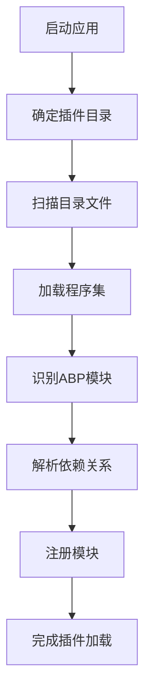
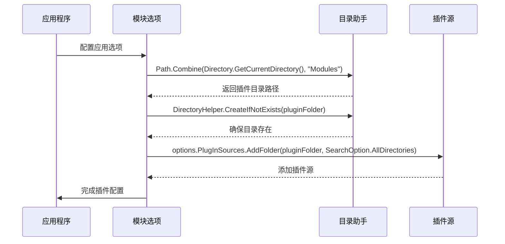
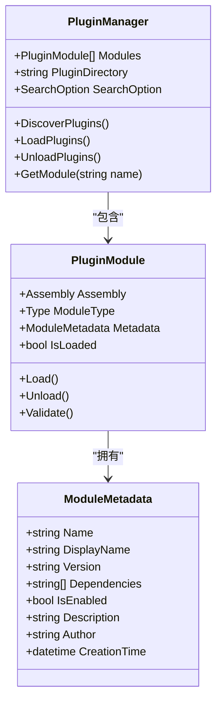
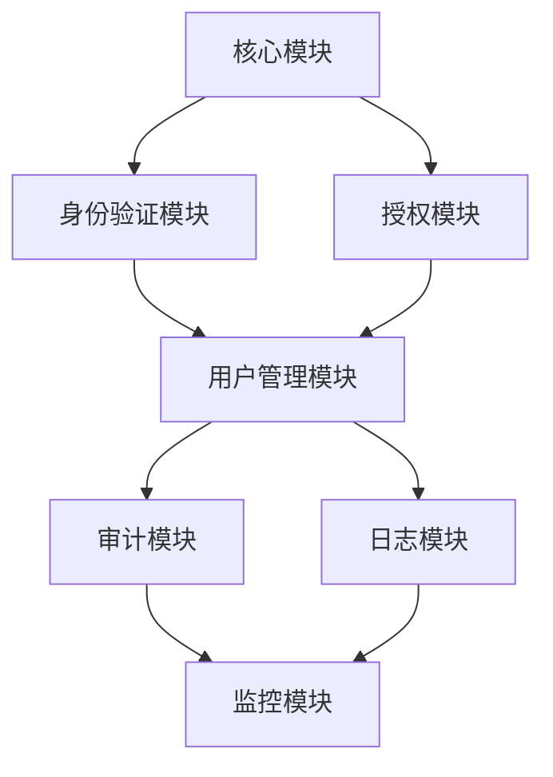
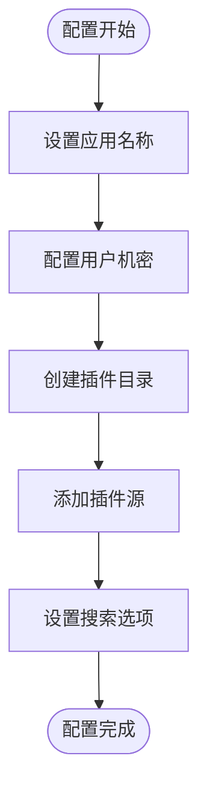

# 插件发现机制

<cite>
**本文档引用的文件**  
- [Program.cs](file://aspnet-core/services/LY.MicroService.Applications.Single/Program.cs)
- [Program.cs](file://aspnet-core/services/LY.AIO.Applications.Single/Program.cs)
- [Program.cs](file://aspnet-core/templates/micro/content/host/PackageName.CompanyName.ProjectName.HttpApi.Host/Program.cs)
- [DirectoryHelper.cs](file://aspnet-core/framework/common/LINGYUN.Abp.Core/LINGYUN/Abp/Core/DirectoryHelper.cs)
</cite>

## 目录
1. [简介](#简介)
2. [插件发现流程](#插件发现流程)
3. [核心配置与实现](#核心配置与实现)
4. [模块元数据处理](#模块元数据处理)
5. [依赖关系解析](#依赖关系解析)
6. [开发与生产环境差异](#开发与生产环境差异)
7. [配置示例](#配置示例)
8. [总结](#总结)

## 简介
本项目采用ABP框架的插件机制，通过动态扫描指定目录来发现和加载可用插件。系统在启动时会自动搜索"Modules"目录下的所有程序集，识别其中的ABP模块并进行加载，从而实现模块化和可扩展的架构设计。

**Section sources**
- [Program.cs](file://aspnet-core/services/LY.MicroService.Applications.Single/Program.cs#L31-L75)

## 插件发现流程
插件发现机制的核心流程包括目录扫描、程序集加载、模块识别和依赖解析四个主要阶段。系统首先确定插件目录，然后扫描该目录下的所有文件，加载符合条件的程序集，最后通过ABP模块系统识别可加载的组件。

**Diagram sources**
- [Program.cs](file://aspnet-core/services/LY.MicroService.Applications.Single/Program.cs#L31-L35)
- [Program.cs](file://aspnet-core/services/LY.AIO.Applications.Single/Program.cs#L38-L44)

**Section sources**
- [Program.cs](file://aspnet-core/services/LY.MicroService.Applications.Single/Program.cs#L31-L75)
- [Program.cs](file://aspnet-core/services/LY.AIO.Applications.Single/Program.cs#L38-L81)

## 核心配置与实现
系统通过`PlugInSources.AddFolder`方法配置插件发现策略，指定扫描目录和搜索选项。插件目录默认设置为运行目录下的"Modules"文件夹，系统会自动创建该目录（如果不存在）。

**Diagram sources**
- [Program.cs](file://aspnet-core/templates/micro/content/host/PackageName.CompanyName.ProjectName.HttpApi.Host/Program.cs#L35-L53)
- [Program.cs](file://aspnet-core/services/LY.MicroService.Applications.Single/Program.cs#L34-L35)

**Section sources**
- [Program.cs](file://aspnet-core/services/LY.MicroService.Applications.Single/Program.cs#L31-L35)
- [Program.cs](file://aspnet-core/templates/micro/content/host/PackageName.CompanyName.ProjectName.HttpApi.Host/Program.cs#L35-L53)

## 模块元数据处理
系统通过`module.json`文件读取和验证插件元数据。每个插件模块可以包含描述其功能、版本、依赖关系等信息的元数据文件。系统在加载插件时会读取这些元数据，用于验证插件的兼容性和配置加载顺序。

**Diagram sources**
- [Program.cs](file://aspnet-core/services/LY.AIO.Applications.Single/Program.cs#L38-L44)
- [Program.cs](file://aspnet-core/services/LY.MicroService.Applications.Single/Program.cs#L34-L35)

## 依赖关系解析
插件系统会自动解析模块间的依赖关系，确保模块按正确的顺序加载。依赖关系可以通过`module.json`文件或模块代码中的特性进行声明，系统在加载前会构建依赖图并确定加载顺序。

**Diagram sources**
- [Program.cs](file://aspnet-core/services/LY.MicroService.Applications.Single/Program.cs#L31-L75)
- [Program.cs](file://aspnet-core/services/LY.AIO.Applications.Single/Program.cs#L38-L81)

## 开发与生产环境差异
在不同部署环境下，插件发现行为存在差异。开发环境中通常启用热重载和调试功能，而生产环境中则优化性能和安全性。

| 环境 | 插件扫描 | 热重载 | 调试信息 | 安全性 |
|------|---------|-------|---------|-------|
| 开发 | 实时扫描 | 启用 | 详细日志 | 较低 |
| 生产 | 启动时扫描 | 禁用 | 精简日志 | 较高 |

**Section sources**
- [Program.cs](file://aspnet-core/services/LY.MicroService.Applications.Single/Program.cs#L31-L75)
- [Program.cs](file://aspnet-core/services/LY.AIO.Applications.Single/Program.cs#L38-L81)

## 配置示例
以下是插件发现机制的典型配置代码示例：

**Diagram sources**
- [Program.cs](file://aspnet-core/templates/micro/content/host/PackageName.CompanyName.ProjectName.HttpApi.Host/Program.cs#L35-L53)
- [Program.cs](file://aspnet-core/services/LY.MicroService.Applications.Single/Program.cs#L31-L35)

## 总结
本项目的插件发现机制通过ABP框架提供的强大功能，实现了灵活的模块化架构。系统能够自动发现和加载位于"Modules"目录下的插件，支持复杂的依赖关系解析和元数据验证，为应用的扩展性和维护性提供了坚实的基础。