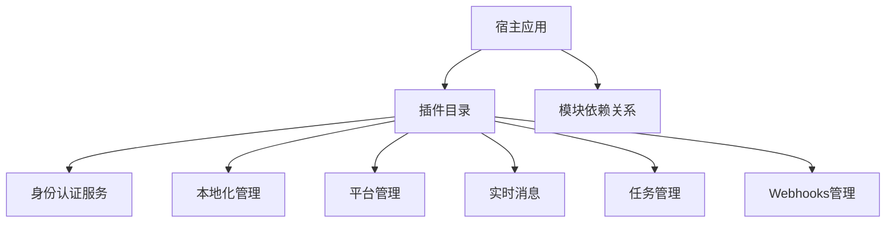
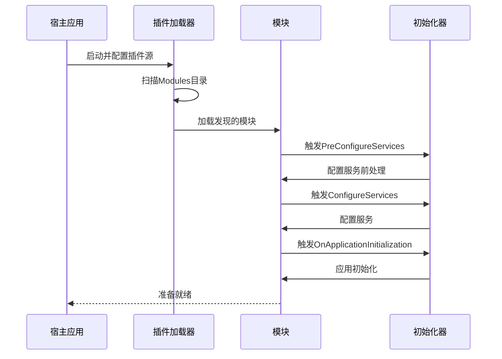
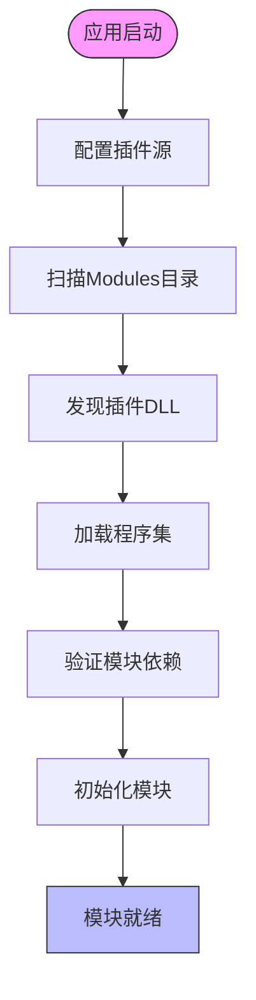
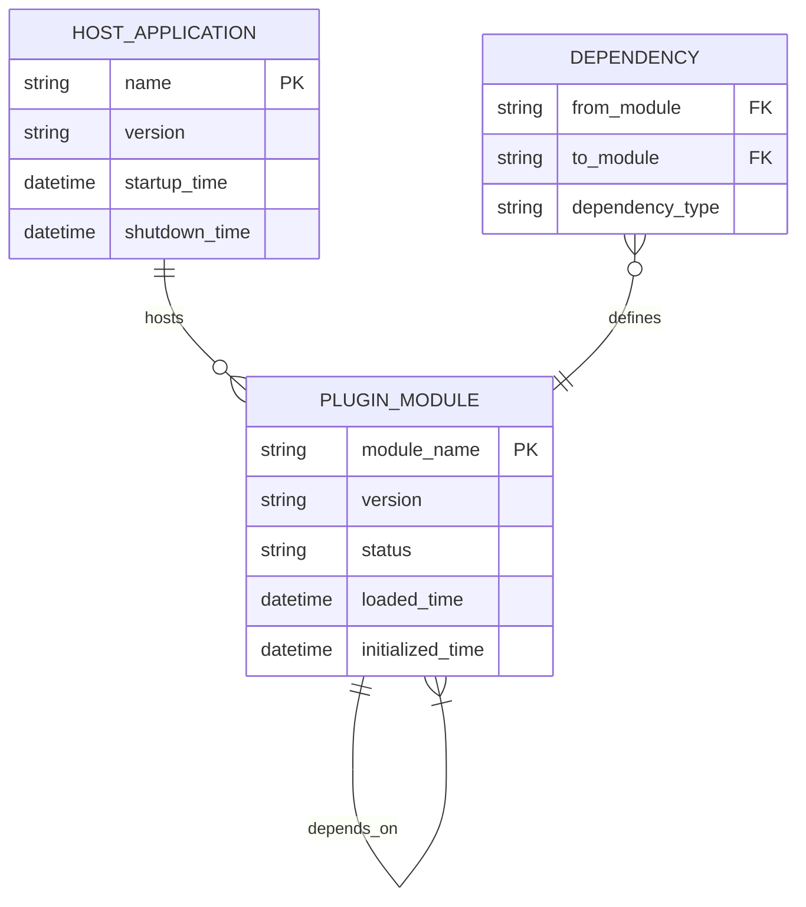

# 插件生命周期管理

<cite>
**本文档引用的文件**
- [Program.cs](file://aspnet-core/templates/micro/content/host/PackageName.CompanyName.ProjectName.HttpApi.Host/Program.cs)
- [AuthServerModule.cs](file://aspnet-core/services/LY.MicroService.AuthServer/AuthServerModule.cs)
- [IdentityServerModule.cs](file://aspnet-core/services/LY.MicroService.IdentityServer/IdentityServerModule.cs)
- [InternalApiGatewayModule.cs](file://gateways/internal/LINGYUN.MicroService.Internal.ApiGateway/src/LINGYUN.MicroService.Internal.ApiGateway/InternalApiGatewayModule.cs)
</cite>

## 目录
1. [引言](#引言)
2. [项目结构](#项目结构)
3. [核心组件](#核心组件)
4. [架构概述](#架构概述)
5. [详细组件分析](#详细组件分析)
6. [依赖分析](#依赖分析)
7. [性能考虑](#性能考虑)
8. [故障排除指南](#故障排除指南)
9. [结论](#结论)

## 引言
本文档详细说明了ABP Next Admin系统中插件从加载、初始化、运行到卸载的完整生命周期。文档涵盖了插件与宿主应用的生命周期同步机制，解释了模块启动和关闭事件的处理流程，描述了资源清理和依赖释放的最佳实践，并提供了代码示例展示生命周期钩子的使用方法。

## 项目结构
本项目采用微服务架构，通过插件化方式管理各个功能模块。核心的插件管理机制在宿主应用程序的启动配置中实现，通过扫描指定目录来动态加载插件模块。



**Diagram sources**
- [Program.cs](file://aspnet-core/templates/micro/content/host/PackageName.CompanyName.ProjectName.HttpApi.Host/Program.cs)

**Section sources**
- [Program.cs](file://aspnet-core/templates/micro/content/host/PackageName.CompanyName.ProjectName.HttpApi.Host/Program.cs)

## 核心组件
系统的核心组件包括插件加载器、模块初始化器和生命周期管理器。这些组件协同工作，确保插件能够正确地被发现、加载、初始化和运行。

**Section sources**
- [Program.cs](file://aspnet-core/templates/micro/content/host/PackageName.CompanyName.ProjectName.HttpApi.Host/Program.cs)
- [AuthServerModule.cs](file://aspnet-core/services/LY.MicroService.AuthServer/AuthServerModule.cs)

## 架构概述
系统的插件架构基于ABP框架的模块化设计，通过在程序启动时配置插件源来实现动态模块加载。这种设计允许系统在不重新编译的情况下扩展功能。



**Diagram sources**
- [Program.cs](file://aspnet-core/templates/micro/content/host/PackageName.CompanyName.ProjectName.HttpApi.Host/Program.cs)
- [AuthServerModule.cs](file://aspnet-core/services/LY.MicroService.AuthServer/AuthServerModule.cs)

## 详细组件分析

### 插件加载机制分析
插件加载机制是系统的核心功能之一，它允许在运行时动态发现和加载功能模块。

#### 插件加载流程：


**Diagram sources**
- [Program.cs](file://aspnet-core/templates/micro/content/host/PackageName.CompanyName.ProjectName.HttpApi.Host/Program.cs)

**Section sources**
- [Program.cs](file://aspnet-core/templates/micro/content/host/PackageName.CompanyName.ProjectName.HttpApi.Host/Program.cs)

### 模块生命周期钩子分析
ABP框架提供了完整的模块生命周期钩子，允许开发者在不同阶段执行特定逻辑。

#### 生命周期钩子调用顺序：
```mermaid
classDiagram
class AbpModule {
+PreConfigureServices(context)
+ConfigureServices(context)
+OnApplicationInitialization(context)
+OnApplicationShutdown(context)
+OnPreApplicationInitialization(context)
}
class AuthServerModule {
+PreConfigureServices(context)
+ConfigureServices(context)
+OnApplicationInitialization(context)
}
class IdentityServerModule {
+PreConfigureServices(context)
+ConfigureServices(context)
+OnApplicationInitialization(context)
}
AbpModule <|-- AuthServerModule
AbpModule <|-- IdentityServerModule
note right of AbpModule
基础模块类提供生命周期钩子
PreConfigureServices : 服务配置前
ConfigureServices : 服务配置
OnApplicationInitialization : 应用初始化
OnApplicationShutdown : 应用关闭
OnPreApplicationInitialization : 应用初始化前
end note
```

**Diagram sources**
- [AuthServerModule.cs](file://aspnet-core/services/LY.MicroService.AuthServer/AuthServerModule.cs)
- [IdentityServerModule.cs](file://aspnet-core/services/LY.MicroService.IdentityServer/IdentityServerModule.cs)

**Section sources**
- [AuthServerModule.cs](file://aspnet-core/services/LY.MicroService.AuthServer/AuthServerModule.cs)
- [IdentityServerModule.cs](file://aspnet-core/services/LY.MicroService.IdentityServer/IdentityServerModule.cs)

## 依赖分析
系统中的模块通过明确的依赖关系进行组织，确保正确的加载和初始化顺序。



**Diagram sources**
- [AuthServerModule.cs](file://aspnet-core/services/LY.MicroService.AuthServer/AuthServerModule.cs)
- [IdentityServerModule.cs](file://aspnet-core/services/LY.MicroService.IdentityServer/IdentityServerModule.cs)

**Section sources**
- [AuthServerModule.cs](file://aspnet-core/services/LY.MicroService.AuthServer/AuthServerModule.cs)
- [IdentityServerModule.cs](file://aspnet-core/services/LY.MicroService.IdentityServer/IdentityServerModule.cs)

## 性能考虑
插件化架构对系统性能有一定影响，需要考虑以下方面：

- **启动时间**：扫描和加载大量插件会增加应用启动时间
- **内存占用**：每个加载的模块都会占用一定的内存空间
- **依赖解析**：复杂的依赖关系可能导致初始化时间延长
- **热更新**：动态加载和卸载插件需要额外的资源管理

建议在生产环境中合理规划插件数量，避免过度模块化导致性能下降。

## 故障排除指南
当遇到插件生命周期相关问题时，可以参考以下排查步骤：

1. **检查插件目录**：确认Modules目录存在且有适当的读取权限
2. **验证程序集**：确保插件DLL文件没有损坏且兼容目标框架
3. **查看日志**：检查应用日志中是否有模块加载失败的记录
4. **依赖检查**：确认所有必需的依赖项都已正确安装
5. **版本兼容性**：验证插件与宿主应用的版本是否兼容

**Section sources**
- [Program.cs](file://aspnet-core/templates/micro/content/host/PackageName.CompanyName.ProjectName.HttpApi.Host/Program.cs)
- [AuthServerModule.cs](file://aspnet-core/services/LY.MicroService.AuthServer/AuthServerModule.cs)

## 结论
ABP Next Admin系统的插件生命周期管理机制提供了一套完整的解决方案，支持从插件发现、加载、初始化到卸载的全过程管理。通过合理的生命周期钩子设计和依赖管理，系统能够稳定地运行多个功能模块，同时保持良好的可扩展性和维护性。