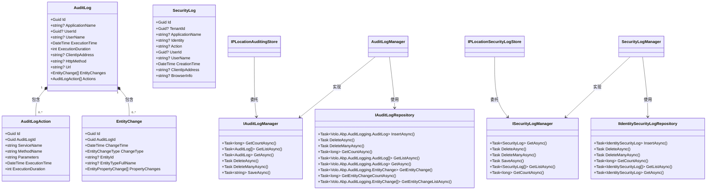
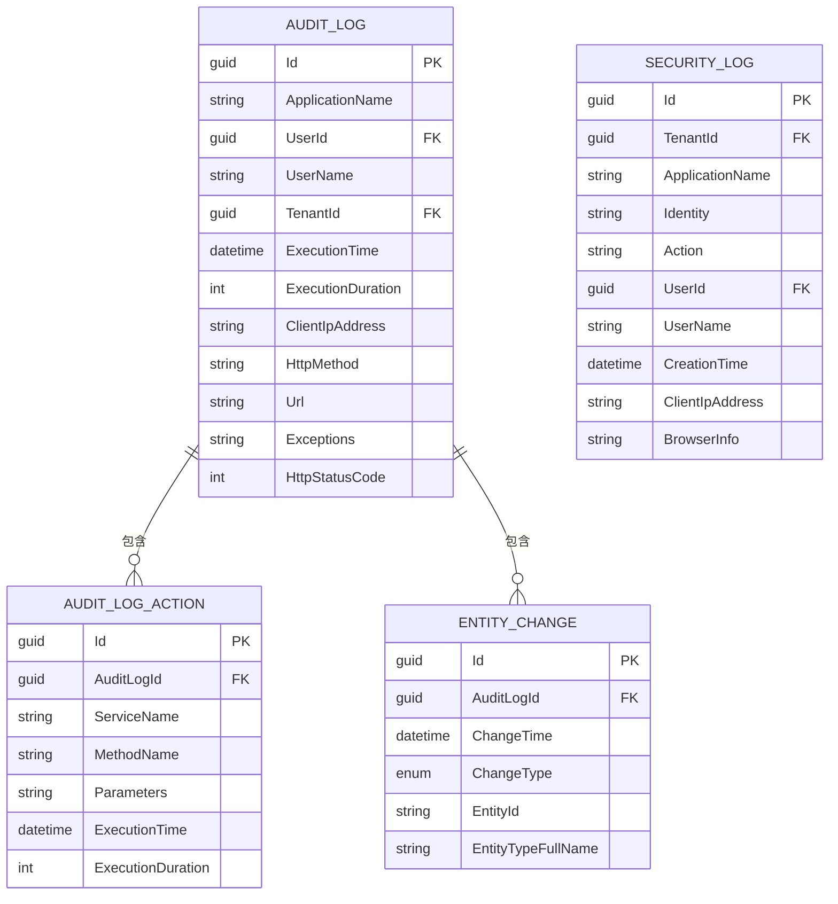
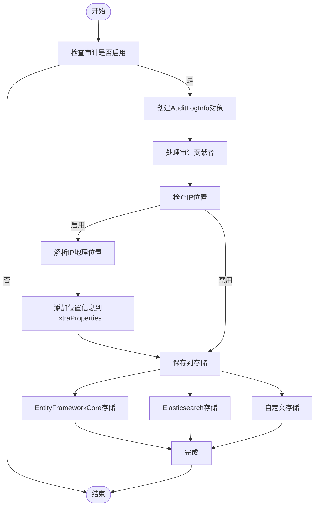
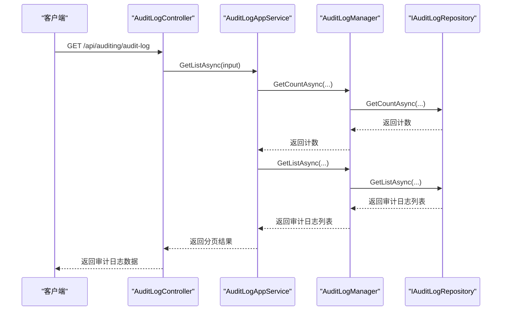
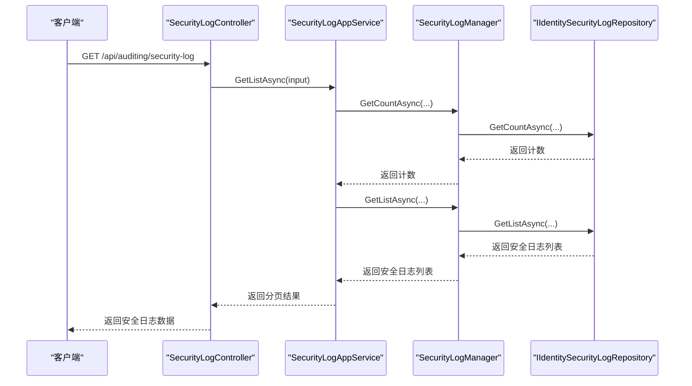

# 插件安全审计

<cite>
**本文档引用的文件**
- [AuditLog.cs](file://aspnet-core/framework/auditing/LINGYUN.Abp.AuditLogging/LINGYUN/Abp/AuditLogging/AuditLog.cs)
- [AuditLogAction.cs](file://aspnet-core/framework/auditing/LINGYUN.Abp.AuditLogging/LINGYUN/Abp/AuditLogging/AuditLogAction.cs)
- [EntityChange.cs](file://aspnet-core/framework/auditing/LINGYUN.Abp.AuditLogging/LINGYUN/Abp/AuditLogging/EntityChange.cs)
- [SecurityLog.cs](file://aspnet-core/framework/auditing/LINGYUN.Abp.AuditLogging/LINGYUN/Abp/AuditLogging/SecurityLog.cs)
- [AuditLogManager.cs](file://aspnet-core/framework/auditing/LINGYUN.Abp.AuditLogging.EntityFrameworkCore/LINGYUN/Abp/AuditLogging/EntityFrameworkCore/AuditLogManager.cs)
- [EntityChangeStore.cs](file://aspnet-core/framework/auditing/LINGYUN.Abp.AuditLogging.EntityFrameworkCore/LINGYUN/Abp/AuditLogging/EntityFrameworkCore/EntityChangeStore.cs)
- [SecurityLogManager.cs](file://aspnet-core/framework/auditing/LINGYUN.Abp.AuditLogging.EntityFrameworkCore/LINGYUN/Abp/AuditLogging/EntityFrameworkCore/SecurityLogManager.cs)
- [IPLocationAuditingStore.cs](file://aspnet-core/framework/auditing/LINGYUN.Abp.AuditLogging.IP.Location/LINGYUN/Abp/AuditLogging/IP/Location/IPLocationAuditingStore.cs)
- [IPLocationSecurityLogStore.cs](file://aspnet-core/framework/auditing/LINGYUN.Abp.AuditLogging.IP.Location/LINGYUN/Abp/AuditLogging/IP/Location/IPLocationSecurityLogStore.cs)
- [AuditLogAppService.cs](file://aspnet-core/modules/auditing/LINGYUN.Abp.Auditing.Application/LINGYUN/Abp/Auditing/AuditLogs/AuditLogAppService.cs)
- [SecurityLogAppService.cs](file://aspnet-core/modules/auditing/LINGYUN.Abp.Auditing.Application/LINGYUN/Abp/Auditing/SecurityLogs/SecurityLogAppService.cs)
- [AuditLogController.cs](file://aspnet-core/modules/auditing/LINGYUN.Abp.Auditing.HttpApi/LINGYUN/Abp/Auditing/AuditLogs/AuditLogController.cs)
- [SecurityLogController.cs](file://aspnet-core/modules/auditing/LINGYUN.Abp.Auditing.HttpApi/LINGYUN/Abp/Auditing/SecurityLogs/SecurityLogController.cs)
</cite>

## 目录
1. [简介](#简介)
2. [核心组件](#核心组件)
3. [审计日志结构](#审计日志结构)
4. [存储策略](#存储策略)
5. [查询接口](#查询接口)
6. [审计策略配置](#审计策略配置)
7. [合规性检查清单](#合规性检查清单)

## 简介
插件安全审计功能提供了一套完整的系统来记录和监控关键操作，包括API调用、数据访问和权限变更等。该系统通过详细的审计日志记录用户行为，支持多种存储后端，并提供灵活的查询接口和安全策略配置。

**Section sources**
- [README.md](file://aspnet-core/framework/auditing/LINGYUN.Abp.AuditLogging/README.md)

## 核心组件

插件安全审计系统由多个核心组件构成，这些组件协同工作以实现全面的安全监控和审计功能。



**Diagram sources**
- [AuditLog.cs](file://aspnet-core/framework/auditing/LINGYUN.Abp.AuditLogging/LINGYUN/Abp/AuditLogging/AuditLog.cs)
- [AuditLogAction.cs](file://aspnet-core/framework/auditing/LINGYUN.Abp.AuditLogging/LINGYUN/Abp/AuditLogging/AuditLogAction.cs)
- [EntityChange.cs](file://aspnet-core/framework/auditing/LINGYUN.Abp.AuditLogging/LINGYUN/Abp/AuditLogging/EntityChange.cs)
- [SecurityLog.cs](file://aspnet-core/framework/auditing/LINGYUN.Abp.AuditLogging/LINGYUN/Abp/AuditLogging/SecurityLog.cs)
- [AuditLogManager.cs](file://aspnet-core/framework/auditing/LINGYUN.Abp.AuditLogging.EntityFrameworkCore/LINGYUN/Abp/AuditLogging/EntityFrameworkCore/AuditLogManager.cs)
- [EntityChangeStore.cs](file://aspnet-core/framework/auditing/LINGYUN.Abp.AuditLogging.EntityFrameworkCore/LINGYUN/Abp/AuditLogging/EntityFrameworkCore/EntityChangeStore.cs)
- [SecurityLogManager.cs](file://aspnet-core/framework/auditing/LINGYUN.Abp.AuditLogging.EntityFrameworkCore/LINGYUN/Abp/AuditLogging/EntityFrameworkCore/SecurityLogManager.cs)

**Section sources**
- [AuditLog.cs](file://aspnet-core/framework/auditing/LINGYUN.Abp.AuditLogging/LINGYUN/Abp/AuditLogging/AuditLog.cs)
- [AuditLogAction.cs](file://aspnet-core/framework/auditing/LINGYUN.Abp.AuditLogging/LINGYUN/Abp/AuditLogging/AuditLogAction.cs)
- [EntityChange.cs](file://aspnet-core/framework/auditing/LINGYUN.Abp.AuditLogging/LINGYUN/Abp/AuditLogging/EntityChange.cs)
- [SecurityLog.cs](file://aspnet-core/framework/auditing/LINGYUN.Abp.AuditLogging/LINGYUN/Abp/AuditLogging/SecurityLog.cs)

## 审计日志结构

### 审计日志(AuditLog)
审计日志是系统中最基本的审计单元，记录了每次请求的完整信息：

- **基础信息**: 请求ID、应用名称、用户ID、租户ID、执行时间、执行时长
- **客户端信息**: 客户端IP地址、客户端名称、客户端ID、浏览器信息
- **请求信息**: HTTP方法、URL、相关ID、HTTP状态码
- **异常信息**: 异常详情、注释
- **关联数据**: 实体变更列表、操作动作列表、额外属性

### 操作动作(AuditLogAction)
记录具体的服务调用信息：
- 服务名称(ServiceName)
- 方法名称(MethodName)
- 参数(Parameters)
- 执行时间和时长
- 额外属性

### 实体变更(EntityChange)
记录数据库实体的变更情况：
- 变更类型(ChangeType): 创建、更新、删除
- 实体类型和ID
- 属性变更列表
- 变更时间和租户信息

### 安全日志(SecurityLog)
专门记录安全相关事件：
- 身份标识(Identity)
- 操作类型(Action)
- 用户和租户信息
- 创建时间
- 客户端信息



**Diagram sources**
- [AuditLog.cs](file://aspnet-core/framework/auditing/LINGYUN.Abp.AuditLogging/LINGYUN/Abp/AuditLogging/AuditLog.cs)
- [AuditLogAction.cs](file://aspnet-core/framework/auditing/LINGYUN.Abp.AuditLogging/LINGYUN/Abp/AuditLogging/AuditLogAction.cs)
- [EntityChange.cs](file://aspnet-core/framework/auditing/LINGYUN.Abp.AuditLogging/LINGYUN/Abp/AuditLogging/EntityChange.cs)
- [SecurityLog.cs](file://aspnet-core/framework/auditing/LINGYUN.Abp.AuditLogging/LINGYUN/Abp/AuditLogging/SecurityLog.cs)

## 存储策略

### 多后端支持
系统支持多种存储后端，包括：
- Entity Framework Core (默认)
- Elasticsearch
- 其他自定义存储

### 存储流程


**Diagram sources**
- [IPLocationAuditingStore.cs](file://aspnet-core/framework/auditing/LINGYUN.Abp.AuditLogging.IP.Location/LINGYUN/Abp/AuditLogging/IP/Location/IPLocationAuditingStore.cs)
- [IPLocationSecurityLogStore.cs](file://aspnet-core/framework/auditing/LINGYUN.Abp.AuditLogging.IP.Location/LINGYUN/Abp/AuditLogging/IP/Location/IPLocationSecurityLogStore.cs)
- [AuditLogManager.cs](file://aspnet-core/framework/auditing/LINGYUN.Abp.AuditLogging.EntityFrameworkCore/LINGYUN/Abp/AuditLogging/EntityFrameworkCore/AuditLogManager.cs)
- [SecurityLogManager.cs](file://aspnet-core/framework/auditing/LINGYUN.Abp.AuditLogging.EntityFrameworkCore/LINGYUN/Abp/AuditLogging/EntityFrameworkCore/SecurityLogManager.cs)

### IP位置集成
系统集成了IP地理位置解析功能，可以在审计日志中自动记录客户端的地理位置信息：

```csharp
// 配置示例
Configure<AbpAuditLoggingIPLocationOptions>(options =>
{
    options.IsEnabled = true; // 启用IP位置记录
});
```

当IP位置功能启用时，系统会自动解析客户端IP地址并将其位置信息添加到审计日志的额外属性中。

**Section sources**
- [IPLocationAuditingStore.cs](file://aspnet-core/framework/auditing/LINGYUN.Abp.AuditLogging.IP.Location/LINGYUN/Abp/AuditLogging/IP/Location/IPLocationAuditingStore.cs)
- [IPLocationSecurityLogStore.cs](file://aspnet-core/framework/auditing/LINGYUN.Abp.AuditLogging.IP.Location/LINGYUN/Abp/AuditLogging/IP/Location/IPLocationSecurityLogStore.cs)

## 查询接口

### 审计日志查询
提供丰富的查询接口用于检索审计日志：



**Diagram sources**
- [AuditLogController.cs](file://aspnet-core/modules/auditing/LINGYUN.Abp.Auditing.HttpApi/LINGYUN/Abp/Auditing/AuditLogs/AuditLogController.cs)
- [AuditLogAppService.cs](file://aspnet-core/modules/auditing/LINGYUN.Abp.Auditing.Application/LINGYUN/Abp/Auditing/AuditLogs/AuditLogAppService.cs)
- [AuditLogManager.cs](file://aspnet-core/framework/auditing/LINGYUN.Abp.AuditLogging.EntityFrameworkCore/LINGYUN/Abp/AuditLogging/EntityFrameworkCore/AuditLogManager.cs)

### 支持的查询条件
审计日志查询支持以下过滤条件：
- 时间范围(开始时间、结束时间)
- HTTP方法(GET, POST, PUT, DELETE等)
- URL路径
- 用户ID和用户名
- 应用程序名称
- 相关ID(CorrelationId)
- 客户端ID和IP地址
- 执行时长范围
- 是否有异常
- HTTP状态码

### 安全日志查询
安全日志提供类似的查询接口：



**Diagram sources**
- [SecurityLogController.cs](file://aspnet-core/modules/auditing/LINGYUN.Abp.Auditing.HttpApi/LINGYUN/Abp/Auditing/SecurityLogs/SecurityLogController.cs)
- [SecurityLogAppService.cs](file://aspnet-core/modules/auditing/LINGYUN.Abp.Auditing.Application/LINGYUN/Abp/Auditing/SecurityLogs/SecurityLogAppService.cs)
- [SecurityLogManager.cs](file://aspnet-core/framework/auditing/LINGYUN.Abp.AuditLogging.EntityFrameworkCore/LINGYUN/Abp/AuditLogging/EntityFrameworkCore/SecurityLogManager.cs)

## 审计策略配置

### 基本配置
在`appsettings.json`中配置审计策略：

```json
{
  "Auditing": {
    "IsEnabled": true,
    "HideErrors": false,
    "IsEnabledForAnonymousUsers": true,
    "IsEnabledForGetRequests": false,
    "ApplicationName": "MyApplication"
  },
  "AbpAuditLoggingIPLocation": {
    "IsEnabled": true
  }
}
```

### 功能特性配置
通过功能特性系统控制审计功能：

```csharp
// 在模块中配置功能特性
protected override void SetFeatures(IFeatureDefinitionContext context)
{
    var auditing = context.GetOrNull("Auditing") ?? context.Create("Auditing", defaultValue: "true");
    
    auditing.CreateChild(
        name: AuditingFeatureNames.Logging.AuditLog,
        defaultValue: "true",
        displayName: L("Features:DisplayName:AuditLog"),
        description: L("Features:Description:AuditLog")
    );
    
    auditing.CreateChild(
        name: AuditingFeatureNames.Logging.SecurityLog,
        defaultValue: "true",
        displayName: L("Features:DisplayName:SecurityLog"),
        description: L("Features:Description:SecurityLog")
    );
}
```

### 权限控制
审计功能通过权限系统进行访问控制：

```csharp
// 审计日志权限
public static class AuditingPermissionNames
{
    public const string AuditLog = "Auditing.AuditLog";
    public const string AuditLog_Default = AuditLog + ".Default";
    public const string AuditLog_Delete = AuditLog + ".Delete";
    
    public const string SecurityLog = "Auditing.SecurityLog";
    public const string SecurityLog_Default = SecurityLog + ".Default";
    public const string SecurityLog_Delete = SecurityLog + ".Delete";
}
```

### 忽略特定类型
可以配置忽略某些类型的审计记录：

```csharp
Configure<AbpAuditingOptions>(options =>
{
    options.IgnoredTypes.AddIfNotContains(typeof(CancellationToken));
    options.IgnoredTypes.AddIfNotContains(typeof(YourCustomType));
});
```

**Section sources**
- [README.md](file://aspnet-core/framework/auditing/LINGYUN.Abp.AuditLogging/README.md)
- [AuditingFeatureDefinitionProvider.cs](file://aspnet-core/modules/auditing/LINGYUN.Abp.Auditing.Application.Contracts/LINGYUN/Abp/Auditing/Features/AuditingFeatureDefinitionProvider.cs)

## 合规性检查清单

### 数据完整性
- [x] 所有关键操作都被记录
- [x] 审计日志包含足够的上下文信息
- [x] 记录不可篡改（通过适当的存储机制）
- [x] 支持数据追溯和回放

### 安全性
- [x] 审计日志访问受权限控制
- [x] 敏感信息适当脱敏
- [x] 支持IP地理位置记录
- [x] 异常情况被记录

### 可用性
- [x] 提供高效的查询接口
- [x] 支持分页和过滤
- [x] 多种存储后端支持
- [x] 高可用性和容错能力

### 合规性
- [x] 符合GDPR要求
- [x] 支持数据保留策略
- [x] 提供数据导出功能
- [x] 完整的访问控制日志

### 性能
- [x] 异步写入避免影响主业务流程
- [x] 批量处理优化性能
- [x] 缓存机制减少数据库压力
- [x] 可配置的采样率

**Section sources**
- [AuditLog.cs](file://aspnet-core/framework/auditing/LINGYUN.Abp.AuditLogging/LINGYUN/Abp/AuditLogging/AuditLog.cs)
- [SecurityLog.cs](file://aspnet-core/framework/auditing/LINGYUN.Abp.AuditLogging/LINGYUN/Abp/AuditLogging/SecurityLog.cs)
- [AuditLogManager.cs](file://aspnet-core/framework/auditing/LINGYUN.Abp.AuditLogging.EntityFrameworkCore/LINGYUN/Abp/AuditLogging/EntityFrameworkCore/AuditLogManager.cs)
- [SecurityLogManager.cs](file://aspnet-core/framework/auditing/LINGYUN.Abp.AuditLogging.EntityFrameworkCore/LINGYUN/Abp/AuditLogging/EntityFrameworkCore/SecurityLogManager.cs)