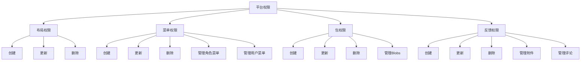
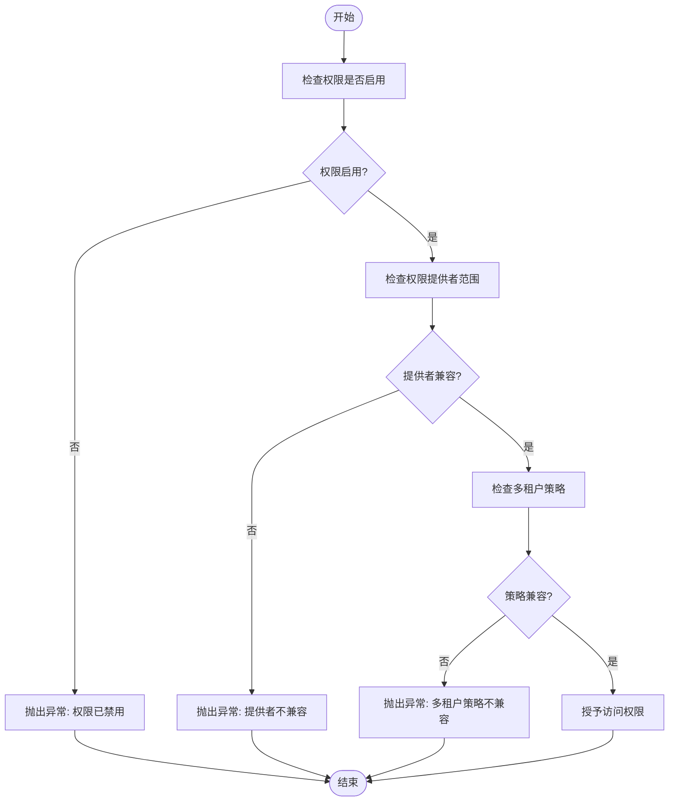
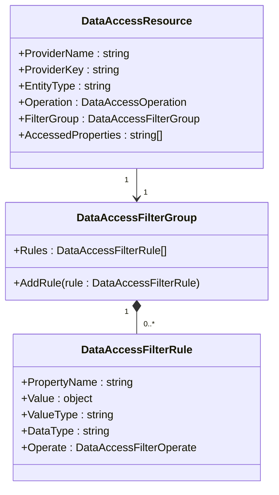
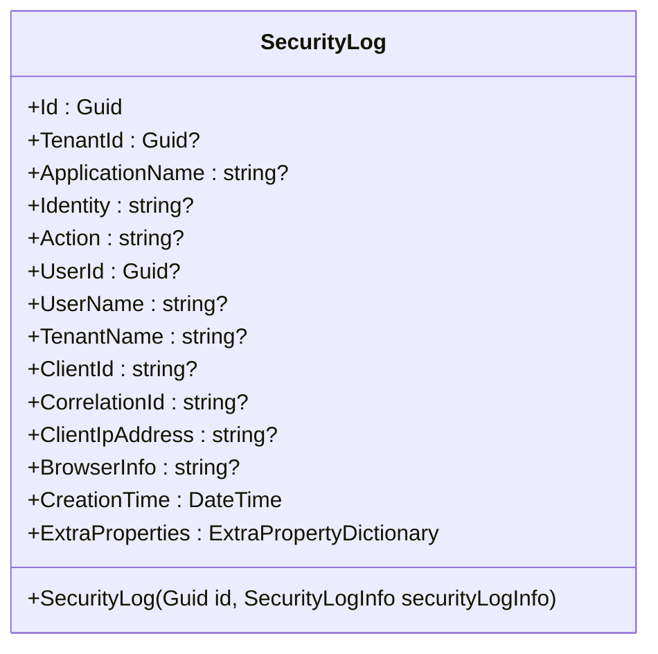

# 插件安全机制

<cite>
**本文档引用的文件**  
- [BackendAdminHttpApiHostModule.cs](file://aspnet-core/services/LY.MicroService.BackendAdmin.HttpApi.Host/Program.cs)
- [WebhooksManagementHttpApiHostModule.cs](file://aspnet-core/services/LY.MicroService.WebhooksManagement.HttpApi.Host/Program.cs)
- [WorkflowManagementHttpApiHostModule.cs](file://aspnet-core/services/LY.MicroService.WorkflowManagement.HttpApi.Host/Program.cs)
- [TaskManagementHttpApiHostModule.cs](file://aspnet-core/services/LY.MicroService.TaskManagement.HttpApi.Host/Program.cs)
- [PlatformPermissionDefinitionProvider.cs](file://aspnet-core/modules/platform/LINGYUN.Platform.Application.Contracts/LINGYUN/Platform/Permissions/PlatformPermissionDefinitionProvider.cs)
- [DataProtectionManagementPermissionDefinitionProvider.cs](file://aspnet-core/modules/data-protection/LINGYUN.Abp.DataProtectionManagement.Application.Contracts/LINGYUN/Abp/DataProtectionManagement/Permissions/DataProtectionManagementPermissionDefinitionProvider.cs)
- [ISecurityLogManager.cs](file://aspnet-core/framework/auditing/LINGYUN.Abp.AuditLogging/LINGYUN/Abp/AuditLogging/ISecurityLogManager.cs)
- [SecurityLog.cs](file://aspnet-core/framework/auditing/LINGYUN.Abp.AuditLogging/LINGYUN/Abp/AuditLogging/SecurityLog.cs)
- [DefaultSecurityLogManager.cs](file://aspnet-core/framework/auditing/LINGYUN.Abp.AuditLogging/LINGYUN/Abp/AuditLogging/DefaultSecurityLogManager.cs)
- [JwtClaimTypesMapping.cs](file://aspnet-core/framework/security/LINGYUN.Abp.Security/Volo/Abp/Security/Claims/JwtClaimTypesMapping.cs)
- [AbpSecurityModule.cs](file://aspnet-core/framework/security/LINGYUN.Abp.Security/README.md)
</cite>

## 目录
1. [引言](#引言)
2. [插件安全沙箱机制](#插件安全沙箱机制)
3. [权限控制系统](#权限控制系统)
4. [数据访问限制与防注入](#数据访问限制与防注入)
5. [安全审计与日志记录](#安全审计与日志记录)
6. [插件签名验证与来源认证](#插件签名验证与来源认证)
7. [安全配置模板](#安全配置模板)
8. [漏洞防范指南](#漏洞防范指南)
9. [结论](#结论)

## 引言
本文档全面阐述基于ABP框架的插件安全机制，涵盖安全沙箱、权限控制、数据访问限制、防注入攻击等核心安全措施。通过分析系统架构和安全模块，详细说明如何利用ABP框架的权限系统实现插件的细粒度访问控制，描述插件签名验证、来源认证和安全审计机制，并提供安全配置模板和漏洞防范指南，确保插件运行的安全性和稳定性。

## 插件安全沙箱机制
本系统通过ABP框架的插件机制实现安全沙箱，将插件隔离在独立的运行环境中。系统在启动时通过`PlugInSources.AddFolder`方法动态加载`Modules`目录下的插件程序集，实现插件的热插拔和隔离运行。

插件沙箱的核心特性包括：
- **目录隔离**：所有插件必须放置在应用程序根目录下的`Modules`文件夹中
- **动态加载**：通过ABP的插件系统在运行时动态加载插件，避免编译时硬依赖
- **权限限制**：插件只能访问被明确授予的权限和资源
- **作用域控制**：插件的权限范围受多租户策略限制，确保租户间数据隔离

该机制确保了插件在受限环境中运行，防止恶意插件对核心系统造成破坏。

**Section sources**
- [BackendAdminHttpApiHostModule.cs](file://aspnet-core/services/LY.MicroService.BackendAdmin.HttpApi.Host/Program.cs#L36-L58)
- [WebhooksManagementHttpApiHostModule.cs](file://aspnet-core/services/LY.MicroService.WebhooksManagement.HttpApi.Host/Program.cs#L36-L57)

## 权限控制系统
系统采用ABP框架的权限管理系统，实现基于角色的细粒度访问控制（RBAC）。权限系统通过权限定义提供者（PermissionDefinitionProvider）注册所有可用权限，并通过权限管理器进行权限验证。

### 权限定义
权限系统采用树状结构组织权限，每个权限组包含多个子权限。例如，平台模块定义了布局、菜单、包、反馈等权限组：



**Diagram sources**
- [PlatformPermissionDefinitionProvider.cs](file://aspnet-core/modules/platform/LINGYUN.Platform.Application.Contracts/LINGYUN/Platform/Permissions/PlatformPermissionDefinitionProvider.cs#L22-L65)

### 权限验证流程
权限验证流程包括以下步骤：
1. 检查权限是否被禁用
2. 验证权限提供者范围兼容性
3. 检查多租户策略兼容性
4. 执行权限验证

系统通过`MultiplePermissionManager`类实现权限验证，确保只有符合所有条件的请求才能通过验证。



**Diagram sources**
- [PlatformPermissionDefinitionProvider.cs](file://aspnet-core/modules/platform/LINGYUN.Platform.Application.Contracts/LINGYUN/Platform/Permissions/PlatformPermissionDefinitionProvider.cs#L22-L65)
- [DataProtectionManagementPermissionDefinitionProvider.cs](file://aspnet-core/modules/data-protection/LINGYUN.Abp.DataProtectionManagement.Application.Contracts/LINGYUN/Abp/DataProtectionManagement/Permissions/DataProtectionManagementPermissionDefinitionProvider.cs#L21-L38)

**Section sources**
- [PlatformPermissionDefinitionProvider.cs](file://aspnet-core/modules/platform/LINGYUN.Platform.Application.Contracts/LINGYUN/Platform/Permissions/PlatformPermissionDefinitionProvider.cs#L22-L65)
- [DataProtectionManagementPermissionDefinitionProvider.cs](file://aspnet-core/modules/data-protection/LINGYUN.Abp.DataProtectionManagement.Application.Contracts/LINGYUN/Abp/DataProtectionManagement/Permissions/DataProtectionManagementPermissionDefinitionProvider.cs#L21-L38)

## 数据访问限制与防注入
系统通过多层次机制实现数据访问限制和防注入攻击防护。

### 数据访问控制
数据访问控制通过数据保护管理模块实现，支持基于角色和组织单元的数据访问规则。系统可以定义复杂的访问过滤规则，如：
- 只允许查询特定条件的数据
- 限制可访问的字段集合
- 基于创建者的数据访问控制



**Diagram sources**
- [ProtectionFieldTests.cs](file://aspnet-core/tests/LINGYUN.Abp.DataProtection.Tests/LINGYUN/Abp/DataProtection/ProtectionFieldTests.cs#L87-L122)

### 防注入攻击
系统通过以下机制防止注入攻击：
1. **输入验证**：对所有用户输入进行严格验证
2. **参数化查询**：使用参数化SQL查询防止SQL注入
3. **输出编码**：对输出内容进行适当的编码处理
4. **安全配置**：设置安全的HTTP头和Cookie策略

特别是Cookie安全策略，系统通过`SameSiteCookiesServiceCollectionExtensions`类实现，根据用户代理和HTTPS状态动态调整SameSite策略，防止跨站请求伪造攻击。

## 安全审计与日志记录
系统提供全面的安全审计功能，记录所有关键操作和安全事件。

### 安全日志结构
安全日志实体包含以下关键信息：
- 应用程序名称
- 身份标识
- 操作类型
- 用户信息
- 客户端信息
- 浏览器信息
- 创建时间
- 额外属性



**Diagram sources**
- [SecurityLog.cs](file://aspnet-core/framework/auditing/LINGYUN.Abp.AuditLogging/LINGYUN/Abp/AuditLogging/SecurityLog.cs#L0-L71)

### 安全日志管理
系统通过`ISecurityLogManager`接口提供安全日志管理功能，包括：
- 获取安全日志列表
- 获取安全日志计数
- 保存安全日志
- 删除安全日志

```mermaid
sequenceDiagram
    participant Client as "客户端"
    participant Service as "安全日志服务"
    participant Manager as "安全日志管理器"
    participant Store as "日志存储"
    
    Client->>Service: 请求安全日志
    Service->>Manager: GetListAsync()
    Manager->>Store: 查询日志数据
    Store