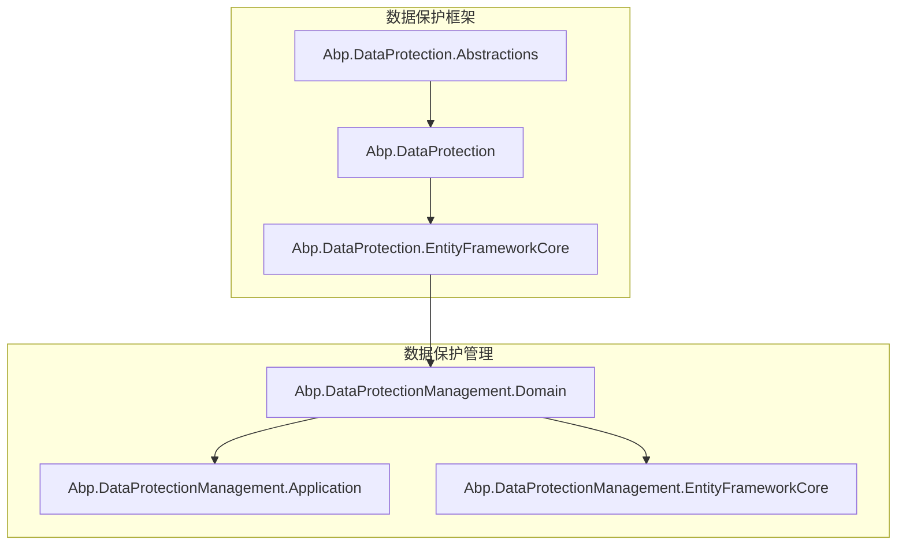
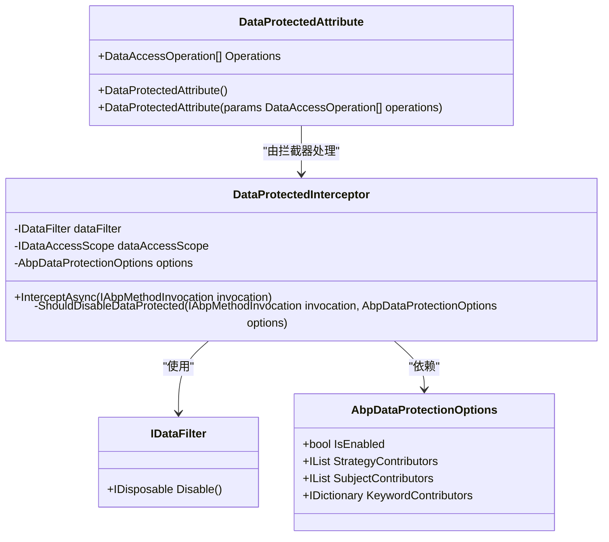
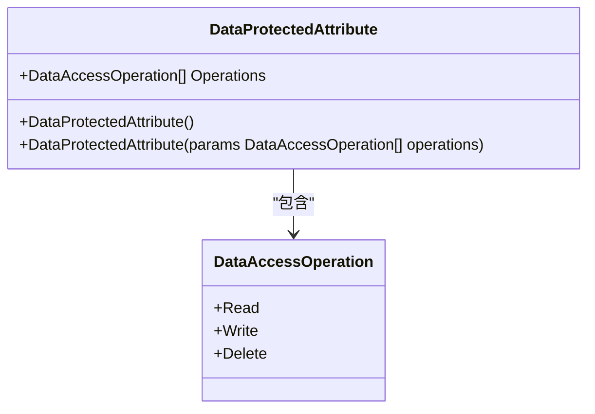
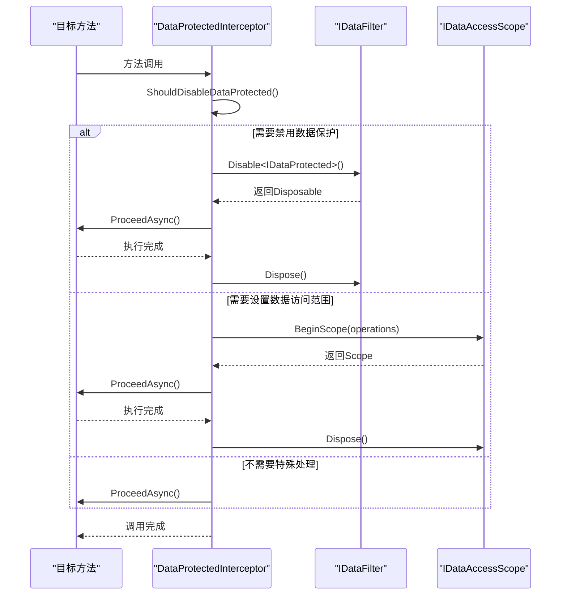
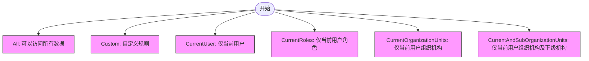
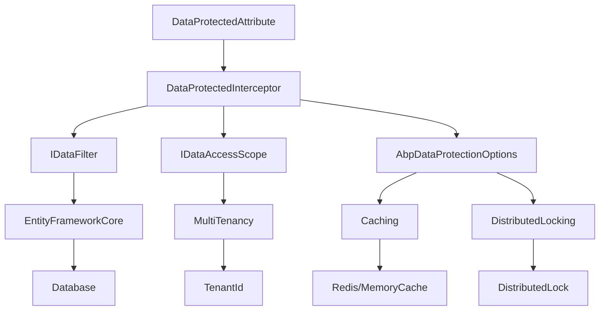

# 插件数据安全

<cite>
**本文档引用的文件**
- [DataProtectedAttribute.cs](file://aspnet-core/framework/data-protection/LINGYUN.Abp.DataProtection.Abstractions/LINGYUN/Abp/DataProtection/DataProtectedAttribute.cs)
- [DataAccessOperation.cs](file://aspnet-core/framework/data-protection/LINGYUN.Abp.DataProtection.Abstractions/LINGYUN/Abp/DataProtection/DataAccessOperation.cs)
- [DataAccessStrategy.cs](file://aspnet-core/framework/data-protection/LINGYUN.Abp.DataProtection.Abstractions/LINGYUN/Abp/DataProtection/DataAccessStrategy.cs)
- [AbpDataProtectionOptions.cs](file://aspnet-core/framework/data-protection/LINGYUN.Abp.DataProtection/LINGYUN/Abp/DataProtection/AbpDataProtectionOptions.cs)
- [DataProtectedInterceptor.cs](file://aspnet-core/framework/data-protection/LINGYUN.Abp.DataProtection/LINGYUN/Abp/DataProtection/DataProtectedInterceptor.cs)
- [README.md](file://aspnet-core/framework/data-protection/LINGYUN.Abp.DataProtection.EntityFrameworkCore/README.md)
- [ProtectedEntitiesSaver.cs](file://aspnet-core/modules/data-protection/LINGYUN.Abp.DataProtectionManagement.Domain/LINGYUN/Abp/DataProtectionManagement/ProtectedEntitiesSaver.cs)
</cite>

## 目录
1. [简介](#简介)
2. [项目结构](#项目结构)
3. [核心组件](#核心组件)
4. [架构概述](#架构概述)
5. [详细组件分析](#详细组件分析)
6. [依赖分析](#依赖分析)
7. [性能考虑](#性能考虑)
8. [故障排除指南](#故障排除指南)
9. [结论](#结论)

## 简介
本文档全面介绍ABP框架中插件数据安全保护机制，涵盖数据加密存储、敏感信息保护、数据库访问隔离等关键技术。重点说明如何利用ABP数据保护框架对插件数据进行加密处理，描述多租户环境下的数据隔离策略，并提供数据访问审计日志配置和数据泄露防护指南。

## 项目结构
ABP数据保护功能分布在多个模块中，主要包含数据保护抽象定义、实体框架实现以及管理应用三个层次。核心数据保护功能位于`aspnet-core/framework/data-protection`目录下，而管理功能则位于`aspnet-core/modules/data-protection`目录中。

**Diagram sources**
- [DataProtectedAttribute.cs](file://aspnet-core/framework/data-protection/LINGYUN.Abp.DataProtection.Abstractions/LINGYUN/Abp/DataProtection/DataProtectedAttribute.cs)
- [ProtectedEntitiesSaver.cs](file://aspnet-core/modules/data-protection/LINGYUN.Abp.DataProtectionManagement.Domain/LINGYUN/Abp/DataProtectionManagement/ProtectedEntitiesSaver.cs)

**Section sources**
- [README.md](file://aspnet-core/framework/data-protection/LINGYUN.Abp.DataProtection.EntityFrameworkCore/README.md)

## 核心组件
ABP数据保护框架的核心组件包括数据保护属性、数据访问操作、数据访问策略和拦截器机制。这些组件共同实现了细粒度的数据安全控制，确保敏感数据在存储和访问过程中的安全性。

**Section sources**
- [DataProtectedAttribute.cs](file://aspnet-core/framework/data-protection/LINGYUN.Abp.DataProtection.Abstractions/LINGYUN/Abp/DataProtection/DataProtectedAttribute.cs)
- [DataAccessOperation.cs](file://aspnet-core/framework/data-protection/LINGYUN.Abp.DataProtection.Abstractions/LINGYUN/Abp/DataProtection/DataAccessOperation.cs)
- [DataAccessStrategy.cs](file://aspnet-core/framework/data-protection/LINGYUN.Abp.DataProtection.Abstractions/LINGYUN/Abp/DataProtection/DataAccessStrategy.cs)

## 架构概述
ABP数据保护框架采用分层架构设计，通过属性标记、拦截器和数据过滤机制实现全方位的数据安全保护。框架支持字段级和实体级的数据保护，能够灵活配置不同的数据访问策略。

**Diagram sources**
- [DataProtectedAttribute.cs](file://aspnet-core/framework/data-protection/LINGYUN.Abp.DataProtection.Abstractions/LINGYUN/Abp/DataProtection/DataProtectedAttribute.cs)
- [DataProtectedInterceptor.cs](file://aspnet-core/framework/data-protection/LINGYUN.Abp.DataProtection/LINGYUN/Abp/DataProtection/DataProtectedInterceptor.cs)
- [AbpDataProtectionOptions.cs](file://aspnet-core/framework/data-protection/LINGYUN.Abp.DataProtection/LINGYUN/Abp/DataProtection/AbpDataProtectionOptions.cs)

## 详细组件分析

### 数据保护属性分析
数据保护属性（DataProtectedAttribute）是ABP数据保护框架的核心注解，用于标记需要保护的数据实体或字段。该属性支持指定具体的数据操作类型，如读取、写入和删除。

**Diagram sources**
- [DataProtectedAttribute.cs](file://aspnet-core/framework/data-protection/LINGYUN.Abp.DataProtection.Abstractions/LINGYUN/Abp/DataProtection/DataProtectedAttribute.cs)
- [DataAccessOperation.cs](file://aspnet-core/framework/data-protection/LINGYUN.Abp.DataProtection.Abstractions/LINGYUN/Abp/DataProtection/DataAccessOperation.cs)

**Section sources**
- [DataProtectedAttribute.cs](file://aspnet-core/framework/data-protection/LINGYUN.Abp.DataProtection.Abstractions/LINGYUN/Abp/DataProtection/DataProtectedAttribute.cs)

### 拦截器机制分析
数据保护拦截器（DataProtectedInterceptor）是实现数据保护逻辑的关键组件，它在方法调用时自动处理数据保护相关的逻辑，包括禁用数据保护和设置数据访问范围。

**Diagram sources**
- [DataProtectedInterceptor.cs](file://aspnet-core/framework/data-protection/LINGYUN.Abp.DataProtection/LINGYUN/Abp/DataProtection/DataProtectedInterceptor.cs)

**Section sources**
- [DataProtectedInterceptor.cs](file://aspnet-core/framework/data-protection/LINGYUN.Abp.DataProtection/LINGYUN/Abp/DataProtection/DataProtectedInterceptor.cs)

### 数据访问策略分析
ABP框架提供了多种数据访问策略，支持根据不同业务场景选择合适的数据隔离方式，特别是在多租户环境中实现有效的数据隔离。

**Diagram sources**
- [DataAccessStrategy.cs](file://aspnet-core/framework/data-protection/LINGYUN.Abp.DataProtection.Abstractions/LINGYUN/Abp/DataProtection/DataAccessStrategy.cs)

**Section sources**
- [DataAccessStrategy.cs](file://aspnet-core/framework/data-protection/LINGYUN.Abp.DataProtection.Abstractions/LINGYUN/Abp/DataProtection/DataAccessStrategy.cs)

## 依赖分析
ABP数据保护框架依赖于多个核心组件和服务，形成了完整的数据安全保护体系。这些依赖关系确保了框架的灵活性和可扩展性。

**Diagram sources**
- [AbpDataProtectionOptions.cs](file://aspnet-core/framework/data-protection/LINGYUN.Abp.DataProtection/LINGYUN/Abp/DataProtection/AbpDataProtectionOptions.cs)
- [DataProtectedInterceptor.cs](file://aspnet-core/framework/data-protection/LINGYUN.Abp.DataProtection/LINGYUN/Abp/DataProtection/DataProtectedInterceptor.cs)

**Section sources**
- [AbpDataProtectionOptions.cs](file://aspnet-core/framework/data-protection/LINGYUN.Abp.DataProtection/LINGYUN/Abp/DataProtection/AbpDataProtectionOptions.cs)

## 性能考虑
在使用ABP数据保护框架时，需要注意以下性能相关事项：
- 数据保护拦截器会增加方法调用的开销，建议仅在必要时使用
- 复杂的数据访问策略可能影响查询性能，应合理设计策略
- 缓存机制可以有效提升数据保护相关的查询性能
- 分布式锁的使用应谨慎，避免成为性能瓶颈

## 故障排除指南
当遇到数据保护相关问题时，可以参考以下排查步骤：
1. 检查是否正确配置了数据保护选项
2. 确认数据保护属性是否正确标记在实体或字段上
3. 验证拦截器是否正常工作
4. 检查数据访问策略配置是否符合预期
5. 查看日志中是否有相关的错误信息

**Section sources**
- [AbpDataProtectionOptions.cs](file://aspnet-core/framework/data-protection/LINGYUN.Abp.DataProtection/LINGYUN/Abp/DataProtection/AbpDataProtectionOptions.cs)
- [DataProtectedInterceptor.cs](file://aspnet-core/framework/data-protection/LINGYUN.Abp.DataProtection/LINGYUN/Abp/DataProtection/DataProtectedInterceptor.cs)

## 结论
ABP数据保护框架提供了一套完整的插件数据安全解决方案，通过属性标记、拦截器和数据过滤机制实现了细粒度的数据安全控制。框架支持多种数据访问策略，特别适合多租户环境下的数据隔离需求。结合审计日志和缓存机制，能够有效防止数据泄露并提升系统性能。