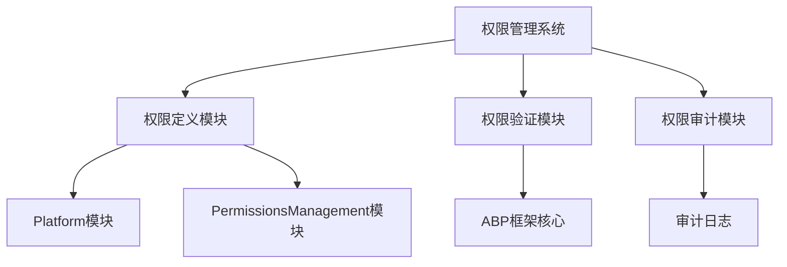
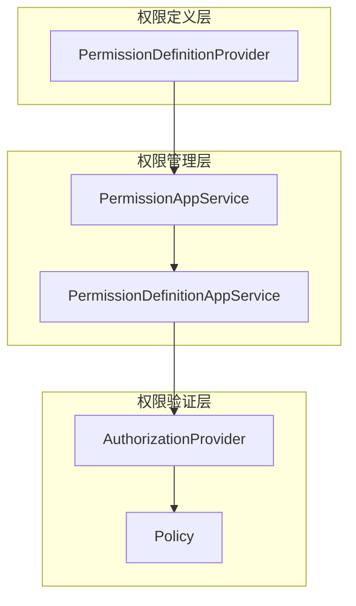
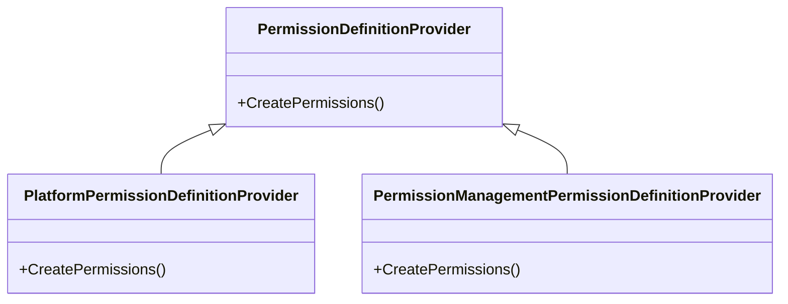
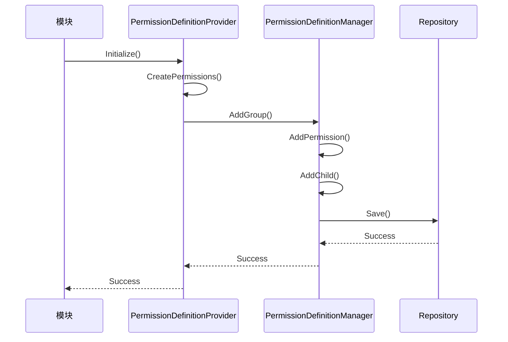

# 插件权限控制

<cite>
**本文档中引用的文件**  
- [PlatformPermissionDefinitionProvider.cs](file://aspnet-core/modules/platform/LINGYUN.Platform.Application.Contracts/LINGYUN/Platform/Permissions/PlatformPermissionDefinitionProvider.cs)
- [PermissionManagementPermissionDefinitionProvider.cs](file://aspnet-core/modules/permissions-management/LINGYUN.Abp.PermissionManagement.Application.Contracts/LINGYUN/Abp/PermissionManagement/Permissions/PermissionManagementPermissionDefinitionProvider.cs)
- [ProjectNamePermissions.cs](file://aspnet-core/templates/micro/content/src/PackageName.CompanyName.ProjectName.Application.Contracts/PackageName/CompanyName/ProjectName/Permissions/ProjectNamePermissions.cs)
- [PermissionDefinitionAppService.cs](file://aspnet-core/modules/permissions-management/LINGYUN.Abp.PermissionManagement.Application/LINGYUN/Abp/PermissionManagement/Definitions/PermissionDefinitionAppService.cs)
- [PermissionAppService.cs](file://aspnet-core/modules/permissions-management/LINGYUN.Abp.PermissionManagement.Application/LINGYUN/Abp/PermissionManagement/PermissionAppService.cs)
- [PermissionChangeState.cs](file://aspnet-core/modules/permissions-management/LINGYUN.Abp.PermissionManagement.Application/LINGYUN/Abp/PermissionManagement/PermissionChangeState.cs)
- [PermissionDefinitionController.cs](file://aspnet-core/modules/permissions-management/LINGYUN.Abp.PermissionManagement.HttpApi/LINGYUN/Abp/PermissionManagement/HttpApi/Definitions/PermissionDefinitionController.cs)
</cite>

## 目录
1. [简介](#简介)
2. [项目结构](#项目结构)
3. [核心组件](#核心组件)
4. [架构概述](#架构概述)
5. [详细组件分析](#详细组件分析)
6. [依赖分析](#依赖分析)
7. [性能考虑](#性能考虑)
8. [故障排除指南](#故障排除指南)
9. [结论](#结论)

## 简介
本文档深入讲解基于ABP框架的插件权限控制系统，详细说明如何定义插件专属权限、配置权限层级结构、实现细粒度访问控制。展示权限声明、验证和审计的完整流程，包括代码示例和配置文件。解释与系统级权限的集成方式，提供权限策略设计的最佳实践和常见反模式。

## 项目结构
本项目采用模块化设计，权限控制系统主要分布在`aspnet-core/modules`目录下的多个模块中。核心权限管理功能由`permissions-management`模块提供，而具体插件的权限定义则分散在各个业务模块中，如`platform`模块。这种设计实现了权限控制的集中管理与分布式定义。

**图示来源**
- [PlatformPermissionDefinitionProvider.cs](file://aspnet-core/modules/platform/LINGYUN.Platform.Application.Contracts/LINGYUN/Platform/Permissions/PlatformPermissionDefinitionProvider.cs)
- [PermissionManagementPermissionDefinitionProvider.cs](file://aspnet-core/modules/permissions-management/LINGYUN.Abp.PermissionManagement.Application.Contracts/LINGYUN/Abp/PermissionManagement/Permissions/PermissionManagementPermissionDefinitionProvider.cs)

**章节来源**
- [PlatformPermissionDefinitionProvider.cs](file://aspnet-core/modules/platform/LINGYUN.Platform.Application.Contracts/LINGYUN/Platform/Permissions/PlatformPermissionDefinitionProvider.cs)

## 核心组件
插件权限控制系统的核心组件包括权限定义提供者、权限管理服务和权限验证机制。权限定义提供者负责声明插件的专属权限，权限管理服务提供权限的增删改查接口，权限验证机制则在运行时检查用户是否具有执行特定操作的权限。

**章节来源**
- [PermissionDefinitionAppService.cs](file://aspnet-core/modules/permissions-management/LINGYUN.Abp.PermissionManagement.Application/LINGYUN/Abp/PermissionManagement/Definitions/PermissionDefinitionAppService.cs)
- [PermissionAppService.cs](file://aspnet-core/modules/permissions-management/LINGYUN.Abp.PermissionManagement.Application/LINGYUN/Abp/PermissionManagement/PermissionAppService.cs)

## 架构概述
插件权限控制系统采用分层架构，包括权限定义层、权限管理层和权限验证层。权限定义层负责声明权限，权限管理层提供权限的CRUD操作，权限验证层则在应用运行时进行权限检查。

**图示来源**
- [PermissionDefinitionAppService.cs](file://aspnet-core/modules/permissions-management/LINGYUN.Abp.PermissionManagement.Application/LINGYUN/Abp/PermissionManagement/Definitions/PermissionDefinitionAppService.cs)
- [PermissionAppService.cs](file://aspnet-core/modules/permissions-management/LINGYUN.Abp.PermissionManagement.Application/LINGYUN/Abp/PermissionManagement/PermissionAppService.cs)

## 详细组件分析
### 权限定义分析
权限定义是插件权限控制的基础，通过继承`PermissionDefinitionProvider`类来实现。每个插件可以定义自己的权限组和权限项，并建立层级结构。

#### 权限定义类图

**图示来源**
- [PlatformPermissionDefinitionProvider.cs](file://aspnet-core/modules/platform/LINGYUN.Platform.Application.Contracts/LINGYUN/Platform/Permissions/PlatformPermissionDefinitionProvider.cs)
- [PermissionManagementPermissionDefinitionProvider.cs](file://aspnet-core/modules/permissions-management/LINGYUN.Abp.PermissionManagement.Application.Contracts/LINGYUN/Abp/PermissionManagement/Permissions/PermissionManagementPermissionDefinitionProvider.cs)

#### 权限定义流程

**图示来源**
- [PlatformPermissionDefinitionProvider.cs](file://aspnet-core/modules/platform/LINGYUN.Platform.Application.Contracts/LINGYUN/Platform/Permissions/PlatformPermissionDefinitionProvider.cs)
- [PermissionDefinitionAppService.cs](file://aspnet-core/modules/permissions-management/LINGYUN.Abp.PermissionManagement.Application/LINGYUN/Abp/PermissionManagement/Definitions/PermissionDefinitionAppService.cs)

**章节来源**
- [PlatformPermissionDefinitionProvider.cs](file://aspnet-core/modules/platform/LINGYUN.Platform.Application.Contracts/LINGYUN/Platform/Permissions/PlatformPermissionDefinitionProvider.cs)

### 权限管理分析
权限管理服务提供对权限的增删改查操作