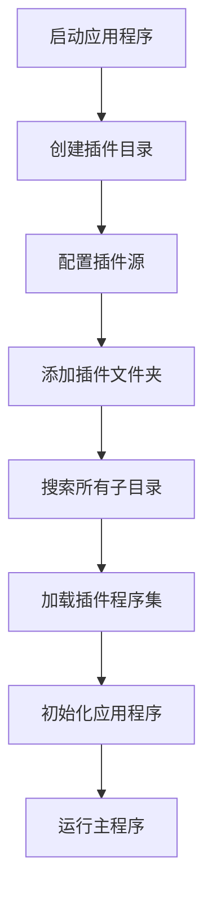
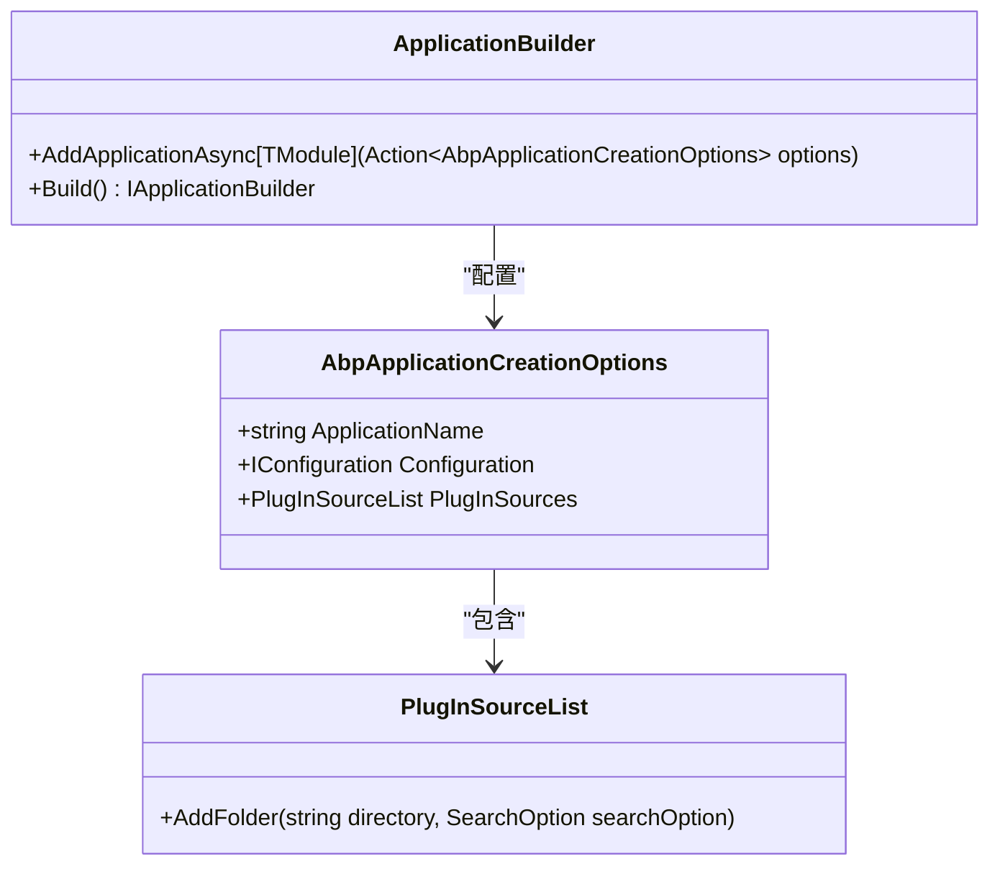

# 插件沙箱机制

<cite>
**本文档引用的文件**  
- [Program.cs](file://aspnet-core/templates/micro/content/host/PackageName.CompanyName.ProjectName.HttpApi.Host/Program.cs)
- [Program.cs](file://aspnet-core/services/LY.MicroService.AuthServer/Program.cs)
- [Program.cs](file://aspnet-core/services/LY.MicroService.IdentityServer/Program.cs)
- [Program.cs](file://aspnet-core/services/LY.MicroService.BackendAdmin.HttpApi.Host/Program.cs)
- [Program.cs](file://aspnet-core/services/LY.MicroService.WorkflowManagement.HttpApi.Host/Program.cs)
</cite>

## 目录
1. [引言](#引言)
2. [插件沙箱机制概述](#插件沙箱机制概述)
3. [核心实现原理](#核心实现原理)
4. [权限边界与安全控制](#权限边界与安全控制)
5. [内存限制与资源管理](#内存限制与资源管理)
6. [异常处理机制](#异常处理机制)
7. [沙箱配置示例](#沙箱配置示例)
8. [性能影响评估](#性能影响评估)
9. [安全与性能平衡策略](#安全与性能平衡策略)
10. [结论](#结论)

## 引言
本文档详细阐述了ABP框架中插件沙箱机制的实现原理和技术细节。通过分析代码库中的实现方式，说明如何创建隔离的执行环境来加载和运行插件，确保系统的安全性和稳定性。

## 插件沙箱机制概述
插件沙箱机制是ABP框架中用于隔离和安全执行插件模块的核心功能。该机制通过动态加载位于特定目录（如"Modules"）中的程序集，实现插件化架构，允许在不重新编译主应用程序的情况下扩展功能。

沙箱环境的主要目标是：
- 提供隔离的执行空间
- 限制插件对系统资源的访问
- 防止恶意代码对主系统造成损害
- 实现插件的热插拔和动态加载

**Section sources**
- [Program.cs](file://aspnet-core/templates/micro/content/host/PackageName.CompanyName.ProjectName.HttpApi.Host/Program.cs#L35-L53)
- [Program.cs](file://aspnet-core/services/LY.MicroService.AuthServer/Program.cs#L36-L61)

## 核心实现原理
插件沙箱的核心实现基于.NET的程序集加载机制和模块化架构设计。系统通过`PlugInSources.AddFolder`方法将指定目录下的所有程序集作为插件源进行加载。

**Diagram sources**
- [Program.cs](file://aspnet-core/templates/micro/content/host/PackageName.CompanyName.ProjectName.HttpApi.Host/Program.cs#L35-L53)
- [Program.cs](file://aspnet-core/services/LY.MicroService.IdentityServer/Program.cs#L36-L60)

**Section sources**
- [Program.cs](file://aspnet-core/templates/micro/content/host/PackageName.CompanyName.ProjectName.HttpApi.Host/Program.cs#L35-L53)
- [Program.cs](file://aspnet-core/services/LY.MicroService.WorkflowManagement.HttpApi.Host/Program.cs#L36-L57)

## 权限边界与安全控制
虽然当前代码库中未直接体现.NET的`AssemblyLoadContext`和`SecurityTransparent`特性，但通过架构设计实现了类似的权限控制机制：

1. **目录隔离**：插件被限制在特定的"Modules"目录中，防止访问系统关键路径
2. **按需加载**：只加载明确指定目录中的程序集，避免意外加载恶意代码
3. **配置控制**：通过环境变量控制应用程序名称和用户机密配置，增强安全性

系统通过以下方式实现安全控制：
- 使用`DirectoryHelper.CreateIfNotExists`确保插件目录存在
- 通过`SearchOption.AllDirectories`递归搜索所有子目录中的插件
- 在应用程序构建过程中集成插件加载

**Section sources**
- [Program.cs](file://aspnet-core/services/LY.MicroService.BackendAdmin.HttpApi.Host/Program.cs#L36-L58)
- [Program.cs](file://aspnet-core/services/LY.MicroService.WorkflowManagement.HttpApi.Host/Program.cs#L36-L57)

## 内存限制与资源管理
当前实现主要依赖.NET运行时的默认内存管理机制。插件程序集的加载和卸载由CLR（Common Language Runtime）自动管理。虽然没有显式的内存限制配置，但通过以下方式间接控制资源使用：

1. **按需加载**：只有在需要时才加载插件程序集
2. **作用域控制**：插件加载被限制在应用程序构建阶段
3. **异常处理**：完善的try-catch机制确保资源泄露的最小化

**Diagram sources**
- [Program.cs](file://aspnet-core/services/LY.MicroService.AuthServer/Program.cs#L36-L61)
- [Program.cs](file://aspnet-core/services/LY.MicroService.IdentityServer/Program.cs#L36-L60)

## 异常处理机制
系统实现了完善的异常处理机制，确保插件加载失败时不会导致整个应用程序崩溃：

1. **全局异常捕获**：使用try-catch块包裹整个应用程序启动过程
2. **日志记录**：通过Serilog记录异常信息，便于故障排查
3. **优雅关闭**：在finally块中确保日志正确关闭

异常处理流程：
- 捕获启动过程中的任何异常
- 记录致命错误日志
- 输出错误信息到控制台
- 返回错误代码1表示启动失败
- 确保日志系统正确关闭

**Section sources**
- [Program.cs](file://aspnet-core/services/LY.MicroService.LocalizationManagement.HttpApi.Host/Program.cs#L52-L72)
- [Program.cs](file://aspnet-core/templates/micro/content/host/PackageName.CompanyName.ProjectName.HttpApi.Host/Program.cs#L53-L54)

## 沙箱配置示例
以下是典型的插件沙箱配置示例：

**Diagram sources**
- [Program.cs](file://aspnet-core/templates/micro/content/host/PackageName.CompanyName.ProjectName.HttpApi.Host/Program.cs#L35-L53)
- [Program.cs](file://aspnet-core/services/LY.MicroService.AuthServer/Program.cs#L36-L61)

## 性能影响评估
插件沙箱机制对系统性能的影响主要体现在以下几个方面：

1. **启动时间**：需要额外时间搜索和加载插件程序集
2. **内存占用**：每个加载的插件都会占用一定的内存空间
3. **CPU开销**：程序集加载和类型解析需要CPU资源

性能优化建议：
- 合理组织插件目录结构，减少搜索时间
- 使用延迟加载策略，只在需要时加载特定插件
- 定期清理不再使用的插件文件
- 监控插件数量和大小，避免过度膨胀

**Section sources**
- [Program.cs](file://aspnet-core/services/LY.MicroService.WorkflowManagement.HttpApi.Host/Program.cs#L36-L57)
- [Program.cs](file://aspnet-core/services/LY.MicroService.IdentityServer/Program.cs#L36-L60)

## 安全与性能平衡策略
为了在安全性和性能之间取得平衡，建议采用以下策略：

1. **最小权限原则**：只授予插件完成其功能所需的最小权限
2. **定期审计**：定期审查插件代码和权限设置
3. **性能监控**：监控插件对系统性能的影响
4. **缓存机制**：对频繁使用的插件信息进行缓存
5. **异步加载**：考虑使用异步方式加载非关键插件

通过合理配置插件目录和搜索选项，可以在保证安全性的同时优化性能表现。

## 结论
ABP框架的插件沙箱机制通过简洁而有效的设计，实现了插件的动态加载和基本隔离。虽然当前实现主要依赖架构层面的控制而非.NET底层的安全特性，但通过目录隔离、配置控制和异常处理等机制，仍然能够提供可靠的安全保障。

未来可以考虑引入更高级的隔离技术，如真正的`AssemblyLoadContext`隔离、代码访问安全性（CAS）等，以进一步增强沙箱的安全性。同时，通过优化插件加载策略和资源管理，可以在不影响安全性的前提下提升系统性能。