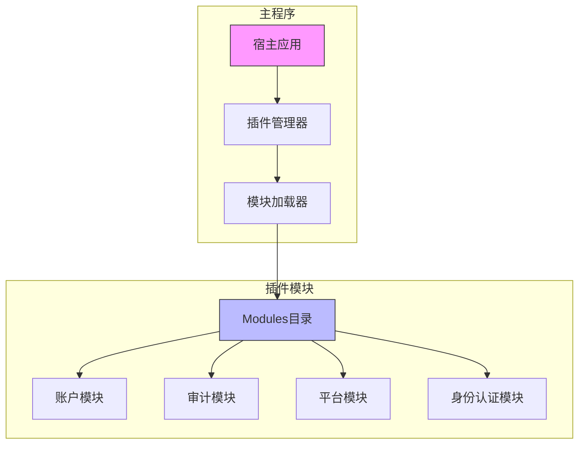
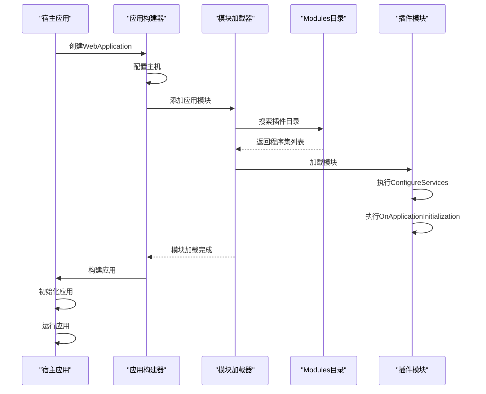
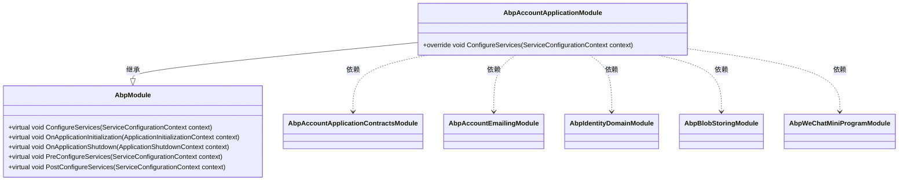
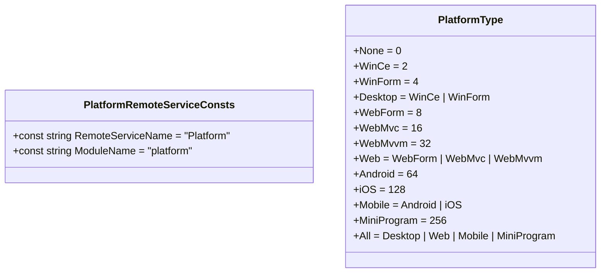
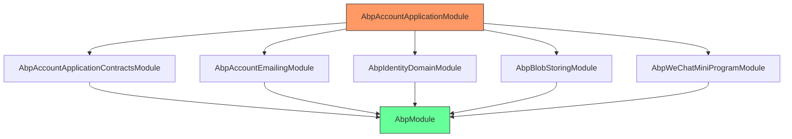

# 插件开发

<cite>
**本文档引用的文件**  
- [Program.cs](file://aspnet-core/templates/micro/content/host/PackageName.CompanyName.ProjectName.HttpApi.Host/Program.cs)
- [AbpAccountApplicationModule.cs](file://aspnet-core/modules/account/LINGYUN.Abp.Account.Application/LINGYUN/Abp/Account/AbpAccountApplicationModule.cs)
- [PlatformRemoteServiceConsts.cs](file://aspnet-core/modules/platform/LINGYUN.Platform.Application.Contracts/LINGYUN/Platform/PlatformRemoteServiceConsts.cs)
- [PlatformType.cs](file://aspnet-core/modules/platform/LINGYUN.Platform.Domain.Shared/LINGYUN/Platform/PlatformType.cs)
- [AbpCommonModule.cs](file://aspnet-core/framework/common/LINGYUN.Abp.Core/AbpCommonModule.cs)
</cite>

## 目录
1. [简介](#简介)
2. [项目结构](#项目结构)
3. [核心组件](#核心组件)
4. [架构概述](#架构概述)
5. [详细组件分析](#详细组件分析)
6. [依赖分析](#依赖分析)
7. [性能考虑](#性能考虑)
8. [故障排除指南](#故障排除指南)
9. [结论](#结论)
10. [附录](#附录)（如有必要）

## 简介
本文档详细介绍了在ABP Next Admin系统中开发可动态加载插件的完整流程。该系统基于ABP框架构建，采用模块化架构设计，支持通过插件机制动态扩展功能。文档涵盖了插件接口定义、加载机制、生命周期管理、配置管理、通信机制、依赖管理、版本兼容性处理、安全性和稳定性保障等关键主题。通过本指南，开发者可以了解如何创建符合系统规范的插件，实现功能的灵活扩展和集成。

## 项目结构
ABP Next Admin项目采用微服务和模块化架构，插件系统是其核心特性之一。主程序通过动态加载`Modules`目录下的程序集来实现功能扩展，避免了硬编码依赖，提高了系统的灵活性和可维护性。



**图示来源**  
- [Program.cs](file://aspnet-core/templates/micro/content/host/PackageName.CompanyName.ProjectName.HttpApi.Host/Program.cs#L35-L53)

**本节来源**  
- [Program.cs](file://aspnet-core/templates/micro/content/host/PackageName.CompanyName.ProjectName.HttpApi.Host/Program.cs#L35-L53)

## 核心组件
本系统的核心在于其模块化和插件化设计。通过ABP框架的模块系统，每个功能单元都被封装为独立的模块，可以在运行时动态加载。这种设计使得系统能够灵活地添加或移除功能，而无需重新编译整个应用程序。

**本节来源**  
- [AbpCommonModule.cs](file://aspnet-core/framework/common/LINGYUN.Abp.Core/AbpCommonModule.cs#L1-L8)
- [AbpAccountApplicationModule.cs](file://aspnet-core/modules/account/LINGYUN.Abp.Account.Application/LINGYUN/Abp/Account/AbpAccountApplicationModule.cs#L1-L52)

## 架构概述
系统的插件架构基于ABP框架的模块化设计，通过`PlugInSources`机制实现动态加载。宿主应用在启动时会扫描指定目录（如`Modules`）下的所有程序集，并自动加载其中的模块。



**图示来源**  
- [Program.cs](file://aspnet-core/templates/micro/content/host/PackageName.CompanyName.ProjectName.HttpApi.Host/Program.cs#L35-L53)

## 详细组件分析
### 插件模块分析
每个插件模块都是一个独立的.NET程序集，包含一个继承自`AbpModule`的模块类。该类通过`[DependsOn]`属性声明其依赖的其他模块，确保正确的加载顺序。

#### 模块定义


**图示来源**  
- [AbpAccountApplicationModule.cs](file://aspnet-core/modules/account/LINGYUN.Abp.Account.Application/LINGYUN/Abp/Account/AbpAccountApplicationModule.cs#L1-L52)

#### 配置管理
插件系统通过常量类来管理远程服务名称和模块名称，确保服务间的正确通信。



**图示来源**  
- [PlatformRemoteServiceConsts.cs](file://aspnet-core/modules/platform/LINGYUN.Platform.Application.Contracts/LINGYUN/Platform/PlatformRemoteServiceConsts.cs#L1-L7)
- [PlatformType.cs](file://aspnet-core/modules/platform/LINGYUN.Platform.Domain.Shared/LINGYUN/Platform/PlatformType.cs#L1-L62)

**本节来源**  
- [AbpAccountApplicationModule.cs](file://aspnet-core/modules/account/LINGYUN.Abp.Account.Application/LINGYUN/Abp/Account/AbpAccountApplicationModule.cs#L1-L52)
- [PlatformRemoteServiceConsts.cs](file://aspnet-core/modules/platform/LINGYUN.Platform.Application.Contracts/LINGYUN/Platform/PlatformRemoteServiceConsts.cs#L1-L7)
- [PlatformType.cs](file://aspnet-core/modules/platform/LINGYUN.Platform.Domain.Shared/LINGYUN/Platform/PlatformType.cs#L1-L62)

## 依赖分析
系统的依赖关系通过ABP框架的模块依赖系统进行管理。每个模块通过`[DependsOn]`特性声明其依赖的其他模块，框架会自动解析依赖图并按正确的顺序加载模块。



**图示来源**  
- [AbpAccountApplicationModule.cs](file://aspnet-core/modules/account/LINGYUN.Abp.Account.Application/LINGYUN/Abp/Account/AbpAccountApplicationModule.cs#L1-L52)

**本节来源**  
- [AbpAccountApplicationModule.cs](file://aspnet-core/modules/account/LINGYUN.Abp.Account.Application/LINGYUN/Abp/Account/AbpAccountApplicationModule.cs#L1-L52)

## 性能考虑
插件系统的性能主要受模块加载时间和依赖解析复杂度的影响。建议采取以下优化措施：
- 将不常用的模块设置为延迟加载
- 优化模块间的依赖关系，避免循环依赖
- 使用缓存机制减少重复的模块扫描
- 对大型模块进行拆分，提高加载效率

## 故障排除指南
在开发和使用插件时，可能会遇到以下常见问题：
- **模块未加载**：检查`Modules`目录路径是否正确，确保程序集文件存在且可读
- **依赖解析失败**：检查`[DependsOn]`特性中的模块名称是否正确，确保依赖模块已正确安装
- **配置冲突**：确保不同模块间的配置项不冲突，使用命名空间隔离配置
- **版本不兼容**：确保插件与宿主应用的ABP框架版本兼容

**本节来源**  
- [Program.cs](file://aspnet-core/templates/micro/content/host/PackageName.CompanyName.ProjectName.HttpApi.Host/Program.cs#L35-L53)
- [AbpAccountApplicationModule.cs](file://aspnet-core/modules/account/LINGYUN.Abp.Account.Application/LINGYUN/Abp/Account/AbpAccountApplicationModule.cs#L1-L52)

## 结论
ABP Next Admin的插件系统提供了一套完整的动态扩展机制，通过模块化设计实现了功能的灵活组合和动态加载。开发者可以基于此系统创建可复用、易维护的插件，满足不同场景下的业务需求。未来可以进一步完善插件市场的管理功能，提供插件的在线安装、更新和卸载能力。

## 附录
### 插件开发模板
```csharp
using Volo.Abp.Modularity;

namespace MyCompany.MyModule
{
    [DependsOn(
        typeof(RequiredModule1),
        typeof(RequiredModule2))]
    public class MyModule : AbpModule
    {
        public override void ConfigureServices(ServiceConfigurationContext context)
        {
            // 配置服务
        }
        
        public override void OnApplicationInitialization(ApplicationInitializationContext context)
        {
            // 应用初始化
        }
    }
}
```