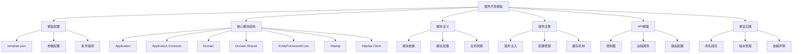
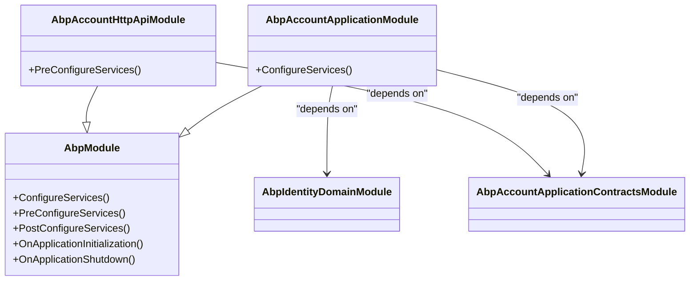

# 插件开发模板

<cite>
**本文档引用的文件**  
- [template.json](file://aspnet-core/templates/aio/content/.template.config/template.json)
- [template.json](file://aspnet-core/templates/micro/content/.template.config/template.json)
- [README.md](file://README.md)
- [AbpAccountApplicationModule.cs](file://aspnet-core/modules/account/LINGYUN.Abp.Account.Application/LINGYUN/Abp/Account/AbpAccountApplicationModule.cs)
- [AbpAccountHttpApiModule.cs](file://aspnet-core/modules/account/LINGYUN.Abp.Account.HttpApi/LINGYUN/Abp/Account/AbpAccountHttpApiModule.cs)
- [AccountController.cs](file://aspnet-core/modules/account/LINGYUN.Abp.Account.HttpApi/LINGYUN/Abp/Account/AccountController.cs)
- [AccountAppService.cs](file://aspnet-core/modules/account/LINGYUN.Abp.Account.Application/LINGYUN/Abp/Account/AccountAppService.cs)
</cite>

## 目录结构

[提供完整的插件开发模板文档。详细介绍标准插件项目的目录结构、核心文件、配置文件和构建脚本。说明如何使用项目模板快速创建新插件，包括模块定义、服务注册、API暴露等关键步骤。提供最佳实践建议，如命名规范、版本管理、依赖声明等，确保插件的一致性和可维护性。]

**Diagram sources**  
- [template.json](file://aspnet-core/templates/aio/content/.template.config/template.json)

## 项目结构

ABP Next Admin项目采用模块化架构，插件开发遵循标准的目录结构和命名规范。项目根目录包含多个关键子目录：

- **aspnet-core**: 核心后端代码，包含框架、迁移、模块、服务和模板
- **deploy**: 部署相关配置和脚本
- **gateways**: 网关配置
- **starter**: 启动脚本集合
- **apps**: 前端应用

插件开发主要集中在`aspnet-core`目录下，特别是`modules`和`templates`子目录。`templates`目录提供了创建新插件的模板，而`modules`目录包含了所有已实现的插件模块。

**Section sources**  
- [README.md](file://README.md)

## 核心文件

插件开发涉及多个核心文件和组件，每个都有特定的职责和作用：

### 模板配置文件

`template.json`文件定义了插件模板的元数据和配置选项，包括：

- **author**: 作者信息
- **classifications**: 分类标签
- **name**: 模板名称
- **identity**: 模板标识
- **description**: 模板描述
- **shortName**: 短名称（用于CLI）
- **symbols**: 可配置参数，如数据库管理和认证方案

模板支持条件编译，通过计算符号（computed symbols）实现不同配置下的代码生成。

### 模块定义文件

每个插件模块都包含一个或多个模块定义类，这些类继承自`AbpModule`并使用`[DependsOn]`属性声明依赖关系。

**Diagram sources**  
-