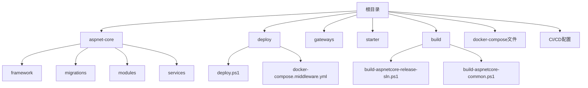
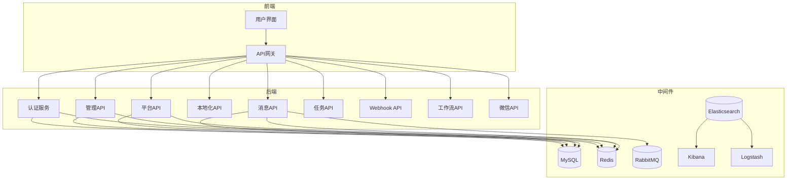
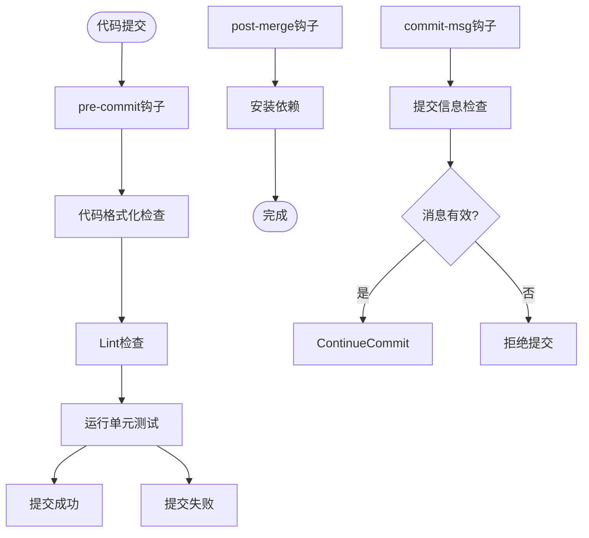
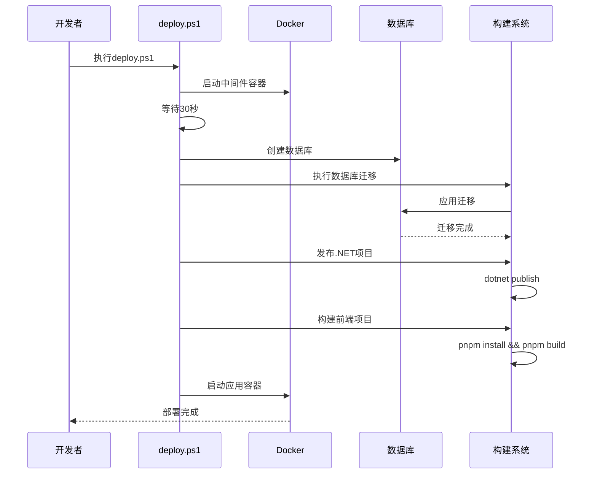
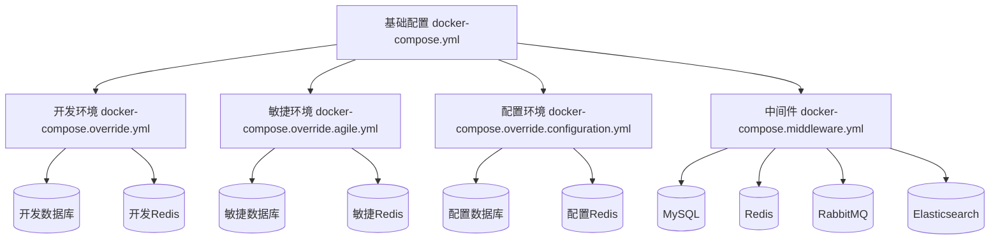
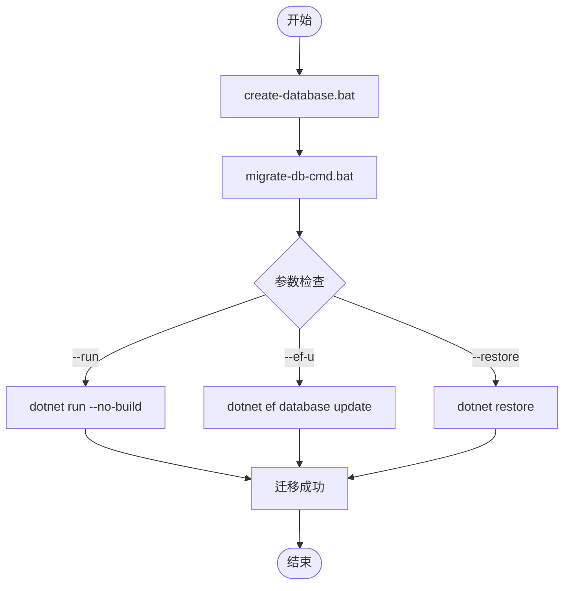
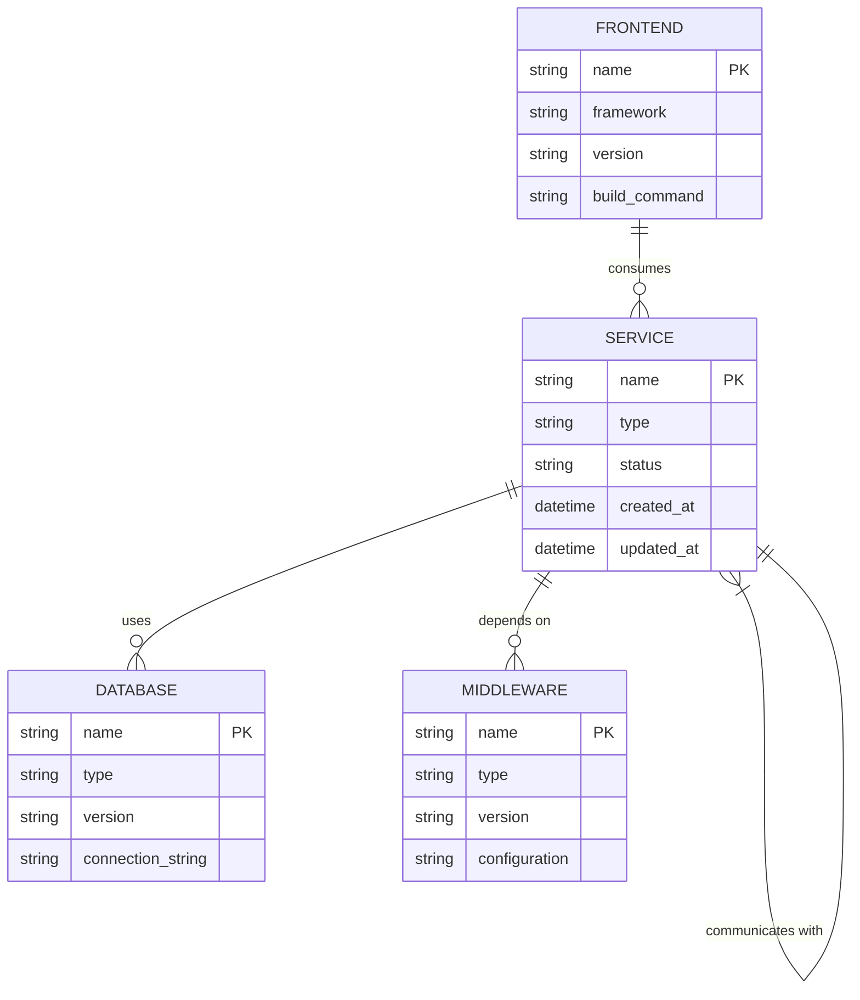
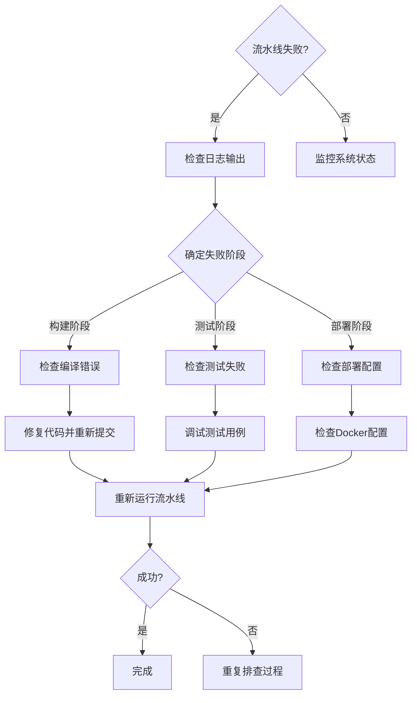

# 插件CI/CD流水线

<cite>
**本文档引用的文件**
- [lefthook.yml](file://lefthook.yml)
- [deploy.ps1](file://deploy\deploy.ps1)
- [docker-compose.yml](file://docker-compose.yml)
- [docker-compose.middleware.yml](file://docker-compose.middleware.yml)
- [create-database.bat](file://aspnet-core\create-database.bat)
- [migrate-database.bat](file://aspnet-core\migrate-database.bat)
- [migrate-db-cmd.bat](file://aspnet-core\migrate-db-cmd.bat)
- [build-aspnetcore-release-sln.ps1](file://build\build-aspnetcore-release-sln.ps1)
- [apps\vben5\lefthook.yml](file://apps\vben5\lefthook.yml)
- [tye.yaml](file://tye.yaml)
</cite>

## 目录
1. [简介](#简介)
2. [项目结构](#项目结构)
3. [核心组件](#核心组件)
4. [架构概述](#架构概述)
5. [详细组件分析](#详细组件分析)
6. [依赖分析](#依赖分析)
7. [性能考虑](#性能考虑)
8. [故障排除指南](#故障排除指南)
9. [结论](#结论)

## 简介
本指南旨在为ABP Next Admin项目提供一个全面的插件CI/CD流水线配置方案。文档详细阐述了自动化构建、测试、打包和部署的流程配置，包括使用lefthook进行本地钩子管理和持续集成服务器的配置。同时涵盖了代码质量检查、安全扫描和性能测试的集成方法，以及多环境（开发、测试、预生产、生产）发布的策略和审批流程。此外，还说明了如何实现自动化回滚机制和部署监控，并包含流水线可视化和报告生成的指导，确保发布过程的透明度和可追溯性。

## 项目结构
该项目是一个基于ABP框架的微服务架构应用，包含多个模块和服务。主要目录结构如下：

- `aspnet-core`: 包含所有.NET Core相关的源代码，分为框架、迁移、模块、服务等子目录。
- `deploy`: 包含部署脚本和Docker配置文件。
- `gateways`: 包含内部和外部API网关的实现。
- `starter`: 包含快速启动脚本。
- `build`: 包含构建脚本。
- 根目录下有多个Docker Compose配置文件和CI/CD相关配置。

**Diagram sources**
- [project_structure](file://project_structure)

**Section sources**
- [project_structure](file://project_structure)

## 核心组件
项目的核心组件包括多个微服务、数据库迁移工具、API网关和前端应用。每个微服务都独立部署并通过Docker容器运行。数据库迁移通过专门的DbMigrator项目完成，确保数据库模式与代码同步。API网关负责路由请求到相应的后端服务，并提供统一的入口点。

**Section sources**
- [docker-compose.yml](file://docker-compose.yml#L1-L244)
- [tye.yaml](file://tye.yaml#L1-L89)

## 架构概述
系统采用微服务架构，使用Docker和Docker Compose进行容器化部署。整体架构包括多个后端微服务、中间件服务（如MySQL、Redis、RabbitMQ、Elasticsearch等）和前端应用。API网关作为系统的入口，将请求路由到相应的后端服务。所有服务通过网络隔离的方式部署在同一个Docker网络中。

**Diagram sources**
- [docker-compose.yml](file://docker-compose.yml#L1-L244)
- [docker-compose.middleware.yml](file://docker-compose.middleware.yml#L1-L115)

## 详细组件分析

### CI/CD配置分析
项目的CI/CD流水线配置主要由以下几个部分组成：本地钩子管理、自动化部署脚本、容器编排配置和构建脚本。

#### 本地钩子管理
项目使用lefthook工具来管理Git钩子，确保代码提交前的质量检查。在根目录和前端应用目录中都有lefthook配置文件。

**Diagram sources**
- [lefthook.yml](file://lefthook.yml#L1-L36)
- [apps\vben5\lefthook.yml](file://apps\vben5\lefthook.yml#L1-L77)

#### 自动化部署流程
部署流程通过PowerShell脚本`deploy.ps1`实现，包含以下步骤：
1. 部署中间件服务（数据库、缓存、消息队列等）
2. 等待数据库初始化完成
3. 创建数据库
4. 执行数据库迁移
5. 发布.NET项目
6. 构建前端项目
7. 运行应用程序

**Diagram sources**
- [deploy.ps1](file://deploy\deploy.ps1#L1-L60)

### 多环境部署策略
项目通过多个Docker Compose覆盖文件实现多环境部署：

**Diagram sources**
- [docker-compose.yml](file://docker-compose.yml#L1-L244)
- [docker-compose.middleware.yml](file://docker-compose.middleware.yml#L1-L115)
- [docker-compose.override.configuration.yml](file://docker-compose.override.configuration.yml#L1-L203)

### 数据库迁移机制
数据库迁移通过专门的DbMigrator项目和批处理脚本实现：

**Diagram sources**
- [create-database.bat](file://aspnet-core\create-database.bat#L1-L13)
- [migrate-database.bat](file://aspnet-core\migrate-database.bat#L1-L13)
- [migrate-db-cmd.bat](file://aspnet-core\migrate-db-cmd.bat#L1-L32)

## 依赖分析
项目依赖关系复杂，主要包括以下几个层面：

**Diagram sources**
- [docker-compose.yml](file://docker-compose.yml#L1-L244)
- [tye.yaml](file://tye.yaml#L1-L89)

## 性能考虑
在设计CI/CD流水线时，需要考虑以下性能因素：
- 并行执行任务以减少总体构建时间
- 缓存依赖项以避免重复下载
- 使用增量构建而不是全量构建
- 优化Docker镜像大小
- 合理配置资源限制和请求

虽然这些内容没有直接体现在代码中，但它们是高效CI/CD流水线的重要组成部分。

## 故障排除指南
当CI/CD流水线出现问题时，可以按照以下步骤进行排查：

**Section sources**
- [deploy.ps1](file://deploy\deploy.ps1#L1-L60)
- [migrate-db-cmd.bat](file://aspnet-core\migrate-db-cmd.bat#L1-L32)

## 结论
ABP Next Admin项目的CI/CD流水线设计充分考虑了微服务架构的特点，通过Docker容器化部署、自动化脚本和多环境配置实现了高效的开发和部署流程。lefthook的使用确保了代码质量，而详细的部署脚本则简化了环境搭建过程。未来可以进一步完善流水线，例如添加更多的自动化测试、性能监控和安全扫描环节，以提高软件交付的质量和可靠性。