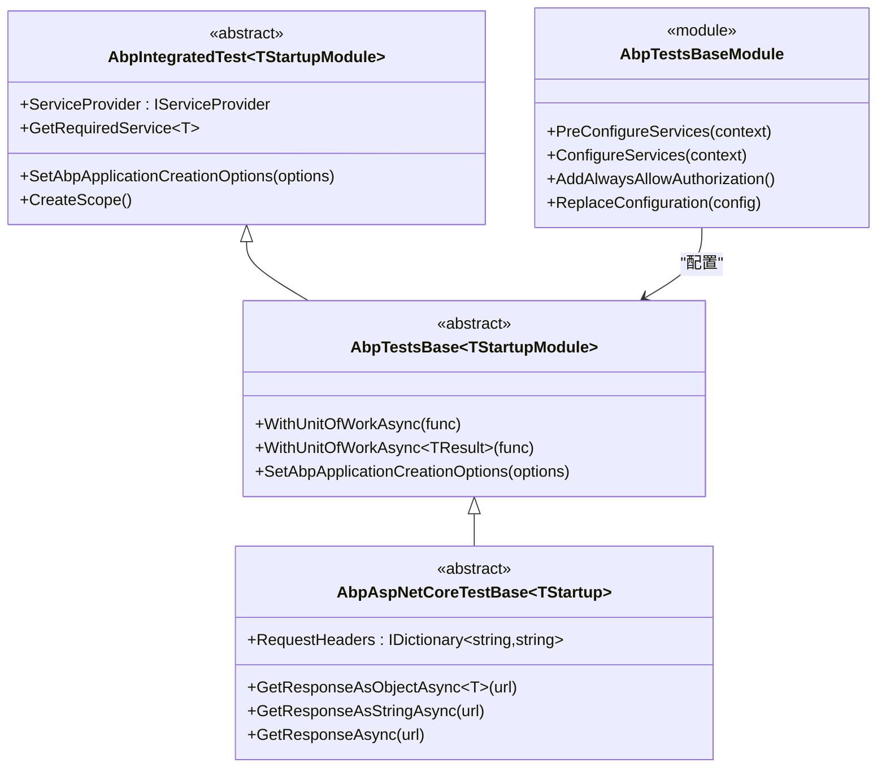
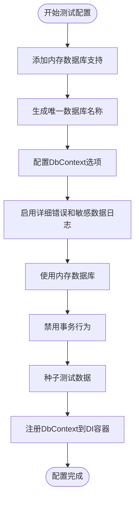
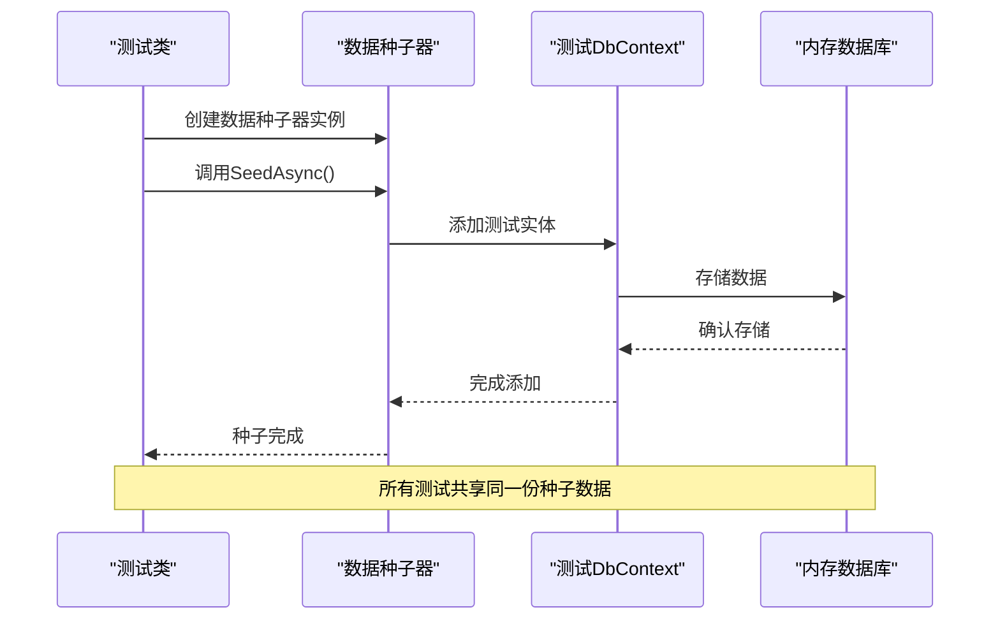
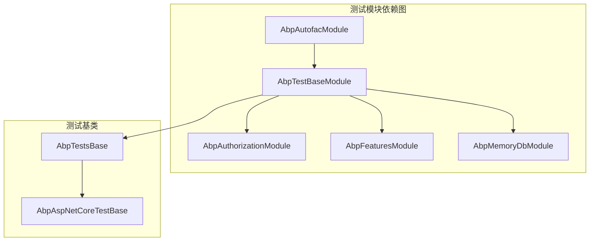

# 插件单元与集成测试详细指南

<cite>
**本文档中引用的文件**
- [AbpTestsBase.cs](file://aspnet-core/tests/LINGYUN.Abp.TestBase/LINGYUN/Abp/Tests/AbpTestsBase.cs)
- [AbpTestsBaseModule.cs](file://aspnet-core/tests/LINGYUN.Abp.TestBase/LINGYUN/Abp/Tests/AbpTestsBaseModule.cs)
- [EfCoreTestDbContext.cs](file://aspnet-core/tests/LINGYUN.Abp.EntityFrameworkCore.Tests/LINGYUN/Abp/EntityFrameworkCore/EfCoreTestDbContext.cs)
- [EfCoreTestEntity.cs](file://aspnet-core/tests/LINGYUN.Abp.EntityFrameworkCore.Tests/LINGYUN/Abp/EntityFrameworkCore/EfCoreTestEntity.cs)
- [EfCoreTestEntityDataSeeder.cs](file://aspnet-core/tests/LINGYUN.Abp.EntityFrameworkCore.Tests/LINGYUN/Abp/EntityFrameworkCore/EfCoreTestEntityDataSeeder.cs)
- [AbpEntityFrameworkCoreTestModule.cs](file://aspnet-core/tests/LINGYUN.Abp.EntityFrameworkCore.Tests/LINGYUN/Abp/EntityFrameworkCore/AbpEntityFrameworkCoreTestModule.cs)
- [AbpAspNetCoreTestBase.cs](file://aspnet-core/tests/LINGYUN.Abp.AspNetCore.Tests/LINGYUN/Abp/AspNetCore/AbpAspNetCoreTestBase.cs)
- [ProjectNameTestBaseModule.cs](file://aspnet-core/templates/aio/content/tests/PackageName.CompanyName.ProjectName.TestBase/PackageName/CompanyName/ProjectName/ProjectNameTestBaseModule.cs)
- [ProjectNameEntityFrameworkCoreTestModule.cs](file://aspnet-core/templates/micro/content/tests/PackageName.CompanyName.ProjectName.EntityFrameworkCore.Tests/PackageName/CompanyName/ProjectName/EntityFrameworkCore/ProjectNameEntityFrameworkCoreTestModule.cs)
</cite>

## 目录
1. [简介](#简介)
2. [ABP测试基类架构](#abp测试基类架构)
3. [核心测试组件详解](#核心测试组件详解)
4. [EF Core测试配置](#ef-core测试配置)
5. [测试数据构建与管理](#测试数据构建与管理)
6. [依赖注入容器配置](#依赖注入容器配置)
7. [单元测试策略](#单元测试策略)
8. [集成测试策略](#集成测试策略)
9. [Mock服务与模拟对象](#mock服务与模拟对象)
10. [测试覆盖率与质量检查](#测试覆盖率与质量检查)
11. [最佳实践与建议](#最佳实践与建议)
12. [故障排除指南](#故障排除指南)

## 简介

本指南深入介绍了基于ABP框架的插件单元测试与集成测试开发方法。ABP框架提供了强大的测试基础设施，包括测试基类、测试模块、数据种子器等组件，帮助开发者高效地编写高质量的测试代码。

ABP框架的测试体系主要由以下核心组件构成：
- **AbpTestBase**: 提供基础测试功能的抽象类
- **AbpTestsBaseModule**: 测试模块的基础配置
- **EfCoreTestDbContext**: EF Core测试专用数据库上下文
- **测试数据构建器**: 用于创建测试数据的工具类
- **Mock服务**: 模拟外部依赖的服务

## ABP测试基类架构

ABP框架的测试基类采用分层架构设计，提供了完整的测试基础设施支持。



**图表来源**
- [AbpTestsBase.cs](file://aspnet-core/tests/LINGYUN.Abp.TestBase/LINGYUN/Abp/Tests/AbpTestsBase.cs#L10-L60)
- [AbpTestsBaseModule.cs](file://aspnet-core/tests/LINGYUN.Abp.TestBase/LINGYUN/Abp/Tests/AbpTestsBaseModule.cs#L15-L43)
- [AbpAspNetCoreTestBase.cs](file://aspnet-core/tests/LINGYUN.Abp.AspNetCore.Tests/LINGYUN/Abp/AspNetCore/AbpAspNetCoreTestBase.cs#L20-L62)

**章节来源**
- [AbpTestsBase.cs](file://aspnet-core/tests/LINGYUN.Abp.TestBase/LINGYUN/Abp/Tests/AbpTestsBase.cs#L1-L60)
- [AbpTestsBaseModule.cs](file://aspnet-core/tests/LINGYUN.Abp.TestBase/LINGYUN/Abp/Tests/AbpTestsBaseModule.cs#L1-L43)

## 核心测试组件详解

### AbpTestsBase抽象类

`AbpTestsBase<TStartupModule>`是所有ABP测试的基础抽象类，它继承自`AbpIntegratedTest<TStartupModule>`，提供了以下核心功能：

#### 工作单元管理
```csharp
// 基础工作单元执行
protected virtual Task WithUnitOfWorkAsync(Func<Task> func)
{
    return WithUnitOfWorkAsync(new AbpUnitOfWorkOptions(), func);
}

// 带结果的工作单元执行
protected virtual Task<TResult> WithUnitOfWorkAsync<TResult>(Func<Task<TResult>> func)
{
    return WithUnitOfWorkAsync(new AbpUnitOfWorkOptions(), func);
}
```

#### 作用域管理
测试基类自动管理依赖注入作用域，确保每个测试都在独立的作用域中执行，避免状态污染。

### AbpTestsBaseModule模块配置

`AbpTestsBaseModule`是测试模块的基础配置类，负责设置测试环境的基本配置：

```csharp
[DependsOn(
    typeof(AbpAutofacModule),
    typeof(AbpTestBaseModule),
    typeof(AbpAuthorizationModule),
    typeof(AbpFeaturesModule)
)]
public class AbpTestsBaseModule : AbpModule
{
    public override void PreConfigureServices(ServiceConfigurationContext context)
    {
        var configurationOptions = new AbpConfigurationBuilderOptions
        {
            EnvironmentName = "Development",
            UserSecretsId = Environment.GetEnvironmentVariable("APPLICATION_USER_SECRETS_ID"),
            UserSecretsAssembly = typeof(AbpTestsBaseModule).Assembly
        };
        
        context.Services.ReplaceConfiguration(ConfigurationHelper.BuildConfiguration(configurationOptions));
    }

    public override void ConfigureServices(ServiceConfigurationContext context)
    {
        context.Services.AddAlwaysAllowAuthorization();
        context.Services.Replace(ServiceDescriptor.Singleton<IFeatureStore, FakeFeatureStore>());
    }
}
```

**章节来源**
- [AbpTestsBase.cs](file://aspnet-core/tests/LINGYUN.Abp.TestBase/LINGYUN/Abp/Tests/AbpTestsBase.cs#L10-L60)
- [AbpTestsBaseModule.cs](file://aspnet-core/tests/LINGYUN.Abp.TestBase/LINGYUN/Abp/Tests/AbpTestsBaseModule.cs#L15-L43)

## EF Core测试配置

ABP框架提供了专门的EF Core测试配置，支持内存数据库和真实数据库两种模式。

### EfCoreTestDbContext配置

```csharp
public class EfCoreTestDbContext : AbpDbContext<EfCoreTestDbContext>
{
    public virtual DbSet<EfCoreTestEntity> TestEntities { get; set; }

    public EfCoreTestDbContext(DbContextOptions<EfCoreTestDbContext> options) : base(options)
    {
    }

    protected override void OnModelCreating(ModelBuilder modelBuilder)
    {
        base.OnModelCreating(modelBuilder);
        
        modelBuilder.Entity<EfCoreTestEntity>(b =>
        {
            b.ConfigureByConvention();
        });
    }
}
```

### 内存数据库配置

在测试模块中配置内存数据库：

```csharp
public override void ConfigureServices(ServiceConfigurationContext context)
{
    context.Services.AddEntityFrameworkInMemoryDatabase();
    
    var databaseName = Guid.NewGuid().ToString();

    Configure<AbpDbContextOptions>(options =>
    {
        options.Configure(abpDbContextConfigurationContext =>
        {
            abpDbContextConfigurationContext.DbContextOptions.EnableDetailedErrors();
            abpDbContextConfigurationContext.DbContextOptions.EnableSensitiveDataLogging();
            abpDbContextConfigurationContext.DbContextOptions.UseEFCoreLogger();
            
            abpDbContextConfigurationContext.DbContextOptions.UseInMemoryDatabase(databaseName);
        });
    });

    Configure<AbpUnitOfWorkDefaultOptions>(options =>
    {
        options.TransactionBehavior = UnitOfWorkTransactionBehavior.Disabled;
    });
}
```

### 单元测试配置流程



**图表来源**
- [AbpEntityFrameworkCoreTestModule.cs](file://aspnet-core/tests/LINGYUN.Abp.EntityFrameworkCore.Tests/LINGYUN/Abp/EntityFrameworkCore/AbpEntityFrameworkCoreTestModule.cs#L15-L60)

**章节来源**
- [EfCoreTestDbContext.cs](file://aspnet-core/tests/LINGYUN.Abp.EntityFrameworkCore.Tests/LINGYUN/Abp/EntityFrameworkCore/EfCoreTestDbContext.cs#L1-L25)
- [AbpEntityFrameworkCoreTestModule.cs](file://aspnet-core/tests/LINGYUN.Abp.EntityFrameworkCore.Tests/LINGYUN/Abp/EntityFrameworkCore/AbpEntityFrameworkCoreTestModule.cs#L15-L60)

## 测试数据构建与管理

### EfCoreTestEntity实体定义

```csharp
public class EfCoreTestEntity : Entity<Guid>
{
    public virtual string PropString { get; set; }
    public virtual int? PropInt32 { get; set; }
    public virtual long? PropInt64 { get; set; }
    public virtual DateTime? DateTime { get; set; }
    
    public EfCoreTestEntity(
        Guid id,
        string propString = null,
        int? propInt32 = null, 
        long? propInt64 = null, 
        DateTime? dateTime = null) : base(id)
    {
        PropString = propString;
        PropInt32 = propInt32;
        PropInt64 = propInt64;
        DateTime = dateTime;
    }
}
```

### EfCoreTestEntityDataSeeder数据种子器

```csharp
public class EfCoreTestEntityDataSeeder
{
    private readonly EfCoreTestDbContext _dbContext;

    public EfCoreTestEntityDataSeeder(EfCoreTestDbContext dbContext)
    {
        _dbContext = dbContext;
    }

    public async virtual Task SeedAsync()
    {
        await _dbContext.TestEntities.AddAsync(
            new EfCoreTestEntity(Guid.NewGuid(), "1223", 1024, 1024L, new DateTime(2021, 10, 1, 0, 0, 0)));

        await _dbContext.TestEntities.AddAsync(
            new EfCoreTestEntity(Guid.NewGuid(), null, 2048, 2048L, new DateTime(2022, 10, 1, 12, 0, 0)));

        await _dbContext.TestEntities.AddAsync(
            new EfCoreTestEntity(Guid.NewGuid(), "3221", null, 4096L, null));

        await _dbContext.TestEntities.AddAsync(
            new EfCoreTestEntity(Guid.NewGuid(), null, null, null, new DateTime(2022, 1, 1, 12, 0, 0)));
    }
}
```

### 测试数据管理策略



**图表来源**
- [EfCoreTestEntityDataSeeder.cs](file://aspnet-core/tests/LINGYUN.Abp.EntityFrameworkCore.Tests/LINGYUN/Abp/EntityFrameworkCore/EfCoreTestEntityDataSeeder.cs#L8-L33)

**章节来源**
- [EfCoreTestEntity.cs](file://aspnet-core/tests/LINGYUN.Abp.EntityFrameworkCore.Tests/LINGYUN/Abp/EntityFrameworkCore/EfCoreTestEntity.cs#L1-L26)
- [EfCoreTestEntityDataSeeder.cs](file://aspnet-core/tests/LINGYUN.Abp.EntityFrameworkCore.Tests/LINGYUN/Abp/EntityFrameworkCore/EfCoreTestEntityDataSeeder.cs#L1-L34)

## 依赖注入容器配置

### 测试模块依赖关系



**图表来源**
- [AbpTestsBaseModule.cs](file://aspnet-core/tests/LINGYUN.Abp.TestBase/LINGYUN/Abp/Tests/AbpTestsBaseModule.cs#L15-L23)
- [ProjectNameTestBaseModule.cs](file://aspnet-core/templates/aio/content/tests/PackageName.CompanyName.ProjectName.TestBase/PackageName/CompanyName/ProjectName/ProjectNameTestBaseModule.cs#L10-L23)

### 依赖注入配置最佳实践

1. **AlwaysAllowAuthorization**: 在测试环境中允许所有授权请求
2. **FakeFeatureStore**: 使用虚拟功能存储替代真实存储
3. **Configuration替换**: 使用测试配置覆盖默认配置
4. **单例服务替换**: 替换关键服务以适应测试需求

```csharp
public override void ConfigureServices(ServiceConfigurationContext context)
{
    context.Services.AddAlwaysAllowAuthorization();
    context.Services.Replace(ServiceDescriptor.Singleton<IFeatureStore, FakeFeatureStore>());
}
```

**章节来源**
- [AbpTestsBaseModule.cs](file://aspnet-core/tests/LINGYUN.Abp.TestBase/LINGYUN/Abp/Tests/AbpTestsBaseModule.cs#L30-L43)

## 单元测试策略

### 服务层单元测试

```csharp
public abstract class MyServiceTestBase : AbpTestsBase<MyAppModule>
{
    protected readonly IMyService MyService;
    
    public MyServiceTestBase()
    {
        MyService = GetRequiredService<IMyService>();
    }
    
    [Fact]
    public async Task Should_Get_User_Profile()
    {
        // Arrange
        var userId = Guid.NewGuid();
        
        // Act
        var profile = await MyService.GetUserProfileAsync(userId);
        
        // Assert
        profile.ShouldNotBeNull();
        profile.UserId.ShouldBe(userId);
    }
}
```

### 应用层单元测试

```csharp
public class MyApplicationServiceTests : AbpTestsBase<MyAppModule>
{
    private readonly IMyAppService _myAppService;
    
    public MyApplicationServiceTests()
    {
        _myAppService = GetRequiredService<IMyAppService>();
    }
    
    [Fact]
    public async Task Should_Create_New_Item()
    {
        // Arrange
        var input = new CreateItemDto
        {
            Name = "Test Item",
            Description = "Test Description"
        };
        
        // Act
        var result = await _myAppService.CreateAsync(input);
        
        // Assert
        result.ShouldNotBeNull();
        result.Name.ShouldBe(input.Name);
    }
}
```

### 领域层单元测试

```csharp
public class MyDomainServiceTests : AbpTestsBase<MyAppModule>
{
    private readonly IMyDomainService _domainService;
    
    public MyDomainServiceTests()
    {
        _domainService = GetRequiredService<IMyDomainService>();
    }
    
    [Fact]
    public async Task Should_Validate_Business_Rules()
    {
        // Arrange
        var entity = new MyEntity(Guid.NewGuid());
        
        // Act & Assert
        await Should.ThrowAsync<BusinessException>(() => 
            _domainService.ValidateBusinessRulesAsync(entity));
    }
}
```

## 集成测试策略

### ASP.NET Core集成测试

```csharp
public abstract class MyIntegrationTestBase : AbpAspNetCoreTestBase<MyAppStartup>
{
    protected readonly HttpClient Client;
    
    public MyIntegrationTestBase()
    {
        Client = GetRequiredService<IHttpClientFactory>().CreateClient();
    }
    
    [Fact]
    public async Task Should_Return_Ok_For_Home_Page()
    {
        // Act
        var response = await Client.GetAsync("/api/my-endpoint");
        
        // Assert
        response.StatusCode.ShouldBe(HttpStatusCode.OK);
        var content = await response.Content.ReadAsStringAsync();
        content.ShouldNotBeNullOrEmpty();
    }
}
```

### 数据访问集成测试

```csharp
public class MyRepositoryIntegrationTests : AbpTestsBase<MyAppModule>
{
    private readonly IRepository<MyEntity, Guid> _repository;
    
    public MyRepositoryIntegrationTests()
    {
        _repository = GetRequiredService<IRepository<MyEntity, Guid>>();
    }
    
    [Fact]
    public async Task Should_Save_And_Retrieve_Entity()
    {
        // Arrange
        var entity = new MyEntity(Guid.NewGuid())
        {
            Name = "Test Entity"
        };
        
        // Act
        await _repository.InsertAsync(entity);
        await WithUnitOfWorkAsync(async () =>
        {
            var savedEntity = await _repository.GetAsync(entity.Id);
            
            // Assert
            savedEntity.ShouldNotBeNull();
            savedEntity.Name.ShouldBe(entity.Name);
        });
    }
}
```

**章节来源**
- [AbpAspNetCoreTestBase.cs](file://aspnet-core/tests/LINGYUN.Abp.AspNetCore.Tests/LINGYUN/Abp/AspNetCore/AbpAspNetCoreTestBase.cs#L20-L62)

## Mock服务与模拟对象

### 使用AutoMocker进行Mock

```csharp
public class MyServiceWithDependenciesTests : AbpTestsBase<MyAppModule>
{
    [Fact]
    public async Task Should_Use_Mocked_Dependency()
    {
        // Arrange
        var mocker = new AutoMocker();
        
        // Mock外部依赖
        var mockDependency = mocker.GetMock<IMyExternalService>();
        mockDependency.Setup(x => x.GetDataAsync(It.IsAny<Guid>()))
                     .ReturnsAsync(new MyData { Value = "Mocked Data" });
        
        // 注入Mock对象
        mocker.Setup<IMyService>(service => service.ExternalService, mockDependency.Object);
        
        var myService = mocker.CreateInstance<MyService>();
        
        // Act
        var result = await myService.ProcessDataAsync(Guid.NewGuid());
        
        // Assert
        result.ShouldNotBeNull();
        result.Value.ShouldBe("Mocked Data");
    }
}
```

### 自定义Mock服务

```csharp
public class FakeMyService : IMyService
{
    private readonly List<MyEntity> _entities = new();
    
    public Task<MyEntity> GetByIdAsync(Guid id)
    {
        return Task.FromResult(_entities.FirstOrDefault(e => e.Id == id));
    }
    
    public Task InsertAsync(MyEntity entity)
    {
        _entities.Add(entity);
        return Task.CompletedTask;
    }
    
    public Task<List<MyEntity>> GetAllAsync()
    {
        return Task.FromResult(_entities.ToList());
    }
}
```

## 测试覆盖率与质量检查

### 测试覆盖率要求

根据ABP框架的最佳实践，建议达到以下测试覆盖率标准：

- **单元测试覆盖率**: ≥ 80%
- **集成测试覆盖率**: ≥ 60%
- **关键业务逻辑覆盖率**: 100%

### 代码质量检查标准

```csharp
public class QualityAssuranceTests : AbpTestsBase<MyAppModule>
{
    [Fact]
    public void Should_Follow_Naming_Conventions()
    {
        // 检查命名约定
        var assembly = typeof(MyAppModule).Assembly;
        var invalidNames = assembly.GetTypes()
            .Where(t => !t.Name.EndsWith("Tests"))
            .Where(t => t.Namespace != null && !t.Namespace.Contains(".Tests."));
        
        invalidNames.ShouldBeEmpty();
    }
    
    [Fact]
    public void Should_Have_Complete_Exception_Handling()
    {
        // 检查异常处理完整性
        var serviceMethods = typeof(IMyService).GetMethods();
        foreach (var method in serviceMethods)
        {
            var hasThrowsAttribute = method.GetCustomAttributes(typeof(ThrowsAttribute), false).Any();
            var hasExceptionHandling = method.ReturnType.IsGenericType && 
                                     method.ReturnType.GetGenericTypeDefinition() == typeof(Task<>);
            
            hasThrowsAttribute.ShouldBeTrue();
            hasExceptionHandling.ShouldBeTrue();
        }
    }
}
```

### 测试性能监控

```csharp
public class PerformanceTests : AbpTestsBase<MyAppModule>
{
    [Fact]
    public async Task Should_Not_Exceed_Performance_Boundaries()
    {
        // Arrange
        var stopwatch = Stopwatch.StartNew();
        
        // Act
        await SomeService.MethodUnderTestAsync();
        
        // Assert
        stopwatch.Stop();
        stopwatch.ElapsedMilliseconds.ShouldBeLessThanOrEqualTo(1000); // 1秒限制
    }
}
```

## 最佳实践与建议

### 测试组织原则

1. **单一职责**: 每个测试方法只测试一个功能点
2. **独立性**: 测试之间不应相互依赖
3. **可重复性**: 测试应能在任何环境下重复执行
4. **快速反馈**: 测试执行时间应尽可能短

### 测试命名规范

```csharp
public class MyServiceTests : AbpTestsBase<MyAppModule>
{
    // 正确的命名格式：Should_[预期结果]_[条件]
    [Fact]
    public async Task Should_Return_Null_When_Entity_Not_Found()
    {
        // 测试代码
    }
    
    [Fact]
    public async Task Should_Throw_ArgumentNullException_When_Parameter_Is_Null()
    {
        // 测试代码
    }
}
```

### 测试数据管理

```csharp
public abstract class TestDataManagementBase : AbpTestsBase<MyAppModule>
{
    protected async Task<Guid> CreateTestUserAsync(string userName = "testuser")
    {
        var userManager = GetRequiredService<UserManager<User>>();
        var user = new User(Guid.NewGuid(), userName);
        
        await userManager.CreateAsync(user);
        return user.Id;
    }
    
    protected async Task<Guid> CreateTestEntityAsync(Guid? userId = null)
    {
        var entity = new MyEntity(Guid.NewGuid())
        {
            UserId = userId ?? Guid.NewGuid(),
            Name = "Test Entity"
        };
        
        var repository = GetRequiredService<IRepository<MyEntity, Guid>>();
        await repository.InsertAsync(entity);
        
        return entity.Id;
    }
}
```

## 故障排除指南

### 常见问题与解决方案

#### 1. 测试数据库连接失败

**问题**: 测试运行时出现数据库连接错误

**解决方案**:
```csharp
public override void ConfigureServices(ServiceConfigurationContext context)
{
    // 确保正确配置内存数据库
    context.Services.AddEntityFrameworkInMemoryDatabase();
    
    Configure<AbpDbContextOptions>(options =>
    {
        options.Configure(abpDbContextConfigurationContext =>
        {
            abpDbContextConfigurationContext.DbContextOptions.UseInMemoryDatabase(Guid.NewGuid().ToString());
        });
    });
}
```

#### 2. 依赖注入解析失败

**问题**: 无法解析测试所需的依赖项

**解决方案**:
```csharp
public MyServiceTests()
{
    // 确保正确获取服务
    MyService = GetRequiredService<IMyService>();
    
    // 或者使用作用域获取
    using (var scope = ServiceProvider.CreateScope())
    {
        MyService = scope.ServiceProvider.GetRequiredService<IMyService>();
    }
}
```

#### 3. 工作单元事务问题

**问题**: 工作单元中的数据在测试后丢失

**解决方案**:
```csharp
[Test]
public async Task Should_Persist_Data_In_Workflow()
{
    var entityId = Guid.Empty;
    
    await WithUnitOfWorkAsync(async () =>
    {
        // 在工作单元内操作
        var entity = new MyEntity(Guid.NewGuid());
        await _repository.InsertAsync(entity);
        
        entityId = entity.Id;
    });
    
    // 验证数据已持久化
    var savedEntity = await _repository.GetAsync(entityId);
    savedEntity.ShouldNotBeNull();
}
```

### 调试技巧

1. **启用详细日志**: 在测试配置中启用EF Core详细日志
2. **使用断点调试**: 在关键测试步骤设置断点
3. **检查依赖注入**: 验证所有必要的服务都已正确注册
4. **隔离测试**: 使用单独的测试套件隔离复杂测试

通过遵循本指南中的最佳实践和配置方法，您可以构建出高质量、可靠的插件单元测试和集成测试，确保应用程序的稳定性和可靠性。