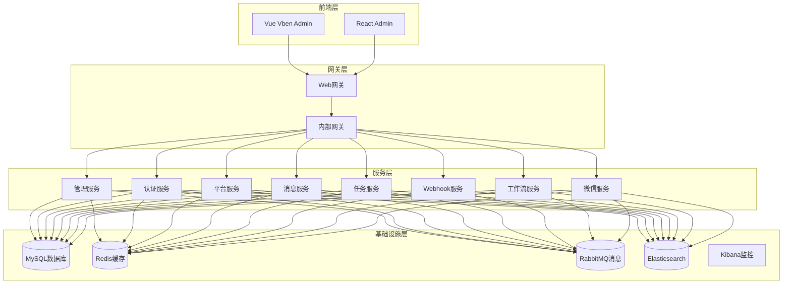
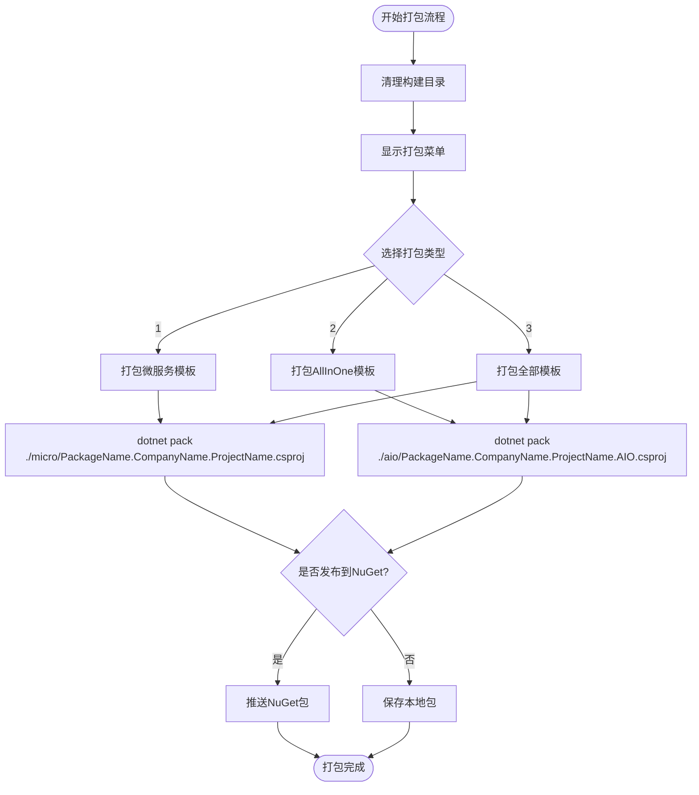
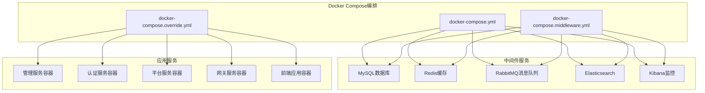
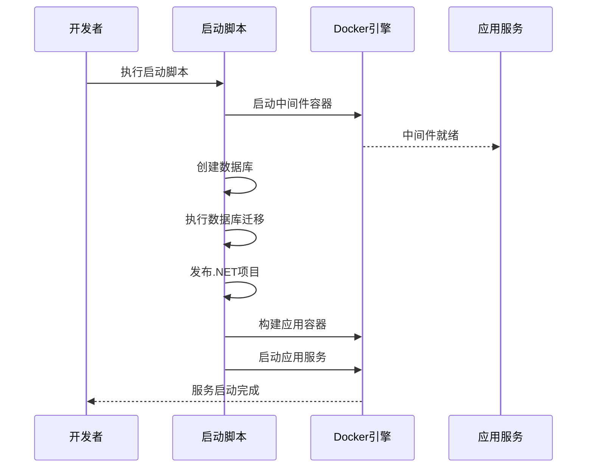
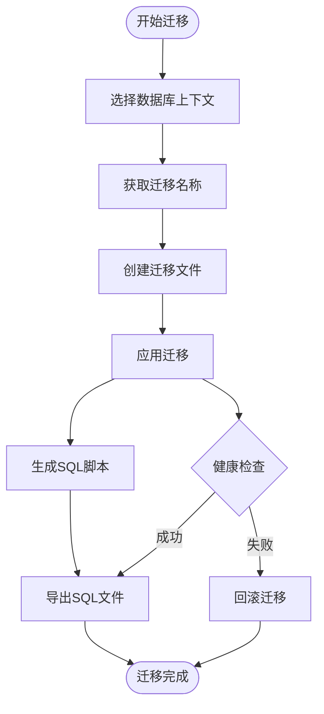
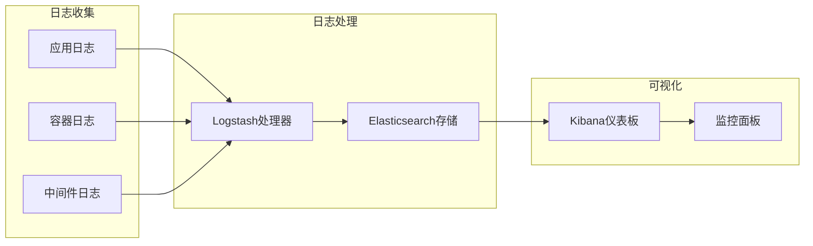

# 插件打包与部署

<cite>
**本文档引用的文件**
- [deploy.ps1](file://deploy/deploy.ps1)
- [docker-compose.yml](file://docker-compose.yml)
- [docker-compose.override.yml](file://docker-compose.override.yml)
- [docker-compose.middleware.yml](file://docker-compose.middleware.yml)
- [tye.yaml](file://tye.yaml)
- [pack.ps1](file://aspnet-core/templates/pack.ps1)
- [Migrate.ps1](file://aspnet-core/migrations/Migrate.ps1)
- [Dockerfile](file://gateways/internal/LINGYUN.MicroService.Internal.ApiGateway/src/LINGYUN.MicroService.Internal.Gateway/Dockerfile)
- [00.auto-config-docker.cmd](file://starter/00.auto-config-docker.cmd)
- [readme.md](file://starter/readme.md)
</cite>

## 目录
1. [概述](#概述)
2. [项目架构分析](#项目架构分析)
3. [插件打包流程](#插件打包流程)
4. [Docker容器化部署](#docker容器化部署)
5. [多环境部署策略](#多环境部署策略)
6. [版本控制与依赖管理](#版本控制与依赖管理)
7. [部署验证与监控](#部署验证与监控)
8. [故障排除指南](#故障排除指南)
9. [最佳实践建议](#最佳实践建议)

## 概述

ABP Next Admin是一个基于ABP框架的现代化企业级应用平台，采用微服务架构设计。该项目提供了完整的插件打包与部署解决方案，支持多种部署模式，包括单体应用和微服务架构。本文档详细介绍了插件的打包、版本控制、依赖管理和在不同环境中的部署策略。

## 项目架构分析

### 整体架构概览



**图表来源**
- [docker-compose.yml](file://docker-compose.yml#L1-L244)
- [tye.yaml](file://tye.yaml#L1-L89)

### 服务组件分析

系统由以下核心组件构成：

1. **管理服务 (Admin)**: 提供用户管理、权限控制等核心功能
2. **认证服务 (Auth)**: 实现OAuth2.0和OpenID Connect认证
3. **平台服务 (Platform)**: 提供基础平台功能
4. **消息服务 (Messages)**: 处理实时消息和通知
5. **任务服务 (Tasks)**: 管理后台任务和作业
6. **Webhook服务 (Webhooks)**: 处理外部事件回调
7. **工作流服务 (Workflow)**: 实现业务流程自动化
8. **微信服务 (Wechat)**: 集成微信相关功能

**章节来源**
- [docker-compose.yml](file://docker-compose.yml#L1-L244)
- [tye.yaml](file://tye.yaml#L1-L89)

## 插件打包流程

### NuGet包打包机制

项目提供了完整的NuGet包打包解决方案，支持微服务模板和AllInOne模板两种打包方式。



**图表来源**
- [pack.ps1](file://aspnet-core/templates/pack.ps1#L1-L81)

### 打包脚本详解

打包脚本提供了三种打包选项：

1. **微服务模板**: 适用于独立部署的微服务模块
2. **AllInOne模板**: 适用于单体应用的完整包
3. **全部打包**: 同时生成两种类型的包

每个包都会包含：
- 编译后的DLL文件
- 相关的依赖项
- NuSpec元数据文件
- 版本信息

**章节来源**
- [pack.ps1](file://aspnet-core/templates/pack.ps1#L1-L81)

### 发布到NuGet服务器

系统支持自动发布到自定义NuGet服务器：

```powershell
# 发布命令示例
dotnet nuget push PackageName.1.0.0.nupkg 
    --source "https://custom.nuget.net/nuget/abp/v3/index.json" 
    --api-key "your-api-key" 
    --skip-duplicate
```

## Docker容器化部署

### 容器编排架构



**图表来源**
- [docker-compose.yml](file://docker-compose.yml#L1-L244)
- [docker-compose.override.yml](file://docker-compose.override.yml#L1-L135)
- [docker-compose.middleware.yml](file://docker-compose.middleware.yml#L1-L115)

### Dockerfile构建流程

每个服务都包含专门的Dockerfile，用于容器化部署：

```dockerfile
FROM mcr.microsoft.com/dotnet/aspnet:8.0
LABEL maintainer="colin.in@foxmail.com"
WORKDIR /app

COPY . /app

EXPOSE 80/tcp
VOLUME [ "./app/Logs" ]
VOLUME [ "./app/Modules" ]

ENTRYPOINT ["dotnet", "ServiceName.dll"]
```

### 多阶段构建优化

系统采用多阶段构建策略：
1. **构建阶段**: 编译.NET应用程序
2. **复制阶段**: 将编译结果复制到最终镜像
3. **运行阶段**: 启动应用程序容器

**章节来源**
- [Dockerfile](file://gateways/internal/LINGYUN.MicroService.Internal.ApiGateway/src/LINGYUN.MicroService.Internal.Gateway/Dockerfile#L1-L12)

### 环境变量配置

每个服务都支持通过环境变量进行配置：

```yaml
environment:
  - ASPNETCORE_ENVIRONMENT=Development
  - ASPNETCORE_HTTP_PORTS=80
  - TZ=Asia/Shanghai
  - ConnectionStrings__Default=Server=mysql;Database=abp;Uid=root;Pwd=123456;
```

**章节来源**
- [docker-compose.yml](file://docker-compose.yml#L1-L244)

## 多环境部署策略

### 开发环境部署

开发环境采用快速启动策略：



**图表来源**
- [deploy.ps1](file://deploy/deploy.ps1#L1-L60)

### 生产环境部署

生产环境采用更严格的部署策略：

1. **预检查**: 验证环境配置和依赖项
2. **蓝绿部署**: 新版本部署到备用实例
3. **流量切换**: 平滑切换到新版本
4. **健康检查**: 确认服务正常运行
5. **回滚准备**: 准备回滚到旧版本

### 灰度发布策略

系统支持灰度发布，通过以下方式实现：

```yaml
# 灰度发布配置示例
services:
  admin-api:
    deploy:
      replicas: 2
      update_config:
        parallelism: 1
        delay: 10s
      restart_policy:
        condition: on-failure
```

**章节来源**
- [deploy.ps1](file://deploy/deploy.ps1#L1-L60)

## 版本控制与依赖管理

### 数据库迁移管理



**图表来源**
- [Migrate.ps1](file://aspnet-core/migrations/Migrate.ps1#L1-L214)

### 版本控制策略

系统采用语义化版本控制：

1. **主版本号**: 不兼容的API修改
2. **次版本号**: 向下兼容的功能性新增
3. **修订号**: 向下兼容的问题修正

### 依赖管理

项目使用以下依赖管理策略：

1. **NuGet包管理**: 统一的包版本控制
2. **Docker镜像标签**: 基于Git标签的镜像版本
3. **数据库迁移**: 版本化的数据库变更

**章节来源**
- [Migrate.ps1](file://aspnet-core/migrations/Migrate.ps1#L1-L214)

## 部署验证与监控

### 健康检查机制

每个服务都配置了健康检查：

```yaml
healthcheck:
  test: ["CMD-SHELL", "wget --spider http://localhost/healthz || exit"]
  interval: 10s
  timeout: 5s
  retries: 5
```

### 监控指标

系统监控以下关键指标：

1. **服务可用性**: 健康检查状态
2. **响应时间**: API响应延迟
3. **错误率**: HTTP错误统计
4. **资源使用**: CPU和内存使用情况
5. **数据库连接**: 数据库连接池状态

### 日志管理



**图表来源**
- [docker-compose.middleware.yml](file://docker-compose.middleware.yml#L50-L80)

## 故障排除指南

### 常见部署问题

1. **容器启动失败**
   - 检查端口占用
   - 验证环境变量配置
   - 查看容器日志

2. **数据库连接问题**
   - 确认数据库服务状态
   - 检查连接字符串
   - 验证网络连通性

3. **服务间通信失败**
   - 检查DNS解析
   - 验证服务发现配置
   - 确认防火墙设置

### 调试工具

系统提供了多种调试工具：

```bash
# 查看容器状态
docker-compose ps

# 查看服务日志
docker-compose logs service-name

# 进入容器调试
docker exec -it container-name bash
```

### 回滚策略

当部署出现问题时，系统支持快速回滚：

1. **停止新版本服务**
2. **恢复备份数据**
3. **重启旧版本服务**
4. **验证服务状态**

## 最佳实践建议

### 部署前准备

1. **环境验证**: 确保目标环境满足要求
2. **备份数据**: 在部署前备份重要数据
3. **测试验证**: 在测试环境中验证部署流程
4. **文档记录**: 记录部署步骤和注意事项

### 部署过程优化

1. **并行部署**: 同时部署多个独立的服务
2. **资源预留**: 为部署过程预留足够的系统资源
3. **监控告警**: 设置关键指标的监控告警
4. **自动化测试**: 部署后自动运行集成测试

### 运维管理

1. **定期维护**: 定期更新容器镜像和依赖包
2. **性能调优**: 根据实际负载调整资源配置
3. **安全加固**: 定期检查安全漏洞和配置
4. **容量规划**: 根据业务增长预测资源需求

### 持续改进

1. **反馈收集**: 收集运维团队的反馈意见
2. **流程优化**: 不断优化部署流程和工具
3. **知识分享**: 建立知识库和最佳实践文档
4. **培训提升**: 定期组织技术培训和经验分享

通过遵循这些最佳实践，可以确保插件的稳定部署和高效运维，为企业级应用提供可靠的技术支撑。