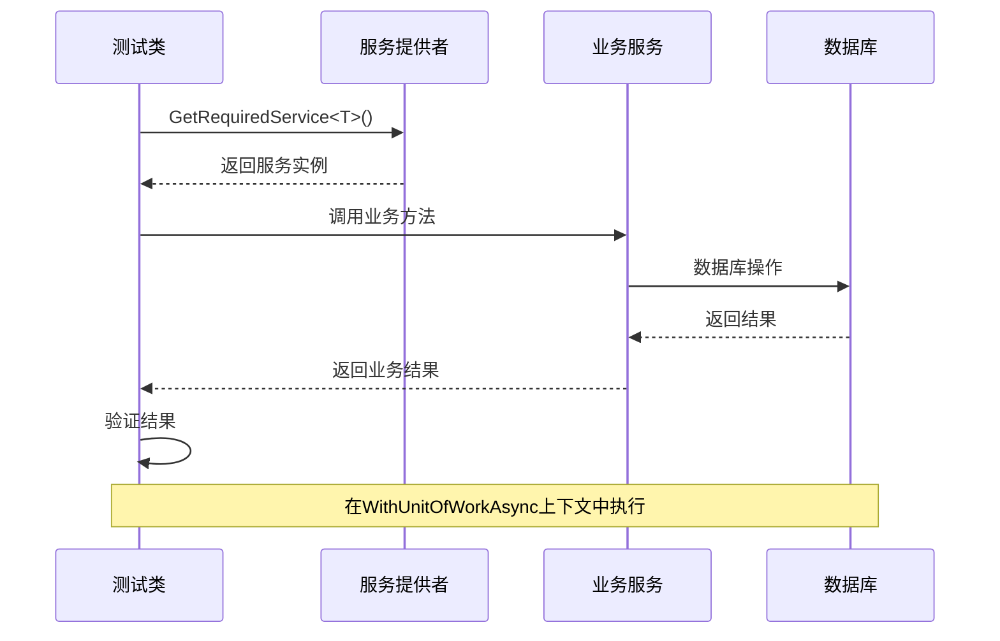
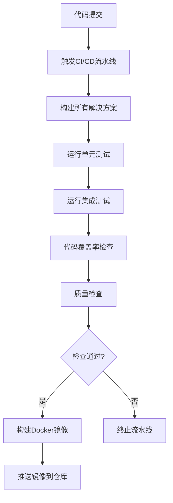
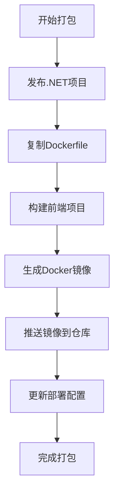
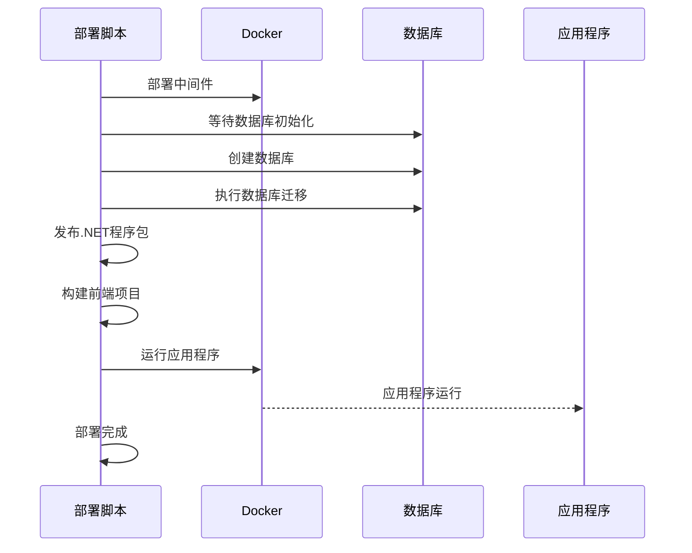
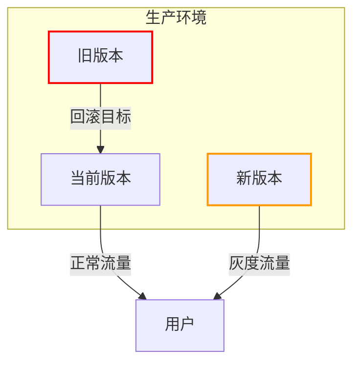

# 插件测试与部署

<cite>
**本文档引用的文件**
- [AbpTestsBase.cs](file://aspnet-core/tests/LINGYUN.Abp.TestBase/LINGYUN/Abp/Tests/AbpTestsBase.cs)
- [deploy.ps1](file://deploy/deploy.ps1)
- [build-aspnetcore-common.ps1](file://build/build-aspnetcore-common.ps1)
- [docker-compose.override.yml](file://docker-compose.override.yml)
- [appsettings.Testing.json](file://aspnet-core/tests/LINGYUN.Abp.Dapr.Actors.Tests/appsettings.Testing.json)
</cite>

## 目录
1. [引言](#引言)
2. [测试策略与框架](#测试策略与框架)
3. [CI/CD流水线](#cicd流水线)
4. [插件打包与发布](#插件打包与发布)
5. [部署策略](#部署策略)
6. [结论](#结论)

## 引言
本指南详细说明了插件测试与部署的完整流程，涵盖单元测试、集成测试和端到端测试策略，CI/CD自动化流程，以及插件打包、版本发布、灰度部署和回滚机制，确保插件发布的可靠性和可追溯性。

## 测试策略与框架

### 单元测试与集成测试
项目采用基于ABP框架的测试体系，通过`AbpTestsBase<TStartupModule>`作为所有测试类的基础类，提供集成测试支持。测试框架会创建独立的测试数据库环境，确保测试的隔离性和可重复性。

测试组织结构清晰，每个模块都有对应的测试项目，如`LINGYUN.Abp.Aliyun.Tests`、`LINGYUN.Abp.EntityFrameworkCore.Tests`等，遵循命名规范`[模块名].Tests`。测试类通常继承自`AbpTestsBase`，并使用特定的测试模块配置。

```mermaid
classDiagram
class AbpTestsBase~TStartupModule~ {
+SetAbpApplicationCreationOptions(options)
+WithUnitOfWorkAsync(func)
+WithUnitOfWorkAsync(options, func)
+WithUnitOfWorkAsync~TResult~(func)
+WithUnitOfWorkAsync~TResult~(options, func)
}
class AbpIntegratedTest~TStartupModule~ {
<<abstract>>
}
AbpTestsBase~TStartupModule~ --|> AbpIntegratedTest~TStartupModule~ : 继承
AbpTestsBase~TStartupModule~ : where TStartupModule : IAbpModule
```

**图示来源**
- [AbpTestsBase.cs](file://aspnet-core/tests/LINGYUN.Abp.TestBase/LINGYUN/Abp/Tests/AbpTestsBase.cs)

**本节来源**
- [AbpTestsBase.cs](file://aspnet-core/tests/LINGYUN.Abp.TestBase/LINGYUN/Abp/Tests/AbpTestsBase.cs)

### Mock服务与测试配置
测试环境通过`appsettings.Testing.json`文件进行配置，如Dapr测试中配置了远程服务基地址。项目使用ABP框架的依赖注入系统，可以轻松地替换服务实现进行Mock测试。

测试中使用`ServiceProvider.GetRequiredService<T>()`获取服务实例，支持在测试中替换特定服务的实现。通过`WithUnitOfWorkAsync`方法，可以在单元工作上下文中执行测试代码，确保数据库操作的事务性。



**图示来源**
- [AbpTestsBase.cs](file://aspnet-core/tests/LINGYUN.Abp.TestBase/LINGYUN/Abp/Tests/AbpTestsBase.cs)
- [appsettings.Testing.json](file://aspnet-core/tests/LINGYUN.Abp.Dapr.Actors.Tests/appsettings.Testing.json)

**本节来源**
- [AbpTestsBase.cs](file://aspnet-core/tests/LINGYUN.Abp.TestBase/LINGYUN/Abp/Tests/AbpTestsBase.cs)
- [appsettings.Testing.json](file://aspnet-core/tests/LINGYUN.Abp.Dapr.Actors.Tests/appsettings.Testing.json)

## CI/CD流水线

### 自动化测试流程
CI/CD流水线在代码提交后自动触发，执行完整的测试套件。构建脚本`build-aspnetcore-common.ps1`定义了服务数组、解决方案数组和迁移数组，为自动化构建和测试提供配置基础。

流水线首先构建所有解决方案，然后运行单元测试和集成测试。测试覆盖率通过.NET内置工具进行检查，质量检查包括代码风格、安全漏洞扫描和依赖项分析。



**图示来源**
- [build-aspnetcore-common.ps1](file://build/build-aspnetcore-common.ps1)

**本节来源**
- [build-aspnetcore-common.ps1](file://build/build-aspnetcore-common.ps1)

### 流水线配置
CI/CD流水线由PowerShell脚本驱动，`build-aspnetcore-common.ps1`定义了所有服务的路径和名称映射，为自动化部署提供基础配置。每个服务的构建和测试都在独立的上下文中执行，确保构建的可靠性。

## 插件打包与发布

### 打包流程
插件打包通过`deploy.ps1`脚本执行，首先发布.NET项目到`Publish`目录，然后复制Dockerfile文件。前端项目通过pnpm进行构建，生成静态资源文件。



**图示来源**
- [deploy.ps1](file://deploy/deploy.ps1)

**本节来源**
- [deploy.ps1](file://deploy/deploy.ps1)

### 版本发布
版本发布通过`pack.ps1`脚本管理，支持将包文件保存到本地NuGet目录。发布过程包括版本号更新、包文件生成和签名等步骤，确保发布的插件具有完整的版本信息和安全性。

## 部署策略

### 自动化部署流程
部署流程由`deploy.ps1`脚本完整管理，包括中间件部署、数据库初始化、数据库迁移、程序包发布、前端构建和应用程序运行等步骤。



**图示来源**
- [deploy.ps1](file://deploy/deploy.ps1)

**本节来源**
- [deploy.ps1](file://deploy/deploy.ps1)

### 灰度部署与回滚
通过`docker-compose.override.yml`文件配置服务的构建上下文和卷映射，支持灰度部署。每个服务独立部署，可以通过更新特定服务的镜像实现灰度发布。

回滚机制通过保留之前的Docker镜像实现，当新版本出现问题时，可以快速切换回之前的稳定版本。部署脚本支持指定不同的compose文件，便于管理不同环境的部署配置。



**图示来源**
- [docker-compose.override.yml](file://docker-compose.override.yml)

**本节来源**
- [docker-compose.override.yml](file://docker-compose.override.yml)

## 结论
本指南详细介绍了插件测试与部署的完整流程，从测试策略到CI/CD流水线，再到打包发布和部署策略。通过标准化的流程和自动化工具，确保了插件发布的可靠性和可追溯性，为系统的稳定运行提供了保障。