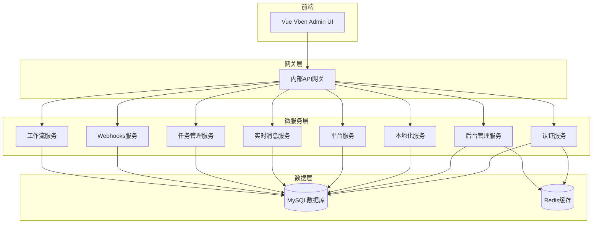
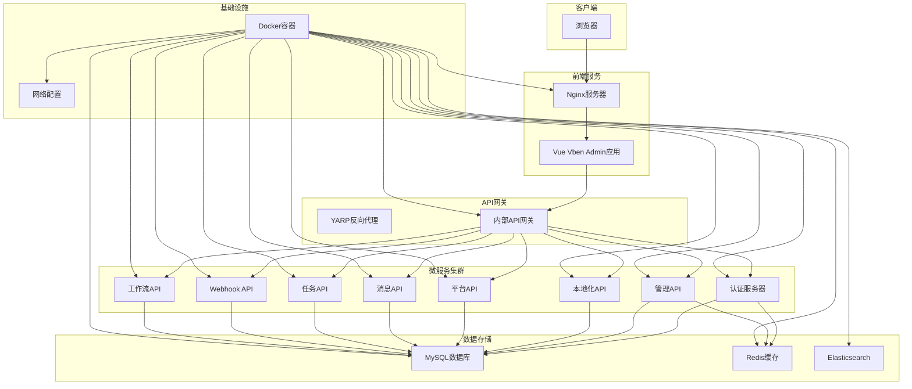
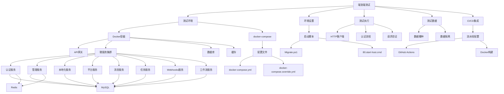

# 插件端到端测试

<cite>
**本文档引用的文件**
- [AbpTestsBase.cs](file://aspnet-core/tests/LINGYUN.Abp.TestBase/LINGYUN/Abp/Tests/AbpTestsBase.cs)
- [AbpTestsBaseModule.cs](file://aspnet-core/tests/LINGYUN.Abp.TestBase/LINGYUN/Abp/Tests/AbpTestsBaseModule.cs)
- [docker-compose.yml](file://docker-compose.yml)
- [Migrate.ps1](file://aspnet-core/migrations/Migrate.ps1)
- [80.start-host.cmd](file://starter/80.start-host.cmd)
- [readme.md](file://starter/readme.md)
</cite>

## 目录
1. [简介](#简介)
2. [项目结构](#项目结构)
3. [核心组件](#核心组件)
4. [架构概述](#架构概述)
5. [详细组件分析](#详细组件分析)
6. [依赖分析](#依赖分析)
7. [性能考虑](#性能考虑)
8. [故障排除指南](#故障排除指南)
9. [结论](#结论)

## 简介
本指南旨在为abp-next-admin_vben5项目提供完整的插件端到端测试解决方案。该系统是一个基于ABP框架的微服务架构应用，包含多个独立的服务模块、网关和前端UI。端到端测试需要覆盖从用户界面到后端服务再到数据库的完整流程，确保整个系统的功能正确性和稳定性。

## 项目结构
该项目采用微服务架构，包含多个独立的服务、网关和前端组件。系统通过Docker容器化部署，使用docker-compose进行服务编排。测试环境需要启动所有必要的微服务、数据库和其他外部依赖。



**Diagram sources**
- [docker-compose.yml](file://docker-compose.yml)

**Section sources**
- [docker-compose.yml](file://docker-compose.yml)

## 核心组件
系统的核心组件包括多个微服务、API网关和数据库。每个微服务负责特定的业务功能，通过API网关对外提供统一的接口。端到端测试需要模拟真实用户场景，验证各组件之间的交互是否正常。

**Section sources**
- [docker-compose.yml](file://docker-compose.yml)
- [80.start-host.cmd](file://starter/80.start-host.cmd)

## 架构概述
系统采用典型的微服务架构，前端UI通过内部API网关访问后端微服务。API网关负责路由请求到相应的微服务，并处理跨域、认证等通用功能。每个微服务都有自己的数据库，但部分服务共享同一个数据库实例。



**Diagram sources**
- [docker-compose.yml](file://docker-compose.yml)

## 详细组件分析

### 测试基础架构分析
系统提供了完善的测试基础架构，基于xUnit测试框架和ABP测试模块。测试基类`AbpTestsBase`提供了集成测试所需的基本功能，如服务提供者访问、工作单元管理等。

```mermaid
classDiagram
class AbpTestsBase~TStartupModule~ {
+IServiceProvider ServiceProvider
-SetAbpApplicationCreationOptions(options)
+WithUnitOfWorkAsync(func)
+WithUnitOfWorkAsync(options, func)
+WithUnitOfWorkAsync~TResult~(func)
+WithUnitOfWorkAsync~TResult~(options, func)
}
class AbpIntegratedTest~TStartupModule~ {
+IServiceProvider ServiceProvider
+GetService~T~()
+GetRequiredService~T~()
}
AbpTestsBase~TStartupModule~ --|> AbpIntegratedTest~TStartupModule~ : 继承
note right of AbpTestsBase~TStartupModule~
抽象基类，为所有集成测试提供
共享的功能，如工作单元管理
end note
```

**Diagram sources**
- [AbpTestsBase.cs](file://aspnet-core/tests/LINGYUN.Abp.TestBase/LINGYUN/Abp/Tests/AbpTestsBase.cs)

**Section sources**
- [AbpTestsBase.cs](file://aspnet-core/tests/LINGYUN.Abp.TestBase/LINGYUN/Abp/Tests/AbpTestsBase.cs)

### 测试模块配置分析
`AbpTestsBaseModule`是测试模块的核心配置类，负责在测试环境中替换生产环境的配置。它设置了开发环境配置、禁用了授权检查，并使用假的功能存储来避免外部依赖。

```mermaid
classDiagram
class AbpTestsBaseModule {
+PreConfigureServices(context)
+ConfigureServices(context)
}
class ServiceConfigurationContext {
+IServiceCollection Services
+IConfiguration Configuration
}
class AbpConfigurationBuilderOptions {
+string EnvironmentName
+string UserSecretsId
+Assembly UserSecretsAssembly
}
AbpTestsBaseModule --> ServiceConfigurationContext : 配置
AbpTestsBaseModule --> AbpConfigurationBuilderOptions : 创建
AbpTestsBaseModule ..> IFeatureStore : 替换为 FakeFeatureStore
AbpTestsBaseModule ..> IAuthorizationService : 替换为 AlwaysAllow
note right of AbpTestsBaseModule
测试模块配置类，负责设置
测试环境所需的特殊配置
end note
```

**Diagram sources**
- [AbpTestsBaseModule.cs](file://aspnet-core/tests/LINGYUN.Abp.TestBase/LINGYUN/Abp/Tests/AbpTestsBaseModule.cs)

**Section sources**
- [AbpTestsBaseModule.cs](file://aspnet-core/tests/LINGYUN.Abp.TestBase/LINGYUN/Abp/Tests/AbpTestsBaseModule.cs)

## 依赖分析
系统各组件之间存在复杂的依赖关系，端到端测试需要正确管理这些依赖，确保测试环境的完整性和隔离性。



**Diagram sources**
- [docker-compose.yml](file://docker-compose.yml)
- [Migrate.ps1](file://aspnet-core/migrations/Migrate.ps1)
- [80.start-host.cmd](file://starter/80.start-host.cmd)

**Section sources**
- [docker-compose.yml](file://docker-compose.yml)
- [Migrate.ps1](file://aspnet-core/migrations/Migrate.ps1)
- [80.start-host.cmd](file://starter/80.start-host.cmd)

## 性能考虑
在进行端到端测试时，需要考虑以下性能因素：
1. 测试环境的资源分配：确保Docker容器有足够的CPU和内存资源
2. 数据库连接池配置：合理设置连接池大小以避免连接耗尽
3. 缓存策略：利用Redis缓存减少数据库查询压力
4. 并行测试执行：合理安排测试用例的执行顺序，避免资源竞争
5. 测试数据清理：及时清理测试产生的数据，防止数据库膨胀

## 故障排除指南
当端到端测试出现问题时，可以按照以下步骤进行排查：

1. **检查服务状态**：确认所有微服务和数据库容器都已正常启动
2. **查看日志信息**：检查各服务的日志输出，查找错误信息
3. **验证网络连接**：确保API网关能够正确路由到各个微服务
4. **检查数据库迁移**：确认数据库迁移已成功执行
5. **验证认证流程**：确保JWT令牌能够正确生成和验证
6. **检查配置文件**：确认docker-compose.yml和相关配置文件正确无误

**Section sources**
- [docker-compose.yml](file://docker-compose.yml)
- [readme.md](file://starter/readme.md)

## 结论
本指南详细介绍了abp-next-admin_vben5项目的端到端测试方案。通过使用Docker容器化技术，可以快速搭建完整的测试环境。测试基础架构提供了必要的工具和配置，使得编写和执行端到端测试变得更加简单高效。在CI/CD流水线中集成这些测试，可以有效保证代码质量和系统稳定性。