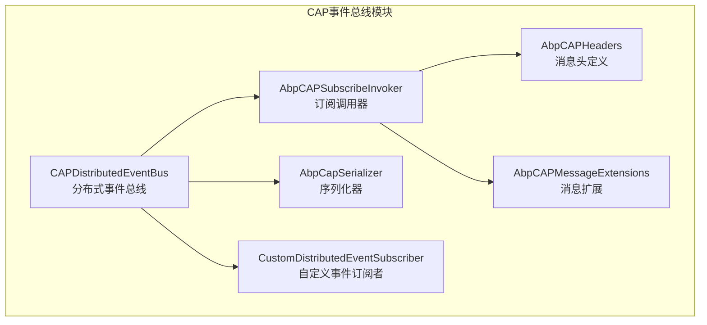
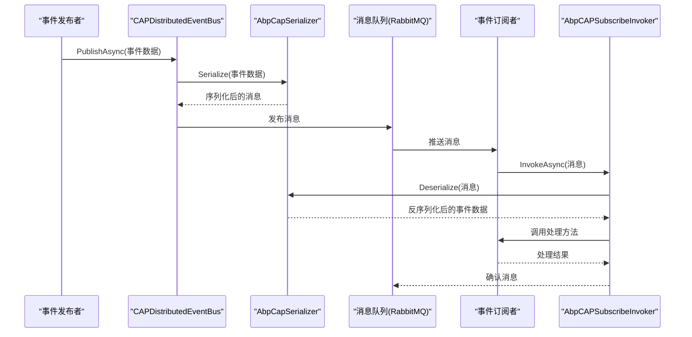

# CAP事件总线

<cite>
**本文档中引用的文件**   
- [AbpCAPEventBusModule.cs](file://aspnet-core/framework/common/LINGYUN.Abp.EventBus.CAP/LINGYUN/Abp/EventBus/CAP/AbpCAPEventBusModule.cs)
- [CAPDistributedEventBus.cs](file://aspnet-core/framework/common/LINGYUN.Abp.EventBus.CAP/LINGYUN/Abp/EventBus/CAP/CAPDistributedEventBus.cs)
- [AbpCAPSubscribeInvoker.cs](file://aspnet-core/framework/common/LINGYUN.Abp.EventBus.CAP/LINGYUN/Abp/EventBus/CAP/AbpCAPSubscribeInvoker.cs)
- [AbpCapSerializer.cs](file://aspnet-core/framework/common/LINGYUN.Abp.EventBus.CAP/LINGYUN/Abp/EventBus/CAP/AbpCapSerializer.cs)
- [CustomDistributedEventSubscriber.cs](file://aspnet-core/framework/common/LINGYUN.Abp.EventBus.CAP/LINGYUN/Abp/EventBus/CAP/CustomDistributedEventSubscriber.cs)
- [AbpCAPHeaders.cs](file://aspnet-core/framework/common/LINGYUN.Abp.EventBus.CAP/LINGYUN/Abp/EventBus/CAP/AbpCAPHeaders.cs)
- [AbpCAPMessageExtensions.cs](file://aspnet-core/framework/common/LINGYUN.Abp.EventBus.CAP/LINGYUN/Abp/EventBus/CAP/AbpCAPMessageExtensions.cs)
- [ServiceCollectionExtensions.cs](file://aspnet-core/framework/common/LINGYUN.Abp.EventBus.CAP/Microsoft/Extensions/DependencyInjection/ServiceCollectionExtensions.cs)
- [AuthServerModule.Configure.cs](file://aspnet-core/services/LY.MicroService.AuthServer/AuthServerModule.Configure.cs)
</cite>

## 目录
1. [简介](#简介)
2. [项目结构](#项目结构)
3. [核心组件](#核心组件)
4. [架构概述](#架构概述)
5. [详细组件分析](#详细组件分析)
6. [依赖分析](#依赖分析)
7. [性能考虑](#性能考虑)
8. [故障排除指南](#故障排除指南)
9. [结论](#结论)

## 简介
CAP事件总线是基于CAP（Consistency, Availability, Partition tolerance）理论的分布式事件总线实现，用于在分布式系统中实现事件驱动架构。它提供了事件发布、订阅、重试和持久化等核心功能，支持与消息队列（如RabbitMQ）的集成，确保了事务性消息发送和消息确认机制。本文档详细阐述了CAP事件总线的实现机制，包括事件定义、发布者和订阅者的实现方式，以及领域事件和集成事件的设计模式。

## 项目结构
CAP事件总线模块位于`aspnet-core/framework/common/LINGYUN.Abp.EventBus.CAP`目录下，主要包含以下子目录和文件：
- `LINGYUN\Abp\EventBus\CAP`: 核心实现代码，包括事件总线、订阅者、序列化器等
- `Microsoft\Extensions\DependencyInjection`: 服务集合扩展
- `FodyWeavers.xml`: Fody配置文件
- `LICENSE.txt`: 许可证文件
- `README.md`: 项目说明文件

该模块通过依赖注入机制集成到ABP框架中，实现了分布式事件总线的功能。



**图源**
- [CAPDistributedEventBus.cs](file://aspnet-core/framework/common/LINGYUN.Abp.EventBus.CAP/LINGYUN/Abp/EventBus/CAP/CAPDistributedEventBus.cs)
- [AbpCAPSubscribeInvoker.cs](file://aspnet-core/framework/common/LINGYUN.Abp.EventBus.CAP/LINGYUN/Abp/EventBus/CAP/AbpCAPSubscribeInvoker.cs)
- [AbpCapSerializer.cs](file://aspnet-core/framework/common/LINGYUN.Abp.EventBus.CAP/LINGYUN/Abp/EventBus/CAP/AbpCapSerializer.cs)
- [CustomDistributedEventSubscriber.cs](file://aspnet-core/framework/common/LINGYUN.Abp.EventBus.CAP/LINGYUN/Abp/EventBus/CAP/CustomDistributedEventSubscriber.cs)
- [AbpCAPHeaders.cs](file://aspnet-core/framework/common/LINGYUN.Abp.EventBus.CAP/LINGYUN/Abp/EventBus/CAP/AbpCAPHeaders.cs)
- [AbpCAPMessageExtensions.cs](file://aspnet-core/framework/common/LINGYUN.Abp.EventBus.CAP/LINGYUN/Abp/EventBus/CAP/AbpCAPMessageExtensions.cs)

**章节源**
- [AbpCAPEventBusModule.cs](file://aspnet-core/framework/common/LINGYUN.Abp.EventBus.CAP/LINGYUN/Abp/EventBus/CAP/AbpCAPEventBusModule.cs)
- [README.md](file://aspnet-core/framework/common/LINGYUN.Abp.EventBus.CAP/README.md)

## 核心组件
CAP事件总线的核心组件包括：
- **CAPDistributedEventBus**: 分布式事件总线的主要实现类，负责事件的发布和订阅
- **AbpCAPSubscribeInvoker**: 订阅调用器，负责调用订阅者的方法
- **AbpCapSerializer**: 序列化器，负责消息的序列化和反序列化
- **CustomDistributedEventSubscriber**: 自定义事件订阅者，负责管理事件订阅
- **AbpCAPHeaders**: 消息头定义，包含租户ID、用户ID等上下文信息
- **AbpCAPMessageExtensions**: 消息扩展方法，提供获取租户ID和链路ID的便捷方法

这些组件共同协作，实现了CAP事件总线的核心功能。

**章节源**
- [CAPDistributedEventBus.cs](file://aspnet-core/framework/common/LINGYUN.Abp.EventBus.CAP/LINGYUN/Abp/EventBus/CAP/CAPDistributedEventBus.cs)
- [AbpCAPSubscribeInvoker.cs](file://aspnet-core/framework/common/LINGYUN.Abp.EventBus.CAP/LINGYUN/Abp/EventBus/CAP/AbpCAPSubscribeInvoker.cs)
- [AbpCapSerializer.cs](file://aspnet-core/framework/common/LINGYUN.Abp.EventBus.CAP/LINGYUN/Abp/EventBus/CAP/AbpCapSerializer.cs)
- [CustomDistributedEventSubscriber.cs](file://aspnet-core/framework/common/LINGYUN.Abp.EventBus.CAP/LINGYUN/Abp/EventBus/CAP/CustomDistributedEventSubscriber.cs)
- [AbpCAPHeaders.cs](file://aspnet-core/framework/common/LINGYUN.Abp.EventBus.CAP/LINGYUN/Abp/EventBus/CAP/AbpCAPHeaders.cs)
- [AbpCAPMessageExtensions.cs](file://aspnet-core/framework/common/LINGYUN.Abp.EventBus.CAP/LINGYUN/Abp/EventBus/CAP/AbpCAPMessageExtensions.cs)

## 架构概述
CAP事件总线的架构基于ABP框架的分布式事件总线设计，通过CAP库实现消息的发布和订阅。其主要架构特点包括：

1. **事件发布**: 通过`CAPDistributedEventBus`类的`PublishToCapAsync`方法发布事件，支持消息头的自定义，如租户ID、用户ID等上下文信息。
2. **事件订阅**: 通过`CustomDistributedEventSubscriber`类管理事件订阅，支持动态订阅和取消订阅。
3. **消息序列化**: 使用`AbpCapSerializer`进行消息的序列化和反序列化，支持JSON格式。
4. **订阅调用**: 通过`AbpCAPSubscribeInvoker`调用订阅者的方法，支持异步调用和异常处理。
5. **上下文传递**: 通过消息头传递租户ID、用户ID、链路ID等上下文信息，确保分布式环境下的数据一致性。



**图源**
- [CAPDistributedEventBus.cs](file://aspnet-core/framework/common/LINGYUN.Abp.EventBus.CAP/LINGYUN/Abp/EventBus/CAP/CAPDistributedEventBus.cs)
- [AbpCapSerializer.cs](file://aspnet-core/framework/common/LINGYUN.Abp.EventBus.CAP/LINGYUN/Abp/EventBus/CAP/AbpCapSerializer.cs)
- [AbpCAPSubscribeInvoker.cs](file://aspnet-core/framework/common/LINGYUN.Abp.EventBus.CAP/LINGYUN/Abp/EventBus/CAP/AbpCAPSubscribeInvoker.cs)

## 详细组件分析

### CAPDistributedEventBus分析
`CAPDistributedEventBus`是CAP事件总线的核心类，继承自`DistributedEventBusBase`，实现了`IDistributedEventBus`接口。它负责事件的发布和订阅管理。

```mermaid
classDiagram
    class CAPDistributedEventBus {
        +ICapPublisher CapPublisher
        +ICustomDistributedEventSubscriber CustomDistributedEventSubscriber
        +ConcurrentDictionary~Type, List~IEventHandlerFactory~~ HandlerFactories
        +ConcurrentDictionary~string, Type~ EventTypes
        +ICurrentUser CurrentUser
        +ICurrentClient CurrentClient
        +IJsonSerializer JsonSerializer