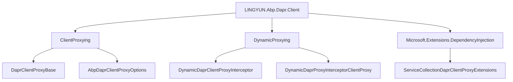
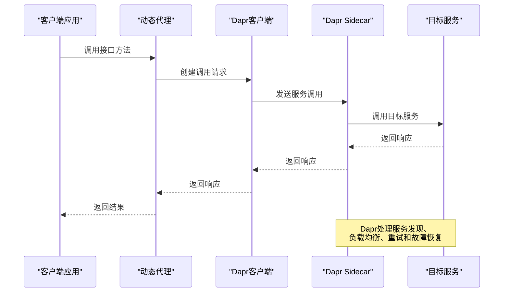
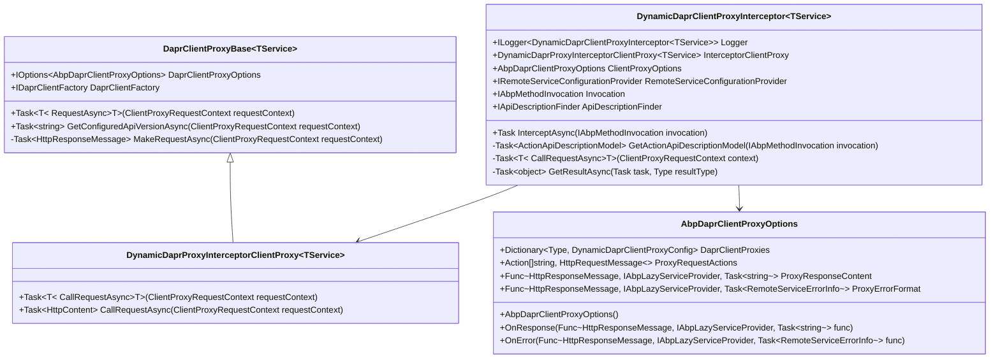
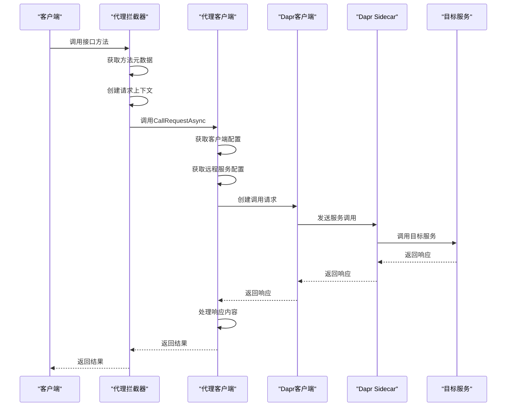

# Dapr服务调用

<cite>
**本文档引用的文件**   
- [AbpDaprClientModule.cs](file://aspnet-core/framework/dapr/LINGYUN.Abp.Dapr.Client/LINGYUN/Abp/Dapr/Client/AbpDaprClientModule.cs)
- [DaprClientProxyBase.cs](file://aspnet-core/framework/dapr/LINGYUN.Abp.Dapr.Client/LINGYUN/Abp/Dapr/Client/ClientProxying/DaprClientProxyBase.cs)
- [DynamicDaprClientProxyConfig.cs](file://aspnet-core/framework/dapr/LINGYUN.Abp.Dapr.Client/LINGYUN/Abp/Dapr/Client/DynamicProxying/DynamicDaprClientProxyConfig.cs)
- [AbpDaprClientProxyOptions.cs](file://aspnet-core/framework/dapr/LINGYUN.Abp.Dapr.Client/LINGYUN/Abp/Dapr/Client/ClientProxying/AbpDaprClientProxyOptions.cs)
- [ServiceCollectionDaprClientProxyExtensions.cs](file://aspnet-core/framework/dapr/LINGYUN.Abp.Dapr.Client/Microsoft/Extensions/DependencyInjection/ServiceCollectionDaprClientProxyExtensions.cs)
- [DynamicDaprClientProxyInterceptor.cs](file://aspnet-core/framework/dapr/LINGYUN.Abp.Dapr.Client/LINGYUN/Abp/Dapr/Client/DynamicProxying/DynamicDaprClientProxyInterceptor.cs)
- [README.md](file://aspnet-core/framework/dapr/LINGYUN.Abp.Dapr.Client/README.md)
- [TestAppServiceTests.cs](file://aspnet-core/tests/LINGYUN.Abp.Dapr.Client.Tests/LINGYUN/Abp/Dapr/Client/Tests/TestAppServiceTests.cs)
- [WebhooksManagementDaprClientModule.cs](file://aspnet-core/modules/webhooks/LINGYUN.Abp.WebhooksManagement.Dapr.Client/LINGYUN/Abp/WebhooksManagement/WebhooksManagementDaprClientModule.cs)
</cite>

## 目录
1. [简介](#简介)
2. [项目结构](#项目结构)
3. [核心组件](#核心组件)
4. [架构概述](#架构概述)
5. [详细组件分析](#详细组件分析)
6. [依赖分析](#依赖分析)
7. [性能考虑](#性能考虑)
8. [故障排除指南](#故障排除指南)
9. [结论](#结论)

## 简介
本文档详细说明基于Dapr的服务间调用机制，阐述Dapr服务调用的实现原理，包括服务发现、负载均衡、重试策略和故障恢复。文档详细说明LINGYUN.Abp.Dapr.Client组件的使用方法，提供同步和异步调用的代码示例，解释Dapr sidecar模式下的通信流程，包括HTTP/gRPC协议转换、服务命名约定和跨网络调用的安全性考虑。通过实际案例展示微服务间的服务调用配置和最佳实践。

## 项目结构
LINGYUN.Abp.Dapr.Client组件位于aspnet-core/framework/dapr目录下，是ABP框架对Dapr服务调用功能的集成实现。该组件通过动态代理技术，实现了与Volo.Abp.Http.Client一致的API风格，使开发者能够无缝地在传统HTTP客户端和Dapr服务调用之间切换。



**图源**
- [AbpDaprClientModule.cs](file://aspnet-core/framework/dapr/LINGYUN.Abp.Dapr.Client/LINGYUN/Abp/Dapr/Client/AbpDaprClientModule.cs)
- [DaprClientProxyBase.cs](file://aspnet-core/framework/dapr/LINGYUN.Abp.Dapr.Client/LINGYUN/Abp/Dapr/Client/ClientProxying/DaprClientProxyBase.cs)
- [DynamicDaprClientProxyInterceptor.cs](file://aspnet-core/framework/dapr/LINGYUN.Abp.Dapr.Client/LINGYUN/Abp/Dapr/Client/DynamicProxying/DynamicDaprClientProxyInterceptor.cs)
- [ServiceCollectionDaprClientProxyExtensions.cs](file://aspnet-core/framework/dapr/LINGYUN.Abp.Dapr.Client/Microsoft/Extensions/DependencyInjection/ServiceCollectionDaprClientProxyExtensions.cs)

**本节来源**
- [AbpDaprClientModule.cs](file://aspnet-core/framework/dapr/LINGYUN.Abp.Dapr.Client/LINGYUN/Abp/Dapr/Client/AbpDaprClientModule.cs)
- [README.md](file://aspnet-core/framework/dapr/LINGYUN.Abp.Dapr.Client/README.md)

## 核心组件
LINGYUN.Abp.Dapr.Client的核心组件包括DaprClientProxyBase、DynamicDaprClientProxyInterceptor和AbpDaprClientProxyOptions。DaprClientProxyBase是所有Dapr客户端代理的基础类，负责处理实际的服务调用逻辑。DynamicDaprClientProxyInterceptor是动态代理拦截器，用于拦截接口调用并将其转换为Dapr服务调用。AbpDaprClientProxyOptions提供配置选项，允许开发者自定义请求、响应和错误处理行为。

**本节来源**
- [DaprClientProxyBase.cs](file://aspnet-core/framework/dapr/LINGYUN.Abp.Dapr.Client/LINGYUN/Abp/Dapr/Client/ClientProxying/DaprClientProxyBase.cs)
- [DynamicDaprClientProxyInterceptor.cs](file://aspnet-core/framework/dapr/LINGYUN.Abp.Dapr.Client/LINGYUN/Abp/Dapr/Client/DynamicProxying/DynamicDaprClientProxyInterceptor.cs)
- [AbpDaprClientProxyOptions.cs](file://aspnet-core/framework/dapr/LINGYUN.Abp.Dapr.Client/LINGYUN/Abp/Dapr/Client/ClientProxying/AbpDaprClientProxyOptions.cs)

## 架构概述
LINGYUN.Abp.Dapr.Client的架构基于ABP框架的动态代理机制和Dapr的sidecar模式。客户端通过动态代理生成接口的实现，将方法调用转换为Dapr服务调用。Dapr sidecar负责处理服务发现、负载均衡、重试策略和故障恢复等分布式系统问题。



**图源**
- [DaprClientProxyBase.cs](file://aspnet-core/framework/dapr/LINGYUN.Abp.Dapr.Client/LINGYUN/Abp/Dapr/Client/ClientProxying/DaprClientProxyBase.cs)
- [DynamicDaprClientProxyInterceptor.cs](file://aspnet-core/framework/dapr/LINGYUN.Abp.Dapr.Client/LINGYUN/Abp/Dapr/Client/DynamicProxying/DynamicDaprClientProxyInterceptor.cs)

## 详细组件分析

### Dapr客户端代理分析
Dapr客户端代理通过动态代理技术实现，将接口调用转换为Dapr服务调用。代理拦截器捕获方法调用，提取方法元数据，然后通过Dapr客户端发送请求。

#### 对象导向组件


**图源**
- [DaprClientProxyBase.cs](file://aspnet-core/framework/dapr/LINGYUN.Abp.Dapr.Client/LINGYUN/Abp/Dapr/Client/ClientProxying/DaprClientProxyBase.cs)
- [DynamicDaprClientProxyInterceptor.cs](file://aspnet-core/framework/dapr/LINGYUN.Abp.Dapr.Client/LINGYUN/Abp/Dapr/Client/DynamicProxying/DynamicDaprClientProxyInterceptor.cs)
- [DynamicDaprProxyInterceptorClientProxy.cs](file://aspnet-core/framework/dapr/LINGYUN.Abp.Dapr.Client/LINGYUN/Abp/Dapr/Client/DynamicProxying/DynamicDaprProxyInterceptorClientProxy.cs)
- [AbpDaprClientProxyOptions.cs](file://aspnet-core/framework/dapr/LINGYUN.Abp.Dapr.Client/LINGYUN/Abp/Dapr/Client/ClientProxying/AbpDaprClientProxyOptions.cs)

**本节来源**
- [DaprClientProxyBase.cs](file://aspnet-core/framework/dapr/LINGYUN.Abp.Dapr.Client/LINGYUN/Abp/Dapr/Client/ClientProxying/DaprClientProxyBase.cs)
- [DynamicDaprClientProxyInterceptor.cs](file://aspnet-core/framework/dapr/LINGYUN.Abp.Dapr.Client/LINGYUN/Abp/Dapr/Client/DynamicProxying/DynamicDaprClientProxyInterceptor.cs)
- [DynamicDaprProxyInterceptorClientProxy.cs](file://aspnet-core/framework/dapr/LINGYUN.Abp.Dapr.Client/LINGYUN/Abp/Dapr/Client/DynamicProxying/DynamicDaprProxyInterceptorClientProxy.cs)

### 服务调用流程分析
服务调用流程包括方法拦截、请求构建、服务发现、网络调用和响应处理等步骤。

#### API/服务组件


**图源**
- [DynamicDaprClientProxyInterceptor.cs](file://aspnet-core/framework/dapr/LINGYUN.Abp.Dapr.Client/LINGYUN/Abp/Dapr/Client/DynamicProxying/DynamicDaprClientProxyInterceptor.cs)
- [DaprClientProxyBase.cs](file://aspnet-core/framework/dapr/LINGYUN.Abp.Dapr.Client/LINGYUN/Abp/Dapr/Client/ClientProxying/DaprClientProxyBase.cs)

### 复杂逻辑组件分析
复杂逻辑组件处理请求构建、响应解析和错误处理等复杂逻辑。

#### 复杂逻辑组件
```mermaid
flowchart TD
    Start([开始]) --> ValidateInput["验证输入参数"]
    ValidateInput --> InputValid{"输入有效?"}
    InputValid -->|否| ReturnError["返回错误响应"]
    InputValid -->|是| GetConfig["获取客户端配置"]
    GetConfig --> GetRemoteConfig["获取远程服务配置"]
    GetRemoteConfig --> GetAppId["获取应用ID"]
    GetAppId --> GetApiVersion["获取API版本"]
    GetApiVersion --> BuildRequest["构建请求"]
    BuildRequest --> AddHeaders["添加请求头"]
    AddHeaders --> Authenticate["身份验证"]
    Authenticate --> MakeRequest["