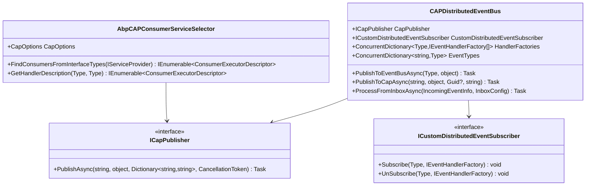

# 发布订阅模式

<cite>
**本文档中引用的文件**
- [CAPDistributedEventBus.cs](file://aspnet-core/framework/common/LINGYUN.Abp.EventBus.CAP/LINGYUN/Abp/EventBus/CAP/CAPDistributedEventBus.cs)
- [AbpCAPConsumerServiceSelector.cs](file://aspnet-core/framework/common/LINGYUN.Abp.EventBus.CAP/LINGYUN/Abp/EventBus/CAP/AbpCAPConsumerServiceSelector.cs)
- [CustomDistributedEventSubscriber.cs](file://aspnet-core/framework/common/LINGYUN.Abp.EventBus.CAP/LINGYUN/Abp/EventBus/CAP/CustomDistributedEventSubscriber.cs)
- [AbpCAPHeaders.cs](file://aspnet-core/framework/common/LINGYUN.Abp.EventBus.CAP/LINGYUN/Abp/EventBus/CAP/AbpCAPHeaders.cs)
- [DefaultDaprClientFactory.cs](file://aspnet-core/framework/dapr/LINGYUN.Abp.Dapr/Dapr/Client/DefaultDaprClientFactory.cs)
- [ChatMessageEventHandler.cs](file://aspnet-core/services/LY.AIO.Applications.Single/EventBus/Distributed/ChatMessageEventHandler.cs)
- [README.md](file://aspnet-core/modules/webhooks/LINGYUN.Abp.WebhooksManagement.Dapr.Client/README.md)
</cite>

## 目录
1. [简介](#简介)
2. [项目结构概览](#项目结构概览)
3. [核心组件分析](#核心组件分析)
4. [架构概览](#架构概览)
5. [详细组件分析](#详细组件分析)
6. [依赖关系分析](#依赖关系分析)
7. [性能考虑](#性能考虑)
8. [故障排除指南](#故障排除指南)
9. [结论](#结论)

## 简介

本文档详细介绍了ABP Next Admin框架中实现的发布订阅模式，重点比较了Dapr发布订阅和CAP事件总线两种不同的实现方式。该系统采用了事件驱动架构，支持分布式事件处理、消息路由、主题订阅等高级功能。

发布订阅模式是一种广泛使用的软件设计模式，它允许应用程序组件之间进行松耦合的通信。在ABP Next Admin框架中，这种模式被用于实现微服务之间的解耦通信，支持多种消息传输协议和事件处理策略。

## 项目结构概览

ABP Next Admin项目采用模块化架构，发布订阅功能主要分布在以下模块中：

**图表来源**
- [CAPDistributedEventBus.cs](file://aspnet-core/framework/common/LINGYUN.Abp.EventBus.CAP/LINGYUN/Abp/EventBus/CAP/CAPDistributedEventBus.cs#L1-L50)
- [DefaultDaprClientFactory.cs](file://aspnet-core/framework/dapr/LINGYUN.Abp.Dapr/Dapr/Client/DefaultDaprClientFactory.cs#L1-L30)

**章节来源**
- [CAPDistributedEventBus.cs](file://aspnet-core/framework/common/LINGYUN.Abp.EventBus.CAP/LINGYUN/Abp/EventBus/CAP/CAPDistributedEventBus.cs#L1-L297)
- [DefaultDaprClientFactory.cs](file://aspnet-core/framework/dapr/LINGYUN.Abp.Dapr/Dapr/Client/DefaultDaprClientFactory.cs#L1-L99)

## 核心组件分析

### CAP分布式事件总线

CAP（Cloud Events Application Protocol）是一个轻量级的消息中间件，专门用于处理分布式系统中的事件发布和订阅。

**图表来源**
- [CAPDistributedEventBus.cs](file://aspnet-core/framework/common/LINGYUN.Abp.EventBus.CAP/LINGYUN/Abp/EventBus/CAP/CAPDistributedEventBus.cs#L25-L50)
- [AbpCAPConsumerServiceSelector.cs](file://aspnet-core/framework/common/LINGYUN.Abp.EventBus.CAP/LINGYUN/Abp/EventBus/CAP/AbpCAPConsumerServiceSelector.cs#L20-L40)

### Dapr客户端工厂

Dapr提供了强大的服务调用和发布订阅功能，通过统一的API接口简化了微服务间的通信。

**图表来源**
- [DefaultDaprClientFactory.cs](file://aspnet-core/framework/dapr/LINGYUN.Abp.Dapr/Dapr/Client/DefaultDaprClientFactory.cs#L10-L30)

**章节来源**
- [CAPDistributedEventBus.cs](file://aspnet-core/framework/common/LINGYUN.Abp.EventBus.CAP/LINGYUN/Abp/EventBus/CAP/CAPDistributedEventBus.cs#L25-L100)
- [DefaultDaprClientFactory.cs](file://aspnet-core/framework/dapr/LINGYUN.Abp.Dapr/Dapr/Client/DefaultDaprClientFactory.cs#L10-L50)

## 架构概览

ABP Next Admin的发布订阅架构采用了混合模式，同时支持CAP和Dapr两种不同的实现：

**图表来源**
- [CAPDistributedEventBus.cs](file://aspnet-core/framework/common/LINGYUN.Abp.EventBus.CAP/LINGYUN/Abp/EventBus/CAP/CAPDistributedEventBus.cs#L15-L30)
- [DefaultDaprClientFactory.cs](file://aspnet-core/framework/dapr/LINGYUN.Abp.Dapr/Dapr/Client/DefaultDaprClientFactory.cs#L20-L40)

## 详细组件分析

### 事件发布流程

事件发布是发布订阅模式的核心功能之一，以下是CAP事件总线的发布流程：

**图表来源**
- [CAPDistributedEventBus.cs](file://aspnet-core/framework/common/LINGYUN.Abp.EventBus.CAP/LINGYUN/Abp/EventBus/CAP/CAPDistributedEventBus.cs#L280-L297)

### 事件订阅机制

事件订阅通过自定义的事件订阅者实现，支持动态订阅和取消订阅：

**图表来源**
- [CustomDistributedEventSubscriber.cs](file://aspnet-core/framework/common/LINGYUN.Abp.EventBus.CAP/LINGYUN/Abp/EventBus/CAP/CustomDistributedEventSubscriber.cs#L40-L80)

### Dapr服务调用

Dapr提供了统一的服务调用接口，简化了微服务间的通信：

**图表来源**
- [DefaultDaprClientFactory.cs](file://aspnet-core/framework/dapr/LINGYUN.Abp.Dapr/Dapr/Client/DefaultDaprClientFactory.cs#L35-L70)

**章节来源**
- [CAPDistributedEventBus.cs](file://aspnet-core/framework/common/LINGYUN.Abp.EventBus.CAP/LINGYUN/Abp/EventBus/CAP/CAPDistributedEventBus.cs#L280-L300)
- [CustomDistributedEventSubscriber.cs](file://aspnet-core/framework/common/LINGYUN.Abp.EventBus.CAP/LINGYUN/Abp/EventBus/CAP/CustomDistributedEventSubscriber.cs#L40-L100)
- [DefaultDaprClientFactory.cs](file://aspnet-core/framework/dapr/LINGYUN.Abp.Dapr/Dapr/Client/DefaultDaprClientFactory.cs#L35-L80)

### 主题定义和消息格式

系统支持灵活的主题定义和消息格式配置：

**图表来源**
- [AbpCAPHeaders.cs](file://aspnet-core/framework/common/LINGYUN.Abp.EventBus.CAP/LINGYUN/Abp/EventBus/CAP/AbpCAPHeaders.cs#L1-L13)

### 消息序列化和内容类型处理

系统支持多种消息序列化方式和内容类型：

**章节来源**
- [CAPDistributedEventBus.cs](file://aspnet-core/framework/common/LINGYUN.Abp.EventBus.CAP/LINGYUN/Abp/EventBus/CAP/CAPDistributedEventBus.cs#L150-L200)
- [AbpCAPHeaders.cs](file://aspnet-core/framework/common/LINGYUN.Abp.EventBus.CAP/LINGYUN/Abp/EventBus/CAP/AbpCAPHeaders.cs#L1-L13)

## 依赖关系分析

系统的依赖关系展现了清晰的分层架构：

**图表来源**
- [CAPDistributedEventBus.cs](file://aspnet-core/framework/common/LINGYUN.Abp.EventBus.CAP/LINGYUN/Abp/EventBus/CAP/CAPDistributedEventBus.cs#L1-L20)
- [DefaultDaprClientFactory.cs](file://aspnet-core/framework/dapr/LINGYUN.Abp.Dapr/Dapr/Client/DefaultDaprClientFactory.cs#L1-L15)

**章节来源**
- [CAPDistributedEventBus.cs](file://aspnet-core/framework/common/LINGYUN.Abp.EventBus.CAP/LINGYUN/Abp/EventBus/CAP/CAPDistributedEventBus.cs#L1-L30)
- [DefaultDaprClientFactory.cs](file://aspnet-core/framework/dapr/LINGYUN.Abp.Dapr/Dapr/Client/DefaultDaprClientFactory.cs#L1-L30)

## 性能考虑

### 消息处理优化

系统采用了多种性能优化策略：

1. **并发处理**：支持多线程并发处理事件
2. **批量处理**：支持批量发布和处理消息
3. **缓存机制**：缓存事件处理器和主题信息
4. **连接池**：复用Dapr客户端连接

### QoS保证

系统提供了多种服务质量保证机制：

- **消息持久化**：确保消息不会丢失
- **重试机制**：自动重试失败的处理
- **死信队列**：处理无法正常处理的消息
- **监控告警**：实时监控消息处理状态

## 故障排除指南

### 常见问题和解决方案

1. **事件订阅失败**
   - 检查事件处理器是否正确注册
   - 验证主题名称是否匹配
   - 确认网络连接是否正常

2. **消息重复发送**
   - 检查消息ID去重机制
   - 验证事务处理逻辑
   - 查看重试配置

3. **性能问题**
   - 监控消息处理延迟
   - 优化事件处理器实现
   - 调整并发度配置

**章节来源**
- [CAPDistributedEventBus.cs](file://aspnet-core/framework/common/LINGYUN.Abp.EventBus.CAP/LINGYUN/Abp/EventBus/CAP/CAPDistributedEventBus.cs#L200-L280)

## 结论

ABP Next Admin框架中的发布订阅模式实现了高度灵活和可扩展的事件驱动架构。通过同时支持CAP和Dapr两种不同的实现方式，系统能够适应不同的应用场景和技术需求。

### 主要优势

1. **灵活性**：支持多种消息传输协议和事件处理策略
2. **可扩展性**：模块化设计便于功能扩展
3. **可靠性**：提供完善的错误处理和恢复机制
4. **性能**：优化的并发处理和缓存机制

### 最佳实践建议

1. **合理选择传输协议**：根据具体需求选择CAP或Dapr
2. **优化事件设计**：保持事件的简洁性和稳定性
3. **监控和调试**：建立完善的监控体系
4. **安全考虑**：确保消息传输的安全性

通过深入理解这些组件和架构设计，开发者可以更好地利用发布订阅模式构建高性能、高可靠性的分布式系统。