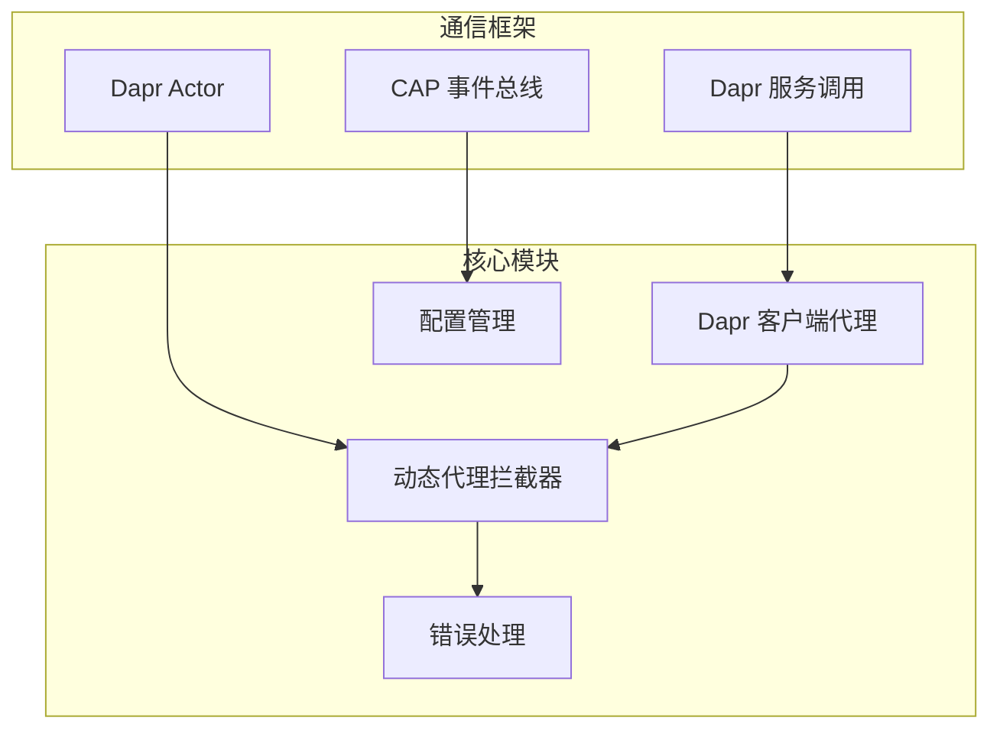
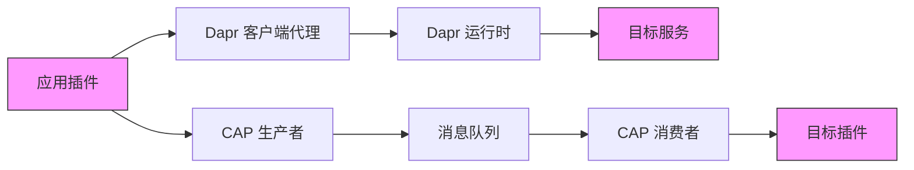
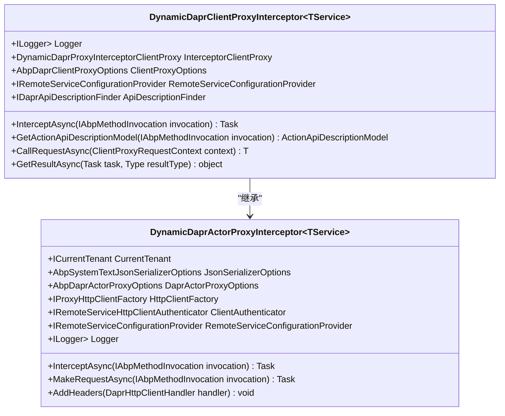
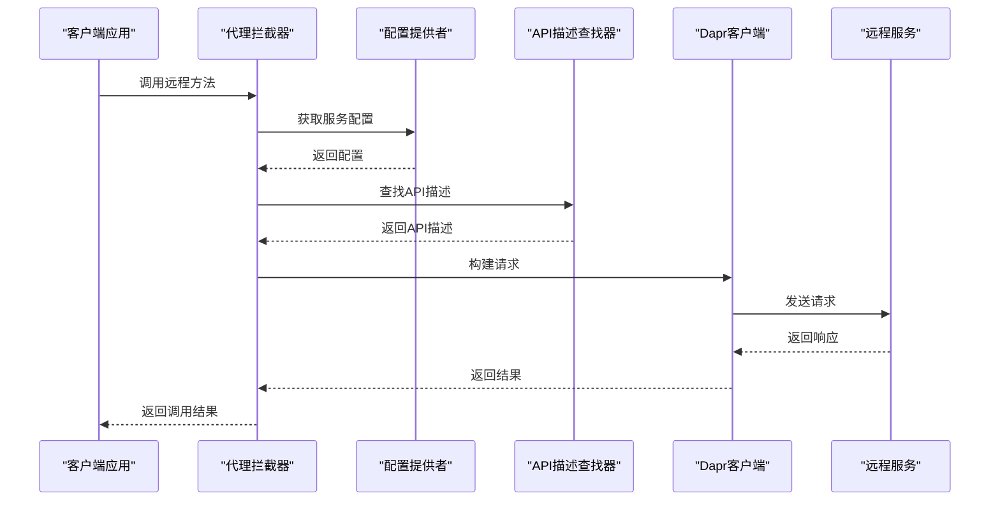
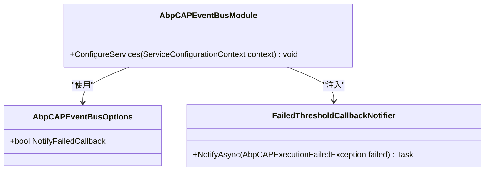
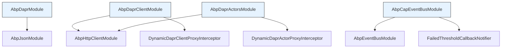

# 插件通信协议

<cite>
**本文档引用的文件**
- [AbpDaprClientModule.cs](file://aspnet-core/framework/dapr/LINGYUN.Abp.Dapr.Client/LINGYUN/Abp/Dapr/Client/AbpDaprClientModule.cs)
- [DynamicDaprClientProxyInterceptor.cs](file://aspnet-core/framework/dapr/LINGYUN.Abp.Dapr.Client/LINGYUN/Abp/Dapr/Client/DynamicProxying/DynamicDaprClientProxyInterceptor.cs)
- [AbpCapEventBusModule.cs](file://aspnet-core/framework/common/LINGYUN.Abp.EventBus.CAP/LINGYUN/Abp/EventBus/CAP/AbpCapEventBusModule.cs)
- [AbpCAPEventBusOptions.cs](file://aspnet-core/framework/common/LINGYUN.Abp.EventBus.CAP/LINGYUN/Abp/EventBus/CAP/AbpCAPEventBusOptions.cs)
- [DynamicDaprActorProxyInterceptor.cs](file://aspnet-core/framework/dapr/LINGYUN.Abp.Dapr.Actors/LINGYUN/Abp/Dapr/Actors/DynamicProxying/DynamicDaprActorProxyInterceptor.cs)
- [DaprHttpClientHandler.cs](file://aspnet-core/framework/dapr/LINGYUN.Abp.Dapr.Actors/LINGYUN/Abp/Dapr/Actors/DynamicProxying/DaprHttpClientHandler.cs)
- [AbpDaprActorCallException.cs](file://aspnet-core/framework/dapr/LINGYUN.Abp.Dapr.Actors/LINGYUN/Abp/Dapr/Actors/AbpDaprActorCallException.cs)
- [AbpDaprModule.cs](file://aspnet-core/framework/dapr/LINGYUN.Abp.Dapr/LINGYUN/Abp/Dapr/AbpDaprModule.cs)
- [AbpDaprActorsModule.cs](file://aspnet-core/framework/dapr/LINGYUN.Abp.Dapr.Actors/LINGYUN/Abp/Dapr/Actors/AbpDaprActorsModule.cs)
- [AbpDaprClientProxyOptions.cs](file://aspnet-core/framework/dapr/LINGYUN.Abp.Dapr.Client/LINGYUN/Abp/Dapr/Client/ClientProxying/AbpDaprClientProxyOptions.cs)
- [DaprRemoteServiceConfigurationExtensions.cs](file://aspnet-core/framework/dapr/LINGYUN.Abp.Dapr.Client/LINGYUN/Abp/Dapr/Client/DaprRemoteServiceConfigurationExtensions.cs)
</cite>

## 目录
1. [引言](#引言)
2. [项目结构](#项目结构)
3. [核心组件](#核心组件)
4. [架构概述](#架构概述)
5. [详细组件分析](#详细组件分析)
6. [依赖分析](#依赖分析)
7. [性能考虑](#性能考虑)
8. [故障排除指南](#故障排除指南)
9. [结论](#结论)

## 引言
本文档详细说明了ABP Next Admin项目中插件间的通信机制，重点阐述基于Dapr和CAP事件总线的分布式通信模式。文档涵盖了服务调用、事件发布订阅、状态管理等关键方面，提供了同步与异步通信的最佳实践、接口定义和消息格式规范。通过分析实际代码实现，解释了服务发现、负载均衡和故障恢复机制。

## 项目结构
该项目采用微服务架构，通过Dapr和CAP实现插件间的通信。核心通信功能分布在`aspnet-core/framework/dapr`和`aspnet-core/framework/common/LINGYUN.Abp.EventBus.CAP`目录中。Dapr相关模块提供了服务间调用和Actor模型支持，而CAP事件总线则负责事件驱动的异步通信。

**图示来源**
- [AbpDaprClientModule.cs](file://aspnet-core/framework/dapr/LINGYUN.Abp.Dapr.Client/LINGYUN/Abp/Dapr/Client/AbpDaprClientModule.cs)
- [DynamicDaprClientProxyInterceptor.cs](file://aspnet-core/framework/dapr/LINGYUN.Abp.Dapr.Client/LINGYUN/Abp/Dapr/Client/DynamicProxying/DynamicDaprClientProxyInterceptor.cs)
- [AbpCapEventBusModule.cs](file://aspnet-core/framework/common/LINGYUN.Abp.EventBus.CAP/LINGYUN/Abp/EventBus/CAP/AbpCapEventBusModule.cs)

**本节来源**
- [AbpDaprModule.cs](file://aspnet-core/framework/dapr/LINGYUN.Abp.Dapr/LINGYUN/Abp/Dapr/AbpDaprModule.cs)
- [AbpCapEventBusModule.cs](file://aspnet-core/framework/common/LINGYUN.Abp.EventBus.CAP/LINGYUN/Abp/EventBus/CAP/AbpCapEventBusModule.cs)

## 核心组件
系统的核心通信组件包括基于Dapr的服务调用代理、Dapr Actor集成和CAP事件总线。Dapr客户端代理通过动态拦截器实现透明的服务调用，而CAP事件总线则提供了可靠的事件发布订阅机制。这些组件共同构成了插件间通信的基础。

**本节来源**
- [AbpDaprClientModule.cs](file://aspnet-core/framework/dapr/LINGYUN.Abp.Dapr.Client/LINGYUN/Abp/Dapr/Client/AbpDaprClientModule.cs)
- [AbpCapEventBusModule.cs](file://aspnet-core/framework/common/LINGYUN.Abp.EventBus.CAP/LINGYUN/Abp/EventBus/CAP/AbpCapEventBusModule.cs)

## 架构概述
系统采用分层架构，上层应用通过代理透明地调用底层服务。Dapr提供服务发现和调用能力，CAP处理事件驱动的异步通信。这种架构实现了插件间的松耦合，支持独立部署和扩展。

**图示来源**
- [AbpDaprClientModule.cs](file://aspnet-core/framework/dapr/LINGYUN.Abp.Dapr.Client/LINGYUN/Abp/Dapr/Client/AbpDaprClientModule.cs)
- [AbpCapEventBusModule.cs](file://aspnet-core/framework/common/LINGYUN.Abp.EventBus.CAP/LINGYUN/Abp/EventBus/CAP/AbpCapEventBusModule.cs)

## 详细组件分析
### Dapr 客户端代理分析
Dapr客户端代理通过动态拦截器实现服务调用的透明化。当应用调用远程服务时，拦截器会自动处理服务发现、请求构建和响应解析。

#### 动态代理拦截器

**图示来源**
- [DynamicDaprClientProxyInterceptor.cs](file://aspnet-core/framework/dapr/LINGYUN.Abp.Dapr.Client/LINGYUN/Abp/Dapr/Client/DynamicProxying/DynamicDaprClientProxyInterceptor.cs)
- [DynamicDaprActorProxyInterceptor.cs](file://aspnet-core/framework/dapr/LINGYUN.Abp.Dapr.Actors/LINGYUN/Abp/Dapr/Actors/DynamicProxying/DynamicDaprActorProxyInterceptor.cs)

#### 服务调用流程

**图示来源**
- [DynamicDaprClientProxyInterceptor.cs](file://aspnet-core/framework/dapr/LINGYUN.Abp.Dapr.Client/LINGYUN/Abp/Dapr/Client/DynamicProxying/DynamicDaprClientProxyInterceptor.cs)
- [DaprRemoteServiceConfigurationExtensions.cs](file://aspnet-core/framework/dapr/LINGYUN.Abp.Dapr.Client/LINGYUN/Abp/Dapr/Client/DaprRemoteServiceConfigurationExtensions.cs)

### CAP 事件总线分析
CAP事件总线提供了可靠的事件发布订阅机制，确保消息的最终一致性。

#### 事件总线配置

**图示来源**
- [AbpCapEventBusModule.cs](file://aspnet-core/framework/common/LINGYUN.Abp.EventBus.CAP/LINGYUN/Abp/EventBus/CAP/AbpCapEventBusModule.cs)
- [AbpCAPEventBusOptions.cs](file://aspnet-core/framework/common/LINGYUN.Abp.EventBus.CAP/LINGYUN/Abp/EventBus/CAP/AbpCAPEventBusOptions.cs)

**本节来源**
- [DynamicDaprClientProxyInterceptor.cs](file://aspnet-core/framework/dapr/LINGYUN.Abp.Dapr.Client/LINGYUN/Abp/Dapr/Client/DynamicProxying/DynamicDaprClientProxyInterceptor.cs)
- [DynamicDaprActorProxyInterceptor.cs](file://aspnet-core/framework/dapr/LINGYUN.Abp.Dapr.Actors/LINGYUN/Abp/Dapr/Actors/DynamicProxying/DynamicDaprActorProxyInterceptor.cs)
- [AbpCapEventBusModule.cs](file://aspnet-core/framework/common/LINGYUN.Abp.EventBus.CAP/LINGYUN/Abp/EventBus/CAP/AbpCapEventBusModule.cs)

## 依赖分析
系统组件间存在明确的依赖关系，确保了通信机制的稳定性和可扩展性。

**图示来源**
- [AbpDaprModule.cs](file://aspnet-core/framework/dapr/LINGYUN.Abp.Dapr/LINGYUN/Abp/Dapr/AbpDaprModule.cs)
- [AbpDaprClientModule.cs](file://aspnet-core/framework/dapr/LINGYUN.Abp.Dapr.Client/LINGYUN/Abp/Dapr/Client/AbpDaprClientModule.cs)
- [AbpDaprActorsModule.cs](file://aspnet-core/framework/dapr/LINGYUN.Abp.Dapr.Actors/LINGYUN/Abp/Dapr/Actors/AbpDaprActorsModule.cs)
- [AbpCapEventBusModule.cs](file://aspnet-core/framework/common/LINGYUN.Abp.EventBus.CAP/LINGYUN/Abp/EventBus/CAP/AbpCapEventBusModule.cs)

**本节来源**
- [AbpDaprModule.cs](file://aspnet-core/framework/dapr/LINGYUN.Abp.Dapr/LINGYUN/Abp/Dapr/AbpDaprModule.cs)
- [AbpDaprClientModule.cs](file://aspnet-core/framework/dapr/LINGYUN.Abp.Dapr.Client/LINGYUN/Abp/Dapr/Client/AbpDaprClientModule.cs)
- [AbpDaprActorsModule.cs](file://aspnet-core/framework/dapr/LINGYUN.Abp.Dapr.Actors/LINGYUN/Abp/Dapr/Actors/AbpDaprActorsModule.cs)
- [AbpCapEventBusModule.cs](file://aspnet-core/framework/common/LINGYUN.Abp.EventBus.CAP/LINGYUN/Abp/EventBus/CAP/AbpCapEventBusModule.cs)

## 性能考虑
系统在设计时考虑了性能优化，通过连接池、异步调用和消息批处理等机制提高通信效率。Dapr的边车模式减少了直接网络连接的开销，而CAP的批量发布机制降低了消息队列的压力。

## 故障排除指南
当通信出现问题时，应首先检查服务配置和网络连接。对于Dapr调用失败，需要验证AppId配置和Dapr运行时状态；对于CAP事件丢失，应检查消息队列的健康状况和消费者处理逻辑。

**本节来源**
- [AbpDaprActorCallException.cs](file://aspnet-core/framework/dapr/LINGYUN.Abp.Dapr.Actors/LINGYUN/Abp/Dapr/Actors/AbpDaprActorCallException.cs)
- [AbpCapEventBusModule.cs](file://aspnet-core/framework/common/LINGYUN.Abp.EventBus.CAP/LINGYUN/Abp/EventBus/CAP/AbpCapEventBusModule.cs)

## 结论
ABP Next Admin项目通过Dapr和CAP实现了强大的插件间通信能力。Dapr提供了同步服务调用和Actor模型支持，而CAP确保了异步事件的可靠传递。这种组合既满足了实时交互的需求，又保证了系统的最终一致性，为微服务架构下的插件化开发提供了坚实的基础。