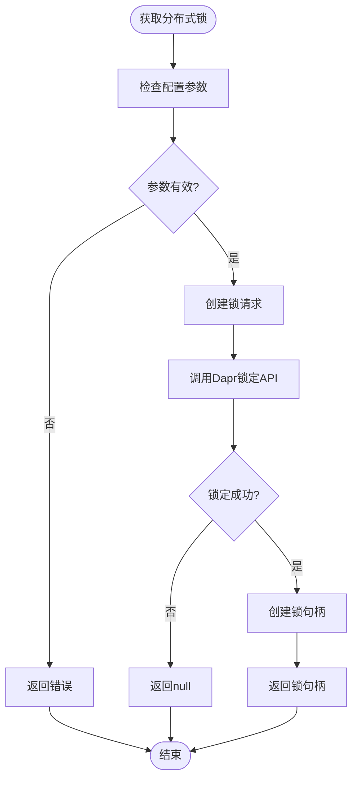

# 状态管理

<cite>
**本文档中引用的文件**
- [AbpDaprModule.cs](file://aspnet-core/framework/dapr/LINGYUN.Abp.Dapr/LINGYUN/Abp/Dapr/AbpDaprModule.cs)
- [DefaultDaprClientFactory.cs](file://aspnet-core/framework/dapr/LINGYUN.Abp.Dapr/Dapr/Client/DefaultDaprClientFactory.cs)
- [IDaprClientFactory.cs](file://aspnet-core/framework/dapr/LINGYUN.Abp.Dapr/Dapr/Client/IDaprClientFactory.cs)
- [TestActor.cs](file://aspnet-core/tests/LINGYUN.Abp.Dapr.AspNetCore.TestHost/LINGYUN/Abp/Dapr/Actors/TestActor.cs)
- [TestActorsTests.cs](file://aspnet-core/tests/LINGYUN.Abp.Dapr.Actors.Tests/LINGYUN/Abp/Dapr/Actors/Tests/TestActorsTests.cs)
- [DaprAbpDistributedLockHandle.cs](file://aspnet-core/framework/dapr/LINGYUN.Abp.DistributedLocking.Dapr/LINGYUN/Abp/DistributedLocking/Dapr/DaprAbpDistributedLockHandle.cs)
- [AbpDistributedLockingDaprOptions.cs](file://aspnet-core/framework/dapr/LINGYUN.Abp.DistributedLocking.Dapr/LINGYUN/Abp/DistributedLocking/Dapr/AbpDistributedLockingDaprOptions.cs)
- [AbpDaprActorsTestBase.cs](file://aspnet-core/tests/LINGYUN.Abp.Dapr.Actors.Tests/LINGYUN/Abp/Dapr/Actors/Tests/AbpDaprActorsTestBase.cs)
</cite>

## 目录
1. [简介](#简介)
2. [项目结构](#项目结构)
3. [核心组件](#核心组件)
4. [架构概述](#架构概述)
5. [详细组件分析](#详细组件分析)
6. [依赖关系分析](#依赖关系分析)
7. [性能考虑](#性能考虑)
8. [故障排除指南](#故障排除指南)
9. [结论](#结论)

## 简介
本文件旨在深入阐述基于Dapr的状态管理机制，涵盖分布式状态存储的实现原理、状态组件配置、状态存储选项（如Redis）和一致性模型。文档将详细说明状态的读取、写入、删除和事务操作，提供并发控制和乐观锁的实现方式。同时，解释Dapr状态管理器的使用方法，包括状态序列化、元数据配置和分区策略，并通过实际案例展示跨服务的状态共享和状态迁移的最佳实践。

## 项目结构
ABP Next Admin项目中的Dapr状态管理功能主要集中在`aspnet-core/framework/dapr`目录下。该目录包含了Dapr客户端、分布式锁定、Actor模型等核心组件的实现。状态管理相关的代码分布在多个子模块中，包括`LINGYUN.Abp.Dapr`、`LINGYUN.Abp.Dapr.Client`和`LINGYUN.Abp.DistributedLocking.Dapr`等。


**图示来源**
- [AbpDaprModule.cs](file://aspnet-core/framework/dapr/LINGYUN.Abp.Dapr/LINGYUN/Abp/Dapr/AbpDaprModule.cs)
- [DefaultDaprClientFactory.cs](file://aspnet-core/framework/dapr/LINGYUN.Abp.Dapr/Dapr/Client/DefaultDaprClientFactory.cs)
- [TestActor.cs](file://aspnet-core/tests/LINGYUN.Abp.Dapr.AspNetCore.TestHost/LINGYUN/Abp/Dapr/Actors/TestActor.cs)
- [DaprAbpDistributedLockHandle.cs](file://aspnet-core/framework/dapr/LINGYUN.Abp.DistributedLocking.Dapr/LINGYUN/Abp/DistributedLocking/Dapr/DaprAbpDistributedLockHandle.cs)

**章节来源**
- [AbpDaprModule.cs](file://aspnet-core/framework/dapr/LINGYUN.Abp.Dapr/LINGYUN/Abp/Dapr/AbpDaprModule.cs)
- [project_structure](file://project_structure#L1-L100)

## 核心组件
Dapr状态管理的核心组件包括状态客户端工厂、状态管理器、分布式锁和Actor模型。这些组件共同实现了分布式环境下的状态管理和协调。

**章节来源**
- [DefaultDaprClientFactory.cs](file://aspnet-core/framework/dapr/LINGYUN.Abp.Dapr/Dapr/Client/DefaultDaprClientFactory.cs)
- [TestActor.cs](file://aspnet-core/tests/LINGYUN.Abp.Dapr.AspNetCore.TestHost/LINGYUN/Abp/Dapr/Actors/TestActor.cs)
- [DaprAbpDistributedLockHandle.cs](file://aspnet-core/framework/dapr/LINGYUN.Abp.DistributedLocking.Dapr/LINGYUN/Abp/DistributedLocking/Dapr/DaprAbpDistributedLockHandle.cs)

## 架构概述
Dapr状态管理架构基于微服务模式，通过Dapr运行时提供的状态管理API实现跨服务的状态共享。架构主要包括客户端、服务端和状态存储三个层次。


**图示来源**
- [DefaultDaprClientFactory.cs](file://aspnet-core/framework/dapr/LINGYUN.Abp.Dapr/Dapr/Client/DefaultDaprClientFactory.cs)
- [TestActor.cs](file://aspnet-core/tests/LINGYUN.Abp.Dapr.AspNetCore.TestHost/LINGYUN/Abp/Dapr/Actors/TestActor.cs)

## 详细组件分析
### Dapr客户端工厂分析
Dapr客户端工厂负责创建和管理Dapr客户端实例，支持多命名客户端配置和生命周期管理。

#### 类图


**图示来源**
- [IDaprClientFactory.cs](file://aspnet-core/framework/dapr/LINGYUN.Abp.Dapr/Dapr/Client/IDaprClientFactory.cs)
- [DefaultDaprClientFactory.cs](file://aspnet-core/framework/dapr/LINGYUN.Abp.Dapr/Dapr/Client/DefaultDaprClientFactory.cs)

**章节来源**
- [DefaultDaprClientFactory.cs](file://aspnet-core/framework/dapr/LINGYUN.Abp.Dapr/Dapr/Client/DefaultDaprClientFactory.cs)

### Dapr Actor状态管理分析
Dapr Actor模型提供了有状态的微服务构建块，通过虚拟Actor模式实现状态的自动管理和持久化。

#### 序列图
```mermaid
sequenceDiagram
participant Client as "客户端"
participant Actor as "TestActor"
participant StateManager as "StateManager"
Client->>Actor : GetAsync()
Actor->>StateManager : GetStateAsync("test : actors")
StateManager-->>Actor : 返回状态值
Actor-->>Client : 返回结果
Client->>Actor : UpdateAsync()
Actor->>StateManager : AddOrUpdateStateAsync("test : actors : increment", 1, incrementFunction)
StateManager-->>Actor : 返回递增值
Actor->>StateManager : SetStateAsync("test : actors", updatedValues)
StateManager-->>Actor : 确认状态更新
Actor-->>Client : 返回更新结果
```

**图示来源**
- [TestActor.cs](file://aspnet-core/tests/LINGYUN.Abp.Dapr.AspNetCore.TestHost/LINGYUN/Abp/Dapr/Actors/TestActor.cs)
- [TestActorsTests.cs](file://aspnet-core/tests/LINGYUN.Abp.Dapr.Actors.Tests/LINGYUN/Abp/Dapr/Actors/Tests/TestActorsTests.cs)

**章节来源**
- [TestActor.cs](file://aspnet-core/tests/LINGYUN.Abp.Dapr.AspNetCore.TestHost/LINGYUN/Abp/Dapr/Actors/TestActor.cs)

### 分布式锁分析
分布式锁组件基于Dapr的锁定API实现，用于在分布式环境中协调对共享资源的访问。

#### 流程图


**图示来源**
- [DaprAbpDistributedLockHandle.cs](file://aspnet-core/framework/dapr/LINGYUN.Abp.DistributedLocking.Dapr/LINGYUN/Abp/DistributedLocking/Dapr/DaprAbpDistributedLockHandle.cs)
- [AbpDistributedLockingDaprOptions.cs](file://aspnet-core/framework/dapr/LINGYUN.Abp.DistributedLocking.Dapr/LINGYUN/Abp/DistributedLocking/Dapr/AbpDistributedLockingDaprOptions.cs)

**章节来源**
- [DaprAbpDistributedLockHandle.cs](file://aspnet-core/framework/dapr/LINGYUN.Abp.DistributedLocking.Dapr/LINGYUN/Abp/DistributedLocking/Dapr/DaprAbpDistributedLockHandle.cs)

## 依赖关系分析
Dapr状态管理组件与其他系统组件存在明确的依赖关系，确保了系统的模块化和可维护性。


**图示来源**
- [AbpDaprModule.cs](file://aspnet-core/framework/dapr/LINGYUN.Abp.Dapr/LINGYUN/Abp/Dapr/AbpDaprModule.cs)
- [DefaultDaprClientFactory.cs](file://aspnet-core/framework/dapr/LINGYUN.Abp.Dapr/Dapr/Client/DefaultDaprClientFactory.cs)
- [TestActor.cs](file://aspnet-core/tests/LINGYUN.Abp.Dapr.AspNetCore.TestHost/LINGYUN/Abp/Dapr/Actors/TestActor.cs)
- [DaprAbpDistributedLockHandle.cs](file://aspnet-core/framework/dapr/LINGYUN.Abp.DistributedLocking.Dapr/LINGYUN/Abp/DistributedLocking/Dapr/DaprAbpDistributedLockHandle.cs)

**章节来源**
- [AbpDaprModule.cs](file://aspnet-core/framework/dapr/LINGYUN.Abp.Dapr/LINGYUN/Abp/Dapr/AbpDaprModule.cs)
- [DefaultDaprClientFactory.cs](file://aspnet-core/framework/dapr/LINGYUN.Abp.Dapr/Dapr/Client/DefaultDaprClientFactory.cs)

## 性能考虑
Dapr状态管理在设计时充分考虑了性能因素，通过客户端缓存、连接池和异步操作等机制优化了状态访问性能。建议在生产环境中使用Redis作为状态存储后端，以获得最佳的读写性能。

## 故障排除指南
当遇到Dapr状态管理问题时，可以按照以下步骤进行排查：
1. 检查Dapr运行时是否正常启动
2. 验证状态存储组件配置是否正确
3. 检查网络连接是否通畅
4. 查看Dapr日志获取详细错误信息

**章节来源**
- [AbpDaprActorsTestBase.cs](file://aspnet-core/tests/LINGYUN.Abp.Dapr.Actors.Tests/LINGYUN/Abp/Dapr/Actors/Tests/AbpDaprActorsTestBase.cs)
- [TestActorsTests.cs](file://aspnet-core/tests/LINGYUN.Abp.Dapr.Actors.Tests/LINGYUN/Abp/Dapr/Actors/Tests/TestActorsTests.cs)

## 结论
ABP Next Admin项目中的Dapr状态管理机制提供了强大而灵活的分布式状态管理能力。通过集成Dapr的Actor模型和状态管理API，系统能够有效地处理复杂的分布式状态协调问题。建议在实际应用中充分利用Dapr提供的各种状态存储选项和一致性模型，根据具体业务需求选择最适合的配置方案。