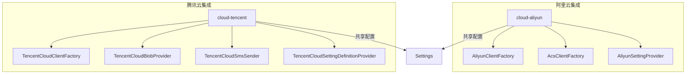
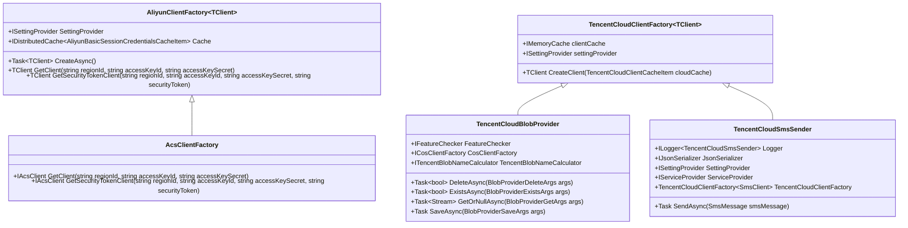
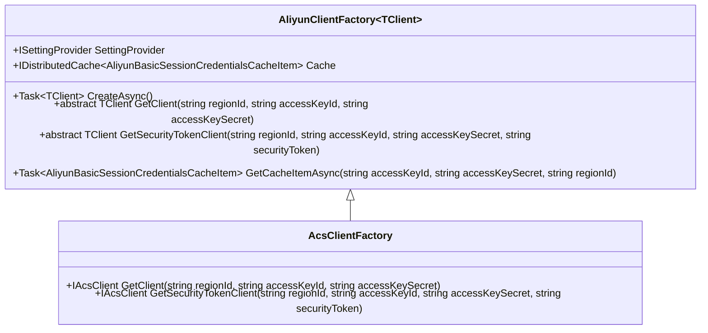
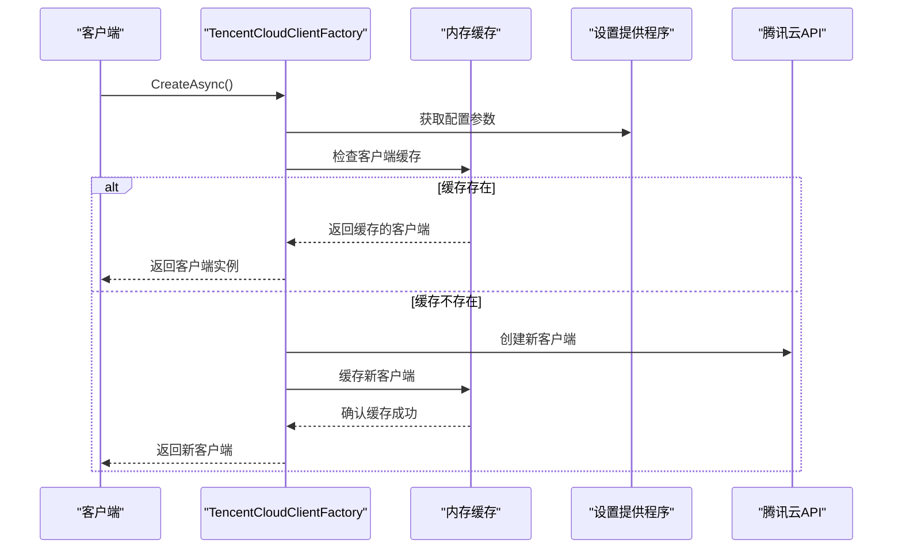
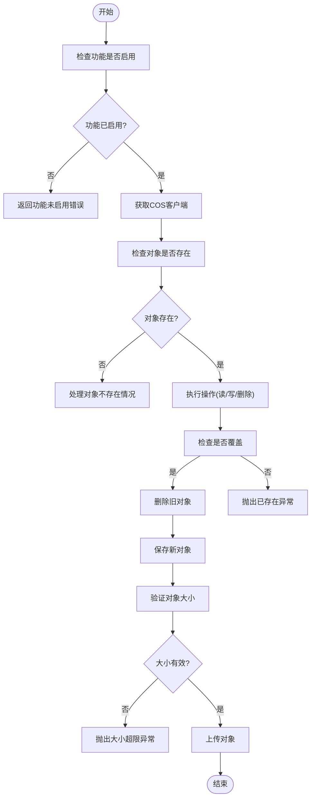
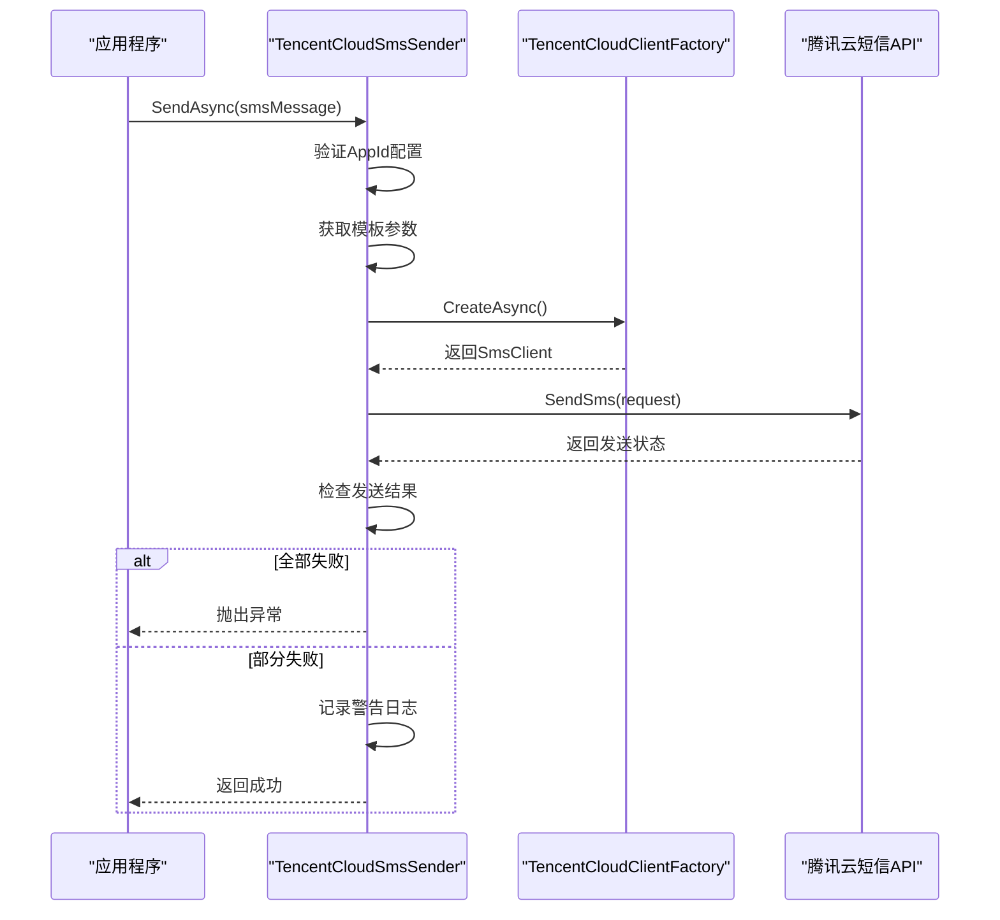
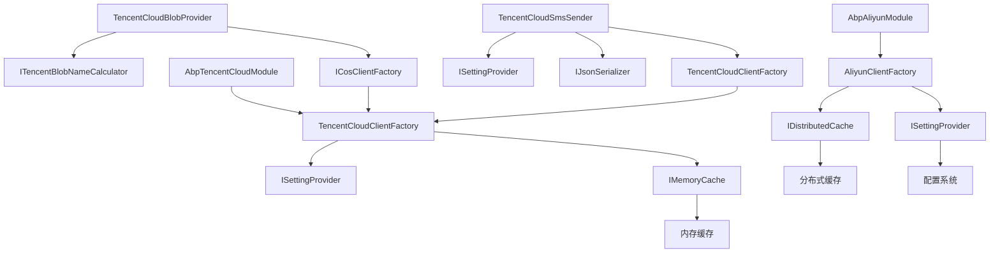

# 云服务集成

<cite>
**本文档引用的文件**
- [AliyunClientFactory.cs](file://aspnet-core/framework/cloud-aliyun/LINGYUN.Abp.Aliyun/LINGYUN/Abp/Aliyun/AliyunClientFactory.cs)
- [AcsClientFactory.cs](file://aspnet-core/framework/cloud-aliyun/LINGYUN.Abp.Aliyun/LINGYUN/Abp/Aliyun/AcsClientFactory.cs)
- [TencentCloudClientFactory.cs](file://aspnet-core/framework/cloud-tencent/LINGYUN.Abp.Tencent/LINGYUN/Abp/Tencent/TencentCloudClientFactory.cs)
- [TencentCloudBlobProvider.cs](file://aspnet-core/framework/cloud-tencent/LINGYUN.Abp.BlobStoring.Tencent/LINGYUN/Abp/BlobStoring/Tencent/TencentCloudBlobProvider.cs)
- [TencentCloudSmsSender.cs](file://aspnet-core/framework/cloud-tencent/LINGYUN.Abp.Sms.Tencent/LINGYUN/Abp/Sms/Tencent/TencentCloudSmsSender.cs)
- [AliyunSettingProvider.cs](file://aspnet-core/framework/cloud-aliyun/LINGYUN.Abp.Aliyun/LINGYUN/Abp/Aliyun/Settings/AliyunSettingProvider.cs)
- [TencentCloudSettingDefinitionProvider.cs](file://aspnet-core/framework/cloud-tencent/LINGYUN.Abp.Tencent/LINGYUN/Abp/Tencent/Settings/TencentCloudSettingDefinitionProvider.cs)
- [AbpAliyunModule.cs](file://aspnet-core/framework/cloud-aliyun/LINGYUN.Abp.Aliyun/LINGYUN/Abp/Aliyun/AbpAliyunModule.cs)
- [AbpTencentCloudModule.cs](file://aspnet-core/framework/cloud-tencent/LINGYUN.Abp.Tencent/LINGYUN/Abp/Tencent/AbpTencentCloudModule.cs)
</cite>

## 目录
1. [简介](#简介)
2. [项目结构](#项目结构)
3. [核心组件](#核心组件)
4. [架构概述](#架构概述)
5. [详细组件分析](#详细组件分析)
6. [依赖分析](#依赖分析)
7. [性能考虑](#性能考虑)
8. [故障排除指南](#故障排除指南)
9. [结论](#结论)

## 简介
本文档详细介绍了如何将阿里云和腾讯云服务集成到ABP框架平台中。文档重点阐述了云服务认证、配置管理、功能特性集成的具体实现方式，包括云服务SDK的初始化、服务客户端的获取、配置参数的设置以及异常处理机制。同时提供了与云服务交互的最佳实践，如连接池管理、超时设置、重试策略等，并包含实际代码示例展示如何调用云服务API完成常见任务。

## 项目结构
项目结构清晰地将阿里云和腾讯云服务集成模块分离，便于维护和扩展。阿里云相关功能位于`cloud-aliyun`目录下，而腾讯云相关功能位于`cloud-tencent`目录下。

**图示来源**
- [AliyunClientFactory.cs](file://aspnet-core/framework/cloud-aliyun/LINGYUN.Abp.Aliyun/LINGYUN/Abp/Aliyun/AliyunClientFactory.cs)
- [TencentCloudClientFactory.cs](file://aspnet-core/framework/cloud-tencent/LINGYUN.Abp.Tencent/LINGYUN/Abp/Tencent/TencentCloudClientFactory.cs)

**本节来源**
- [AliyunClientFactory.cs](file://aspnet-core/framework/cloud-aliyun/LINGYUN.Abp.Aliyun/LINGYUN/Abp/Aliyun/AliyunClientFactory.cs)
- [TencentCloudClientFactory.cs](file://aspnet-core/framework/cloud-tencent/LINGYUN.Abp.Tencent/LINGYUN/Abp/Tencent/TencentCloudClientFactory.cs)

## 核心组件
本系统的核心组件包括阿里云客户端工厂、腾讯云客户端工厂、对象存储提供程序、短信发送器以及相应的配置管理器。这些组件共同构成了云服务集成的基础架构。

**本节来源**
- [AliyunClientFactory.cs](file://aspnet-core/framework/cloud-aliyun/LINGYUN.Abp.Aliyun/LINGYUN/Abp/Aliyun/AliyunClientFactory.cs)
- [TencentCloudClientFactory.cs](file://aspnet-core/framework/cloud-tencent/LINGYUN.Abp.Tencent/LINGYUN/Abp/Tencent/TencentCloudClientFactory.cs)
- [TencentCloudBlobProvider.cs](file://aspnet-core/framework/cloud-tencent/LINGYUN.Abp.BlobStoring.Tencent/LINGYUN/Abp/BlobStoring/Tencent/TencentCloudBlobProvider.cs)
- [TencentCloudSmsSender.cs](file://aspnet-core/framework/cloud-tencent/LINGYUN.Abp.Sms.Tencent/LINGYUN/Abp/Sms/Tencent/TencentCloudSmsSender.cs)

## 架构概述
系统采用模块化设计，通过抽象工厂模式实现云服务客户端的创建和管理。配置通过ABP框架的设置系统进行管理，支持多层级配置覆盖。

**图示来源**
- [AliyunClientFactory.cs](file://aspnet-core/framework/cloud-aliyun/LINGYUN.Abp.Aliyun/LINGYUN/Abp/Aliyun/AliyunClientFactory.cs)
- [AcsClientFactory.cs](file://aspnet-core/framework/cloud-aliyun/LINGYUN.Abp.Aliyun/LINGYUN/Abp/Aliyun/AcsClientFactory.cs)
- [TencentCloudClientFactory.cs](file://aspnet-core/framework/cloud-tencent/LINGYUN.Abp.Tencent/LINGYUN/Abp/Tencent/TencentCloudClientFactory.cs)
- [TencentCloudBlobProvider.cs](file://aspnet-core/framework/cloud-tencent/LINGYUN.Abp.BlobStoring.Tencent/LINGYUN/Abp/BlobStoring/Tencent/TencentCloudBlobProvider.cs)
- [TencentCloudSmsSender.cs](file://aspnet-core/framework/cloud-tencent/LINGYUN.Abp.Sms.Tencent/LINGYUN/Abp/Sms/Tencent/TencentCloudSmsSender.cs)

## 详细组件分析

### 阿里云客户端工厂分析
阿里云客户端工厂提供了创建阿里云服务客户端的通用机制，支持标准认证和安全令牌服务(STS)两种模式。

#### 阿里云客户端工厂类图

**图示来源**
- [AliyunClientFactory.cs](file://aspnet-core/framework/cloud-aliyun/LINGYUN.Abp.Aliyun/LINGYUN/Abp/Aliyun/AliyunClientFactory.cs)
- [AcsClientFactory.cs](file://aspnet-core/framework/cloud-aliyun/LINGYUN.Abp.Aliyun/LINGYUN/Abp/Aliyun/AcsClientFactory.cs)

**本节来源**
- [AliyunClientFactory.cs](file://aspnet-core/framework/cloud-aliyun/LINGYUN.Abp.Aliyun/LINGYUN/Abp/Aliyun/AliyunClientFactory.cs)
- [AcsClientFactory.cs](file://aspnet-core/framework/cloud-aliyun/LINGYUN.Abp.Aliyun/LINGYUN/Abp/Aliyun/AcsClientFactory.cs)

### 腾讯云客户端工厂分析
腾讯云客户端工厂使用反射机制动态创建腾讯云服务客户端，提供了灵活的客户端创建方式。

#### 腾讯云客户端工厂序列图

**图示来源**
- [TencentCloudClientFactory.cs](file://aspnet-core/framework/cloud-tencent/LINGYUN.Abp.Tencent/LINGYUN/Abp/Tencent/TencentCloudClientFactory.cs)

**本节来源**
- [TencentCloudClientFactory.cs](file://aspnet-core/framework/cloud-tencent/LINGYUN.Abp.Tencent/LINGYUN/Abp/Tencent/TencentCloudClientFactory.cs)

### 对象存储服务分析
腾讯云对象存储提供程序实现了ABP框架的Blob存储接口，提供了完整的对象存储操作功能。

#### 对象存储服务流程图

**图示来源**
- [TencentCloudBlobProvider.cs](file://aspnet-core/framework/cloud-tencent/LINGYUN.Abp.BlobStoring.Tencent/LINGYUN/Abp/BlobStoring/Tencent/TencentCloudBlobProvider.cs)

**本节来源**
- [TencentCloudBlobProvider.cs](file://aspnet-core/framework/cloud-tencent/LINGYUN.Abp.BlobStoring.Tencent/LINGYUN/Abp/BlobStoring/Tencent/TencentCloudBlobProvider.cs)

### 短信服务分析
腾讯云短信发送器实现了ABP框架的短信发送接口，提供了完整的短信发送功能。

#### 短信服务序列图

**图示来源**
- [TencentCloudSmsSender.cs](file://aspnet-core/framework/cloud-tencent/LINGYUN.Abp.Sms.Tencent/LINGYUN/Abp/Sms/Tencent/TencentCloudSmsSender.cs)

**本节来源**
- [TencentCloudSmsSender.cs](file://aspnet-core/framework/cloud-tencent/LINGYUN.Abp.Sms.Tencent/LINGYUN/Abp/Sms/Tencent/TencentCloudSmsSender.cs)

## 依赖分析
系统依赖关系清晰，各组件通过接口进行通信，降低了耦合度。

**图示来源**
- [AbpAliyunModule.cs](file://aspnet-core/framework/cloud-aliyun/LINGYUN.Abp.Aliyun/LINGYUN/Abp/Aliyun/AbpAliyunModule.cs)
- [AbpTencentCloudModule.cs](file://aspnet-core/framework/cloud-tencent/LINGYUN.Abp.Tencent/LINGYUN/Abp/Tencent/AbpTencentCloudModule.cs)
- [AliyunClientFactory.cs](file://aspnet-core/framework/cloud-aliyun/LINGYUN.Abp.Aliyun/LINGYUN/Abp/Aliyun/AliyunClientFactory.cs)
- [TencentCloudClientFactory.cs](file://aspnet-core/framework/cloud-tencent/LINGYUN.Abp.Tencent/LINGYUN/Abp/Tencent/TencentCloudClientFactory.cs)

**本节来源**
- [AbpAliyunModule.cs](file://aspnet-core/framework/cloud-aliyun/LINGYUN.Abp.Aliyun/LINGYUN/Abp/Aliyun/AbpAliyunModule.cs)
- [AbpTencentCloudModule.cs](file://aspnet-core/framework/cloud-tencent/LINGYUN.Abp.Tencent/LINGYUN/Abp/Tencent/AbpTencentCloudModule.cs)

## 性能考虑
在云服务集成中，性能优化是关键考虑因素。系统通过多种机制来提高性能：

1. **客户端缓存**：腾讯云客户端工厂使用内存缓存来避免重复创建客户端实例，减少初始化开销。
2. **凭证缓存**：阿里云客户端工厂使用分布式缓存来存储STS安全令牌，避免频繁请求新的安全令牌。
3. **连接复用**：通过客户端工厂模式，实现了客户端实例的复用，减少了网络连接的建立和断开开销。
4. **异