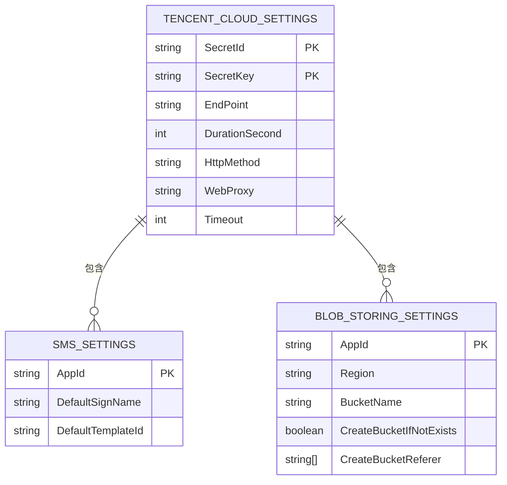

# 腾讯云集成

<cite>
**本文档引用的文件**
- [AbpTencentCloudModule.cs](file://aspnet-core\framework\cloud-tencent\LINGYUN.Abp.Tencent\LINGYUN\Abp\Tencent\AbpTencentCloudModule.cs)
- [AbpTencentCloudOptions.cs](file://aspnet-core\framework\cloud-tencent\LINGYUN.Abp.Tencent\LINGYUN\Abp\Tencent\AbpTencentCloudOptions.cs)
- [TencentCloudClientFactory.cs](file://aspnet-core\framework\cloud-tencent\LINGYUN.Abp.Tencent\LINGYUN\Abp\Tencent\TencentCloudClientFactory.cs)
- [AbstractTencentCloudClientFactory.cs](file://aspnet-core\framework\cloud-tencent\LINGYUN.Abp.Tencent\LINGYUN\Abp\Tencent\AbstractTencentCloudClientFactory.cs)
- [TencentCloudClientCacheItem.cs](file://aspnet-core\framework\cloud-tencent\LINGYUN.Abp.Tencent\LINGYUN\Abp\Tencent\TencentCloudClientCacheItem.cs)
- [TencentCloudSettingNames.cs](file://aspnet-core\framework\cloud-tencent\LINGYUN.Abp.Tencent\LINGYUN\Abp\Tencent\Settings\TencentCloudSettingNames.cs)
- [TencentCloudSmsSender.cs](file://aspnet-core\framework\cloud-tencent\LINGYUN.Abp.Sms.Tencent\LINGYUN\Abp\Sms\Tencent\TencentCloudSmsSender.cs)
- [TencentCloudBlobProvider.cs](file://aspnet-core\framework\cloud-tencent\LINGYUN.Abp.BlobStoring.Tencent\LINGYUN\Abp\BlobStoring\Tencent\TencentCloudBlobProvider.cs)
- [CosClientFactory.cs](file://aspnet-core\framework\cloud-tencent\LINGYUN.Abp.BlobStoring.Tencent\LINGYUN\Abp\BlobStoring\Tencent\CosClientFactory.cs)
- [ICosClientFactory.cs](file://aspnet-core\framework\cloud-tencent\LINGYUN.Abp.BlobStoring.Tencent\LINGYUN\Abp\BlobStoring\Tencent\ICosClientFactory.cs)
</cite>

## 目录
1. [简介](#简介)
2. [项目结构](#项目结构)
3. [核心组件](#核心组件)
4. [架构概述](#架构概述)
5. [详细组件分析](#详细组件分析)
6. [依赖分析](#依赖分析)
7. [性能考虑](#性能考虑)
8. [故障排除指南](#故障排除指南)
9. [结论](#结论)

## 简介
本文档详细介绍了如何将腾讯云服务集成到ABP框架中，重点涵盖腾讯云认证机制、短信服务、对象存储、语音合成(TTS)等服务的具体实现方式。文档详细说明了腾讯云SDK的初始化配置、服务客户端的获取方法、配置参数的设置以及异常处理机制，并提供了与腾讯云服务交互的最佳实践，如连接池管理、超时设置、重试策略等。

## 项目结构
本项目中的腾讯云集成模块位于`aspnet-core/framework/cloud-tencent`目录下，包含多个子模块，分别处理不同的腾讯云服务。主要模块包括：
- `LINGYUN.Abp.Tencent`：腾讯云服务基础模块，为其他腾讯云服务模块提供基础设施支持
- `LINGYUN.Abp.Sms.Tencent`：腾讯云短信服务模块
- `LINGYUN.Abp.BlobStoring.Tencent`：腾讯云对象存储（COS）模块
- `LINGYUN.Abp.Tencent.TTS`：腾讯云语音合成服务模块
- `LINGYUN.Abp.Tencent.QQ`：腾讯QQ认证模块
- `LINGYUN.Abp.Tencent.SettingManagement`：腾讯云设置管理模块

**图示来源**
- [README.md](file://aspnet-core\framework\cloud-tencent\README.md)

## 核心组件
腾讯云集成的核心组件主要包括腾讯云基础模块、短信服务模块和对象存储模块。基础模块提供了腾讯云SDK客户端工厂，支持动态创建腾讯云各项服务的客户端，同时支持多租户配置和统一的腾讯云服务配置管理。短信服务模块实现了腾讯云短信服务的发送功能，支持多手机号批量发送和短信模板参数传递。对象存储模块集成了腾讯云对象存储服务到ABP BlobStoring系统，支持自动创建存储桶和存储桶防盗链配置。

**本节来源**
- [AbpTencentCloudModule.cs](file://aspnet-core\framework\cloud-tencent\LINGYUN.Abp.Tencent\LINGYUN\Abp\Tencent\AbpTencentCloudModule.cs)
- [TencentCloudSmsSender.cs](file://aspnet-core\framework\cloud-tencent\LINGYUN.Abp.Sms.Tencent\LINGYUN\Abp\Sms\Tencent\TencentCloudSmsSender.cs)
- [TencentCloudBlobProvider.cs](file://aspnet-core\framework\cloud-tencent\LINGYUN.Abp.BlobStoring.Tencent\LINGYUN\Abp\BlobStoring\Tencent\TencentCloudBlobProvider.cs)

## 架构概述
腾讯云集成的架构设计遵循ABP框架的模块化原则，通过依赖注入和配置系统实现服务的灵活集成。基础模块`Abp.Tencent`提供了腾讯云服务的通用基础设施，包括客户端工厂、配置管理和特性管理。其他服务模块如短信服务和对象存储服务依赖于基础模块，通过继承和扩展实现具体功能。

**图示来源**
- [AbpTencentCloudModule.cs](file://aspnet-core\framework\cloud-tencent\LINGYUN.Abp.Tencent\LINGYUN\Abp\Tencent\AbpTencentCloudModule.cs)
- [TencentCloudClientFactory.cs](file://aspnet-core\framework\cloud-tencent\LINGYUN.Abp.Tencent\LINGYUN\Abp\Tencent\TencentCloudClientFactory.cs)
- [TencentCloudSmsSender.cs](file://aspnet-core\framework\cloud-tencent\LINGYUN.Abp.Sms.Tencent\LINGYUN\Abp\Sms\Tencent\TencentCloudSmsSender.cs)
- [TencentCloudBlobProvider.cs](file://aspnet-core\framework\cloud-tencent\LINGYUN.Abp.BlobStoring.Tencent\LINGYUN\Abp\BlobStoring\Tencent\TencentCloudBlobProvider.cs)

## 详细组件分析

### 腾讯云基础模块分析
腾讯云基础模块`Abp.Tencent`为其他腾讯云服务模块提供基础设施支持，主要包括客户端工厂、配置管理和特性管理功能。

#### 客户端工厂
客户端工厂`TencentCloudClientFactory<TClient>`负责创建腾讯云各项服务的客户端实例。它通过反射机制动态创建客户端，支持缓存以提高性能。

**图示来源**
- [TencentCloudClientFactory.cs](file://aspnet-core\framework\cloud-tencent\LINGYUN.Abp.Tencent\LINGYUN\Abp\Tencent\TencentCloudClientFactory.cs)
- [AbstractTencentCloudClientFactory.cs](file://aspnet-core\framework\cloud-tencent\LINGYUN.Abp.Tencent\LINGYUN\Abp\Tencent\AbstractTencentCloudClientFactory.cs)

#### 配置管理
配置管理通过`TencentCloudSettingNames`类定义了所有腾讯云服务的配置项，包括基础配置和连接配置。

**图示来源**
- [TencentCloudSettingNames.cs](file://aspnet-core\framework\cloud-tencent\LINGYUN.Abp.Tencent\LINGYUN\Abp\Tencent\Settings\TencentCloudSettingNames.cs)

### 短信服务模块分析
短信服务模块`Abp.Sms.Tencent`实现了腾讯云短信服务的发送功能，通过`TencentCloudSmsSender`类提供具体的发送逻辑。

#### 短信发送流程

**图示来源**
- [TencentCloudSmsSender.cs](file://aspnet-core\framework\cloud-tencent\LINGYUN.Abp.Sms.Tencent\LINGYUN\Abp\Sms\Tencent\TencentCloudSmsSender.cs)

### 对象存储模块分析
对象存储模块`Abp.BlobStoring.Tencent`集成了腾讯云对象存储服务到ABP BlobStoring系统，通过`TencentCloudBlobProvider`类提供具体的存储操作。

#### 存储操作流程

**图示来源**
- [TencentCloudBlobProvider.cs](file://aspnet-core\framework\cloud-tencent\LINGYUN.Abp.BlobStoring.Tencent\LINGYUN\Abp\BlobStoring\Tencent\TencentCloudBlobProvider.cs)
- [CosClientFactory.cs](file://aspnet-core\framework\cloud-tencent\LINGYUN.Abp.BlobStoring.Tencent\LINGYUN\Abp\BlobStoring\Tencent\CosClientFactory.cs)

## 依赖分析
腾讯云集成模块的依赖关系清晰，遵循了良好的分层架构设计。基础模块`Abp.Tencent`作为核心依赖，被其他所有腾讯云服务模块所依赖。各服务模块之间相互独立，通过基础模块提供的通用功能实现各自的服务集成。

**图示来源**
- [AbpTencentCloudModule.cs](file://aspnet-core\framework\cloud-tencent\LINGYUN.Abp.Tencent\LINGYUN\Abp\Tencent\AbpTencentCloudModule.cs)

## 性能考虑
在腾讯云服务集成中，性能优化主要体现在以下几个方面：

1. **客户端缓存**：通过`IMemoryCache`缓存腾讯云客户端实例，避免频繁创建和销毁客户端