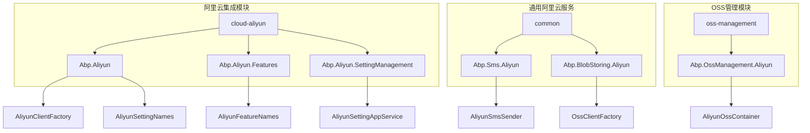
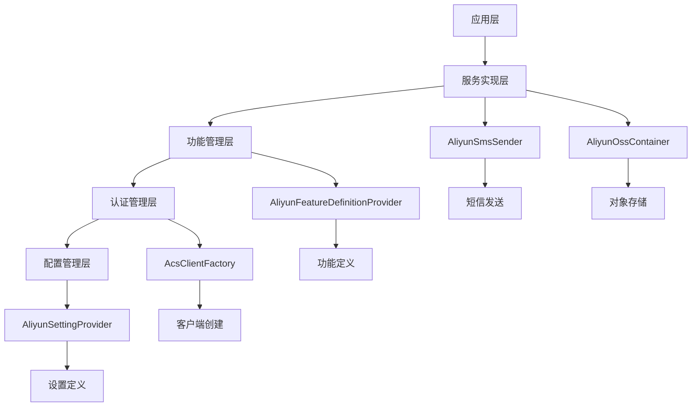
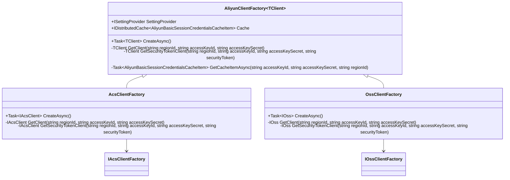
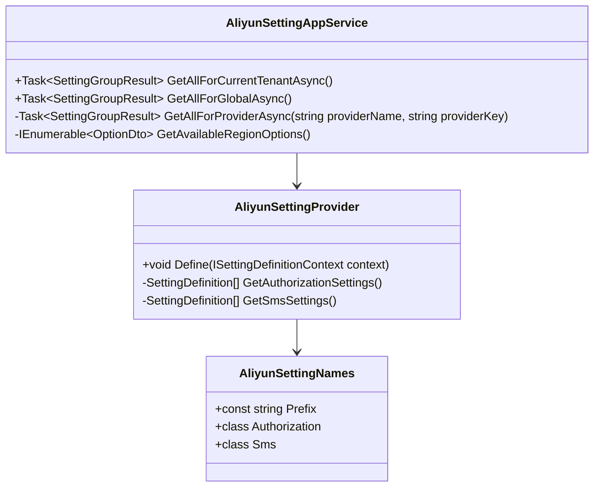
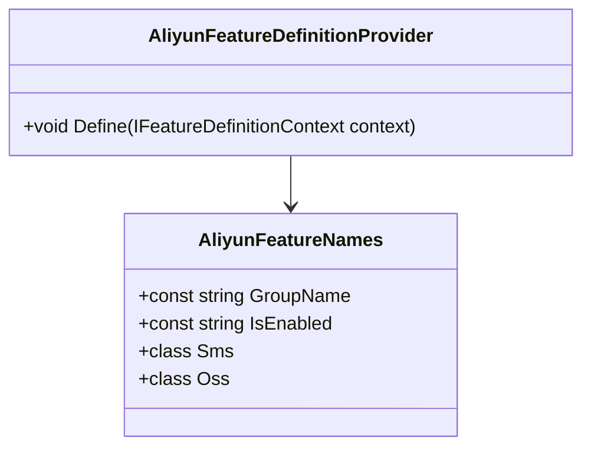
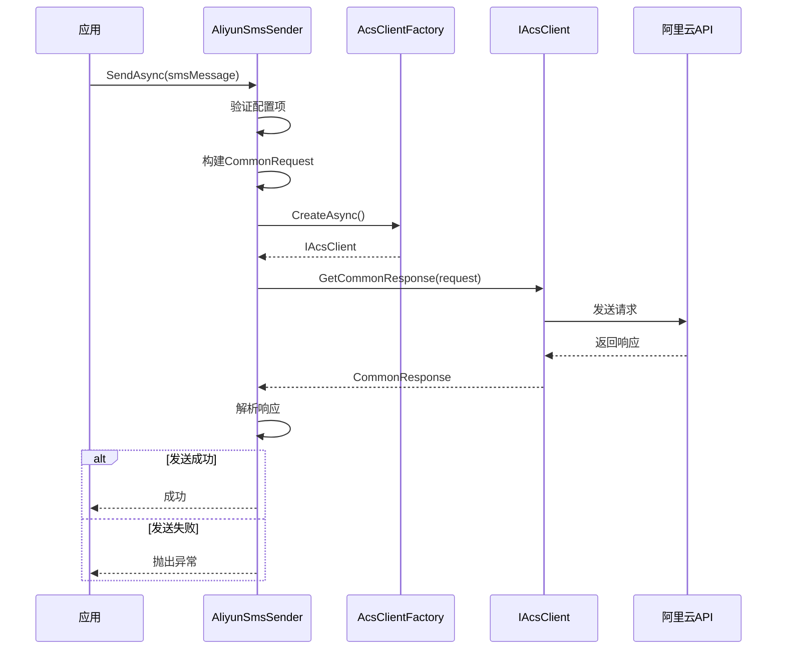

# 阿里云集成

<cite>
**本文档引用的文件**  
- [AliyunClientFactory.cs](file://aspnet-core/framework/cloud-aliyun/LINGYUN.Abp.Aliyun/LINGYUN/Abp/Aliyun/AliyunClientFactory.cs)
- [AcsClientFactory.cs](file://aspnet-core/framework/cloud-aliyun/LINGYUN.Abp.Aliyun/LINGYUN/Abp/Aliyun/AcsClientFactory.cs)
- [AliyunSettingNames.cs](file://aspnet-core/framework/cloud-aliyun/LINGYUN.Abp.Aliyun/LINGYUN/Abp/Aliyun/Settings/AliyunSettingNames.cs)
- [AliyunSettingProvider.cs](file://aspnet-core/framework/cloud-aliyun/LINGYUN.Abp.Aliyun/LINGYUN/Abp/Aliyun/Settings/AliyunSettingProvider.cs)
- [AliyunFeatureNames.cs](file://aspnet-core/framework/cloud-aliyun/LINGYUN.Abp.Aliyun.Features/LINGYUN/Abp/Aliyun/Features/AliyunFeatureNames.cs)
- [AliyunFeatureDefinitionProvider.cs](file://aspnet-core/framework/cloud-aliyun/LINGYUN.Abp.Aliyun.Features/LINGYUN/Abp/Aliyun/Features/AliyunFeatureDefinitionProvider.cs)
- [AliyunSettingAppService.cs](file://aspnet-core/framework/cloud-aliyun/LINGYUN.Abp.Aliyun.SettingManagement/LINGYUN/Abp/Aliyun/SettingManagement/AliyunSettingAppService.cs)
- [AbpAliyunModule.cs](file://aspnet-core/framework/cloud-aliyun/LINGYUN.Abp.Aliyun/LINGYUN/Abp/Aliyun/AbpAliyunModule.cs)
- [AliyunSmsSender.cs](file://aspnet-core/framework/common/LINGYUN.Abp.Sms.Aliyun/LINGYUN/Abp/Sms/Aliyun/AliyunSmsSender.cs)
- [AliyunSmsResponse.cs](file://aspnet-core/framework/common/LINGYUN.Abp.Sms.Aliyun/LINGYUN/Abp/Sms/Aliyun/AliyunSmsResponse.cs)
- [AliyunOssContainer.cs](file://aspnet-core/modules/oss-management/LINGYUN.Abp.OssManagement.Aliyun/LINGYUN/Abp/OssManagement/Aliyun/AliyunOssContainer.cs)
- [OssClientFactory.cs](file://aspnet-core/framework/common/LINGYUN.Abp.BlobStoring.Aliyun/LINGYUN/Abp/BlobStoring/Aliyun/OssClientFactory.cs)
- [AbpAliyunException.cs](file://aspnet-core/framework/cloud-aliyun/LINGYUN.Abp.Aliyun/LINGYUN/Abp/Aliyun/AbpAliyunException.cs)
- [AbpAliyunOptions.cs](file://aspnet-core/framework/common/LINGYUN.Abp.Aliyun.Authorization/LINGYUN/Abp/Aliyun/Authorization/AbpAliyunOptions.cs)
</cite>

## 目录
1. [简介](#简介)
2. [项目结构](#项目结构)
3. [核心组件](#核心组件)
4. [架构概述](#架构概述)
5. [详细组件分析](#详细组件分析)
6. [依赖分析](#依赖分析)
7. [性能考虑](#性能考虑)
8. [故障排除指南](#故障排除指南)
9. [结论](#结论)

## 简介
本文档详细介绍了如何将阿里云服务集成到ABP框架中，重点涵盖阿里云认证机制、功能特性管理、设置管理的具体实现方式。文档包括阿里云SDK的初始化配置、服务客户端的获取方法、功能开关的控制以及配置参数的动态管理。同时提供与阿里云服务交互的最佳实践，如连接池管理、超时设置、重试策略等。通过实际代码示例展示如何调用阿里云API完成对象存储、短信服务等常见任务，并说明集成过程中的安全考虑和性能优化建议。

## 项目结构
项目结构中与阿里云集成相关的模块主要位于`aspnet-core/framework/cloud-aliyun`目录下，包含核心的阿里云服务集成组件。此外，`aspnet-core/framework/common`目录下包含通用的阿里云服务实现，如短信服务和对象存储服务。`aspnet-core/modules/oss-management`模块提供了对阿里云OSS的管理功能。

**图示来源**
- [AliyunClientFactory.cs](file://aspnet-core/framework/cloud-aliyun/LINGYUN.Abp.Aliyun/LINGYUN/Abp/Aliyun/AliyunClientFactory.cs)
- [AliyunSettingNames.cs](file://aspnet-core/framework/cloud-aliyun/LINGYUN.Abp.Aliyun/LINGYUN/Abp/Aliyun/Settings/AliyunSettingNames.cs)
- [AliyunFeatureNames.cs](file://aspnet-core/framework/cloud-aliyun/LINGYUN.Abp.Aliyun.Features/LINGYUN/Abp/Aliyun/Features/AliyunFeatureNames.cs)
- [AliyunSettingAppService.cs](file://aspnet-core/framework/cloud-aliyun/LINGYUN.Abp.Aliyun.SettingManagement/LINGYUN/Abp/Aliyun/SettingManagement/AliyunSettingAppService.cs)
- [AliyunSmsSender.cs](file://aspnet-core/framework/common/LINGYUN.Abp.Sms.Aliyun/LINGYUN/Abp/Sms/Aliyun/AliyunSmsSender.cs)
- [OssClientFactory.cs](file://aspnet-core/framework/common/LINGYUN.Abp.BlobStoring.Aliyun/LINGYUN/Abp/BlobStoring/Aliyun/OssClientFactory.cs)
- [AliyunOssContainer.cs](file://aspnet-core/modules/oss-management/LINGYUN.Abp.OssManagement.Aliyun/LINGYUN/Abp/OssManagement/Aliyun/AliyunOssContainer.cs)

**章节来源**
- [AliyunClientFactory.cs](file://aspnet-core/framework/cloud-aliyun/LINGYUN.Abp.Aliyun/LINGYUN/Abp/Aliyun/AliyunClientFactory.cs)
- [AliyunSettingNames.cs](file://aspnet-core/framework/cloud-aliyun/LINGYUN.Abp.Aliyun/LINGYUN/Abp/Aliyun/Settings/AliyunSettingNames.cs)
- [AliyunFeatureNames.cs](file://aspnet-core/framework/cloud-aliyun/LINGYUN.Abp.Aliyun.Features/LINGYUN/Abp/Aliyun/Features/AliyunFeatureNames.cs)

## 核心组件
阿里云集成的核心组件包括阿里云客户端工厂、设置管理、功能特性管理和具体服务实现。这些组件共同构成了ABP框架与阿里云服务之间的桥梁，提供了统一的配置管理、认证机制和功能开关控制。

**章节来源**
- [AliyunClientFactory.cs](file://aspnet-core/framework/cloud-aliyun/LINGYUN.Abp.Aliyun/LINGYUN/Abp/Aliyun/AliyunClientFactory.cs)
- [AliyunSettingNames.cs](file://aspnet-core/framework/cloud-aliyun/LINGYUN.Abp.Aliyun/LINGYUN/Abp/Aliyun/Settings/AliyunSettingNames.cs)
- [AliyunFeatureNames.cs](file://aspnet-core/framework/cloud-aliyun/LINGYUN.Abp.Aliyun.Features/LINGYUN/Abp/Aliyun/Features/AliyunFeatureNames.cs)

## 架构概述
阿里云集成的架构设计遵循ABP框架的模块化原则，通过分层设计实现了配置管理、认证机制、功能开关和具体服务实现的分离。整体架构分为四个主要层次：配置管理层、认证管理层、功能管理层和具体服务实现层。

**图示来源**
- [AliyunSettingProvider.cs](file://aspnet-core/framework/cloud-aliyun/LINGYUN.Abp.Aliyun/LINGYUN/Abp/Aliyun/Settings/AliyunSettingProvider.cs)
- [AcsClientFactory.cs](file://aspnet-core/framework/cloud-aliyun/LINGYUN.Abp.Aliyun/LINGYUN/Abp/Aliyun/AcsClientFactory.cs)
- [AliyunFeatureDefinitionProvider.cs](file://aspnet-core/framework/cloud-aliyun/LINGYUN.Abp.Aliyun.Features/LINGYUN/Abp/Aliyun/Features/AliyunFeatureDefinitionProvider.cs)
- [AliyunSmsSender.cs](file://aspnet-core/framework/common/LINGYUN.Abp.Sms.Aliyun/LINGYUN/Abp/Sms/Aliyun/AliyunSmsSender.cs)
- [AliyunOssContainer.cs](file://aspnet-core/modules/oss-management/LINGYUN.Abp.OssManagement.Aliyun/LINGYUN/Abp/OssManagement/Aliyun/AliyunOssContainer.cs)

## 详细组件分析

### 阿里云客户端工厂分析
阿里云客户端工厂是整个集成架构的核心，负责创建和管理阿里云服务客户端实例。工厂通过抽象基类`AliyunClientFactory<TClient>`提供通用的客户端创建逻辑，支持普通认证和STS安全令牌认证两种模式。

**图示来源**
- [AliyunClientFactory.cs](file://aspnet-core/framework/cloud-aliyun/LINGYUN.Abp.Aliyun/LINGYUN/Abp/Aliyun/AliyunClientFactory.cs)
- [AcsClientFactory.cs](file://aspnet-core/framework/cloud-aliyun/LINGYUN.Abp.Aliyun/LINGYUN/Abp/Aliyun/AcsClientFactory.cs)
- [OssClientFactory.cs](file://aspnet-core/framework/common/LINGYUN.Abp.BlobStoring.Aliyun/LINGYUN/Abp/BlobStoring/Aliyun/OssClientFactory.cs)

**章节来源**
- [AliyunClientFactory.cs](file://aspnet-core/framework/cloud-aliyun/LINGYUN.Abp.Aliyun/LINGYUN/Abp/Aliyun/AliyunClientFactory.cs)
- [AcsClientFactory.cs](file://aspnet-core/framework/cloud-aliyun/LINGYUN.Abp.Aliyun/LINGYUN/Abp/Aliyun/AcsClientFactory.cs)
- [OssClientFactory.cs](file://aspnet-core/framework/common/LINGYUN.Abp.BlobStoring.Aliyun/LINGYUN/Abp/BlobStoring/Aliyun/OssClientFactory.cs)

### 配置管理分析
配置管理组件负责定义和管理阿里云服务的所有配置项，包括认证信息、服务域名、版本号等。通过`AliyunSettingNames`类定义所有配置项的常量，`AliyunSettingProvider`类负责注册这些配置项并提供默认值。

**图示来源**
- [AliyunSettingNames.cs](file://aspnet-core/framework/cloud-aliyun/LINGYUN.Abp.Aliyun/LINGYUN/Abp/Aliyun/Settings/AliyunSettingNames.cs)
- [AliyunSettingProvider.cs](file://aspnet-core/framework/cloud-aliyun/LINGYUN.Abp.Aliyun/LINGYUN/Abp/Aliyun/Settings/AliyunSettingProvider.cs)
- [AliyunSettingAppService.cs](file://aspnet-core/framework/cloud-aliyun/LINGYUN.Abp.Aliyun.SettingManagement/LINGYUN/Abp/Aliyun/SettingManagement/AliyunSettingAppService.cs)

**章节来源**
- [AliyunSettingNames.cs](file://aspnet-core/framework/cloud-aliyun/LINGYUN.Abp.Aliyun/LINGYUN/Abp/Aliyun/Settings/AliyunSettingNames.cs)
- [AliyunSettingProvider.cs](file://aspnet-core/framework/cloud-aliyun/LINGYUN.Abp.Aliyun/LINGYUN/Abp/Aliyun/Settings/AliyunSettingProvider.cs)
- [AliyunSettingAppService.cs](file://aspnet-core/framework/cloud-aliyun/LINGYUN.Abp.Aliyun.SettingManagement/LINGYUN/Abp/Aliyun/SettingManagement/AliyunSettingAppService.cs)

### 功能特性管理分析
功能特性管理组件通过ABP框架的特性系统实现对阿里云服务功能的开关控制。`AliyunFeatureNames`类定义了所有功能特性的名称，`AliyunFeatureDefinitionProvider`类负责注册这些特性并提供默认值。

**图示来源**
- [AliyunFeatureNames.cs](file://aspnet-core/framework/cloud-aliyun/LINGYUN.Abp.Aliyun.Features/LINGYUN/Abp/Aliyun/Features/AliyunFeatureNames.cs)
- [AliyunFeatureDefinitionProvider.cs](file://aspnet-core/framework/cloud-aliyun/LINGYUN.Abp.Aliyun.Features/LINGYUN/Abp/Aliyun/Features/AliyunFeatureDefinitionProvider.cs)

**章节来源**
- [AliyunFeatureNames.cs](file://aspnet-core/framework/cloud-aliyun/LINGYUN.Abp.Aliyun.Features/LINGYUN/Abp/Aliyun/Features/AliyunFeatureNames.cs)
- [AliyunFeatureDefinitionProvider.cs](file://aspnet-core/framework/cloud-aliyun/LINGYUN.Abp.Aliyun.Features/LINGYUN/Abp/Aliyun/Features/AliyunFeatureDefinitionProvider.cs)

### 短信服务实现分析
短信服务实现组件`AliyunSmsSender`负责通过阿里云API发送短信。该组件通过`IAcsClientFactory`获取阿里云客户端实例，使用`CommonRequest`调用阿里云短信服务API，并处理响应结果。

**图示来源**
- [AliyunSmsSender.cs](file://aspnet-core/framework/common/LINGYUN.Abp.Sms.Aliyun/LINGYUN/Abp/Sms/Aliyun/AliyunSmsSender.cs)
- [AcsClientFactory.cs](file://aspnet-core/framework/cloud-aliyun/LINGY