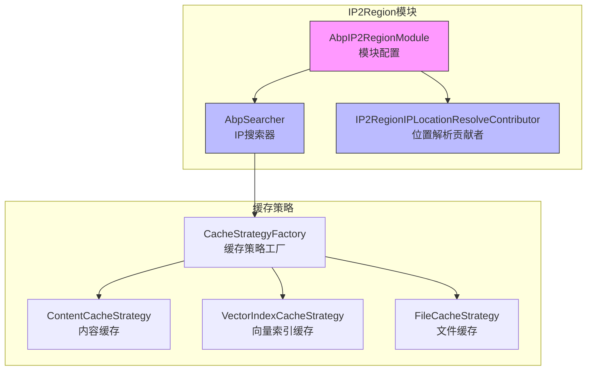
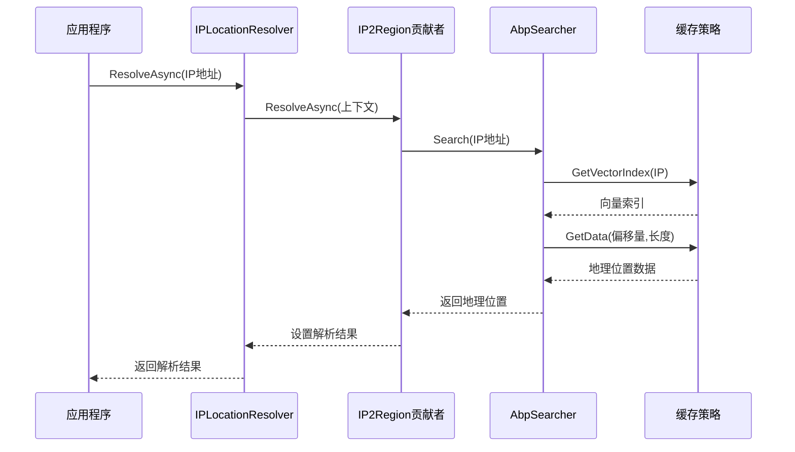
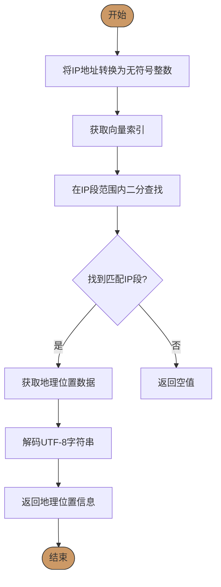
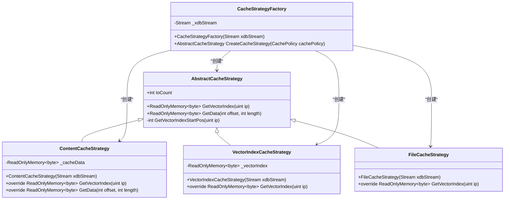
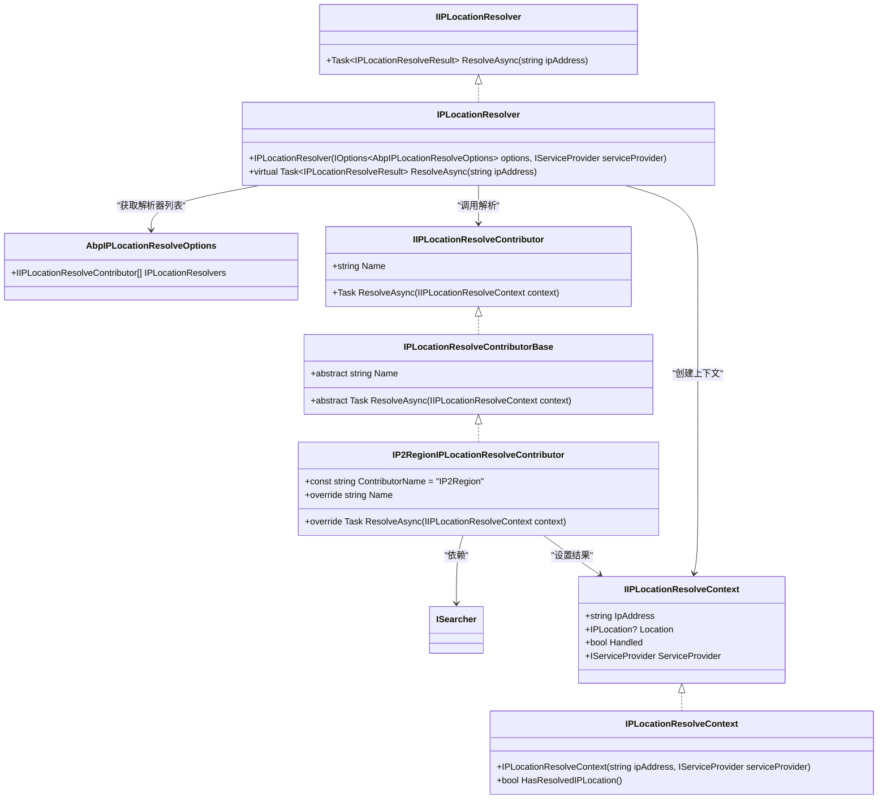
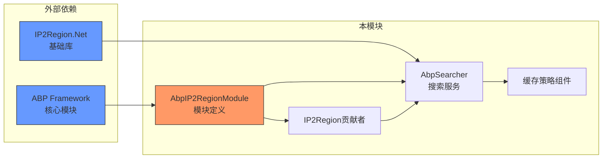

# IP地址定位

<cite>
**本文档中引用的文件**
- [AbpIP2RegionModule.cs](file://aspnet-core/framework/common/LINGYUN.Abp.IP2Region/LINGYUN/Abp/IP2Region/AbpIP2RegionModule.cs)
- [AbpSearcher.cs](file://aspnet-core/framework/common/LINGYUN.Abp.IP2Region/LINGYUN/Abp/IP2Region/AbpSearcher.cs)
- [IP2RegionIPLocationResolveContributor.cs](file://aspnet-core/framework/common/LINGYUN.Abp.IP2Region/LINGYUN/Abp/IP2Region/IP2RegionIPLocationResolveContributor.cs)
- [CacheStrategyFactory.cs](file://aspnet-core/framework/common/LINGYUN.Abp.IP2Region/IP2Region/Net/Internal/CacheStrategyFactory.cs)
- [AbstractCacheStrategy.cs](file://aspnet-core/framework/common/LINGYUN.Abp.IP2Region/IP2Region/Net/Internal/Abstractions/AbstractCacheStrategy.cs)
- [FileCacheStrategy.cs](file://aspnet-core/framework/common/LINGYUN.Abp.IP2Region/IP2Region/Net/Internal/FileCacheStrategy.cs)
- [ContentCacheStrategy.cs](file://aspnet-core/framework/common/LINGYUN.Abp.IP2Region/IP2Region/Net/Internal/ContentCacheStrategy.cs)
- [VectorIndexCacheStrategy.cs](file://aspnet-core/framework/common/LINGYUN.Abp.IP2Region/IP2Region/Net/Internal/VectorIndexCacheStrategy.cs)
- [AbpIPLocationResolveOptions.cs](file://aspnet-core/framework/common/LINGYUN.Abp.IP.Location/LINGYUN/Abp/IP/Location/AbpIPLocationResolveOptions.cs)
- [IPLocationResolver.cs](file://aspnet-core/framework/common/LINGYUN.Abp.IP.Location/LINGYUN/Abp/IP/Location/IPLocationResolver.cs)
- [SearcherTest.cs](file://aspnet-core/tests/LINGYUN.Abp.IP2Region.Tests/LINGYUN/Abp/IP2Region/SearcherTest.cs)
</cite>

## 目录
1. [介绍](#介绍)
2. [项目结构](#项目结构)
3. [核心组件](#核心组件)
4. [架构概述](#架构概述)
5. [详细组件分析](#详细组件分析)
6. [依赖分析](#依赖分析)
7. [性能考虑](#性能考虑)
8. [故障排除指南](#故障排除指南)
9. [结论](#结论)

## 介绍
`LINGYUN.Abp.IP2Region` 是一个基于IP2Region的ABP框架模块，提供离线IP地址查询功能。该模块集成了IP2Region.Net库，通过内置的IP数据库文件实现高效的IP地址到地理位置的转换。系统支持多种缓存策略，能够满足不同场景下的性能需求，并与ABP框架的虚拟文件系统集成，便于部署和维护。

## 项目结构
IP2Region模块位于`aspnet-core/framework/common/LINGYUN.Abp.IP2Region`目录下，包含核心搜索器、缓存策略实现和与ABP框架集成的组件。模块使用嵌入式资源方式包含IP2Region数据文件`ip2region.xdb`，并通过虚拟文件系统进行访问。



**Diagram sources**
- [AbpIP2RegionModule.cs](file://aspnet-core/framework/common/LINGYUN.Abp.IP2Region/LINGYUN/Abp/IP2Region/AbpIP2RegionModule.cs)
- [AbpSearcher.cs](file://aspnet-core/framework/common/LINGYUN.Abp.IP2Region/LINGYUN/Abp/IP2Region/AbpSearcher.cs)
- [CacheStrategyFactory.cs](file://aspnet-core/framework/common/LINGYUN.Abp.IP2Region/IP2Region/Net/Internal/CacheStrategyFactory.cs)

**Section sources**
- [AbpIP2RegionModule.cs](file://aspnet-core/framework/common/LINGYUN.Abp.IP2Region/LINGYUN/Abp/IP2Region/AbpIP2RegionModule.cs)
- [README.md](file://aspnet-core/framework/common/LINGYUN.Abp.IP2Region/README.md)

## 核心组件
IP2Region模块的核心组件包括IP搜索器(AbpSearcher)、多种缓存策略和与ABP框架的集成点。AbpSearcher实现了ISearcher接口，负责执行IP地址查询操作。模块提供了三种缓存策略：内容缓存、向量索引缓存和文件缓存，以平衡内存使用和查询性能。通过IP2RegionIPLocationResolveContributor，该模块与ABP的IP位置解析系统集成，作为地理位置解析的贡献者之一。

**Section sources**
- [AbpSearcher.cs](file://aspnet-core/framework/common/LINGYUN.Abp.IP2Region/LINGYUN/Abp/IP2Region/AbpSearcher.cs)
- [IP2RegionIPLocationResolveContributor.cs](file://aspnet-core/framework/common/LINGYUN.Abp.IP2Region/LINGYUN/Abp/IP2Region/IP2RegionIPLocationResolveContributor.cs)
- [AbstractCacheStrategy.cs](file://aspnet-core/framework/common/LINGYUN.Abp.IP2Region/IP2Region/Net/Internal/Abstractions/AbstractCacheStrategy.cs)

## 架构概述
IP2Region模块采用分层架构设计，上层为ABP框架集成层，中层为搜索服务层，底层为缓存策略层。模块通过依赖注入注册为单例服务，在应用程序启动时加载IP数据库文件。查询请求通过二分查找算法在IP段索引中快速定位，然后获取对应的地理位置信息。



**Diagram sources**
- [IPLocationResolver.cs](file://aspnet-core/framework/common/LINGYUN.Abp.IP.Location/LINGYUN/Abp/IP/Location/IPLocationResolver.cs)
- [IP2RegionIPLocationResolveContributor.cs](file://aspnet-core/framework/common/LINGYUN.Abp.IP2Region/LINGYUN/Abp/IP2Region/IP2RegionIPLocationResolveContributor.cs)
- [AbpSearcher.cs](file://aspnet-core/framework/common/LINGYUN.Abp.IP2Region/LINGYUN/Abp/IP2Region/AbpSearcher.cs)

## 详细组件分析

### IP搜索器分析
AbpSearcher是IP2Region模块的核心实现，负责执行IP地址到地理位置的转换。它采用XDB文件格式存储IP数据，通过二分查找算法实现高效查询。

#### 搜索算法流程


**Diagram sources**
- [AbpSearcher.cs](file://aspnet-core/framework/common/LINGYUN.Abp.IP2Region/LINGYUN/Abp/IP2Region/AbpSearcher.cs)

#### 缓存策略类图


**Diagram sources**
- [AbstractCacheStrategy.cs](file://aspnet-core/framework/common/LINGYUN.Abp.IP2Region/IP2Region/Net/Internal/Abstractions/AbstractCacheStrategy.cs)
- [ContentCacheStrategy.cs](file://aspnet-core/framework/common/LINGYUN.Abp.IP2Region/IP2Region/Net/Internal/ContentCacheStrategy.cs)
- [VectorIndexCacheStrategy.cs](file://aspnet-core/framework/common/LINGYUN.Abp.IP2Region/IP2Region/Net/Internal/VectorIndexCacheStrategy.cs)
- [FileCacheStrategy.cs](file://aspnet-core/framework/common/LINGYUN.Abp.IP2Region/IP2Region/Net/Internal/FileCacheStrategy.cs)
- [CacheStrategyFactory.cs](file://aspnet-core/framework/common/LINGYUN.Abp.IP2Region/IP2Region/Net/Internal/CacheStrategyFactory.cs)

**Section sources**
- [AbpSearcher.cs](file://aspnet-core/framework/common/LINGYUN.Abp.IP2Region/LINGYUN/Abp/IP2Region/AbpSearcher.cs)
- [AbstractCacheStrategy.cs](file://aspnet-core/framework/common/LINGYUN.Abp.IP2Region/IP2Region/Net/Internal/Abstractions/AbstractCacheStrategy.cs)

### 集成与解析机制
IP2Region模块通过IPLocationResolveContributor接口与ABP框架的IP位置解析系统集成，作为地理位置解析的贡献者之一。

#### 解析贡献者实现


**Diagram sources**
- [IP2RegionIPLocationResolveContributor.cs](file://aspnet-core/framework/common/LINGYUN.Abp.IP2Region/LINGYUN/Abp/IP2Region/IP2RegionIPLocationResolveContributor.cs)
- [IPLocationResolveContributorBase.cs](file://aspnet-core/framework/common/LINGYUN.Abp.IP.Location/LINGYUN/Abp/IP/Location/IPLocationResolveContributorBase.cs)
- [IPLocationResolver.cs](file://aspnet-core/framework/common/LINGYUN.Abp.IP.Location/LINGYUN/Abp/IP/Location/IPLocationResolver.cs)
- [AbpIPLocationResolveOptions.cs](file://aspnet-core/framework/common/LINGYUN.Abp.IP.Location/LINGYUN/Abp/IP/Location/AbpIPLocationResolveOptions.cs)

**Section sources**
- [IP2RegionIPLocationResolveContributor.cs](file://aspnet-core/framework/common/LINGYUN.Abp.IP2Region/LINGYUN/Abp/IP2Region/IP2RegionIPLocationResolveContributor.cs)
- [IPLocationResolver.cs](file://aspnet-core/framework/common/LINGYUN.Abp.IP.Location/LINGYUN/Abp/IP/Location/IPLocationResolver.cs)

## 依赖分析
IP2Region模块依赖于ABP框架的核心组件和IP2Region.Net库。模块通过依赖注入系统注册服务，并利用虚拟文件系统访问嵌入式资源。



**Diagram sources**
- [AbpIP2RegionModule.cs](file://aspnet-core/framework/common/LINGYUN.Abp.IP2Region/LINGYUN/Abp/IP2Region/AbpIP2RegionModule.cs)
- [go.mod](file://go.mod)

**Section sources**
- [AbpIP2RegionModule.cs](file://aspnet-core/framework/common/LINGYUN.Abp.IP2Region/LINGYUN/Abp/IP2Region/AbpIP2RegionModule.cs)
- [AbpSearcher.cs](file://aspnet-core/framework/common/LINGYUN.Abp.IP2Region/LINGYUN/Abp/IP2Region/AbpSearcher.cs)

## 性能考虑
IP2Region模块提供了三种缓存策略，以适应不同的性能和内存需求：

| 缓存策略 | 内存占用 | 查询性能 | 适用场景 |
|---------|--------|--------|--------|
| 内容缓存(Content) | 高 | 最快(约155ns) | 高频查询，内存充足 |
| 向量索引缓存(VectorIndex) | 中等 | 快(约1570ns) | 平衡内存和性能 |
| 文件缓存(File) | 低 | 较慢(约2187ns) | 内存受限环境 |

模块在初始化时从虚拟文件系统加载`ip2region.xdb`数据文件，大小约为数MB。内容缓存策略会将整个文件加载到内存中，而其他策略则按需读取文件内容。对于高并发查询场景，推荐使用内容缓存策略以获得最佳性能。

**Section sources**
- [README.md](file://aspnet-core/framework/common/LINGYUN.Abp.IP2Region/README.md)
- [AbpSearcher.cs](file://aspnet-core/framework/common/LINGYUN.Abp.IP2Region/LINGYUN/Abp/IP2Region/AbpSearcher.cs)

## 故障排除指南
当IP地址定位失败时，系统会返回空结果，不会抛出异常。以下是常见问题及解决方案：

1. **IP地址格式错误**：确保输入的IP地址符合IPv4格式（如"192.168.1.1"）
2. **数据库文件缺失**：检查`ip2region.xdb`文件是否正确嵌入到程序集中
3. **缓存策略配置错误**：验证模块配置中的缓存策略设置
4. **特殊IP地址**：私有IP地址（如10.x.x.x, 192.168.x.x）可能无法定位到具体地理位置

测试代码中包含了多个示例，可用于验证模块的正确性：

```csharp
// 测试用例示例
[Theory]
[InlineData("8.8.8.8", "美国")]
[InlineData("36.133.108.1", "重庆市")]
[InlineData("111.26.31.1", "吉林省吉林市")]
public async void TestSearchLocation(string ip, string shouleBeRemarks)
{
    var resolver = GetRequiredService<IIPLocationResolver>();
    var result = await resolver.ResolveAsync(ip);
    result.Location.Remarks.ShouldBe(shouleBeRemarks);
}
```

**Section sources**
- [SearcherTest.cs](file://aspnet-core/tests/LINGYUN.Abp.IP2Region.Tests/LINGYUN/Abp/IP2Region/SearcherTest.cs)
- [IP2RegionIPLocationResolveContributor.cs](file://aspnet-core/framework/common/LINGYUN.Abp.IP2Region/LINGYUN/Abp/IP2Region/IP2RegionIPLocationResolveContributor.cs)

## 结论
IP2Region模块为ABP框架提供了高效的离线IP地址定位功能。通过集成IP2Region.Net库和灵活的缓存策略，模块能够在不同环境下提供稳定的地理位置查询服务。模块设计遵循ABP框架的最佳实践，易于集成和扩展。对于需要IP地址定位功能的应用，该模块是一个可靠的选择，特别适合对响应时间要求高且需要离线工作的场景。