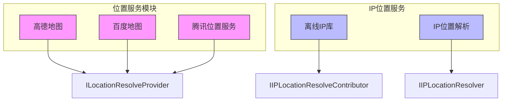
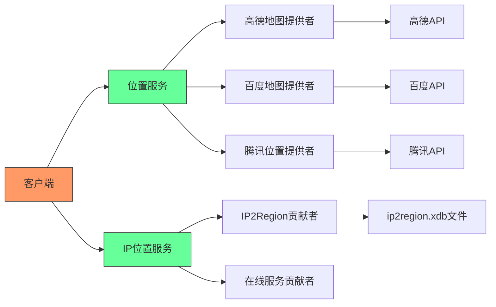
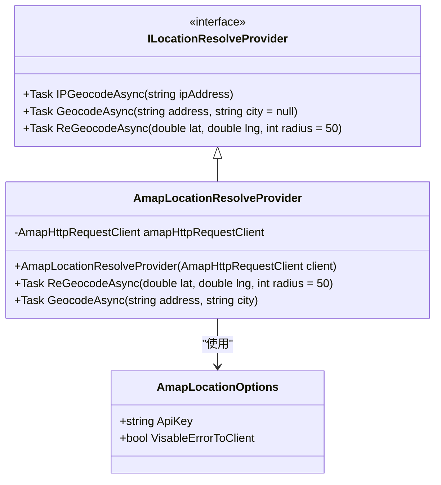
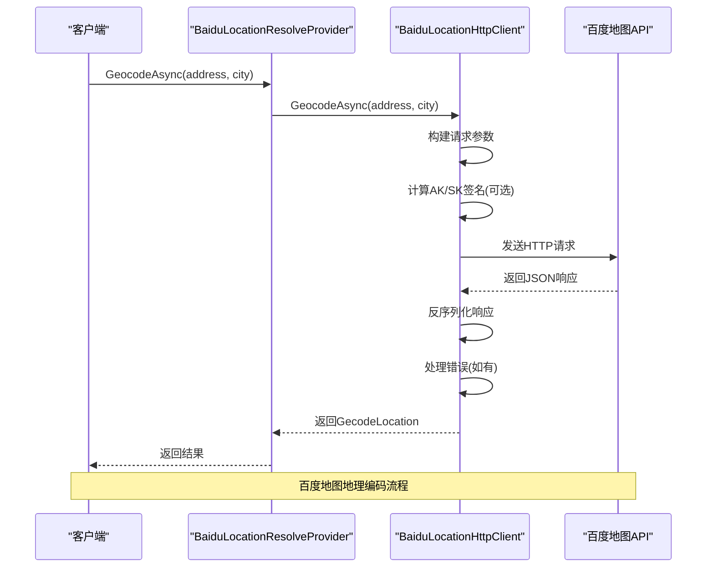
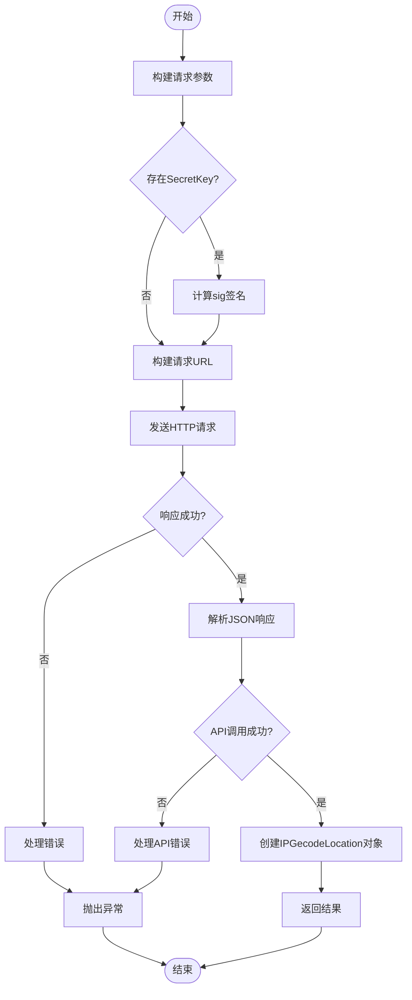
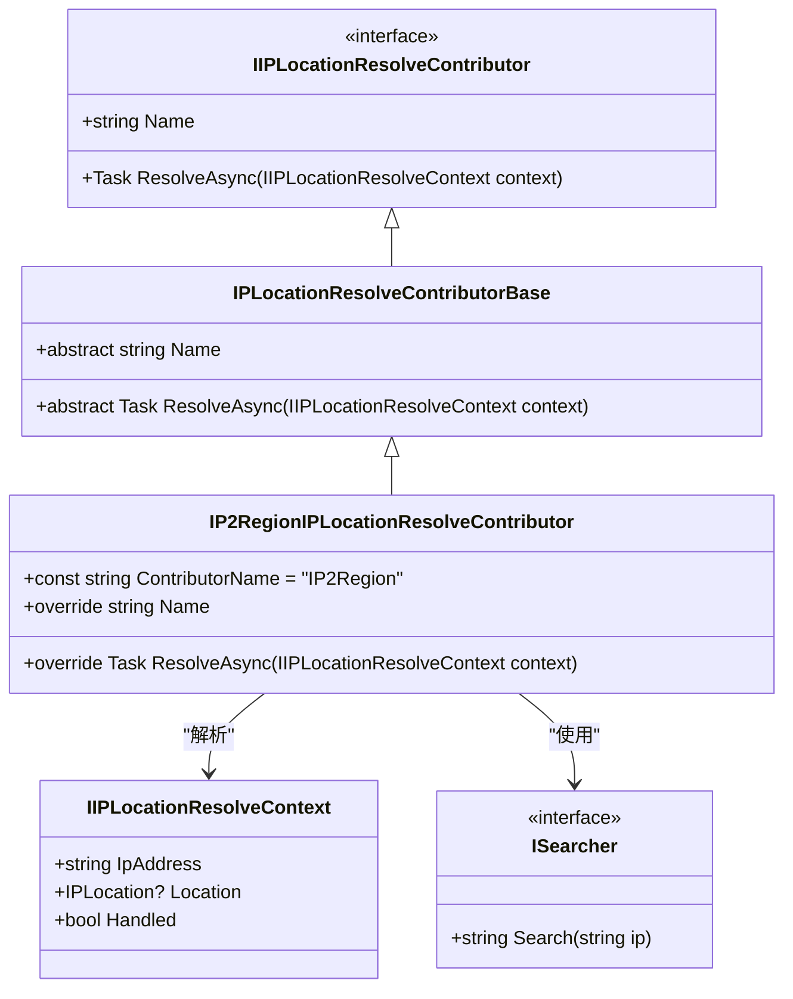
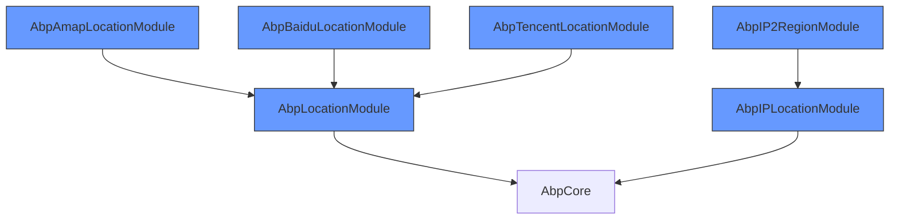

# 位置服务集成

<cite>
**本文档引用的文件**
- [AmapLocationResolveProvider.cs](file://aspnet-core/framework/common/LINGYUN.Abp.Location.Amap/LINGYUN/Abp/Location/Amap/AmapLocationResolveProvider.cs)
- [BaiduLocationHttpClient.cs](file://aspnet-core/framework/common/LINGYUN.Abp.Location.Baidu/LINGYUN/Abp/Location/Baidu/BaiduLocationHttpClient.cs)
- [TencentLocationHttpClient.cs](file://aspnet-core/framework/common/LINGYUN.Abp.Location.Tencent/LINGYUN/Abp/Location/Tencent/TencentLocationHttpClient.cs)
- [ILocationResolveProvider.cs](file://aspnet-core/framework/common/LINGYUN.Abp.Location/LINGYUN/Abp/Location/ILocationResolveProvider.cs)
- [IP2RegionIPLocationResolveContributor.cs](file://aspnet-core/framework/common/LINGYUN.Abp.IP2Region/LINGYUN/Abp/IP2Region/IP2RegionIPLocationResolveContributor.cs)
- [IPLocationResolver.cs](file://aspnet-core/framework/common/LINGYUN.Abp.IP.Location/LINGYUN/Abp/IP/Location/IPLocationResolver.cs)
- [AbpIP2RegionModule.cs](file://aspnet-core/framework/common/LINGYUN.Abp.IP2Region/LINGYUN/Abp/IP2Region/AbpIP2RegionModule.cs)
- [AbpIPLocationModule.cs](file://aspnet-core/framework/common/LINGYUN.Abp.IP.Location/LINGYUN/Abp/IP/Location/AbpIPLocationModule.cs)
- [AmapLocationOptions.cs](file://aspnet-core/framework/common/LINGYUN.Abp.Location.Amap/LINGYUN/Abp/Location/Amap/AmapLocationOptions.cs)
- [BaiduLocationOptions.cs](file://aspnet-core/framework/common/LINGYUN.Abp.Location.Baidu/LINGYUN/Abp/Location/Baidu/BaiduLocationOptions.cs)
- [TencentLocationOptions.cs](file://aspnet-core/framework/common/LINGYUN.Abp.Location.Tencent/LINGYUN/Abp/Location/Tencent/TencentLocationOptions.cs)
</cite>

## 目录
1. [简介](#简介)
2. [项目结构](#项目结构)
3. [核心组件](#核心组件)
4. [架构概述](#架构概述)
5. [详细组件分析](#详细组件分析)
6. [依赖分析](#依赖分析)
7. [性能考虑](#性能考虑)
8. [故障排除指南](#故障排除指南)
9. [结论](#结论)

## 简介
本文档详细介绍了在ABP框架中集成高德地图、百度地图和腾讯位置服务的实现方式。文档涵盖了地理位置编码、逆地理编码、IP地址定位等功能的实现机制，以及地图服务API密钥的配置、地理信息解析器的注册、位置查询API的调用方法。同时提供了IP地址到地理位置转换的实现细节，包括离线IP库的使用方法。文档还包含了位置服务的缓存策略、调用限流、错误降级方案，以及如何根据业务需求选择合适的定位服务。

## 项目结构
本项目的位置服务集成主要分布在`aspnet-core/framework/common`目录下，包含多个独立的模块，每个模块负责不同的位置服务提供商。主要结构如下：

```
aspnet-core/
└── framework/
    └── common/
        ├── LINGYUN.Abp.Location.Amap/        # 高德地图集成
        ├── LINGYUN.Abp.Location.Baidu/       # 百度地图集成
        ├── LINGYUN.Abp.Location.Tencent/     # 腾讯位置服务集成
        ├── LINGYUN.Abp.IP.Location/          # IP位置服务基础模块
        └── LINGYUN.Abp.IP2Region/            # 离线IP库集成
```

每个位置服务模块都实现了统一的接口，确保了API的一致性和可替换性。



**图示来源**
- [AmapLocationResolveProvider.cs](file://aspnet-core/framework/common/LINGYUN.Abp.Location.Amap/LINGYUN/Abp/Location/Amap/AmapLocationResolveProvider.cs)
- [TencentLocationResolveProvider.cs](file://aspnet-core/framework/common/LINGYUN.Abp.Location.Tencent/LINGYUN/Abp/Location/Tencent/TencentLocationResolveProvider.cs)
- [IP2RegionIPLocationResolveContributor.cs](file://aspnet-core/framework/common/LINGYUN.Abp.IP2Region/LINGYUN/Abp/IP2Region/IP2RegionIPLocationResolveContributor.cs)

**本节来源**
- [AmapLocationResolveProvider.cs](file://aspnet-core/framework/common/LINGYUN.Abp.Location.Amap/LINGYUN/Abp/Location/Amap/AmapLocationResolveProvider.cs)
- [TencentLocationResolveProvider.cs](file://aspnet-core/framework/common/LINGYUN.Abp.Location.Tencent/LINGYUN/Abp/Location/Tencent/TencentLocationResolveProvider.cs)
- [IP2RegionIPLocationResolveContributor.cs](file://aspnet-core/framework/common/LINGYUN.Abp.IP2Region/LINGYUN/Abp/IP2Region/IP2RegionIPLocationResolveContributor.cs)

## 核心组件
位置服务集成的核心组件包括统一的位置解析接口`ILocationResolveProvider`，以及针对不同服务提供商的具体实现。系统还提供了IP位置解析的扩展机制，支持在线服务和离线数据库的混合使用。

**本节来源**
- [ILocationResolveProvider.cs](file://aspnet-core/framework/common/LINGYUN.Abp.Location/LINGYUN/Abp/Location/ILocationResolveProvider.cs)
- [IPLocationResolver.cs](file://aspnet-core/framework/common/LINGYUN.Abp.IP.Location/LINGYUN/Abp/IP/Location/IPLocationResolver.cs)

## 架构概述
系统采用模块化设计，将不同的位置服务提供商作为独立的模块实现。所有模块都遵循统一的接口规范，通过依赖注入进行注册和使用。IP位置解析服务采用了贡献者模式，允许注册多个解析器，按优先级顺序尝试解析。



**图示来源**
- [ILocationResolveProvider.cs](file://aspnet-core/framework/common/LINGYUN.Abp.Location/LINGYUN/Abp/Location/ILocationResolveProvider.cs)
- [IPLocationResolver.cs](file://aspnet-core/framework/common/LINGYUN.Abp.IP.Location/LINGYUN/Abp/IP/Location/IPLocationResolver.cs)
- [AbpIP2RegionModule.cs](file://aspnet-core/framework/common/LINGYUN.Abp.IP2Region/LINGYUN/Abp/IP2Region/AbpIP2RegionModule.cs)

## 详细组件分析
### 高德地图集成分析
高德地图集成通过`AmapLocationResolveProvider`类实现，该类实现了`ILocationResolveProvider`接口，提供了地理编码、逆地理编码和IP定位功能。配置通过`AmapLocationOptions`类进行，主要包含API密钥和错误处理策略。



**图示来源**
- [AmapLocationResolveProvider.cs](file://aspnet-core/framework/common/LINGYUN.Abp.Location.Amap/LINGYUN/Abp/Location/Amap/AmapLocationResolveProvider.cs)
- [AmapLocationOptions.cs](file://aspnet-core/framework/common/LINGYUN.Abp.Location.Amap/LINGYUN/Abp/Location/Amap/AmapLocationOptions.cs)

**本节来源**
- [AmapLocationResolveProvider.cs](file://aspnet-core/framework/common/LINGYUN.Abp.Location.Amap/LINGYUN/Abp/Location/Amap/AmapLocationResolveProvider.cs)
- [AmapLocationOptions.cs](file://aspnet-core/framework/common/LINGYUN.Abp.Location.Amap/LINGYUN/Abp/Location/Amap/AmapLocationOptions.cs)

### 百度地图集成分析
百度地图集成通过`BaiduLocationHttpClient`类实现，该类提供了完整的HTTP客户端功能，支持AK/SK安全验证。系统通过`BaiduLocationOptions`配置类管理API密钥、坐标系类型等参数。



**图示来源**
- [BaiduLocationHttpClient.cs](file://aspnet-core/framework/common/LINGYUN.Abp.Location.Baidu/LINGYUN/Abp/Location/Baidu/BaiduLocationHttpClient.cs)
- [BaiduLocationOptions.cs](file://aspnet-core/framework/common/LINGYUN.Abp.Location.Baidu/LINGYUN/Abp/Location/Baidu/BaiduLocationOptions.cs)

**本节来源**
- [BaiduLocationHttpClient.cs](file://aspnet-core/framework/common/LINGYUN.Abp.Location.Baidu/LINGYUN/Abp/Location/Baidu/BaiduLocationHttpClient.cs)
- [BaiduLocationOptions.cs](file://aspnet-core/framework/common/LINGYUN.Abp.Location.Baidu/LINGYUN/Abp/Location/Baidu/BaiduLocationOptions.cs)

### 腾讯位置服务集成分析
腾讯位置服务集成通过`TencentLocationHttpClient`类实现，支持密钥签名验证。系统通过`TencentLocationOptions`配置类管理访问密钥、输出格式等参数。



**图示来源**
- [TencentLocationHttpClient.cs](file://aspnet-core/framework/common/LINGYUN.Abp.Location.Tencent/LINGYUN/Abp/Location/Tencent/TencentLocationHttpClient.cs)
- [TencentLocationOptions.cs](file://aspnet-core/framework/common/LINGYUN.Abp.Location.Tencent/LINGYUN/Abp/Location/Tencent/TencentLocationOptions.cs)

**本节来源**
- [TencentLocationHttpClient.cs](file://aspnet-core/framework/common/LINGYUN.Abp.Location.Tencent/LINGYUN/Abp/Location/Tencent/TencentLocationHttpClient.cs)
- [TencentLocationOptions.cs](file://aspnet-core/framework/common/LINGYUN.Abp.Location.Tencent/LINGYUN/Abp/Location/Tencent/TencentLocationOptions.cs)

### 离线IP库集成分析
离线IP库集成基于IP2Region技术，通过`IP2RegionIPLocationResolveContributor`类实现。系统在启动时加载`ip2region.xdb`数据库文件，提供快速的IP地址到地理位置的查询功能。



**图示来源**
- [IP2RegionIPLocationResolveContributor.cs](file://aspnet-core/framework/common/LINGYUN.Abp.IP2Region/LINGYUN/Abp/IP2Region/IP2RegionIPLocationResolveContributor.cs)
- [IIPLocationResolveContext.cs](file://aspnet-core/framework/common/LINGYUN.Abp.IP.Location/LINGYUN/Abp/IP/Location/IIPLocationResolveContext.cs)

**本节来源**
- [IP2RegionIPLocationResolveContributor.cs](file://aspnet-core/framework/common/LINGYUN.Abp.IP2Region/LINGYUN/Abp/IP2Region/IP2RegionIPLocationResolveContributor.cs)
- [IIPLocationResolveContext.cs](file://aspnet-core/framework/common/LINGYUN.Abp.IP.Location/LINGYUN/Abp/IP/Location/IIPLocationResolveContext.cs)

## 依赖分析
位置服务模块之间存在清晰的依赖关系，基础模块为`LINGYUN.Abp.Location`，提供统一的接口和模型定义。各具体实现模块依赖基础模块，并通过依赖注入进行注册。



**图示来源**
- [AbpAmapLocationModule.cs](file://aspnet-core/framework/common/LINGYUN.Abp.Location.Amap/LINGYUN/Abp/Location/Amap/AbpAmapLocationModule.cs)
- [AbpIP2RegionModule.cs](file://aspnet-core/framework/common/LINGYUN.Abp.IP2Region/LINGYUN/Abp/IP2Region/AbpIP2RegionModule.cs)
- [AbpIPLocationModule.cs](file://aspnet-core/framework/common/LINGYUN.Abp.IP.Location/LINGYUN/Abp/IP/Location/AbpIPLocationModule.cs)

**本节来源**
- [AbpAmapLocationModule.cs](file://aspnet-core/framework/common/LINGYUN.Abp.Location.Amap/LINGYUN/Abp/Location/Amap/AbpAmapLocationModule.cs)
- [AbpIP2RegionModule.cs](file://aspnet-core/framework/common/LINGYUN.Abp.IP2Region/LINGYUN/Abp/IP2Region/AbpIP2RegionModule.cs)
- [AbpIPLocationModule.cs](file://aspnet-core/framework/common/LINGYUN.Abp.IP.Location/LINGYUN/Abp/IP/Location/AbpIPLocationModule.cs)

## 性能考虑
位置服务集成考虑了多种性能优化策略：

1. **HTTP客户端重试策略**：高德地图模块配置了Polly重试策略，在HTTP请求失败时自动重试3次，间隔时间呈指数增长。
2. **离线IP库缓存**：IP2Region模块在内存中加载整个`ip2region.xdb`数据库，提供O(1)时间复杂度的IP查询性能。
3. **异步编程模型**：所有位置查询方法都采用异步模式，避免阻塞线程。
4. **连接池管理**：通过HttpClientFactory管理HTTP连接，避免频繁创建和销毁连接的开销。

## 故障排除指南
### 常见问题及解决方案
1. **API调用频繁被限制**：
   - 检查是否超过了服务提供商的QPS限制
   - 考虑使用离线IP库作为降级方案
   - 实现本地缓存减少重复查询

2. **IP定位精度不高**：
   - 检查IP数据库是否为最新版本
   - 考虑结合多个服务提供商的结果进行综合判断
   - 对于重要业务，建议使用更精确的定位方式

3. **HTTPS请求失败**：
   - 检查服务提供商是否支持HTTPS
   - 确认API密钥是否有HTTPS访问权限
   - 检查网络环境是否存在中间人攻击

4. **坐标系转换错误**：
   - 确认使用的坐标系类型（如BD09LL、GCJ02等）
   - 在系统中统一坐标系标准
   - 必要时实现坐标系转换工具

**本节来源**
- [AmapHttpResponse.cs](file://aspnet-core/framework/common/LINGYUN.Abp.Location.Amap/LINGYUN/Abp/Location/Amap/AmapHttpResponse.cs)
- [BaiduLocationHttpClient.cs](file://aspnet-core/framework/common/LINGYUN.Abp.Location.Baidu/LINGYUN/Abp/Location/Baidu/BaiduLocationHttpClient.cs)
- [TencentLocationHttpClient.cs](file://aspnet-core/framework/common/LINGYUN.Abp.Location.Tencent/LINGYUN/Abp/Location/Tencent/TencentLocationHttpClient.cs)

## 结论
本文档详细介绍了ABP框架中位置服务集成的实现方式。系统通过模块化设计，支持高德地图、百度地图和腾讯位置服务等多种提供商，并提供了统一的API接口。IP位置解析服务支持在线服务和离线数据库的混合使用，通过贡献者模式实现了灵活的解析策略。系统考虑了性能优化和错误处理，为业务应用提供了可靠的位置服务支持。