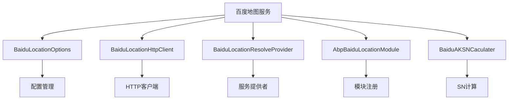
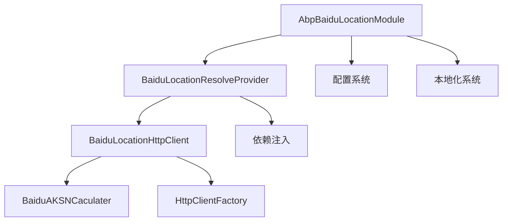
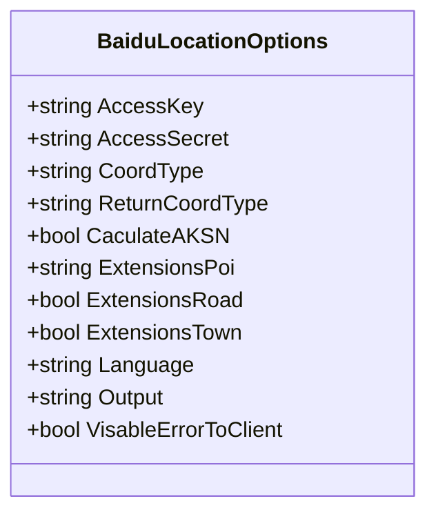
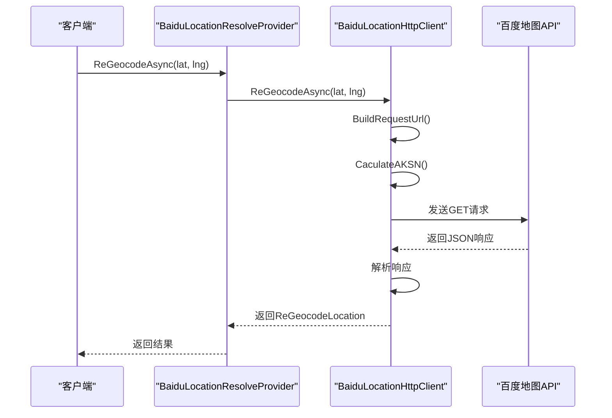
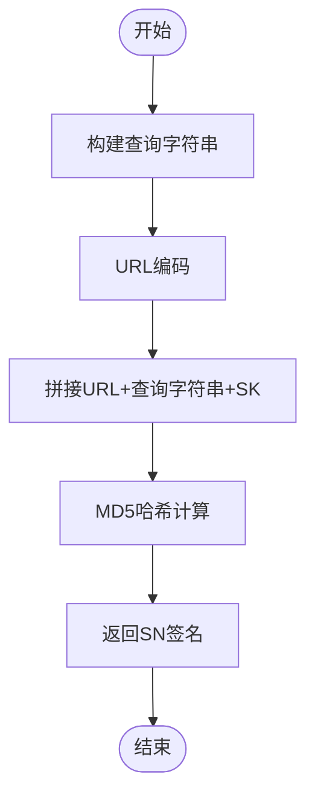
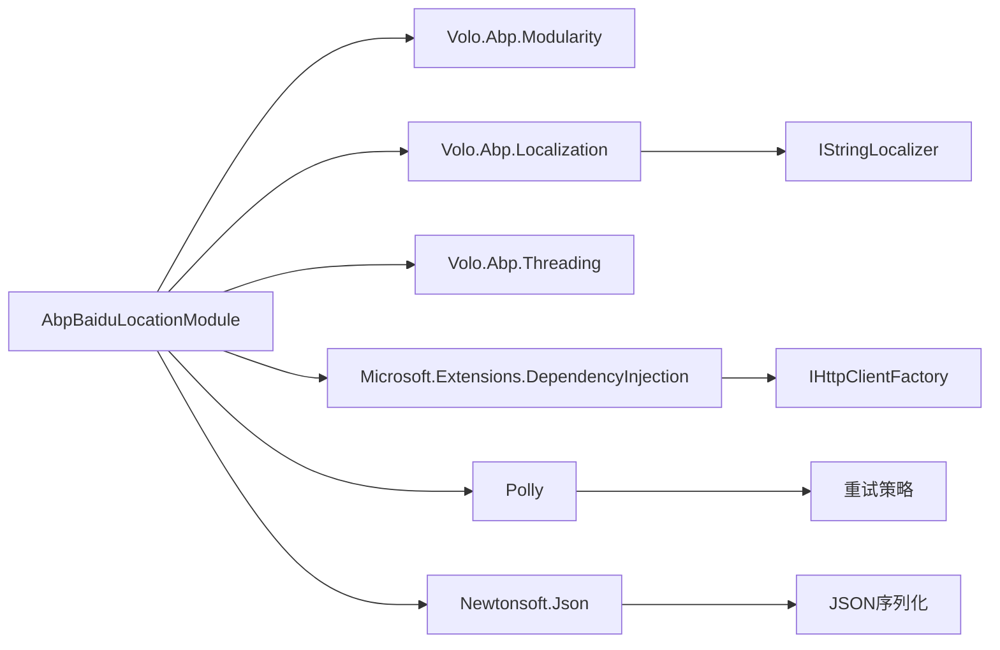

# 百度地图集成

<cite>
**本文档引用的文件**
- [BaiduLocationOptions.cs](file://aspnet-core/framework/common/LINGYUN.Abp.Location.Baidu/LINGYUN/Abp/Location/Baidu/BaiduLocationOptions.cs)
- [BaiduLocationHttpClient.cs](file://aspnet-core/framework/common/LINGYUN.Abp.Location.Baidu/LINGYUN/Abp/Location/Baidu/BaiduLocationHttpClient.cs)
- [AbpBaiduLocationModule.cs](file://aspnet-core/framework/common/LINGYUN.Abp.Location.Baidu/LINGYUN/Abp/Location/Baidu/AbpBaiduLocationModule.cs)
- [BaiduLocationResolveProvider.cs](file://aspnet-core/framework/common/LINGYUN.Abp.Location.Baidu/LINGYUN/Abp/Location/Baidu/BaiduLocationResolveProvider.cs)
- [BaiduAKSNCaculater.cs](file://aspnet-core/framework/common/LINGYUN.Abp.Location.Baidu/LINGYUN/Abp/Location/Baidu/Utils/BaiduAKSNCaculater.cs)
- [BaiduLocationHttpConsts.cs](file://aspnet-core/framework/common/LINGYUN.Abp.Location.Baidu/LINGYUN/Abp/Location/Baidu/BaiduLocationHttpConsts.cs)
- [ILocationResolveProvider.cs](file://aspnet-core/framework/common/LINGYUN.Abp.Location/LINGYUN/Abp/Location/ILocationResolveProvider.cs)
- [BaiduLocationResolveProviderTests.cs](file://aspnet-core/tests/LINGYUN.Abp.Location.Baidu.Tests/LINGYUN/Abp/Location/Baidu/BaiduLocationResolveProviderTests.cs)
</cite>

## 目录
1. [简介](#简介)
2. [项目结构](#项目结构)
3. [核心组件](#核心组件)
4. [架构概述](#架构概述)
5. [详细组件分析](#详细组件分析)
6. [依赖分析](#依赖分析)
7. [性能考虑](#性能考虑)
8. [故障排除指南](#故障排除指南)
9. [结论](#结论)

## 简介
本文档详细介绍了在ABP框架中集成百度地图服务的方法。该实现提供了地理编码、逆地理编码和IP定位功能，支持通过配置AK密钥进行安全访问，并包含错误处理、重试机制和本地化支持。

## 项目结构
百度地图服务位于`aspnet-core/framework/common/LINGYUN.Abp.Location.Baidu`目录下，作为ABP框架的一个模块提供位置服务功能。

**图示来源**
- [BaiduLocationOptions.cs](file://aspnet-core/framework/common/LINGYUN.Abp.Location.Baidu/LINGYUN/Abp/Location/Baidu/BaiduLocationOptions.cs)
- [BaiduLocationHttpClient.cs](file://aspnet-core/framework/common/LINGYUN.Abp.Location.Baidu/LINGYUN/Abp/Location/Baidu/BaiduLocationHttpClient.cs)
- [BaiduLocationResolveProvider.cs](file://aspnet-core/framework/common/LINGYUN.Abp.Location.Baidu/LINGYUN/Abp/Location/Baidu/BaiduLocationResolveProvider.cs)
- [AbpBaiduLocationModule.cs](file://aspnet-core/framework/common/LINGYUN.Abp.Location.Baidu/LINGYUN/Abp/Location/Baidu/AbpBaiduLocationModule.cs)
- [BaiduAKSNCaculater.cs](file://aspnet-core/framework/common/LINGYUN.Abp.Location.Baidu/LINGYUN/Abp/Location/Baidu/Utils/BaiduAKSNCaculater.cs)

**章节来源**
- [BaiduLocationOptions.cs](file://aspnet-core/framework/common/LINGYUN.Abp.Location.Baidu/LINGYUN/Abp/Location/Baidu/BaiduLocationOptions.cs)
- [BaiduLocationHttpClient.cs](file://aspnet-core/framework/common/LINGYUN.Abp.Location.Baidu/LINGYUN/Abp/Location/Baidu/BaiduLocationHttpClient.cs)

## 核心组件
百度地图集成的核心组件包括配置选项、HTTP客户端、服务提供者和模块定义。这些组件共同实现了对百度地图API的安全调用和结果解析。

**章节来源**
- [BaiduLocationOptions.cs](file://aspnet-core/framework/common/LINGYUN.Abp.Location.Baidu/LINGYUN/Abp/Location/Baidu/BaiduLocationOptions.cs#L1-L65)
- [BaiduLocationHttpClient.cs](file://aspnet-core/framework/common/LINGYUN.Abp.Location.Baidu/LINGYUN/Abp/Location/Baidu/BaiduLocationHttpClient.cs#L1-L253)

## 架构概述
百度地图服务采用分层架构设计，从上到下分别为：模块层、服务提供者层、HTTP客户端层和工具层。这种设计实现了关注点分离，便于维护和扩展。

**图示来源**
- [AbpBaiduLocationModule.cs](file://aspnet-core/framework/common/LINGYUN.Abp.Location.Baidu/LINGYUN/Abp/Location/Baidu/AbpBaiduLocationModule.cs#L1-L39)
- [BaiduLocationResolveProvider.cs](file://aspnet-core/framework/common/LINGYUN.Abp.Location.Baidu/LINGYUN/Abp/Location/Baidu/BaiduLocationResolveProvider.cs#L1-L33)
- [BaiduLocationHttpClient.cs](file://aspnet-core/framework/common/LINGYUN.Abp.Location.Baidu/LINGYUN/Abp/Location/Baidu/BaiduLocationHttpClient.cs#L1-L253)

## 详细组件分析

### 配置选项分析
`BaiduLocationOptions`类定义了所有可配置的参数，包括AK密钥、坐标类型、输出格式等。

**图示来源**
- [BaiduLocationOptions.cs](file://aspnet-core/framework/common/LINGYUN.Abp.Location.Baidu/LINGYUN/Abp/Location/Baidu/BaiduLocationOptions.cs#L1-L65)

#### HTTP客户端分析
`BaiduLocationHttpClient`负责与百度地图API进行实际通信，处理请求构建、SN计算和响应解析。

**图示来源**
- [BaiduLocationHttpClient.cs](file://aspnet-core/framework/common/LINGYUN.Abp.Location.Baidu/LINGYUN/Abp/Location/Baidu/BaiduLocationHttpClient.cs#L1-L253)
- [BaiduLocationResolveProvider.cs](file://aspnet-core/framework/common/LINGYUN.Abp.Location.Baidu/LINGYUN/Abp/Location/Baidu/BaiduLocationResolveProvider.cs#L1-L33)

#### SN计算工具分析
`BaiduAKSNCaculater`类实现了百度API的SN签名算法，确保请求的安全性。

**图示来源**
- [BaiduAKSNCaculater.cs](file://aspnet-core/framework/common/LINGYUN.Abp.Location.Baidu/LINGYUN/Abp/Location/Baidu/Utils/BaiduAKSNCaculater.cs#L1-L45)

**章节来源**
- [BaiduAKSNCaculater.cs](file://aspnet-core/framework/common/LINGYUN.Abp.Location.Baidu/LINGYUN/Abp/Location/Baidu/Utils/BaiduAKSNCaculater.cs#L1-L45)
- [BaiduLocationHttpClient.cs](file://aspnet-core/framework/common/LINGYUN.Abp.Location.Baidu/LINGYUN/Abp/Location/Baidu/BaiduLocationHttpClient.cs#L1-L253)

## 依赖分析
百度地图服务依赖于多个ABP框架组件和第三方库，形成了完整的依赖链。

**图示来源**
- [AbpBaiduLocationModule.cs](file://aspnet-core/framework/common/LINGYUN.Abp.Location.Baidu/LINGYUN/Abp/Location/Baidu/AbpBaiduLocationModule.cs#L1-L39)
- [BaiduLocationHttpClient.cs](file://aspnet-core/framework/common/LINGYUN.Abp.Location.Baidu/LINGYUN/Abp/Location/Baidu/BaiduLocationHttpClient.cs#L1-L253)

**章节来源**
- [AbpBaiduLocationModule.cs](file://aspnet-core/framework/common/LINGYUN.Abp.Location.Baidu/LINGYUN/Abp/Location/Baidu/AbpBaiduLocationModule.cs#L1-L39)
- [BaiduLocationHttpClient.cs](file://aspnet-core/framework/common/LINGYUN.Abp.Location.Baidu/LINGYUN/Abp/Location/Baidu/BaiduLocationHttpClient.cs#L1-L253)

## 性能考虑
百度地图服务通过多种机制优化性能和可靠性：

1. **HTTP客户端池化**：使用`IHttpClientFactory`避免频繁创建销毁HTTP客户端
2. **重试策略**：通过Polly库实现指数退避重试，最多重试3次
3. **异步编程**：所有API调用均为异步，避免阻塞线程
4. **缓存友好**：返回结果包含原始数据，便于上层实现缓存

对于高并发场景，建议：
- 配置适当的连接池大小
- 实现应用层缓存以减少API调用
- 监控API配额使用情况
- 设置合理的超时时间

## 故障排除指南
常见问题及解决方案：

1. **AK密钥错误**：检查`appsettings.json`中的配置是否正确
2. **SN计算失败**：确保同时配置了AccessKey和AccessSecret
3. **网络连接问题**：检查服务器是否能访问`api.map.baidu.com`
4. **配额耗尽**：监控API调用次数，申请更高的配额
5. **坐标系不匹配**：确认使用的坐标系类型是否符合需求

异常处理机制：
- 使用`UserFriendlyException`向客户端显示友好的错误信息
- 详细的日志记录便于问题排查
- 可配置是否将详细错误信息暴露给客户端

**章节来源**
- [BaiduLocationHttpClient.cs](file://aspnet-core/framework/common/LINGYUN.Abp.Location.Baidu/LINGYUN/Abp/Location/Baidu/BaiduLocationHttpClient.cs#L1-L253)
- [BaiduLocationOptions.cs](file://aspnet-core/framework/common/LINGYUN.Abp.Location.Baidu/LINGYUN/Abp/Location/Baidu/BaiduLocationOptions.cs#L1-L65)

## 结论
百度地图集成模块提供了一套完整的位置服务解决方案，具有以下优势：
- 易于配置和使用
- 安全的AK/SK验证机制
- 健壮的错误处理和重试策略
- 良好的性能表现
- 与其他ABP模块无缝集成

通过合理配置和使用，可以满足各种位置相关的业务需求。