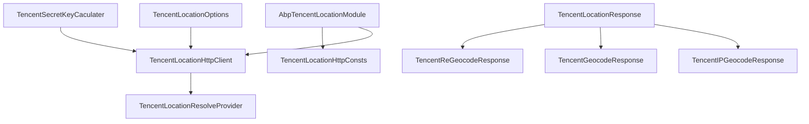
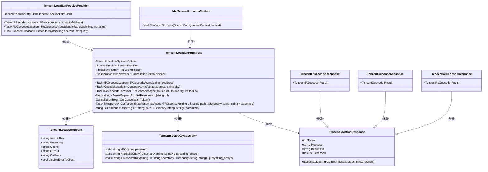
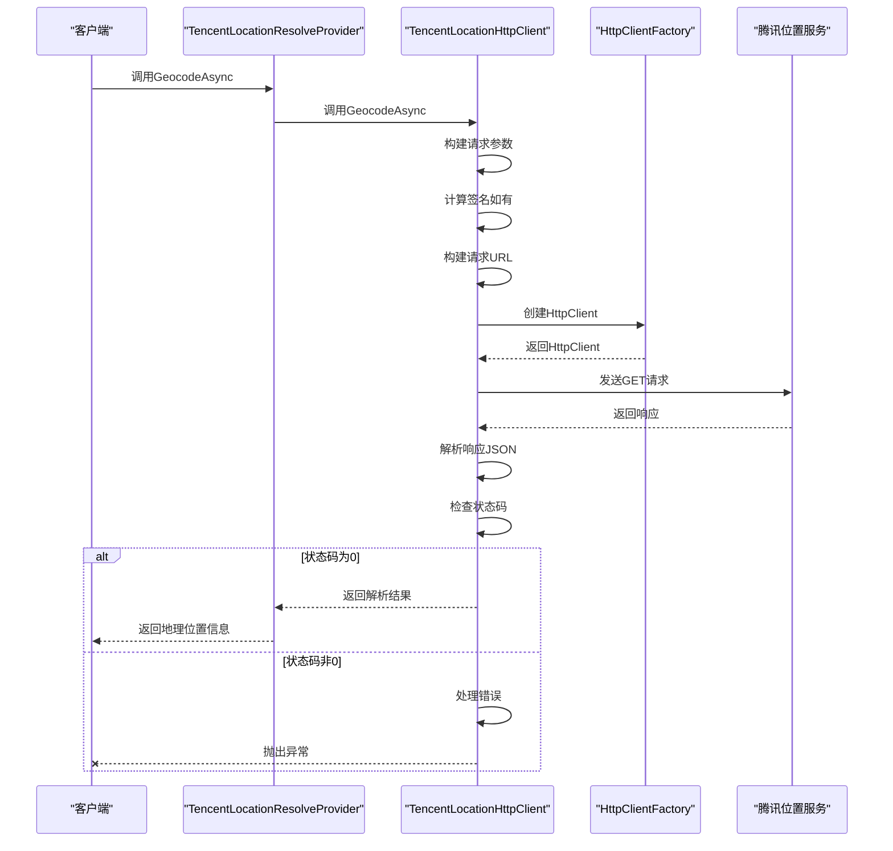
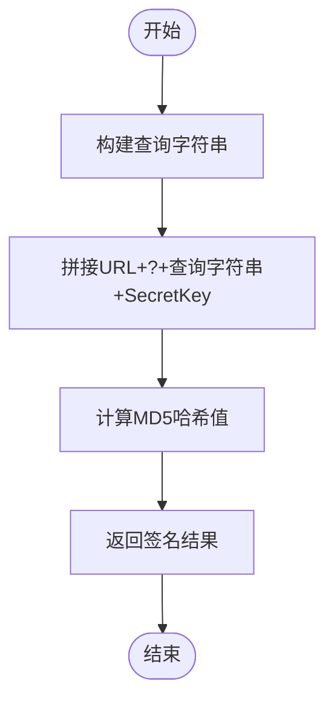
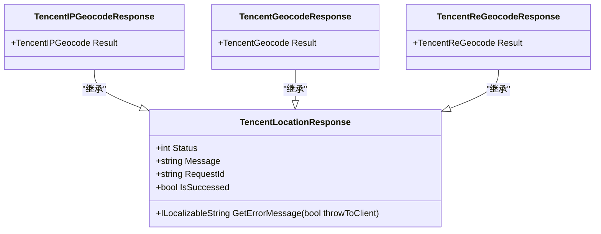
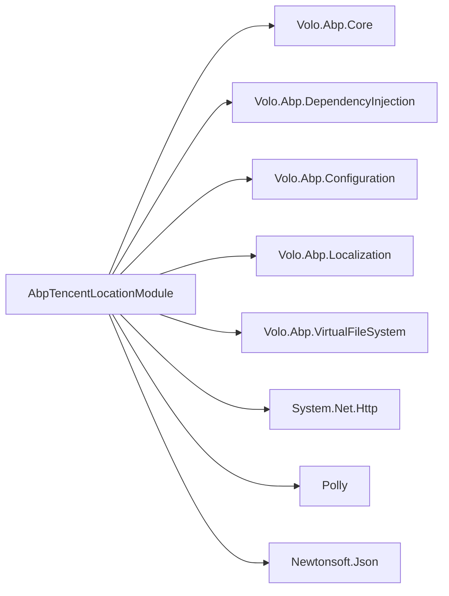

# 腾讯位置服务集成

<cite>
**本文档引用的文件**
- [TencentLocationOptions.cs](file://aspnet-core/framework/common/LINGYUN.Abp.Location.Tencent/LINGYUN/Abp/Location/Tencent/TencentLocationOptions.cs)
- [TencentLocationHttpClient.cs](file://aspnet-core/framework/common/LINGYUN.Abp.Location.Tencent/LINGYUN/Abp/Location/Tencent/TencentLocationHttpClient.cs)
- [TencentSecretKeyCaculater.cs](file://aspnet-core/framework/common/LINGYUN.Abp.Location.Tencent/LINGYUN/Abp/Location/Tencent/Utils/TencentSecretKeyCaculater.cs)
- [TencentLocationResponse.cs](file://aspnet-core/framework/common/LINGYUN.Abp.Location.Tencent/LINGYUN/Abp/Location/Tencent/Response/TencentLocationResponse.cs)
- [TencentIPGeocodeResponse.cs](file://aspnet-core/framework/common/LINGYUN.Abp.Location.Tencent/LINGYUN/Abp/Location/Tencent/Response/TencentIPGeocodeResponse.cs)
- [TencentGeocodeResponse.cs](file://aspnet-core/framework/common/LINGYUN.Abp.Location.Tencent/LINGYUN/Abp/Location/Tencent/Response/TencentGeocodeResponse.cs)
- [TencentReGeocodeResponse.cs](file://aspnet-core/framework/common/LINGYUN.Abp.Location.Tencent/LINGYUN/Abp/Location/Tencent/Response/TencentReGeocodeResponse.cs)
- [TencentIPGeocode.cs](file://aspnet-core/framework/common/LINGYUN.Abp.Location.Tencent/LINGYUN/Abp/Location/Tencent/Model/TencentIPGeocode.cs)
- [TencentGeocode.cs](file://aspnet-core/framework/common/LINGYUN.Abp.Location.Tencent/LINGYUN/Abp/Location/Tencent/Model/TencentGeocode.cs)
- [TencentReGeocode.cs](file://aspnet-core/framework/common/LINGYUN.Abp.Location.Tencent/LINGYUN/Abp/Location/Tencent/Model/TencentReGeocode.cs)
- [AbpTencentLocationModule.cs](file://aspnet-core/framework/common/LINGYUN.Abp.Location.Tencent/LINGYUN/Abp/Location/Tencent/AbpTencentLocationModule.cs)
- [TencentLocationResolveProvider.cs](file://aspnet-core/framework/common/LINGYUN.Abp.Location.Tencent/LINGYUN/Abp/Location/Tencent/TencentLocationResolveProvider.cs)
- [appsettings.json](file://aspnet-core/services/LY.MicroService.Applications.Single/appsettings.json)
</cite>

## 目录
1. [简介](#简介)
2. [项目结构](#项目结构)
3. [核心组件](#核心组件)
4. [架构概述](#架构概述)
5. [详细组件分析](#详细组件分析)
6. [依赖分析](#依赖分析)
7. [性能考虑](#性能考虑)
8. [故障排除指南](#故障排除指南)
9. [结论](#结论)

## 简介
本文档详细说明了腾讯位置服务SDK的集成方法，包括SecretId和SecretKey的配置、地理编码、逆地理编码、行政区划查询等API调用方式。文档涵盖了HTTPS请求配置、签名算法实现、请求频率限制处理以及服务不可用时的容错机制。同时提供了在微服务架构中调用腾讯位置服务的最佳实践，包括异步调用、超时设置、结果缓存等技术细节，并说明了与腾讯云等其他云服务的协同使用方法。

## 项目结构
腾讯位置服务集成模块位于`aspnet-core/framework/common/LINGYUN.Abp.Location.Tencent`目录下，包含配置选项、HTTP客户端、响应模型、工具类等核心组件。该模块通过ABP框架的依赖注入系统进行注册和管理，支持通过配置文件灵活配置各项参数。



**图示来源**
- [TencentLocationOptions.cs](file://aspnet-core/framework/common/LINGYUN.Abp.Location.Tencent/LINGYUN/Abp/Location/Tencent/TencentLocationOptions.cs)
- [TencentLocationHttpClient.cs](file://aspnet-core/framework/common/LINGYUN.Abp.Location.Tencent/LINGYUN/Abp/Location/Tencent/TencentLocationHttpClient.cs)
- [TencentSecretKeyCaculater.cs](file://aspnet-core/framework/common/LINGYUN.Abp.Location.Tencent/LINGYUN/Abp/Location/Tencent/Utils/TencentSecretKeyCaculater.cs)
- [TencentLocationResponse.cs](file://aspnet-core/framework/common/LINGYUN.Abp.Location.Tencent/LINGYUN/Abp/Location/Tencent/Response/TencentLocationResponse.cs)
- [TencentIPGeocodeResponse.cs](file://aspnet-core/framework/common/LINGYUN.Abp.Location.Tencent/LINGYUN/Abp/Location/Tencent/Response/TencentIPGeocodeResponse.cs)
- [TencentGeocodeResponse.cs](file://aspnet-core/framework/common/LINGYUN.Abp.Location.Tencent/LINGYUN/Abp/Location/Tencent/Response/TencentGeocodeResponse.cs)
- [TencentReGeocodeResponse.cs](file://aspnet-core/framework/common/LINGYUN.Abp.Location.Tencent/LINGYUN/Abp/Location/Tencent/Response/TencentReGeocodeResponse.cs)
- [AbpTencentLocationModule.cs](file://aspnet-core/framework/common/LINGYUN.Abp.Location.Tencent/LINGYUN/Abp/Location/Tencent/AbpTencentLocationModule.cs)
- [TencentLocationHttpConsts.cs](file://aspnet-core/framework/common/LINGYUN.Abp.Location.Tencent/LINGYUN/Abp/Location/Tencent/TencentLocationHttpConsts.cs)

**本节来源**
- [TencentLocationOptions.cs](file://aspnet-core/framework/common/LINGYUN.Abp.Location.Tencent/LINGYUN/Abp/Location/Tencent/TencentLocationOptions.cs)
- [TencentLocationHttpClient.cs](file://aspnet-core/framework/common/LINGYUN.Abp.Location.Tencent/LINGYUN/Abp/Location/Tencent/TencentLocationHttpClient.cs)

## 核心组件
腾讯位置服务集成的核心组件包括配置选项、HTTP客户端、响应模型、签名计算工具和解析提供程序。这些组件共同实现了对腾讯位置服务API的封装和调用。

**本节来源**
- [TencentLocationOptions.cs](file://aspnet-core/framework/common/LINGYUN.Abp.Location.Tencent/LINGYUN/Abp/Location/Tencent/TencentLocationOptions.cs)
- [TencentLocationHttpClient.cs](file://aspnet-core/framework/common/LINGYUN.Abp.Location.Tencent/LINGYUN/Abp/Location/Tencent/TencentLocationHttpClient.cs)
- [TencentSecretKeyCaculater.cs](file://aspnet-core/framework/common/LINGYUN.Abp.Location.Tencent/LINGYUN/Abp/Location/Tencent/Utils/TencentSecretKeyCaculater.cs)

## 架构概述
腾讯位置服务集成采用分层架构设计，包括配置层、客户端层、响应处理层和业务逻辑层。通过ABP框架的依赖注入和模块化设计，实现了高内聚低耦合的系统结构。



**图示来源**
- [TencentLocationOptions.cs](file://aspnet-core/framework/common/LINGYUN.Abp.Location.Tencent/LINGYUN/Abp/Location/Tencent/TencentLocationOptions.cs)
- [TencentLocationHttpClient.cs](file://aspnet-core/framework/common/LINGYUN.Abp.Location.Tencent/LINGYUN/Abp/Location/Tencent/TencentLocationHttpClient.cs)
- [TencentSecretKeyCaculater.cs](file://aspnet-core/framework/common/LINGYUN.Abp.Location.Tencent/LINGYUN/Abp/Location/Tencent/Utils/TencentSecretKeyCaculater.cs)
- [TencentLocationResponse.cs](file://aspnet-core/framework/common/LINGYUN.Abp.Location.Tencent/LINGYUN/Abp/Location/Tencent/Response/TencentLocationResponse.cs)
- [TencentIPGeocodeResponse.cs](file://aspnet-core/framework/common/LINGYUN.Abp.Location.Tencent/LINGYUN/Abp/Location/Tencent/Response/TencentIPGeocodeResponse.cs)
- [TencentGeocodeResponse.cs](file://aspnet-core/framework/common/LINGYUN.Abp.Location.Tencent/LINGYUN/Abp/Location/Tencent/Response/TencentGeocodeResponse.cs)
- [TencentReGeocodeResponse.cs](file://aspnet-core/framework/common/LINGYUN.Abp.Location.Tencent/LINGYUN/Abp/Location/Tencent/Response/TencentReGeocodeResponse.cs)
- [TencentLocationResolveProvider.cs](file://aspnet-core/framework/common/LINGYUN.Abp.Location.Tencent/LINGYUN/Abp/Location/Tencent/TencentLocationResolveProvider.cs)
- [AbpTencentLocationModule.cs](file://aspnet-core/framework/common/LINGYUN.Abp.Location.Tencent/LINGYUN/Abp/Location/Tencent/AbpTencentLocationModule.cs)

## 详细组件分析
### 配置选项分析
腾讯位置服务的配置选项通过`TencentLocationOptions`类定义，支持在应用配置文件中进行设置。主要配置项包括：

| 配置项 | 描述 | 默认值 |
|--------|------|--------|
| AccessKey | 腾讯地图API的访问密钥 | 无 |
| SecretKey | 腾讯地图API的签名密钥 | 无 |
| GetPoi | 是否返回周边POI信息 | "1" |
| Output | 返回数据格式 | "JSON" |
| Callback | JSONP回调函数名称 | null |
| VisableErrorToClient | 是否将错误信息暴露给客户端 | false |

**本节来源**
- [TencentLocationOptions.cs](file://aspnet-core/framework/common/LINGYUN.Abp.Location.Tencent/LINGYUN/Abp/Location/Tencent/TencentLocationOptions.cs)

### HTTP客户端分析
`TencentLocationHttpClient`是腾讯位置服务的核心客户端类，负责构建请求、处理响应和错误。该类通过依赖注入获取配置选项和HTTP工厂，实现了以下功能：



**图示来源**
- [TencentLocationHttpClient.cs](file://aspnet-core/framework/common/LINGYUN.Abp.Location.Tencent/LINGYUN/Abp/Location/Tencent/TencentLocationHttpClient.cs)
- [TencentLocationResolveProvider.cs](file://aspnet-core/framework/common/LINGYUN.Abp.Location.Tencent/LINGYUN/Abp/Location/Tencent/TencentLocationResolveProvider.cs)

**本节来源**
- [TencentLocationHttpClient.cs](file://aspnet-core/framework/common/LINGYUN.Abp.Location.Tencent/LINGYUN/Abp/Location/Tencent/TencentLocationHttpClient.cs)

### 签名算法分析
腾讯位置服务要求对请求进行签名验证，签名算法通过`TencentSecretKeyCaculater`类实现。签名计算过程如下：



具体实现代码：
```csharp
public static string CalcSecretKey(string url, string secretKey, IDictionary<string, string> querystring_arrays)
{
    var queryString = HttpBuildQuery(querystring_arrays);
    return MD5(url + "?" + queryString + secretKey);
}
```

**图示来源**
- [TencentSecretKeyCaculater.cs](file://aspnet-core/framework/common/LINGYUN.Abp.Location.Tencent/LINGYUN/Abp/Location/Tencent/Utils/TencentSecretKeyCaculater.cs)

**本节来源**
- [TencentSecretKeyCaculater.cs](file://aspnet-core/framework/common/LINGYUN.Abp.Location.Tencent/LINGYUN/Abp/Location/Tencent/Utils/TencentSecretKeyCaculater.cs)

### 响应模型分析
腾讯位置服务的响应模型采用继承结构，基础响应类`TencentLocationResponse`定义了通用的状态码和消息字段，具体响应类型继承自基础响应类。



**图示来源**
- [TencentLocationResponse.cs](file://aspnet-core/framework/common/LINGYUN.Abp.Location.Tencent/LINGYUN/Abp/Location/Tencent/Response/TencentLocationResponse.cs)
- [TencentIPGeocodeResponse.cs](file://aspnet-core/framework/common/LINGYUN.Abp.Location.Tencent/LINGYUN/Abp/Location/Tencent/Response/TencentIPGeocodeResponse.cs)
- [TencentGeocodeResponse.cs](file://aspnet-core/framework/common/LINGYUN.Abp.Location.Tencent/LINGYUN/Abp/Location/Tencent/Response/TencentGeocodeResponse.cs)
- [TencentReGeocodeResponse.cs](file://aspnet-core/framework/common/LINGYUN.Abp.Location.Tencent/LINGYUN/Abp/Location/Tencent/Response/TencentReGeocodeResponse.cs)

**本节来源**
- [TencentLocationResponse.cs](file://aspnet-core/framework/common/LINGYUN.Abp.Location.Tencent/LINGYUN/Abp/Location/Tencent/Response/TencentLocationResponse.cs)

## 依赖分析
腾讯位置服务集成模块依赖于ABP框架的核心组件，包括依赖注入、配置系统、本地化和虚拟文件系统。同时使用HttpClientFactory进行HTTP请求，通过Polly库实现重试策略。



**图示来源**
- [AbpTencentLocationModule.cs](file://aspnet-core/framework/common/LINGYUN.Abp.Location.Tencent/LINGYUN/Abp/Location/Tencent/AbpTencentLocationModule.cs)

**本节来源**
- [AbpTencentLocationModule.cs](file://aspnet-core/framework/common/LINGYUN.Abp.Location.Tencent/LINGYUN/Abp/Location/Tencent/AbpTencentLocationModule.cs)

## 性能考虑
腾讯位置服务集成在性能方面做了多项优化：

1. **HTTP客户端重用**：通过HttpClientFactory创建命名HttpClient，实现连接池复用
2. **重试策略**：使用Polly库实现指数退避重试，最多重试3次
3. **异步调用**：所有API调用均为异步方法，避免阻塞线程
4. **缓存建议**：建议在业务层实现结果缓存，减少重复请求

重试策略配置：
```csharp
context.Services.AddHttpClient(TencentLocationHttpConsts.HttpClientName)
   .AddTransientHttpErrorPolicy(builder =>
       builder.WaitAndRetryAsync(3, i => TimeSpan.FromSeconds(Math.Pow(2, i))));
```

**本节来源**
- [AbpTencentLocationModule.cs](file://aspnet-core/framework/common/LINGYUN.Abp.Location.Tencent/LINGYUN/Abp/Location/Tencent/AbpTencentLocationModule.cs)
- [TencentLocationHttpClient.cs](file://aspnet-core/framework/common/LINGYUN.Abp.Location.Tencent/LINGYUN/Abp/Location/Tencent/TencentLocationHttpClient.cs)

## 故障排除指南
### 配置问题
确保在`appsettings.json`中正确配置腾讯位置服务参数：

```json
{
  "Location": {
    "Tencent": {
      "AccessKey": "your-access-key",
      "SecretKey": "your-secret-key",
      "GetPoi": "1",
      "Output": "JSON",
      "VisableErrorToClient": false
    }
  }
}
```

### 常见错误码
| 错误码 | 描述 | 解决方案 |
|-------|------|---------|
| 0 | 正常 | 无需处理 |
| 310 | 请求参数信息有误 | 检查请求参数是否正确 |
| 311 | Key格式错误 | 检查AccessKey和SecretKey格式 |
| 306 | 请求有护持信息请检查字符串 | 检查请求字符串是否有非法字符 |
| 110 | 请求来源未被授权 | 检查域名白名单配置 |

### 签名验证失败
签名验证失败通常由以下原因导致：
1. SecretKey配置错误
2. 请求参数顺序不一致
3. URL路径错误
4. 时间戳过期

**本节来源**
- [TencentLocationResponse.cs](file://aspnet-core/framework/common/LINGYUN.Abp.Location.Tencent/LINGYUN/Abp/Location/Tencent/Response/TencentLocationResponse.cs)
- [TencentSecretKeyCaculater.cs](file://aspnet-core/framework/common/LINGYUN.Abp.Location.Tencent/LINGYUN/Abp/Location/Tencent/Utils/TencentSecretKeyCaculater.cs)
- [appsettings.json](file://aspnet-core/services/LY.MicroService.Applications.Single/appsettings.json)

## 结论
腾讯位置服务集成模块提供了完整的地理位置服务解决方案，包括地理编码、逆地理编码和IP定位功能。通过合理的架构设计和错误处理机制，确保了服务的稳定性和可靠性。建议在生产环境中启用结果缓存，并合理配置重试策略以应对网络波动。