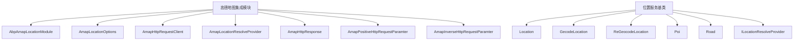
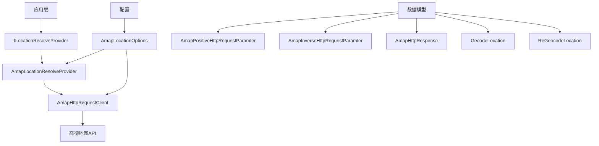
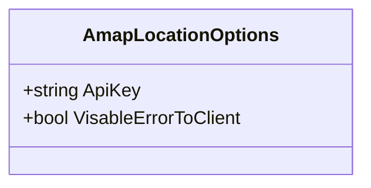
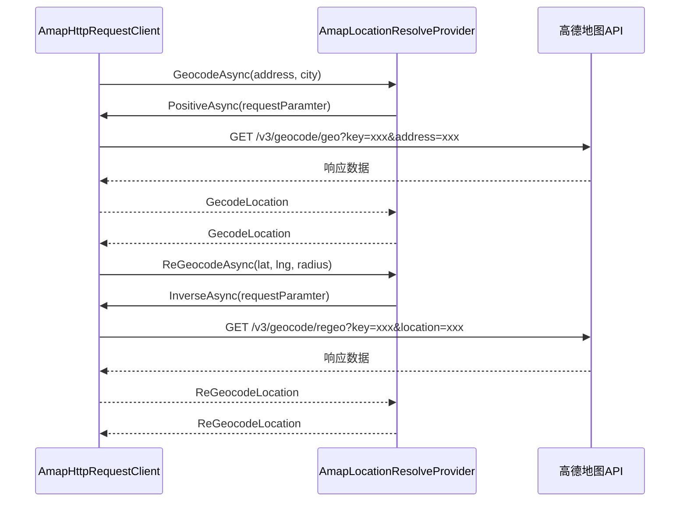
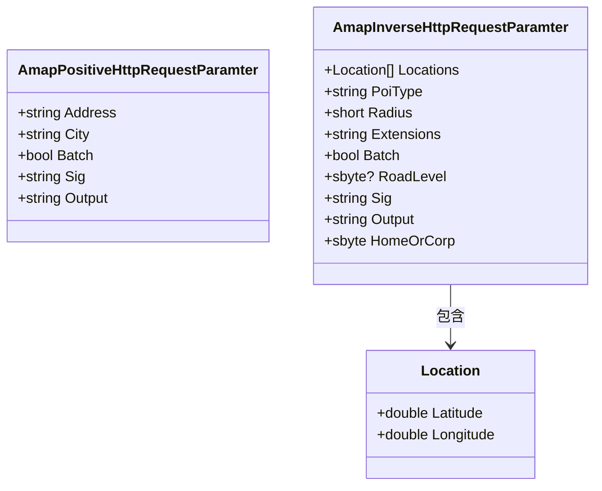
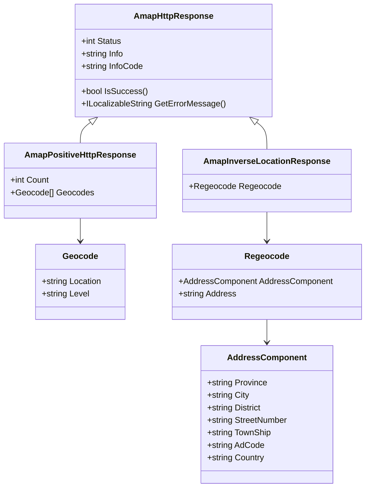
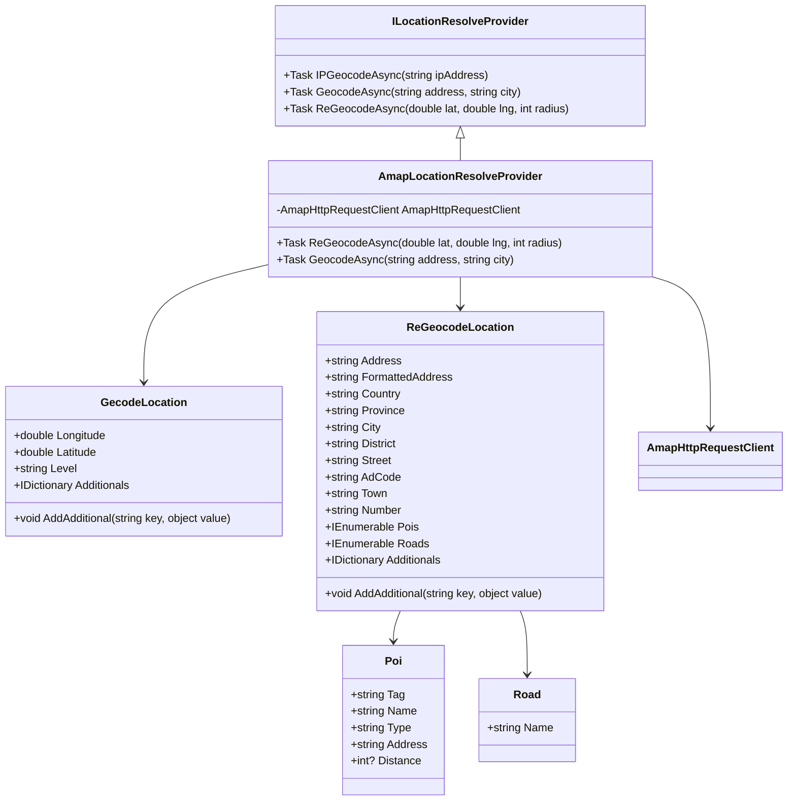
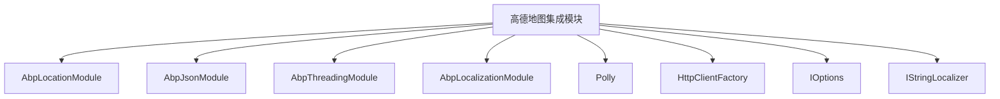

# 高德地图集成

<cite>
**本文档引用的文件**
- [AbpAmapLocationModule.cs](file://aspnet-core/framework/common/LINGYUN.Abp.Location.Amap/LINGYUN/Abp/Location/Amap/AbpAmapLocationModule.cs)
- [AmapLocationOptions.cs](file://aspnet-core/framework/common/LINGYUN.Abp.Location.Amap/LINGYUN/Abp/Location/Amap/AmapLocationOptions.cs)
- [AmapHttpRequestClient.cs](file://aspnet-core/framework/common/LINGYUN.Abp.Location.Amap/LINGYUN/Abp/Location/Amap/AmapHttpRequestClient.cs)
- [AmapLocationResolveProvider.cs](file://aspnet-core/framework/common/LINGYUN.Abp.Location.Amap/LINGYUN/Abp/Location/Amap/AmapLocationResolveProvider.cs)
- [AmapHttpResponse.cs](file://aspnet-core/framework/common/LINGYUN.Abp.Location.Amap/LINGYUN/Abp/Location/Amap/AmapHttpResponse.cs)
- [AmapPositiveHttpRequestParamter.cs](file://aspnet-core/framework/common/LINGYUN.Abp.Location.Amap/LINGYUN/Abp/Location/Amap/AmapPositiveHttpRequestParamter.cs)
- [AmapInverseHttpRequestParamter.cs](file://aspnet-core/framework/common/LINGYUN.Abp.Location.Amap/LINGYUN/Abp/Location/Amap/AmapInverseHttpRequestParamter.cs)
- [Location.cs](file://aspnet-core/framework/common/LINGYUN.Abp.Location/LINGYUN/Abp/Location/Location.cs)
- [GecodeLocation.cs](file://aspnet-core/framework/common/LINGYUN.Abp.Location/LINGYUN/Abp/Location/GecodeLocation.cs)
- [ReGeocodeLocation.cs](file://aspnet-core/framework/common/LINGYUN.Abp.Location/LINGYUN/Abp/Location/ReGeocodeLocation.cs)
- [Poi.cs](file://aspnet-core/framework/common/LINGYUN.Abp.Location/LINGYUN/Abp/Location/Poi.cs)
- [Road.cs](file://aspnet-core/framework/common/LINGYUN.Abp.Location/LINGYUN/Abp/Location/Road.cs)
- [ILocationResolveProvider.cs](file://aspnet-core/framework/common/LINGYUN.Abp.Location/LINGYUN/Abp/Location/ILocationResolveProvider.cs)
</cite>

## 目录
1. [简介](#简介)
2. [项目结构](#项目结构)
3. [核心组件](#核心组件)
4. [架构概述](#架构概述)
5. [详细组件分析](#详细组件分析)
6. [依赖分析](#依赖分析)
7. [性能考虑](#性能考虑)
8. [故障排除指南](#故障排除指南)
9. [结论](#结论)

## 简介
本文档详细说明了如何在ABP框架中集成高德地图服务，包括API密钥配置、地理编码和逆地理编码功能的实现。文档涵盖了高德地图API的调用限制、请求频率控制、错误处理机制以及API调用失败时的降级策略。同时提供了实际代码示例，展示在业务逻辑中调用高德地图服务的方法，包括HTTP客户端配置、请求参数构造、响应数据解析等细节，并说明了高德地图服务与其他位置服务的兼容性设计。

## 项目结构
高德地图集成模块位于`aspnet-core/framework/common/LINGYUN.Abp.Location.Amap`目录下，是ABP框架位置服务的一部分。该模块提供了对高德地图API的封装，实现了地理编码和逆地理编码功能。

**图示来源**
- [AbpAmapLocationModule.cs](file://aspnet-core/framework/common/LINGYUN.Abp.Location.Amap/LINGYUN/Abp/Location/Amap/AbpAmapLocationModule.cs)
- [AmapLocationOptions.cs](file://aspnet-core/framework/common/LINGYUN.Abp.Location.Amap/LINGYUN/Abp/Location/Amap/AmapLocationOptions.cs)
- [AmapHttpRequestClient.cs](file://aspnet-core/framework/common/LINGYUN.Abp.Location.Amap/LINGYUN/Abp/Location/Amap/AmapHttpRequestClient.cs)
- [Location.cs](file://aspnet-core/framework/common/LINGYUN.Abp.Location/LINGYUN/Abp/Location/Location.cs)
- [GecodeLocation.cs](file://aspnet-core/framework/common/LINGYUN.Abp.Location/LINGYUN/Abp/Location/GecodeLocation.cs)
- [ReGeocodeLocation.cs](file://aspnet-core/framework/common/LINGYUN.Abp.Location/LINGYUN/Abp/Location/ReGeocodeLocation.cs)

**章节来源**
- [AbpAmapLocationModule.cs](file://aspnet-core/framework/common/LINGYUN.Abp.Location.Amap/LINGYUN/Abp/Location/Amap/AbpAmapLocationModule.cs#L1-L41)
- [AmapLocationOptions.cs](file://aspnet-core/framework/common/LINGYUN.Abp.Location.Amap/LINGYUN/Abp/Location/Amap/AmapLocationOptions.cs#L1-L9)

## 核心组件
高德地图集成模块的核心组件包括配置选项、HTTP客户端、请求参数类、响应处理类和位置解析提供程序。这些组件共同实现了对高德地图API的封装和调用。

**章节来源**
- [AmapLocationOptions.cs](file://aspnet-core/framework/common/LINGYUN.Abp.Location.Amap/LINGYUN/Abp/Location/Amap/AmapLocationOptions.cs#L1-L9)
- [AmapHttpRequestClient.cs](file://aspnet-core/framework/common/LINGYUN.Abp.Location.Amap/LINGYUN/Abp/Location/Amap/AmapHttpRequestClient.cs#L1-L207)
- [AmapLocationResolveProvider.cs](file://aspnet-core/framework/common/LINGYUN.Abp.Location.Amap/LINGYUN/Abp/Location/Amap/AmapLocationResolveProvider.cs#L1-L42)

## 架构概述
高德地图集成模块采用分层架构设计，从上到下分别为模块层、服务层、HTTP客户端层和数据模型层。模块层负责注册服务和配置，服务层提供位置解析接口，HTTP客户端层负责与高德地图API通信，数据模型层定义了请求和响应的数据结构。

**图示来源**
- [AbpAmapLocationModule.cs](file://aspnet-core/framework/common/LINGYUN.Abp.Location.Amap/LINGYUN/Abp/Location/Amap/AbpAmapLocationModule.cs#L1-L41)
- [AmapLocationResolveProvider.cs](file://aspnet-core/framework/common/LINGYUN.Abp.Location.Amap/LINGYUN/Abp/Location/Amap/AmapLocationResolveProvider.cs#L1-L42)
- [AmapHttpRequestClient.cs](file://aspnet-core/framework/common/LINGYUN.Abp.Location.Amap/LINGYUN/Abp/Location/Amap/AmapHttpRequestClient.cs#L1-L207)

## 详细组件分析
### 配置选项分析
高德地图集成模块通过`AmapLocationOptions`类配置API密钥和其他选项。API密钥是调用高德地图API的必要凭证，必须在应用程序配置中正确设置。

**图示来源**
- [AmapLocationOptions.cs](file://aspnet-core/framework/common/LINGYUN.Abp.Location.Amap/LINGYUN/Abp/Location/Amap/AmapLocationOptions.cs#L1-L9)

**章节来源**
- [AmapLocationOptions.cs](file://aspnet-core/framework/common/LINGYUN.Abp.Location.Amap/LINGYUN/Abp/Location/Amap/AmapLocationOptions.cs#L1-L9)

### HTTP客户端分析
`AmapHttpRequestClient`类负责与高德地图API进行HTTP通信。它使用HttpClientFactory创建HTTP客户端，并通过配置的API密钥构造请求URL。客户端实现了正向地理编码和逆向地理编码的API调用。

**图示来源**
- [AmapLocationResolveProvider.cs](file://aspnet-core/framework/common/LINGYUN.Abp.Location.Amap/LINGYUN/Abp/Location/Amap/AmapLocationResolveProvider.cs#L1-L42)
- [AmapHttpRequestClient.cs](file://aspnet-core/framework/common/LINGYUN.Abp.Location.Amap/LINGYUN/Abp/Location/Amap/AmapHttpRequestClient.cs#L1-L207)

**章节来源**
- [AmapHttpRequestClient.cs](file://aspnet-core/framework/common/LINGYUN.Abp.Location.Amap/LINGYUN/Abp/Location/Amap/AmapHttpRequestClient.cs#L1-L207)

### 请求参数分析
高德地图集成模块定义了两个请求参数类：`AmapPositiveHttpRequestParamter`用于正向地理编码，`AmapInverseHttpRequestParamter`用于逆向地理编码。这些类封装了API调用所需的所有参数。

**图示来源**
- [AmapPositiveHttpRequestParamter.cs](file://aspnet-core/framework/common/LINGYUN.Abp.Location.Amap/LINGYUN/Abp/Location/Amap/AmapPositiveHttpRequestParamter.cs#L1-L46)
- [AmapInverseHttpRequestParamter.cs](file://aspnet-core/framework/common/LINGYUN.Abp.Location.Amap/LINGYUN/Abp/Location/Amap/AmapInverseHttpRequestParamter.cs#L1-L73)
- [Location.cs](file://aspnet-core/framework/common/LINGYUN.Abp.Location/LINGYUN/Abp/Location/Location.cs#L1-L97)

**章节来源**
- [AmapPositiveHttpRequestParamter.cs](file://aspnet-core/framework/common/LINGYUN.Abp.Location.Amap/LINGYUN/Abp/Location/Amap/AmapPositiveHttpRequestParamter.cs#L1-L46)
- [AmapInverseHttpRequestParamter.cs](file://aspnet-core/framework/common/LINGYUN.Abp.Location.Amap/LINGYUN/Abp/Location/Amap/AmapInverseHttpRequestParamter.cs#L1-L73)

### 响应处理分析
`AmapHttpResponse`类是所有高德地图API响应的基类，定义了标准的响应结构，包括状态码、状态说明和错误码。子类如`AmapPositiveHttpResponse`和`AmapInverseLocationResponse`继承了这些属性并添加了特定于API的响应数据。

**图示来源**
- [AmapHttpResponse.cs](file://aspnet-core/framework/common/LINGYUN.Abp.Location.Amap/LINGYUN/Abp/Location/Amap/AmapHttpResponse.cs#L1-L122)
- [AmapHttpRequestClient.cs](file://aspnet-core/framework/common/LINGYUN.Abp.Location.Amap/LINGYUN/Abp/Location/Amap/AmapHttpRequestClient.cs#L1-L207)

**章节来源**
- [AmapHttpResponse.cs](file://aspnet-core/framework/common/LINGYUN.Abp.Location.Amap/LINGYUN/Abp/Location/Amap/AmapHttpResponse.cs#L1-L122)

### 位置解析提供程序分析
`AmapLocationResolveProvider`类实现了`ILocationResolveProvider`接口，提供了正向和逆向地理编码的服务。它依赖于`AmapHttpRequestClient`来执行实际的API调用，并将结果转换为统一的位置数据模型。

**图示来源**
- [ILocationResolveProvider.cs](file://aspnet-core/framework/common/LINGYUN.Abp.Location/LINGYUN/Abp/Location/ILocationResolveProvider.cs#L1-L13)
- [AmapLocationResolveProvider.cs](file://aspnet-core/framework/common/LINGYUN.Abp.Location.Amap/LINGYUN/Abp/Location/Amap/AmapLocationResolveProvider.cs#L1-L42)
- [GecodeLocation.cs](file://aspnet-core/framework/common/LINGYUN.Abp.Location/LINGYUN/Abp/Location/GecodeLocation.cs#L1-L39)
- [ReGeocodeLocation.cs](file://aspnet-core/framework/common/LINGYUN.Abp.Location/LINGYUN/Abp/Location/ReGeocodeLocation.cs#L1-L75)
- [Poi.cs](file://aspnet-core/framework/common/LINGYUN.Abp.Location/LINGYUN/Abp/Location/Poi.cs#L1-L11)
- [Road.cs](file://aspnet-core/framework/common/LINGYUN.Abp.Location/LINGYUN/Abp/Location/Road.cs#L1-L7)

**章节来源**
- [AmapLocationResolveProvider.cs](file://aspnet-core/framework/common/LINGYUN.Abp.Location.Amap/LINGYUN/Abp/Location/Amap/AmapLocationResolveProvider.cs#L1-L42)
- [GecodeLocation.cs](file://aspnet-core/framework/common/LINGYUN.Abp.Location/LINGYUN/Abp/Location/GecodeLocation.cs#L1-L39)
- [ReGeocodeLocation.cs](file://aspnet-core/framework/common/LINGYUN.Abp.Location/LINGYUN/Abp/Location/ReGeocodeLocation.cs#L1-L75)

## 依赖分析
高德地图集成模块依赖于ABP框架的核心模块，包括JSON序列化、本地化、虚拟文件系统和线程处理模块。它还使用了Polly库进行HTTP错误重试策略。

**图示来源**
- [AbpAmapLocationModule.cs](file://aspnet-core/framework/common/LINGYUN.Abp.Location.Amap/LINGYUN/Abp/Location/Amap/AbpAmapLocationModule.cs#L1-L41)
- [AmapHttpRequestClient.cs](file://aspnet-core/framework/common/LINGYUN.Abp.Location.Amap/LINGYUN/Abp/Location/Amap/AmapHttpRequestClient.cs#L1-L207)

**章节来源**
- [AbpAmapLocationModule.cs](file://aspnet-core/framework/common/LINGYUN.Abp.Location.Amap/LINGYUN/Abp/Location/Amap/AbpAmapLocationModule.cs#L1