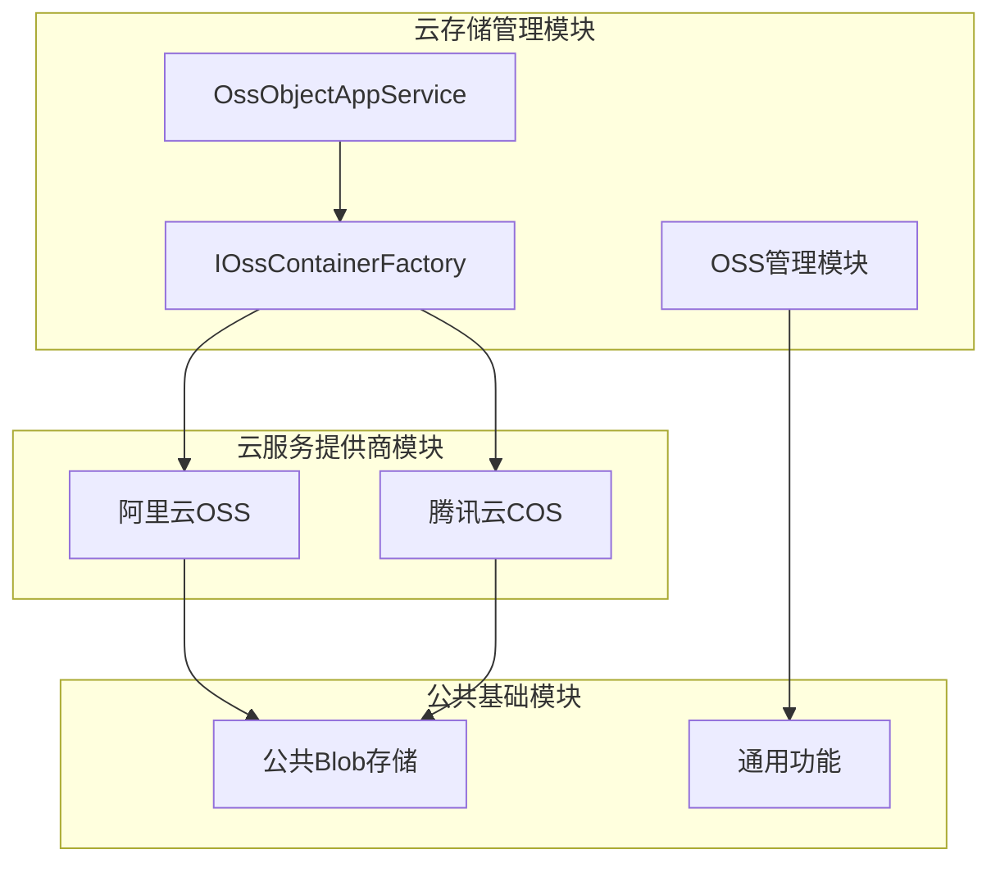
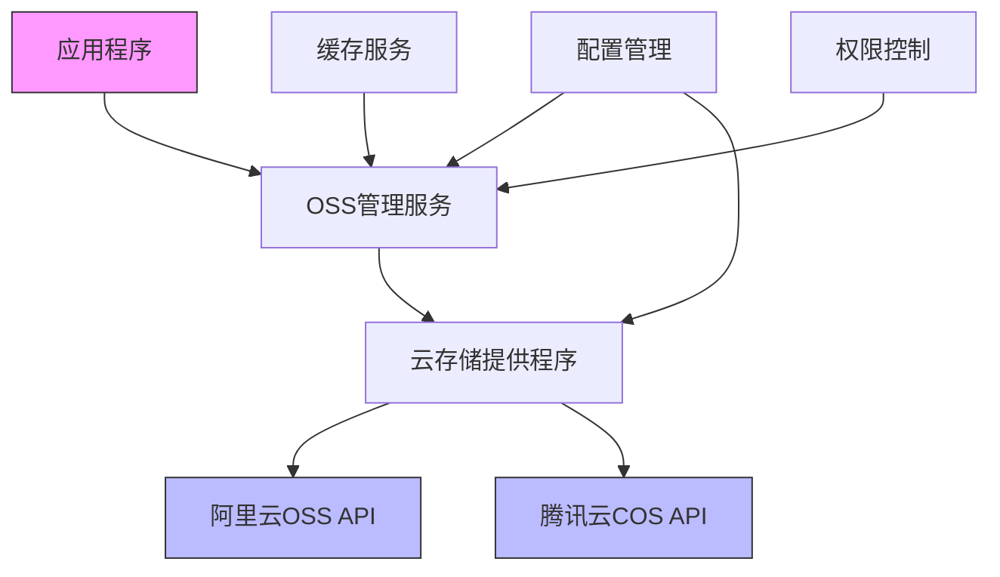
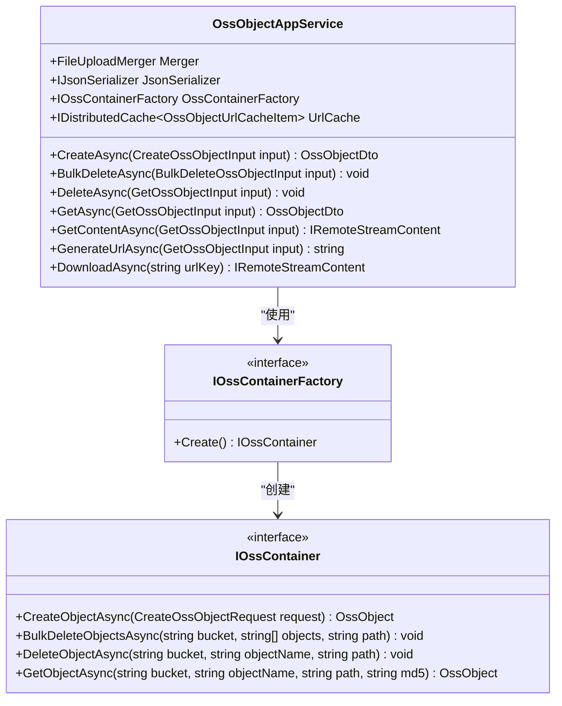
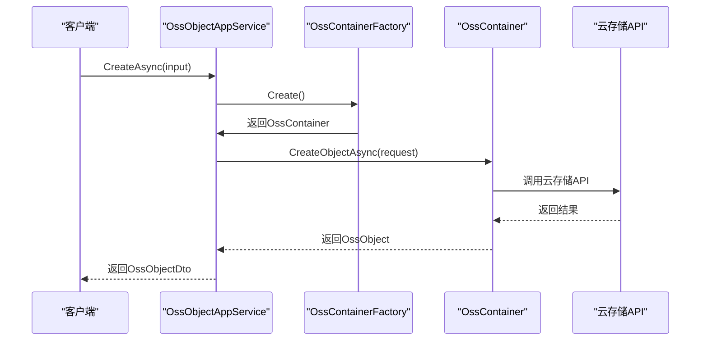

# 云存储集成

<cite>
**本文档引用的文件**
- [AliyunBlobProvider.cs](file://aspnet-core/framework/common/LINGYUN.Abp.BlobStoring.Aliyun/LINGYUN/Abp/BlobStoring/Aliyun/AliyunBlobProvider.cs)
- [TencentCloudBlobProvider.cs](file://aspnet-core/framework/cloud-tencent/LINGYUN.Abp.BlobStoring.Tencent/LINGYUN/Abp/BlobStoring/Tencent/TencentCloudBlobProvider.cs)
- [OssObjectAppService.cs](file://aspnet-core/modules/oss-management/LINGYUN.Abp.OssManagement.Application/LINGYUN/Abp/OssManagement/OssObjectAppService.cs)
- [AliyunBlobProviderConfiguration.cs](file://aspnet-core/framework/common/LINGYUN.Abp.BlobStoring.Aliyun/LINGYUN/Abp/BlobStoring/Aliyun/AliyunBlobProviderConfiguration.cs)
- [TencentBlobProviderConfiguration.cs](file://aspnet-core/framework/cloud-tencent/LINGYUN.Abp.BlobStoring.Tencent/LINGYUN/Abp/BlobStoring/Tencent/TencentBlobProviderConfiguration.cs)
- [AbpAliyunModule.cs](file://aspnet-core/framework/cloud-aliyun/LINGYUN.Abp.Aliyun/LINGYUN/Abp/Aliyun/AbpAliyunModule.cs)
- [AbpTencentCloudModule.cs](file://aspnet-core/framework/cloud-tencent/LINGYUN.Abp.Tencent/LINGYUN/Abp/Tencent/AbpTencentCloudModule.cs)
</cite>

## 目录
1. [简介](#简介)
2. [项目结构](#项目结构)
3. [核心组件](#核心组件)
4. [架构概述](#架构概述)
5. [详细组件分析](#详细组件分析)
6. [依赖分析](#依赖分析)
7. [性能考虑](#性能考虑)
8. [故障排除指南](#故障排除指南)
9. [结论](#结论)

## 简介
本文档详细介绍了在ABP框架中集成阿里云OSS和腾讯云COS的实现方案。文档涵盖了云存储提供程序的配置参数、认证机制、存储桶管理策略以及网络优化配置等关键方面。重点说明了云存储客户端的初始化、文件上传下载、权限控制、预签名URL生成等操作的实现细节。同时提供了多云存储的配置示例和切换策略，以及大文件分片上传、断点续传等高级功能的实现方案。文档还包含了云存储服务的性能优化建议、成本控制策略和安全最佳实践，如跨区域复制、生命周期管理、访问日志分析等。

## 项目结构
本项目采用模块化设计，云存储相关功能分布在多个模块中。阿里云和腾讯云的集成分别由独立的模块实现，确保了代码的可维护性和可扩展性。核心的云存储管理功能位于`oss-management`模块中，而具体的云服务提供商实现则分布在`cloud-aliyun`和`cloud-tencent`模块中。

**图示来源**
- [OssObjectAppService.cs](file://aspnet-core/modules/oss-management/LINGYUN.Abp.OssManagement.Application/LINGYUN/Abp/OssManagement/OssObjectAppService.cs)
- [AliyunBlobProvider.cs](file://aspnet-core/framework/common/LINGYUN.Abp.BlobStoring.Aliyun/LINGYUN/Abp/BlobStoring/Aliyun/AliyunBlobProvider.cs)
- [TencentCloudBlobProvider.cs](file://aspnet-core/framework/cloud-tencent/LINGYUN.Abp.BlobStoring.Tencent/LINGYUN/Abp/BlobStoring/Tencent/TencentCloudBlobProvider.cs)

**节来源**
- [OssObjectAppService.cs](file://aspnet-core/modules/oss-management/LINGYUN.Abp.OssManagement.Application/LINGYUN/Abp/OssManagement/OssObjectAppService.cs)
- [AliyunBlobProvider.cs](file://aspnet-core/framework/common/LINGYUN.Abp.BlobStoring.Aliyun/LINGYUN/Abp/BlobStoring/Aliyun/AliyunBlobProvider.cs)
- [TencentCloudBlobProvider.cs](file://aspnet-core/framework/cloud-tencent/LINGYUN.Abp.BlobStoring.Tencent/LINGYUN/Abp/BlobStoring/Tencent/TencentCloudBlobProvider.cs)

## 核心组件
云存储集成的核心组件包括OSS管理服务、云存储提供程序和配置管理。OSS管理服务提供统一的API接口，封装了底层云存储的具体实现细节。云存储提供程序实现了与特定云服务商的交互逻辑，包括阿里云OSS和腾讯云COS。配置管理组件负责处理云存储的各项配置参数，确保系统能够灵活适应不同的部署环境。

**节来源**
- [OssObjectAppService.cs](file://aspnet-core/modules/oss-management/LINGYUN.Abp.OssManagement.Application/LINGYUN/Abp/OssManagement/OssObjectAppService.cs)
- [AliyunBlobProvider.cs](file://aspnet-core/framework/common/LINGYUN.Abp.BlobStoring.Aliyun/LINGYUN/Abp/BlobStoring/Aliyun/AliyunBlobProvider.cs)
- [TencentCloudBlobProvider.cs](file://aspnet-core/framework/cloud-tencent/LINGYUN.Abp.BlobStoring.Tencent/LINGYUN/Abp/BlobStoring/Tencent/TencentCloudBlobProvider.cs)

## 架构概述
云存储集成采用分层架构设计，上层应用通过统一的OSS管理服务接口与底层云存储进行交互。OSS管理服务作为抽象层，屏蔽了不同云服务商的技术差异，提供了统一的文件操作API。云存储提供程序作为适配器层，实现了与具体云服务商的API对接。配置管理层则负责管理各项云存储配置，支持运行时动态调整。

**图示来源**
- [OssObjectAppService.cs](file://aspnet-core/modules/oss-management/LINGYUN.Abp.OssManagement.Application/LINGYUN/Abp/OssManagement/OssObjectAppService.cs)
- [AliyunBlobProvider.cs](file://aspnet-core/framework/common/LINGYUN.Abp.BlobStoring.Aliyun/LINGYUN/Abp/BlobStoring/Aliyun/AliyunBlobProvider.cs)
- [TencentCloudBlobProvider.cs](file://aspnet-core/framework/cloud-tencent/LINGYUN.Abp.BlobStoring.Tencent/LINGYUN/Abp/BlobStoring/Tencent/TencentCloudBlobProvider.cs)

## 详细组件分析

### OSS管理服务分析
OSS管理服务是云存储集成的核心，提供了文件的创建、删除、获取和下载等基本操作。服务通过依赖注入获取必要的组件，包括文件上传合并器、JSON序列化器、OSS容器工厂和URL缓存服务。权限控制通过ABP框架的授权机制实现，确保只有具备相应权限的用户才能执行特定操作。

#### 对象导向组件：

**图示来源**
- [OssObjectAppService.cs](file://aspnet-core/modules/oss-management/LINGYUN.Abp.OssManagement.Application/LINGYUN/Abp/OssManagement/OssObjectAppService.cs)
- [IOssContainerFactory.cs](file://aspnet-core/modules/oss-management/LINGYUN.Abp.OssManagement.Domain/LINGYUN/Abp/OssManagement/IOssContainerFactory.cs)

#### API/服务组件：

**图示来源**
- [OssObjectAppService.cs](file://aspnet-core/modules/oss-management/LINGYUN.Abp.OssManagement.Application/LINGYUN/Abp/OssManagement/OssObjectAppService.cs)

**节来源**
- [OssObjectAppService.cs](file://aspnet-core/modules/oss-management/LINGYUN.Abp.OssManagement.Application/LINGYUN