# 腾讯云COS集成

<cite>
**本文档引用的文件**
- [TencentBlobProviderConfiguration.cs](file://aspnet-core/framework/cloud-tencent/LINGYUN.Abp.BlobStoring.Tencent/LINGYUN/Abp/BlobStoring/Tencent/TencentBlobProviderConfiguration.cs)
- [TencentBlobProviderConfigurationNames.cs](file://aspnet-core/framework/cloud-tencent/LINGYUN.Abp.BlobStoring.Tencent/LINGYUN/Abp/BlobStoring/Tencent/TencentBlobProviderConfigurationNames.cs)
- [TencentCloudBlobProvider.cs](file://aspnet-core/framework/cloud-tencent/LINGYUN.Abp.BlobStoring.Tencent/LINGYUN/Abp/BlobStoring/Tencent/TencentCloudBlobProvider.cs)
- [CosClientFactory.cs](file://aspnet-core/framework/cloud-tencent/LINGYUN.Abp.BlobStoring.Tencent/LINGYUN/Abp/BlobStoring/Tencent/CosClientFactory.cs)
- [ICosClientFactory.cs](file://aspnet-core/framework/cloud-tencent/LINGYUN.Abp.BlobStoring.Tencent/LINGYUN/Abp/BlobStoring/Tencent/ICosClientFactory.cs)
- [DefaultTencentBlobNameCalculator.cs](file://aspnet-core/framework/cloud-tencent/LINGYUN.Abp.BlobStoring.Tencent/LINGYUN/Abp/BlobStoring/Tencent/DefaultTencentBlobNameCalculator.cs)
- [TencentBlobNamingNormalizer.cs](file://aspnet-core/framework/cloud-tencent/LINGYUN.Abp.BlobStoring.Tencent/LINGYUN/Abp/BlobStoring/Tencent/TencentBlobNamingNormalizer.cs)
- [AbpBlobStoringTencentCloudModule.cs](file://aspnet-core/framework/cloud-tencent/LINGYUN.Abp.BlobStoring.Tencent/LINGYUN/Abp/BlobStoring/Tencent/AbpBlobStoringTencentCloudModule.cs)
- [TencentBlobContainerConfigurationExtensions.cs](file://aspnet-core/framework/cloud-tencent/LINGYUN.Abp.BlobStoring.Tencent/LINGYUN/Abp/BlobStoring/Tencent/TencentBlobContainerConfigurationExtensions.cs)
- [AbstractTencentCloudClientFactory.cs](file://aspnet-core/framework/cloud-tencent/LINGYUN.Abp.Tencent/LINGYUN/Abp/Tencent/AbstractTencentCloudClientFactory.cs)
- [TencentCloudFeatures.cs](file://aspnet-core/framework/cloud-tencent/LINGYUN.Abp.Tencent/LINGYUN/Abp/Tencent/Features/TencentCloudFeatures.cs)
- [TencentCloudSettingNames.cs](file://aspnet-core/framework/cloud-tencent/LINGYUN.Abp.Tencent/LINGYUN/Abp/Tencent/Settings/TencentCloudSettingNames.cs)
- [README.md](file://aspnet-core/framework/cloud-tencent/LINGYUN.Abp.BlobStoring.Tencent/README.md)
</cite>

## 目录
1. [简介](#简介)
2. [项目结构](#项目结构)
3. [核心组件](#核心组件)
4. [架构概览](#架构概览)
5. [详细组件分析](#详细组件分析)
6. [配置参数详解](#配置参数详解)
7. [认证机制](#认证机制)
8. [存储桶管理策略](#存储桶管理策略)
9. [网络优化配置](#网络优化配置)
10. [高级功能实现](#高级功能实现)
11. [性能优化建议](#性能优化建议)
12. [故障排除指南](#故障排除指南)
13. [结论](#结论)

## 简介

AbpBlobStoringTencent模块是ABP框架中专门用于集成腾讯云对象存储（COS）的服务模块。该模块提供了完整的COS客户端初始化、文件上传下载、权限控制、预签名URL生成等功能，支持多租户配置、自动创建存储桶、防盗链配置等高级特性。

该模块基于腾讯云官方SDK构建，采用依赖注入模式设计，与ABP框架的BlobStoring系统无缝集成，为开发者提供了简单易用的对象存储解决方案。

## 项目结构

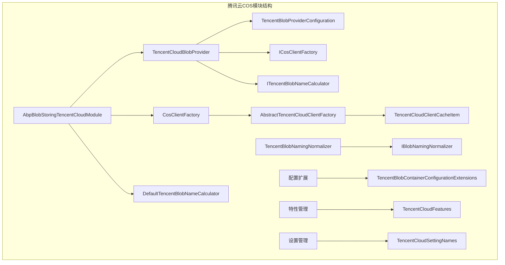

**图表来源**
- [AbpBlobStoringTencentCloudModule.cs](file://aspnet-core/framework/cloud-tencent/LINGYUN.Abp.BlobStoring.Tencent/LINGYUN/Abp/BlobStoring/Tencent/AbpBlobStoringTencentCloudModule.cs#L1-L29)
- [TencentCloudBlobProvider.cs](file://aspnet-core/framework/cloud-tencent/LINGYUN.Abp.BlobStoring.Tencent/LINGYUN/Abp/BlobStoring/Tencent/TencentCloudBlobProvider.cs#L1-L50)

**章节来源**
- [README.md](file://aspnet-core/framework/cloud-tencent/LINGYUN.Abp.BlobStoring.Tencent/README.md#L1-L50)

## 核心组件

### TencentCloudBlobProvider

这是模块的核心组件，负责处理所有与腾讯云COS相关的操作。它继承自`BlobProviderBase`并实现了`ITransientDependency`接口。

主要功能：
- 文件上传和下载
- 存储桶存在性检查
- 文件删除操作
- 权限控制和防盗链配置

### CosClientFactory

负责创建和管理COS客户端实例，采用单例模式确保性能优化。

### TencentBlobProviderConfiguration

配置类，封装了所有与腾讯云COS相关的配置参数。

**章节来源**
- [TencentCloudBlobProvider.cs](file://aspnet-core/framework/cloud-tencent/LINGYUN.Abp.BlobStoring.Tencent/LINGYUN/Abp/BlobStoring/Tencent/TencentCloudBlobProvider.cs#L1-L183)
- [CosClientFactory.cs](file://aspnet-core/framework/cloud-tencent/LINGYUN.Abp.BlobStoring.Tencent/LINGYUN/Abp/BlobStoring/Tencent/CosClientFactory.cs#L1-L71)

## 架构概览

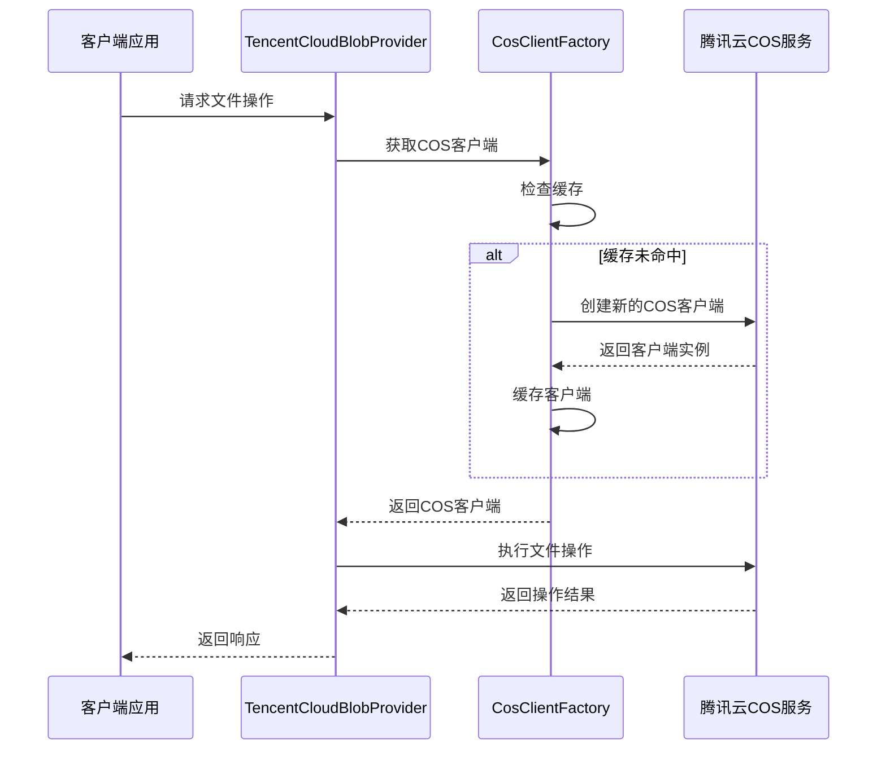

**图表来源**
- [TencentCloudBlobProvider.cs](file://aspnet-core/framework/cloud-tencent/LINGYUN.Abp.BlobStoring.Tencent/LINGYUN/Abp/BlobStoring/Tencent/TencentCloudBlobProvider.cs#L90-L110)
- [CosClientFactory.cs](file://aspnet-core/framework/cloud-tencent/LINGYUN.Abp.BlobStoring.Tencent/LINGYUN/Abp/BlobStoring/Tencent/CosClientFactory.cs#L30-L60)

## 详细组件分析

### TencentCloudBlobProvider详细分析

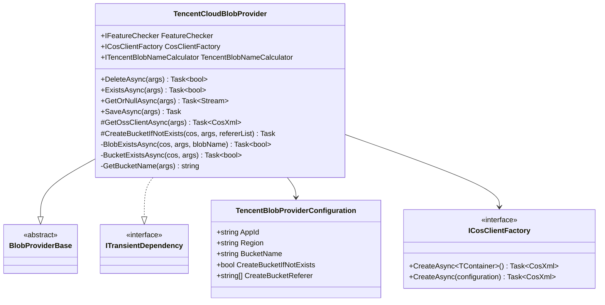

**图表来源**
- [TencentCloudBlobProvider.cs](file://aspnet-core/framework/cloud-tencent/LINGYUN.Abp.BlobStoring.Tencent/LINGYUN/Abp/BlobStoring/Tencent/TencentCloudBlobProvider.cs#L15-L30)
- [TencentBlobProviderConfiguration.cs](file://aspnet-core/framework/cloud-tencent/LINGYUN.Abp.BlobStoring.Tencent/LINGYUN/Abp/BlobStoring/Tencent/TencentBlobProviderConfiguration.cs#L7-L62)

### CosClientFactory详细分析

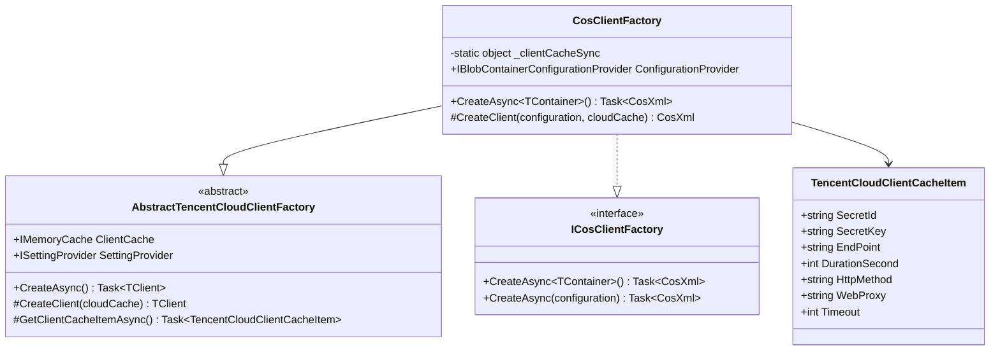

**图表来源**
- [CosClientFactory.cs](file://aspnet-core/framework/cloud-tencent/LINGYUN.Abp.BlobStoring.Tencent/LINGYUN/Abp/BlobStoring/Tencent/CosClientFactory.cs#L13-L30)
- [AbstractTencentCloudClientFactory.cs](file://aspnet-core/framework/cloud-tencent/LINGYUN.Abp.Tencent/LINGYUN/Abp/Tencent/AbstractTencentCloudClientFactory.cs#L10-L50)

**章节来源**
- [TencentCloudBlobProvider.cs](file://aspnet-core/framework/cloud-tencent/LINGYUN.Abp.BlobStoring.Tencent/LINGYUN/Abp/BlobStoring/Tencent/TencentCloudBlobProvider.cs#L15-L183)
- [CosClientFactory.cs](file://aspnet-core/framework/cloud-tencent/LINGYUN.Abp.BlobStoring.Tencent/LINGYUN/Abp/BlobStoring/Tencent/CosClientFactory.cs#L13-L71)

## 配置参数详解

### 基础配置参数

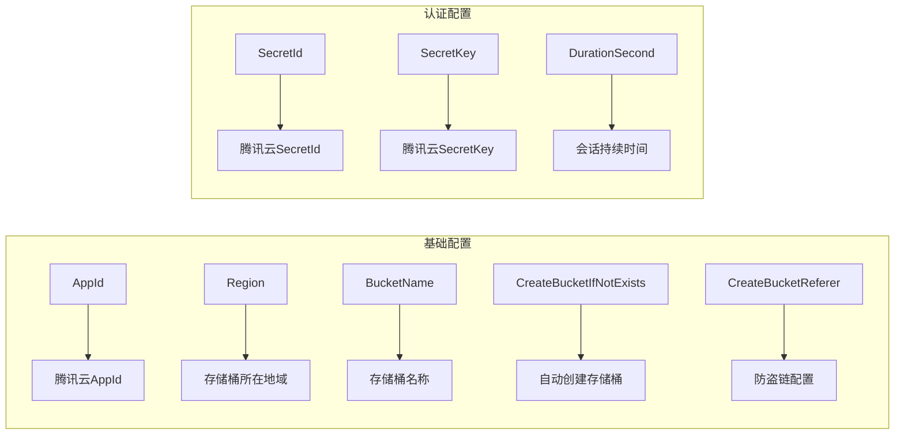

**图表来源**
- [TencentBlobProviderConfiguration.cs](file://aspnet-core/framework/cloud-tencent/LINGYUN.Abp.BlobStoring.Tencent/LINGYUN/Abp/BlobStoring/Tencent/TencentBlobProviderConfiguration.cs#L7-L62)
- [TencentBlobProviderConfigurationNames.cs](file://aspnet-core/framework/cloud-tencent/LINGYUN.Abp.BlobStoring.Tencent/LINGYUN/Abp/BlobStoring/Tencent/TencentBlobProviderConfigurationNames.cs#L3-L25)

### 配置参数说明

#### AppId
- **类型**: string
- **描述**: 腾讯云AppId，用于标识应用身份
- **默认值**: 无
- **必需**: 是

#### Region
- **类型**: string
- **描述**: 存储桶所在的地域，如`ap-guangzhou`、`ap-shanghai`
- **默认值**: 无
- **必需**: 是

#### BucketName
- **类型**: string
- **描述**: 存储桶名称，如果不设置则使用容器名称
- **默认值**: 无
- **必需**: 是

#### CreateBucketIfNotExists
- **类型**: bool
- **描述**: 当存储桶不存在时是否自动创建
- **默认值**: false
- **必需**: 否

#### CreateBucketReferer
- **类型**: List<string>
- **描述**: 创建存储桶时的防盗链域名列表
- **默认值**: []
- **必需**: 否

**章节来源**
- [TencentBlobProviderConfiguration.cs](file://aspnet-core/framework/cloud-tencent/LINGYUN.Abp.BlobStoring.Tencent/LINGYUN/Abp/BlobStoring/Tencent/TencentBlobProviderConfiguration.cs#L7-L62)
- [README.md](file://aspnet-core/framework/cloud-tencent/LINGYUN.Abp.BlobStoring.Tencent/README.md#L15-L40)

## 认证机制

### SecretId/SecretKey认证

腾讯云COS模块采用基于SecretId和SecretKey的身份验证机制：

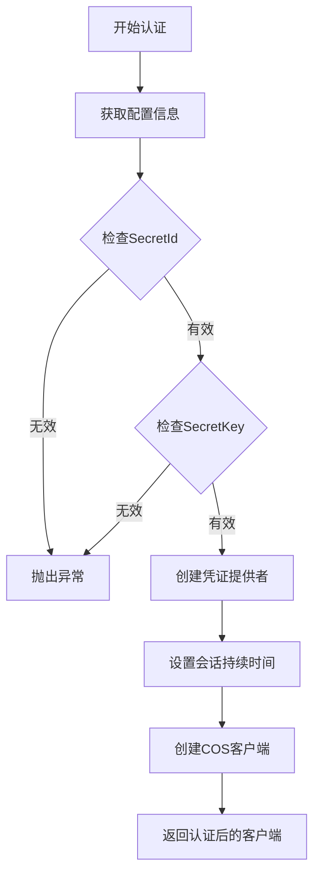

**图表来源**
- [CosClientFactory.cs](file://aspnet-core/framework/cloud-tencent/LINGYUN.Abp.BlobStoring.Tencent/LINGYUN/Abp/BlobStoring/Tencent/CosClientFactory.cs#L40-L60)

### 凭证缓存机制

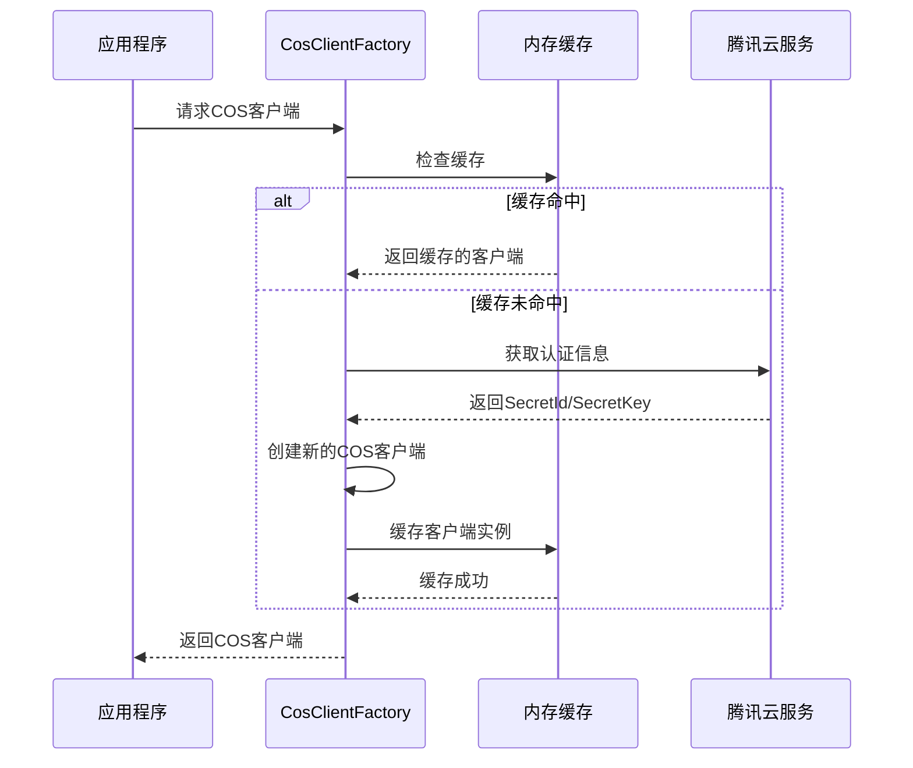

**图表来源**
- [CosClientFactory.cs](file://aspnet-core/framework/cloud-tencent/LINGYUN.Abp.BlobStoring.Tencent/LINGYUN/Abp/BlobStoring/Tencent/CosClientFactory.cs#L30-L60)

**章节来源**
- [CosClientFactory.cs](file://aspnet-core/framework/cloud-tencent/LINGYUN.Abp.BlobStoring.Tencent/LINGYUN/Abp/BlobStoring/Tencent/CosClientFactory.cs#L30-L71)

## 存储桶管理策略

### 自动创建存储桶

当`CreateBucketIfNotExists`设置为true时，模块会在首次访问时自动创建存储桶：

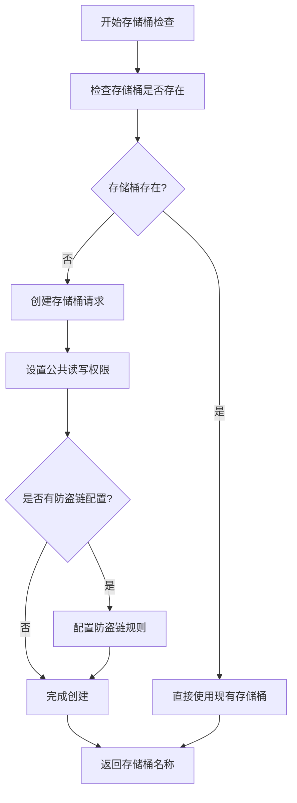

**图表来源**
- [TencentCloudBlobProvider.cs](file://aspnet-core/framework/cloud-tencent/LINGYUN.Abp.BlobStoring.Tencent/LINGYUN/Abp/BlobStoring/Tencent/TencentCloudBlobProvider.cs#L110-L140)

### 存储桶命名规范

腾讯云COS对存储桶名称有严格的命名规范：

1. **字符限制**: 仅支持小写字母、数字和中划线(-)
2. **长度限制**: 最大60个字符
3. **格式要求**: 不能以短划线开头或结尾
4. **唯一性**: 在同一地域内必须唯一

### 防盗链配置

模块支持在创建存储桶时配置防盗链规则：

```csharp
tencent.CreateBucketReferer = new List<string>
{
    "*.example.com",
    "example.com"
};
```

**章节来源**
- [TencentCloudBlobProvider.cs](file://aspnet-core/framework/cloud-tencent/LINGYUN.Abp.BlobStoring.Tencent/LINGYUN/Abp/BlobStoring/Tencent/TencentCloudBlobProvider.cs#L110-L140)
- [TencentBlobNamingNormalizer.cs](file://aspnet-core/framework/cloud-tencent/LINGYUN.Abp.BlobStoring.Tencent/LINGYUN/Abp/BlobStoring/Tencent/TencentBlobNamingNormalizer.cs#L30-L60)

## 网络优化配置

### 客户端缓存策略

模块采用内存缓存来优化网络连接性能：

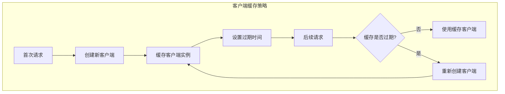

**图表来源**
- [CosClientFactory.cs](file://aspnet-core/framework/cloud-tencent/LINGYUN.Abp.BlobStoring.Tencent/LINGYUN/Abp/BlobStoring/Tencent/CosClientFactory.cs#L40-L60)

### 连接配置选项

模块支持多种网络连接配置：

- **超时设置**: 可配置HTTP请求超时时间
- **代理支持**: 支持通过代理服务器访问
- **HTTP方法**: 可配置使用的HTTP方法
- **连接区域**: 支持指定特定的连接区域

**章节来源**
- [AbstractTencentCloudClientFactory.cs](file://aspnet-core/framework/cloud-tencent/LINGYUN.Abp.Tencent/LINGYUN/Abp/Tencent/AbstractTencentCloudClientFactory.cs#L50-L100)
- [TencentCloudSettingNames.cs](file://aspnet-core/framework/cloud-tencent/LINGYUN.Abp.Tencent/LINGYUN/Abp/Tencent/Settings/TencentCloudSettingNames.cs#L20-L50)

## 高级功能实现

### 多租户支持

模块完全支持ABP框架的多租户架构，存储路径根据租户进行隔离：

```mermaid
graph LR
subgraph "多租户存储路径"
A[宿主模式] --> B[host/{blobName}]
C[租户模式] --> D[tenants/{tenantId}/{blobName}]
end
```

**图表来源**
- [DefaultTencentBlobNameCalculator.cs](file://aspnet-core/framework/cloud-tencent/LINGYUN.Abp.BlobStoring.Tencent/LINGYUN/Abp/BlobStoring/Tencent/DefaultTencentBlobNameCalculator.cs#L15-L23)

### 文件命名规范化

模块提供了严格的文件命名规范化功能：

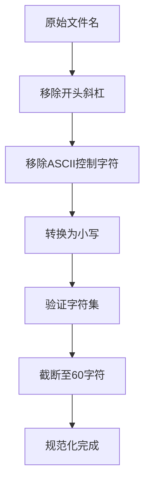

**图表来源**
- [TencentBlobNamingNormalizer.cs](file://aspnet-core/framework/cloud-tencent/LINGYUN.Abp.BlobStoring.Tencent/LINGYUN/Abp/BlobStoring/Tencent/TencentBlobNamingNormalizer.cs#L10-L40)

### 特性管理

模块提供了丰富的特性开关：

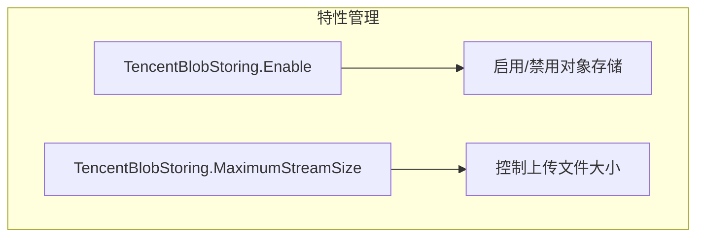

**图表来源**
- [TencentCloudFeatures.cs](file://aspnet-core/framework/cloud-tencent/LINGYUN.Abp.Tencent/LINGYUN/Abp/Tencent/Features/TencentCloudFeatures.cs#L15-L29)

**章节来源**
- [DefaultTencentBlobNameCalculator.cs](file://aspnet-core/framework/cloud-tencent/LINGYUN.Abp.BlobStoring.Tencent/LINGYUN/Abp/BlobStoring/Tencent/DefaultTencentBlobNameCalculator.cs#L15-L23)
- [TencentBlobNamingNormalizer.cs](file://aspnet-core/framework/cloud-tencent/LINGYUN.Abp.BlobStoring.Tencent/LINGYUN/Abp/BlobStoring/Tencent/TencentBlobNamingNormalizer.cs#L10-L60)
- [TencentCloudFeatures.cs](file://aspnet-core/framework/cloud-tencent/LINGYUN.Abp.Tencent/LINGYUN/Abp/Tencent/Features/TencentCloudFeatures.cs#L15-L29)

## 性能优化建议

### 客户端实例复用

模块采用单例模式管理COS客户端实例，避免频繁创建连接：

```csharp
// 客户端缓存示例
var cacheKey = TencentCloudClientCacheItem.CalculateCacheKey("client-instance");
var cosXmlCache = ClientCache.Get<CosXmlServer>(cacheKey);
if (cosXmlCache == null)
{
    // 创建新客户端并缓存
    cosXmlCache = new CosXmlServer(configBuilder.Build(), cred);
    ClientCache.Set(cacheKey, cosXmlCache, TimeSpan.FromSeconds(durationSecond - 60));
}
```

### 并发控制

使用锁机制确保客户端实例的线程安全性：

```csharp
private readonly static object _clientCacheSync = new();
lock(_clientCacheSync)
{
    // 确保只有一个线程创建客户端实例
}
```

### 缓存策略优化

- **过期时间**: 设置合理的缓存过期时间，通常比认证令牌的有效期少60秒
- **内存管理**: 使用内存缓存减少网络开销
- **并发访问**: 通过缓存机制提高并发性能

## 故障排除指南

### 常见问题及解决方案

#### 1. 认证失败
**问题**: 无法连接到腾讯云COS服务
**解决方案**:
- 检查SecretId和SecretKey是否正确
- 验证网络连接是否正常
- 确认地域配置是否正确

#### 2. 存储桶不存在
**问题**: 操作存储桶时出现404错误
**解决方案**:
- 启用`CreateBucketIfNotExists`选项
- 手动创建存储桶并配置权限
- 检查存储桶名称是否符合命名规范

#### 3. 文件上传失败
**问题**: 大文件上传超时或失败
**解决方案**:
- 检查文件大小限制配置
- 优化网络连接设置
- 考虑使用分片上传功能

#### 4. 权限问题
**问题**: 文件访问被拒绝
**解决方案**:
- 配置正确的防盗链规则
- 检查存储桶权限设置
- 验证用户权限配置

### 调试技巧

1. **启用详细日志**: 开启ABP框架的日志记录功能
2. **检查配置**: 验证所有配置参数是否正确
3. **网络测试**: 测试与腾讯云服务的网络连通性
4. **权限验证**: 确认IAM权限配置正确

**章节来源**
- [CosClientFactory.cs](file://aspnet-core/framework/cloud-tencent/LINGYUN.Abp.BlobStoring.Tencent/LINGYUN/Abp/BlobStoring/Tencent/CosClientFactory.cs#L40-L60)
- [TencentCloudBlobProvider.cs](file://aspnet-core/framework/cloud-tencent/LINGYUN.Abp.BlobStoring.Tencent/LINGYUN/Abp/BlobStoring/Tencent/TencentCloudBlobProvider.cs#L90-L110)

## 结论

AbpBlobStoringTencent模块为ABP框架提供了完整的腾讯云COS集成解决方案。该模块具有以下优势：

1. **功能完整**: 支持文件上传下载、存储桶管理、权限控制等完整功能
2. **性能优化**: 采用客户端缓存和单例模式提升性能
3. **易于配置**: 提供清晰的配置参数和使用示例
4. **多租户支持**: 完全兼容ABP框架的多租户架构
5. **安全可靠**: 实现了完善的认证机制和权限控制

通过合理配置和使用该模块，开发者可以快速构建高性能、高可用的对象存储应用，满足各种业务场景的需求。