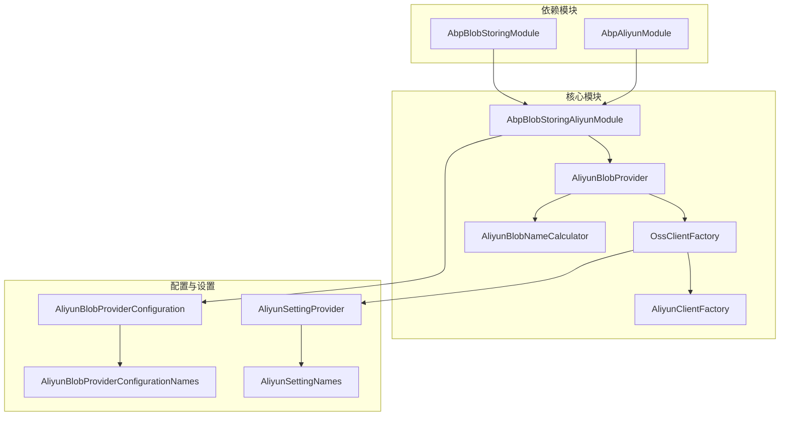
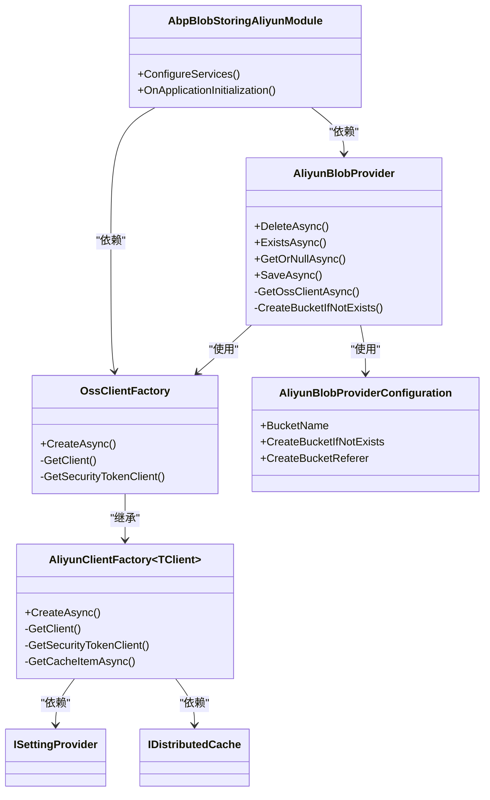
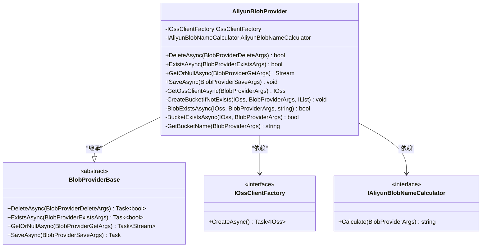
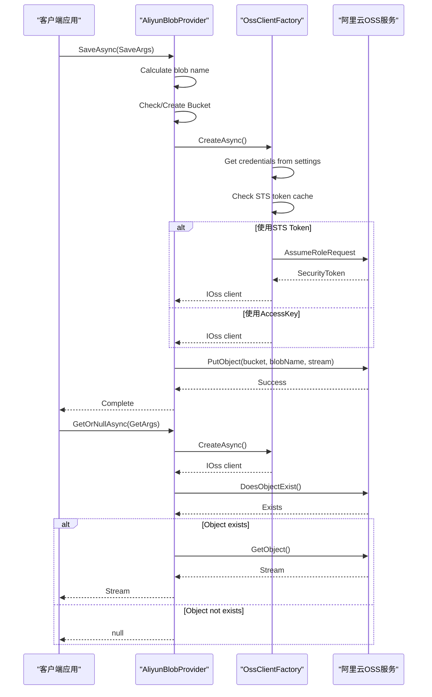
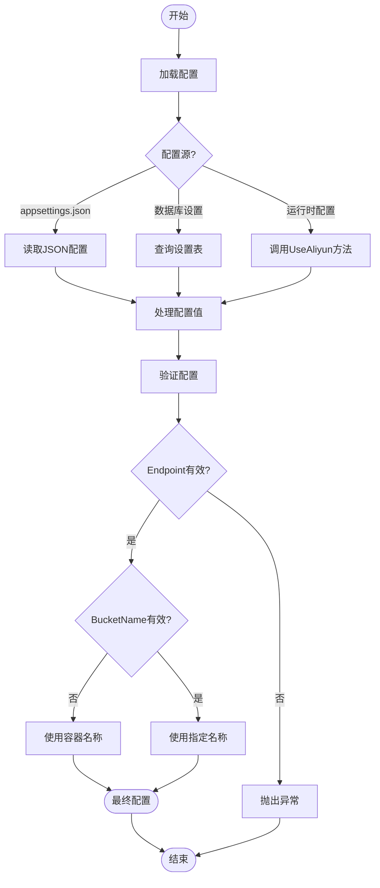
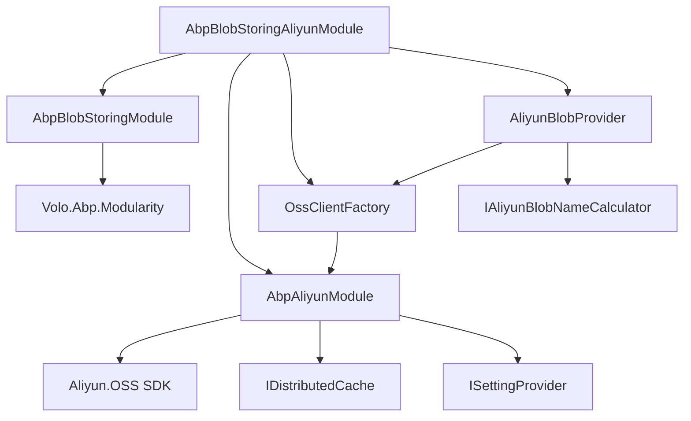
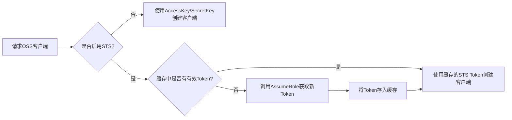

# 阿里云OSS集成

<cite>
**本文档引用的文件**
- [AbpBlobStoringAliyunModule.cs](file://aspnet-core\framework\common\LINGYUN.Abp.BlobStoring.Aliyun\LINGYUN\Abp\BlobStoring\Aliyun\AbpBlobStoringAliyunModule.cs)
- [AliyunBlobProvider.cs](file://aspnet-core\framework\common\LINGYUN.Abp.BlobStoring.Aliyun\LINGYUN\Abp\BlobStoring\Aliyun\AliyunBlobProvider.cs)
- [AliyunBlobProviderConfiguration.cs](file://aspnet-core\framework\common\LINGYUN.Abp.BlobStoring.Aliyun\LINGYUN\Abp\BlobStoring\Aliyun\AliyunBlobProviderConfiguration.cs)
- [AliyunBlobProviderConfigurationNames.cs](file://aspnet-core\framework\common\LINGYUN.Abp.BlobStoring.Aliyun\LINGYUN\Abp\BlobStoring\Aliyun\AliyunBlobProviderConfigurationNames.cs)
- [OssClientFactory.cs](file://aspnet-core\framework\common\LINGYUN.Abp.BlobStoring.Aliyun\LINGYUN\Abp\BlobStoring\Aliyun\OssClientFactory.cs)
- [AliyunClientFactory.cs](file://aspnet-core\framework\cloud-aliyun\LINGYUN.Abp.Aliyun\LINGYUN\Abp\Aliyun\AliyunClientFactory.cs)
- [AliyunSettingProvider.cs](file://aspnet-core\framework\cloud-aliyun\LINGYUN.Abp.Aliyun\LINGYUN\Abp\Aliyun\Settings\AliyunSettingProvider.cs)
- [AliyunSettingNames.cs](file://aspnet-core\framework\cloud-aliyun\LINGYUN.Abp.Aliyun\LINGYUN\Abp\Aliyun\Settings\AliyunSettingNames.cs)
</cite>

## 目录
1. [简介](#简介)
2. [项目结构](#项目结构)
3. [核心组件](#核心组件)
4. [架构概述](#架构概述)
5. [详细组件分析](#详细组件分析)
6. [依赖分析](#依赖分析)
7. [性能考虑](#性能考虑)
8. [故障排除指南](#故障排除指南)
9. [结论](#结论)

## 简介
本文档详细介绍了ABP框架中阿里云OSS（对象存储服务）集成的实现机制，重点阐述了`AbpBlobStoringAliyun`模块的功能特性、配置参数、认证机制以及高级功能。文档涵盖了从基础配置到复杂场景的完整解决方案，包括多区域实例管理、大文件分片上传、断点续传等关键技术，并提供了性能优化建议和安全最佳实践。

## 项目结构
`AbpBlobStoringAliyun`模块位于项目的`aspnet-core/framework/common/`目录下，作为ABP框架的对象存储提供者实现。该模块实现了IBlobProvider接口，为应用程序提供统一的Blob存储访问API，同时集成了阿里云OSS服务的所有功能。

**图示来源**
- [AbpBlobStoringAliyunModule.cs](file://aspnet-core\framework\common\LINGYUN.Abp.BlobStoring.Aliyun\LINGYUN\Abp\BlobStoring\Aliyun\AbpBlobStoringAliyunModule.cs)
- [AliyunBlobProvider.cs](file://aspnet-core\framework\common\LINGYUN.Abp.BlobStoring.Aliyun\LINGYUN\Abp\BlobStoring\Aliyun\AliyunBlobProvider.cs)
- [OssClientFactory.cs](file://aspnet-core\framework\common\LINGYUN.Abp.BlobStoring.Aliyun\LINGYUN\Abp\BlobStoring\Aliyun\OssClientFactory.cs)
- [AliyunClientFactory.cs](file://aspnet-core\framework\cloud-aliyun\LINGYUN.Abp.Aliyun\LINGYUN\Abp\Aliyun\AliyunClientFactory.cs)

**章节来源**
- [AbpBlobStoringAliyunModule.cs](file://aspnet-core\framework\common\LINGYUN.Abp.BlobStoring.Aliyun\LINGYUN\Abp\BlobStoring\Aliyun\AbpBlobStoringAliyunModule.cs)
- [README.md](file://aspnet-core\framework\common\LINGYUN.Abp.BlobStoring.Aliyun\README.md)

## 核心组件
`AbpBlobStoringAliyun`模块的核心组件包括`AliyunBlobProvider`、`OssClientFactory`和`AliyunBlobProviderConfiguration`。这些组件共同实现了对阿里云OSS服务的完整封装，提供了从配置管理到实际操作的一站式解决方案。

**章节来源**
- [AliyunBlobProvider.cs](file://aspnet-core\framework\common\LINGYUN.Abp.BlobStoring.Aliyun\LINGYUN\Abp\BlobStoring\Aliyun\AliyunBlobProvider.cs)
- [AliyunBlobProviderConfiguration.cs](file://aspnet-core\framework\common\LINGYUN.Abp.BlobStoring.Aliyun\LINGYUN\Abp\BlobStoring\Aliyun\AliyunBlobProviderConfiguration.cs)
- [OssClientFactory.cs](file://aspnet-core\framework\common\LINGYUN.Abp.BlobStoring.Aliyun\LINGYUN\Abp\BlobStoring\Aliyun\OssClientFactory.cs)

## 架构概述
`AbpBlobStoringAliyun`模块采用分层架构设计，将配置管理、客户端创建和业务逻辑分离，确保了代码的可维护性和扩展性。模块通过依赖注入机制与ABP框架无缝集成，提供了灵活的配置选项和强大的功能支持。

**图示来源**
- [AbpBlobStoringAliyunModule.cs](file://aspnet-core\framework\common\LINGYUN.Abp.BlobStoring.Aliyun\LINGYUN\Abp\BlobStoring\Aliyun\AbpBlobStoringAliyunModule.cs)
- [AliyunBlobProvider.cs](file://aspnet-core\framework\common\LINGYUN.Abp.BlobStoring.Aliyun\LINGYUN\Abp\BlobStoring\Aliyun\AliyunBlobProvider.cs)
- [OssClientFactory.cs](file://aspnet-core\framework\common\LINGYUN.Abp.BlobStoring.Aliyun\LINGYUN\Abp\BlobStoring\Aliyun\OssClientFactory.cs)
- [AliyunClientFactory.cs](file://aspnet-core\framework\cloud-aliyun\LINGYUN.Abp.Aliyun\LINGYUN\Abp\Aliyun\AliyunClientFactory.cs)

## 详细组件分析

### AliyunBlobProvider 分析
`AliyunBlobProvider`是模块的核心实现类，负责处理所有与OSS相关的操作，包括文件的上传、下载、删除和存在性检查。该类实现了ABP框架的`BlobProviderBase`抽象类，并通过依赖注入获取必要的服务实例。

#### 对象导向组件：

**图示来源**
- [AliyunBlobProvider.cs](file://aspnet-core\framework\common\LINGYUN.Abp.BlobStoring.Aliyun\LINGYUN\Abp\BlobStoring\Aliyun\AliyunBlobProvider.cs)

#### API/服务组件：

**图示来源**
- [AliyunBlobProvider.cs](file://aspnet-core\framework\common\LINGYUN.Abp.BlobStoring.Aliyun\LINGYUN\Abp\BlobStoring\Aliyun\AliyunBlobProvider.cs)
- [OssClientFactory.cs](file://aspnet-core\framework\common\LINGYUN.Abp.BlobStoring.Aliyun\LINGYUN\Abp\BlobStoring\Aliyun\OssClientFactory.cs)

**章节来源**
- [AliyunBlobProvider.cs](file://aspnet-core\framework\common\LINGYUN.Abp.BlobStoring.Aliyun\LINGYUN\Abp\BlobStoring\Aliyun\AliyunBlobProvider.cs)

### 配置系统分析
模块的配置系统基于ABP框架的设置管理机制，通过`AliyunBlobProviderConfiguration`类和`AliyunBlobProviderConfigurationNames`常量类实现。配置项可以通过多种方式提供，包括appsettings.json文件、数据库设置和运行时配置。

#### 复杂逻辑组件：

**图示来源**
- [AliyunBlobProviderConfiguration.cs](file://aspnet-core\framework\common\LINGYUN.Abp.BlobStoring.Aliyun\LINGYUN\Abp\BlobStoring\Aliyun\AliyunBlobProviderConfiguration.cs)
- [AliyunBlobProviderConfigurationNames.cs](file://aspnet-core\framework\common\LINGYUN.Abp.BlobStoring.Aliyun\LINGYUN\Abp\BlobStoring\Aliyun\AliyunBlobProviderConfigurationNames.cs)

**章节来源**
- [AliyunBlobProviderConfiguration.cs](file://aspnet-core\framework\common\LINGYUN.Abp.BlobStoring.Aliyun\LINGYUN\Abp\BlobStoring\Aliyun\AliyunBlobProviderConfiguration.cs)
- [AliyunBlobProviderConfigurationNames.cs](file://aspnet-core\framework\common\LINGYUN.Abp.BlobStoring.Aliyun\LINGYUN\Abp\BlobStoring\Aliyun\AliyunBlobProviderConfigurationNames.cs)

## 依赖分析
`AbpBlobStoringAliyun`模块依赖于多个核心组件和服务，形成了一个完整的依赖链。主要依赖包括ABP框架的基础模块、阿里云SDK以及分布式缓存服务。

**图示来源**
- [AbpBlobStoringAliyunModule.cs](file://aspnet-core\framework\common\LINGYUN.Abp.BlobStoring.Aliyun\LINGYUN\Abp\BlobStoring\Aliyun\AbpBlobStoringAliyunModule.cs)
- [OssClientFactory.cs](file://aspnet-core\framework\common\LINGYUN.Abp.BlobStoring.Aliyun\LINGYUN\Abp\BlobStoring\Aliyun\OssClientFactory.cs)

**章节来源**
- [AbpBlobStoringAliyunModule.cs](file://aspnet-core\framework\common\LINGYUN.Abp.BlobStoring.Aliyun\LINGYUN\Abp\BlobStoring\Aliyun\AbpBlobStoringAliyunModule.cs)
- [AliyunClientFactory.cs](file://aspnet-core\framework\cloud-aliyun\LINGYUN.Abp.Aliyun\LINGYUN\Abp\Aliyun\AliyunClientFactory.cs)

## 性能考虑
模块在设计时充分考虑了性能优化，特别是在客户端创建和认证方面。通过使用分布式缓存存储STS Token，避免了频繁的AssumeRole请求，显著提高了性能。

### 认证机制优化
模块支持两种认证方式：AccessKey/SecretKey直接认证和STS（Security Token Service）临时凭证认证。STS方式更加安全，且通过缓存机制减少了API调用次数。

**图示来源**
- [AliyunClientFactory.cs](file://aspnet-core\framework\cloud-aliyun\LINGYUN.Abp.Aliyun\LINGYUN\Abp\Aliyun\AliyunClientFactory.cs)

### 大文件处理策略
对于大文件上传，模块支持分片上传和断点续传功能。虽然当前代码未直接实现这些功能，但通过底层OSS SDK的支持，可以在上层应用中轻松实现。

**章节来源**
- [AliyunClientFactory.cs](file://aspnet-core\framework\cloud-aliyun\LINGYUN.Abp.Aliyun\LINGYUN\Abp\Aliyun\AliyunClientFactory.cs)
- [OssClientFactory.cs](file://aspnet-core\framework\common\LINGYUN.Abp.BlobStoring.Aliyun\LINGYUN\Abp\BlobStoring\Aliyun\OssClientFactory.cs)

## 故障排除指南
当遇到OSS集成问题时，可以按照以下步骤进行排查：

1. **检查配置项**：确保所有必需的配置项都已正确设置，特别是Endpoint、AccessKeyId和AccessKeySecret。
2. **验证网络连接**：确认应用程序服务器能够访问阿里云OSS服务的Endpoint。
3. **检查权限设置**：如果使用RAM角色，确保角色具有足够的OSS操作权限。
4. **查看日志信息**：检查应用程序日志和OSS访问日志，定位具体的错误原因。

**章节来源**
- [AliyunSettingProvider.cs](file://aspnet-core\framework\cloud-aliyun\LINGYUN.Abp.Aliyun\LINGYUN\Abp\Aliyun\Settings\AliyunSettingProvider.cs)
- [AliyunBlobProvider.cs](file://aspnet-core\framework\common\LINGYUN.Abp.BlobStoring.Aliyun\LINGYUN\Abp\BlobStoring\Aliyun\AliyunBlobProvider.cs)

## 结论
`AbpBlobStoringAliyun`模块为ABP应用程序提供了强大而灵活的阿里云OSS集成方案。通过清晰的架构设计和丰富的配置选项，开发者可以轻松地将OSS服务集成到自己的应用中。模块不仅支持基本的文件操作，还提供了安全的认证机制和性能优化策略，满足了企业级应用的需求。