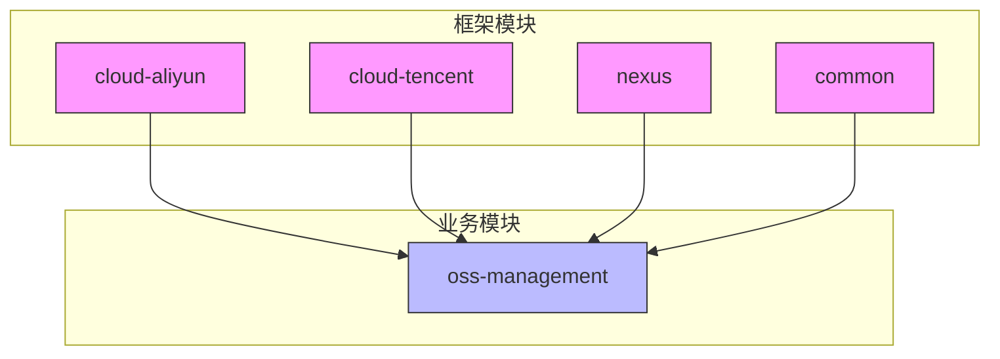
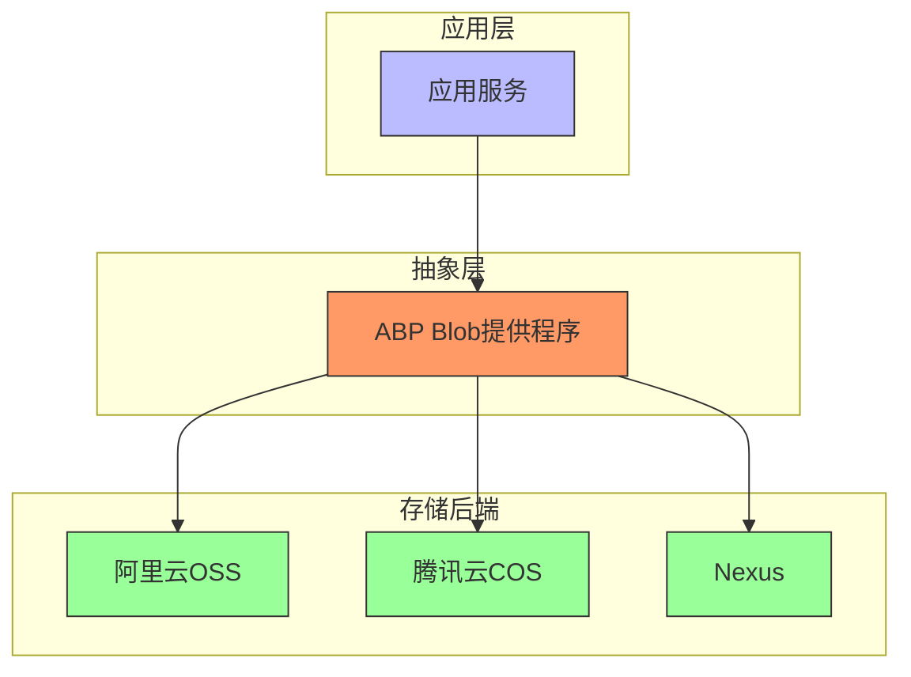
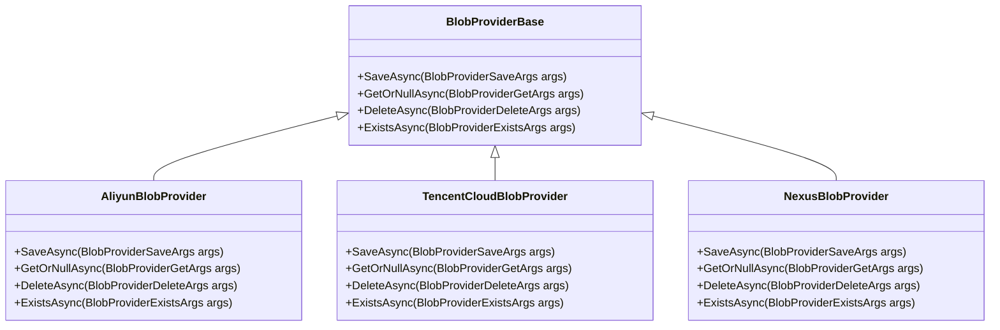

# 文件存储集成

<cite>
**本文档引用的文件**  
- [AliyunBlobProvider.cs](file://aspnet-core\framework\common\LINGYUN.Abp.BlobStoring.Aliyun\LINGYUN\Abp\BlobStoring\Aliyun\AliyunBlobProvider.cs)
- [TencentCloudBlobProvider.cs](file://aspnet-core\framework\cloud-tencent\LINGYUN.Abp.BlobStoring.Tencent\LINGYUN\Abp\BlobStoring\Tencent\TencentCloudBlobProvider.cs)
- [NexusBlobProvider.cs](file://aspnet-core\framework\nexus\LINGYUN.Abp.BlobStoring.Nexus\LINGYUN\Abp\BlobStoring\Nexus\NexusBlobProvider.cs)
- [AliyunBlobProviderConfiguration.cs](file://aspnet-core\framework\common\LINGYUN.Abp.BlobStoring.Aliyun\LINGYUN\Abp\BlobStoring\Aliyun\AliyunBlobProviderConfiguration.cs)
- [TencentBlobProviderConfiguration.cs](file://aspnet-core\framework\cloud-tencent\LINGYUN.Abp.BlobStoring.Tencent\LINGYUN\Abp\BlobStoring\Tencent\TencentBlobProviderConfiguration.cs)
- [NexusBlobProviderConfiguration.cs](file://aspnet-core\framework\nexus\LINGYUN.Abp.BlobStoring.Nexus\LINGYUN\Abp\BlobStoring\Nexus\NexusBlobProviderConfiguration.cs)
- [OssContainerAppService.cs](file://aspnet-core\modules\oss-management\LINGYUN.Abp.OssManagement.Application\LINGYUN\Abp\OssManagement\OssContainerAppService.cs)
- [FileUploader.cs](file://aspnet-core\modules\oss-management\LINGYUN.Abp.OssManagement.Application\LINGYUN\Abp\OssManagement\FileUploader.cs)
- [FileUploadMerger.cs](file://aspnet-core\modules\oss-management\LINGYUN.Abp.OssManagement.Application\LINGYUN\Abp\OssManagement\FileUploadMerger.cs)
</cite>

## 目录
1. [简介](#简介)
2. [项目结构](#项目结构)
3. [核心组件](#核心组件)
4. [架构概述](#架构概述)
5. [详细组件分析](#详细组件分析)
6. [依赖分析](#依赖分析)
7. [性能考虑](#性能考虑)
8. [故障排除指南](#故障排除指南)
9. [结论](#结论)

## 简介
本文档详细介绍了基于ABP框架的文件存储集成方案，重点阐述了阿里云OSS、腾讯云COS和Nexus等存储后端的集成方式。文档涵盖了Blob存储抽象层的设计原理、存储提供程序的配置方法、存储容器的管理策略，以及文件上传下载、权限控制、预签名URL生成等操作的实现细节。同时提供了多存储后端的配置示例、大文件分片上传和断点续传等高级功能的实现方案，并包含性能优化建议、成本控制策略和安全最佳实践。

## 项目结构
项目采用模块化设计，文件存储相关功能分布在多个模块中。核心的Blob存储抽象层由ABP框架提供，具体的云存储实现分布在不同的框架模块中，而业务应用逻辑则集中在`oss-management`模块中。

**图示来源**
- [AliyunBlobProvider.cs](file://aspnet-core\framework\common\LINGYUN.Abp.BlobStoring.Aliyun\LINGYUN\Abp\BlobStoring\Aliyun\AliyunBlobProvider.cs)
- [TencentCloudBlobProvider.cs](file://aspnet-core\framework\cloud-tencent\LINGYUN.Abp.BlobStoring.Tencent\LINGYUN\Abp\BlobStoring\Tencent\TencentCloudBlobProvider.cs)
- [NexusBlobProvider.cs](file://aspnet-core\framework\nexus\LINGYUN.Abp.BlobStoring.Nexus\LINGYUN\Abp\BlobStoring\Nexus\NexusBlobProvider.cs)

**节来源**
- [AliyunBlobProvider.cs](file://aspnet-core\framework\common\LINGYUN.Abp.BlobStoring.Aliyun\LINGYUN\Abp\BlobStoring\Aliyun\AliyunBlobProvider.cs)
- [TencentCloudBlobProvider.cs](file://aspnet-core\framework\cloud-tencent\LINGYUN.Abp.BlobStoring.Tencent\LINGYUN\Abp\BlobStoring\Tencent\TencentCloudBlobProvider.cs)
- [NexusBlobProvider.cs](file://aspnet-core\framework\nexus\LINGYUN.Abp.BlobStoring.Nexus\LINGYUN\Abp\BlobStoring\Nexus\NexusBlobProvider.cs)

## 核心组件
系统的核心组件包括Blob存储抽象层、具体的存储提供程序实现（阿里云OSS、腾讯云COS、Nexus）以及上层的应用服务。Blob存储抽象层提供了统一的API，而具体的存储提供程序实现了与不同后端的交互逻辑。

**节来源**
- [AliyunBlobProvider.cs](file://aspnet-core\framework\common\LINGYUN.Abp.BlobStoring.Aliyun\LINGYUN\Abp\BlobStoring\Aliyun\AliyunBlobProvider.cs)
- [TencentCloudBlobProvider.cs](file://aspnet-core\framework\cloud-tencent\LINGYUN.Abp.BlobStoring.Tencent\LINGYUN\Abp\BlobStoring\Tencent\TencentCloudBlobProvider.cs)
- [NexusBlobProvider.cs](file://aspnet-core\framework\nexus\LINGYUN.Abp.BlobStoring.Nexus\LINGYUN\Abp\BlobStoring\Nexus\NexusBlobProvider.cs)

## 架构概述
系统采用分层架构，上层应用通过ABP的Blob存储抽象层与底层存储服务进行交互。抽象层屏蔽了不同存储后端的差异，使得应用代码可以独立于具体的存储实现。

**图示来源**
- [AliyunBlobProvider.cs](file://aspnet-core\framework\common\LINGYUN.Abp.BlobStoring.Aliyun\LINGYUN\Abp\BlobStoring\Aliyun\AliyunBlobProvider.cs)
- [TencentCloudBlobProvider.cs](file://aspnet-core\framework\cloud-tencent\LINGYUN.Abp.BlobStoring.Tencent\LINGYUN\Abp\BlobStoring\Tencent\TencentCloudBlobProvider.cs)
- [NexusBlobProvider.cs](file://aspnet-core\framework\nexus\LINGYUN.Abp.BlobStoring.Nexus\LINGYUN\Abp\BlobStoring\Nexus\NexusBlobProvider.cs)

## 详细组件分析

### Blob存储抽象层
ABP框架提供了统一的Blob存储抽象层，定义了`BlobProviderBase`基类和相关的操作接口。所有具体的存储提供程序都继承自该基类并实现其抽象方法。

#### 核心操作

**图示来源**
- [AliyunBlobProvider.cs](file://aspnet-core\framework\common\LINGYUN.Abp.BlobStoring.Aliyun\LINGYUN\Abp\BlobStoring\Aliyun\AliyunBlobProvider.cs)
- [TencentCloudBlobProvider.cs](file://aspnet-core\framework\cloud-tencent\LINGYUN.Abp.BlobStoring.Tencent\LINGYUN\Abp\BlobStoring\Tencent\TencentCloudBlobProvider.cs)
- [NexusBlobProvider.cs](file://aspnet-core\framework\nexus\LINGYUN.Abp.BlobStoring.Nexus\LINGYUN\Abp\BlobStoring\Nexus\NexusBlobProvider.cs)

**节来源**
- [AliyunBlobProvider.cs](file://aspnet-core\framework\common\LINGYUN.Abp.BlobStoring.Aliyun\LINGYUN\Abp\BlobStoring\Aliyun\AliyunBlobProvider.cs)
- [TencentCloudBlobProvider.cs](file://aspnet-core\framework\cloud-tencent\LINGYUN.Abp.BlobStoring.Tencent\LINGYUN\Abp\BlobStoring\Tencent\TencentCloudBlobProvider.cs)
- [NexusBlobProvider.cs](file://aspnet-core\framework\nexus\LINGYUN.Abp.BlobStoring.Nexus\LINGYUN\Abp\BlobStoring\Nexus\NexusBlobProvider.cs)

### 阿里云OSS集成