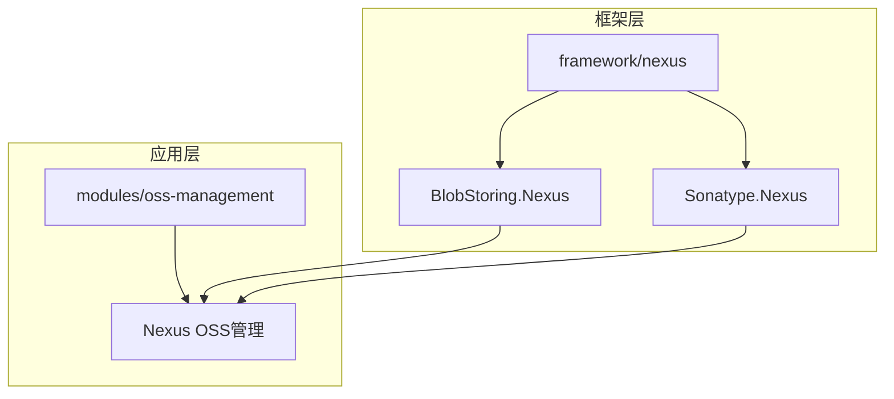
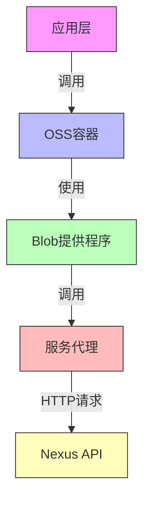
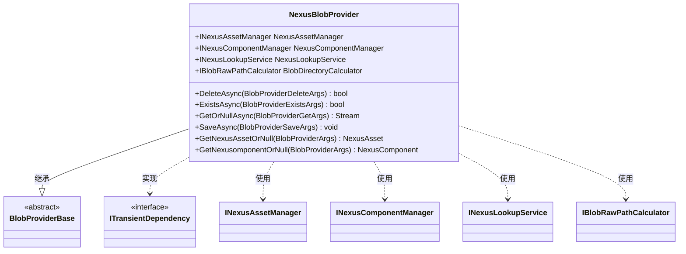
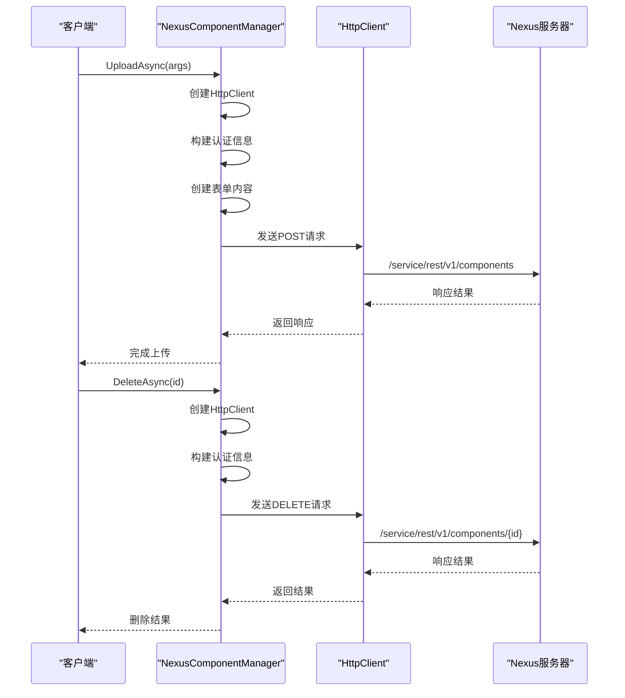
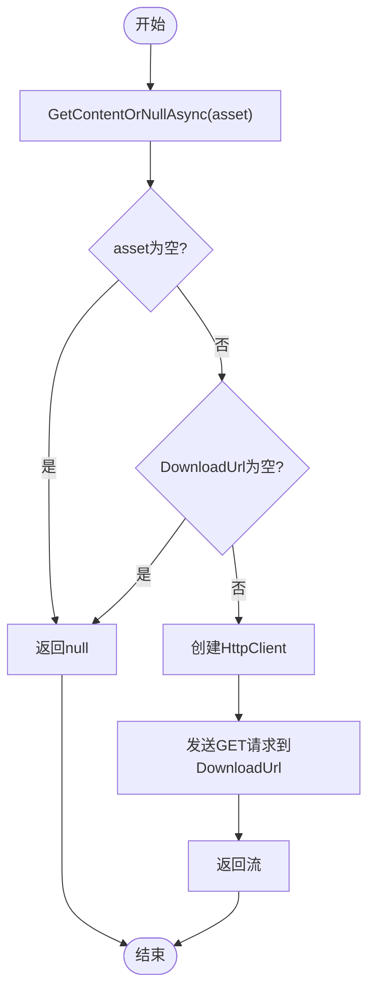
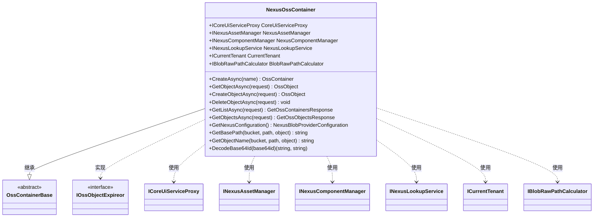
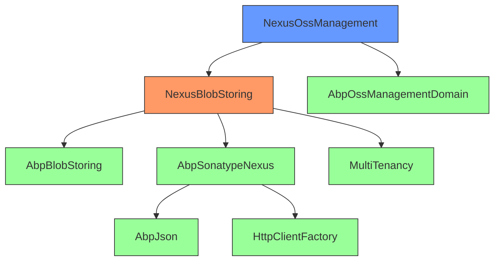

# 私有存储集成

<cite>
**本文档中引用的文件**  
- [NexusBlobProvider.cs](file://aspnet-core/framework/nexus/LINGYUN.Abp.BlobStoring.Nexus/LINGYUN/Abp/BlobStoring/Nexus/NexusBlobProvider.cs)
- [NexusBlobProviderConfiguration.cs](file://aspnet-core/framework/nexus/LINGYUN.Abp.BlobStoring.Nexus/LINGYUN/Abp/BlobStoring/Nexus/NexusBlobProviderConfiguration.cs)
- [NexusBlobProviderConfigurationNames.cs](file://aspnet-core/framework/nexus/LINGYUN.Abp.BlobStoring.Nexus/LINGYUN/Abp/BlobStoring/Nexus/NexusBlobProviderConfigurationNames.cs)
- [AbpSonatypeNexusOptions.cs](file://aspnet-core/framework/nexus/LINGYUN.Abp.Sonatype.Nexus/LINGYUN/Abp/Sonatype/Nexus/AbpSonatypeNexusOptions.cs)
- [NexusComponentManager.cs](file://aspnet-core/framework/nexus/LINGYUN.Abp.Sonatype.Nexus/LINGYUN/Abp/Sonatype/Nexus/Components/NexusComponentManager.cs)
- [NexusAssetManager.cs](file://aspnet-core/framework/nexus/LINGYUN.Abp.Sonatype.Nexus/LINGYUN/Abp/Sonatype/Nexus/Assets/NexusAssetManager.cs)
- [AbpSonatypeNexusModule.cs](file://aspnet-core/framework/nexus/LINGYUN.Abp.Sonatype.Nexus/LINGYUN/Abp/Sonatype/Nexus/AbpSonatypeNexusModule.cs)
- [AbpBlobStoringNexusModule.cs](file://aspnet-core/framework/nexus/LINGYUN.Abp.BlobStoring.Nexus/LINGYUN/Abp/BlobStoring/Nexus/AbpBlobStoringNexusModule.cs)
- [NexusOssContainer.cs](file://aspnet-core/modules/oss-management/LINGYUN.Abp.OssManagement.Nexus/LINGYUN/Abp/OssManagement/Nexus/NexusOssContainer.cs)
- [NexusOssContainerFactory.cs](file://aspnet-core/modules/oss-management/LINGYUN.Abp.OssManagement.Nexus/LINGYUN/Abp/OssManagement/Nexus/NexusOssContainerFactory.cs)
</cite>

## 目录
1. [简介](#简介)
2. [项目结构](#项目结构)
3. [核心组件](#核心组件)
4. [架构概述](#架构概述)
5. [详细组件分析](#详细组件分析)
6. [依赖分析](#依赖分析)
7. [性能考虑](#性能考虑)
8. [故障排除指南](#故障排除指南)
9. [结论](#结论)

## 简介
本文档详细介绍了基于 Sonatype Nexus 的私有存储集成实现。文档重点阐述了 Nexus 存储服务的配置参数、认证机制、仓库管理策略以及网络优化配置。涵盖了私有存储客户端的初始化、文件上传下载、权限控制、预签名 URL 生成等操作的实现细节。提供了私有存储的配置示例和高可用部署方案，以及大文件分片上传、断点续传等高级功能的实现方案。文档还包含了私有存储服务的性能优化建议、容量规划策略和安全最佳实践，如仓库权限管理、访问控制、安全扫描等。

## 项目结构
该项目是一个基于 ABP 框架的微服务架构系统，其中私有存储集成主要通过 `aspnet-core/framework/nexus` 和 `aspnet-core/modules/oss-management` 两个模块实现。`framework/nexus` 模块提供了基础的 Nexus Blob 存储功能，而 `modules/oss-management` 模块则在此基础上构建了更高层次的对象存储管理功能。

**图源**
- [NexusBlobProvider.cs](file://aspnet-core/framework/nexus/LINGYUN.Abp.BlobStoring.Nexus/LINGYUN/Abp/BlobStoring/Nexus/NexusBlobProvider.cs)
- [NexusOssContainer.cs](file://aspnet-core/modules/oss-management/LINGYUN.Abp.OssManagement.Nexus/LINGYUN/Abp/OssManagement/Nexus/NexusOssContainer.cs)

**章节来源**
- [NexusBlobProvider.cs](file://aspnet-core/framework/nexus/LINGYUN.Abp.BlobStoring.Nexus/LINGYUN/Abp/BlobStoring/Nexus/NexusBlobProvider.cs)
- [NexusOssContainer.cs](file://aspnet-core/modules/oss-management/LINGYUN.Abp.OssManagement.Nexus/LINGYUN/Abp/OssManagement/Nexus/NexusOssContainer.cs)

## 核心组件
私有存储集成的核心组件包括 Nexus Blob 提供程序、Nexus 组件管理器、Nexus 资产管理器和 OSS 容器工厂。这些组件共同实现了与 Sonatype Nexus 仓库的交互，提供了完整的对象存储功能。

**章节来源**
- [NexusBlobProvider.cs](file://aspnet-core/framework/nexus/LINGYUN.Abp.BlobStoring.Nexus/LINGYUN/Abp/BlobStoring/Nexus/NexusBlobProvider.cs)
- [NexusComponentManager.cs](file://aspnet-core/framework/nexus/LINGYUN.Abp.Sonatype.Nexus/LINGYUN/Abp/Sonatype/Nexus/Components/NexusComponentManager.cs)
- [NexusAssetManager.cs](file://aspnet-core/framework/nexus/LINGYUN.Abp.Sonatype.Nexus/LINGYUN/Abp/Sonatype/Nexus/Assets/NexusAssetManager.cs)

## 架构概述
私有存储集成采用分层架构设计，底层是直接与 Nexus API 交互的服务代理，中间层是 Blob 存储提供程序，顶层是 OSS 容器管理。这种设计实现了关注点分离，提高了代码的可维护性和可扩展性。

**图源**
- [NexusBlobProvider.cs](file://aspnet-core/framework/nexus/LINGYUN.Abp.BlobStoring.Nexus/LINGYUN/Abp/BlobStoring/Nexus/NexusBlobProvider.cs)
- [NexusOssContainer.cs](file://aspnet-core/modules/oss-management/LINGYUN.Abp.OssManagement.Nexus/LINGYUN/Abp/OssManagement/Nexus/NexusOssContainer.cs)
- [NexusComponentManager.cs](file://aspnet-core/framework/nexus/LINGYUN.Abp.Sonatype.Nexus/LINGYUN/Abp/Sonatype/Nexus/Components/NexusComponentManager.cs)

## 详细组件分析
### Nexus Blob 提供程序分析
Nexus Blob 提供程序是整个私有存储集成的核心，它实现了 ABP 框架的 `BlobProviderBase` 抽象类，提供了保存、获取、删除和检查 Blob 对象的基本功能。

#### 类图

**图源**
- [NexusBlobProvider.cs](file://aspnet-core/framework/nexus/LINGYUN.Abp.BlobStoring.Nexus/LINGYUN/Abp/BlobStoring/Nexus/NexusBlobProvider.cs)

**章节来源**
- [NexusBlobProvider.cs](file://aspnet-core/framework/nexus/LINGYUN.Abp.BlobStoring.Nexus/LINGYUN/Abp/BlobStoring/Nexus/NexusBlobProvider.cs)

### Nexus 组件管理器分析
Nexus 组件管理器负责与 Nexus 的组件 API 进行交互，实现了组件的上传、删除、获取和列表查询功能。它使用 HTTP 客户端直接调用 Nexus REST API。

#### 序列图

**图源**
- [NexusComponentManager.cs](file://aspnet-core/framework/nexus/LINGYUN.Abp.Sonatype.Nexus/LINGYUN/Abp/Sonatype/Nexus/Components/NexusComponentManager.cs)

**章节来源**
- [NexusComponentManager.cs](file://aspnet-core/framework/nexus/LINGYUN.Abp.Sonatype.Nexus/LINGYUN/Abp/Sonatype/Nexus/Components/NexusComponentManager.cs)

### Nexus 资产管理器分析
Nexus 资产管理器负责与 Nexus 的资产 API 进行交互，提供了资产的删除、获取、内容读取和列表查询功能。与组件管理器类似，它也通过 HTTP 客户端调用 Nexus API。

#### 流程图

**图源**
- [NexusAssetManager.cs](file://aspnet-core/framework/nexus/LINGYUN.Abp.Sonatype.Nexus/LINGYUN/Abp/Sonatype/Nexus/Assets/NexusAssetManager.cs)

**章节来源**
- [NexusAssetManager.cs](file://aspnet-core/framework/nexus/LINGYUN.Abp.Sonatype.Nexus/LINGYUN/Abp/Sonatype/Nexus/Assets/NexusAssetManager.cs)

### OSS 容器分析
OSS 容器是高层抽象，提供了对存储桶（容器）和对象的管理功能。它封装了底层的 Nexus API 调用，提供了更友好的接口给应用程序使用。

#### 类图

**图源**
- [NexusOssContainer.cs](file://aspnet-core/modules/oss-management/LINGYUN.Abp.OssManagement.Nexus/LINGYUN/Abp/OssManagement/Nexus/NexusOssContainer.cs)

**章节来源**
- [NexusOssContainer.cs](file://aspnet-core/modules/oss-management/LINGYUN.Abp.OssManagement.Nexus/LINGYUN/Abp/OssManagement/Nexus/NexusOssContainer.cs)

## 依赖分析
私有存储集成模块依赖于多个核心组件和服务。主要依赖关系包括 ABP 框架的基础模块、JSON 序列化服务、HTTP 客户端工厂以及多租户服务。

**图源**
- [AbpBlobStoringNexusModule.cs](file://aspnet-core/framework/nexus/LINGYUN.Abp.BlobStoring.Nexus/LINGYUN/Abp/BlobStoring/Nexus/AbpBlobStoringNexusModule.cs)
- [AbpSonatypeNexusModule.cs](file://aspnet-core/framework/nexus/LINGYUN.Abp.Sonatype.Nexus/LINGYUN/Abp/Sonatype/Nexus/AbpSonatypeNexusModule.cs)
- [AbpOssManagementNexusModule.cs](file://aspnet-core/modules/oss-management/LINGYUN.Abp.OssManagement.Nexus/LINGYUN/Abp/OssManagement/Nexus/AbpOssManagementNexusModule.cs)

**章节来源**
- [AbpBlobStoringNexusModule.cs](file://aspnet-core/framework/nexus/LINGYUN.Abp.BlobStoring.Nexus/LINGYUN/Abp/BlobStoring/Nexus/AbpBlobStoringNexusModule.cs)
- [AbpSonatypeNexusModule.cs](file://aspnet-core/framework/nexus/LINGYUN.Abp.Sonatype.Nexus/LINGYUN/Abp/Sonatype/Nexus/AbpSonatypeNexusModule.cs)

## 性能考虑
在使用私有存储集成时，需要考虑以下性能因素：

1. **HTTP连接复用**：通过 `HttpClientFactory` 创建的客户端支持连接池，减少了频繁建立TCP连接的开销。
2. **批量操作**：目前 `BulkDeleteObjectsAsync` 方法尚未实现，对于大量对象的删除操作需要逐个处理，可能影响性能。
3. **缓存策略**：可以考虑在应用层添加缓存，避免频繁查询相同的对象或容器信息。
4. **异步操作**：所有API调用都采用异步模式，避免阻塞线程，提高并发处理能力。
5. **分页查询**：在获取对象列表时，使用了分页机制，避免一次性加载过多数据。

**章节来源**
- [NexusOssContainer.cs](file://aspnet-core/modules/oss-management/LINGYUN.Abp.OssManagement.Nexus/LINGYUN/Abp/OssManagement/Nexus/NexusOssContainer.cs)
- [NexusComponentManager.cs](file://aspnet-core/framework/nexus/LINGYUN.Abp.Sonatype.Nexus/LINGYUN/Abp/Sonatype/Nexus/Components/NexusComponentManager.cs)

## 故障排除指南
在使用私有存储集成时，可能会遇到以下常见问题：

1. **认证失败**：确保 `appsettings.json` 中正确配置了 Nexus 的用户名和密码。
2. **连接超时**：检查 Nexus 服务器地址是否正确，网络连接是否正常。
3. **权限不足**：确认使用的账户具有足够的权限执行所需操作。
4. **仓库不存在**：确保指定的仓库名称在 Nexus 中存在。
5. **路径问题**：注意路径分隔符的使用，特别是在跨平台环境中。

**章节来源**
- [NexusComponentManager.cs](file://aspnet-core/framework/nexus/LINGYUN.Abp.Sonatype.Nexus/LINGYUN/Abp/Sonatype/Nexus/Components/NexusComponentManager.cs)
- [NexusAssetManager.cs](file://aspnet-core/framework/nexus/LINGYUN.Abp.Sonatype.Nexus/LINGYUN/Abp/Sonatype/Nexus/Assets/NexusAssetManager.cs)

## 结论
本文档详细介绍了基于 Sonatype Nexus 的私有存储集成实现。该集成提供了完整的对象存储功能，包括容器管理、对象上传下载、权限控制等。通过分层架构设计，实现了良好的代码组织和可维护性。在实际使用中，需要注意性能优化和错误处理，以确保系统的稳定运行。