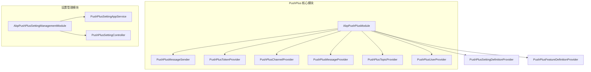
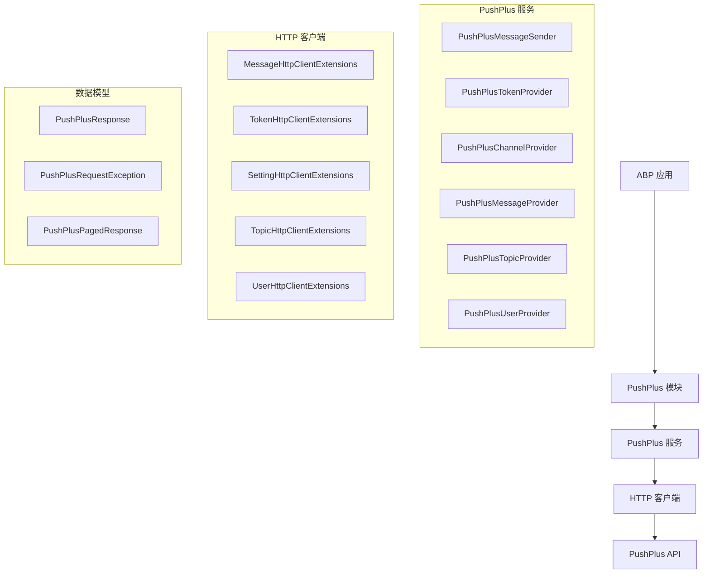
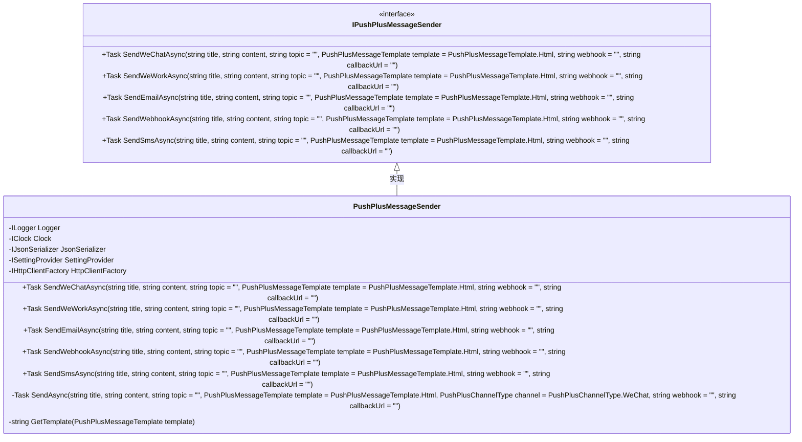
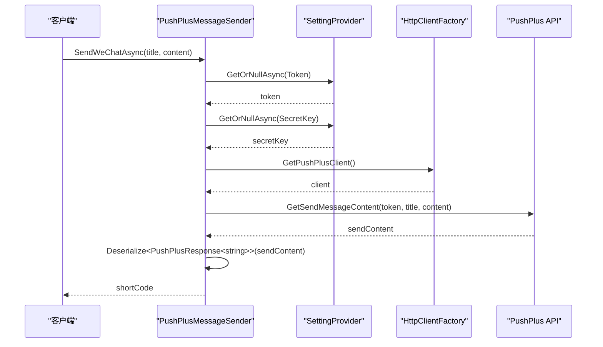
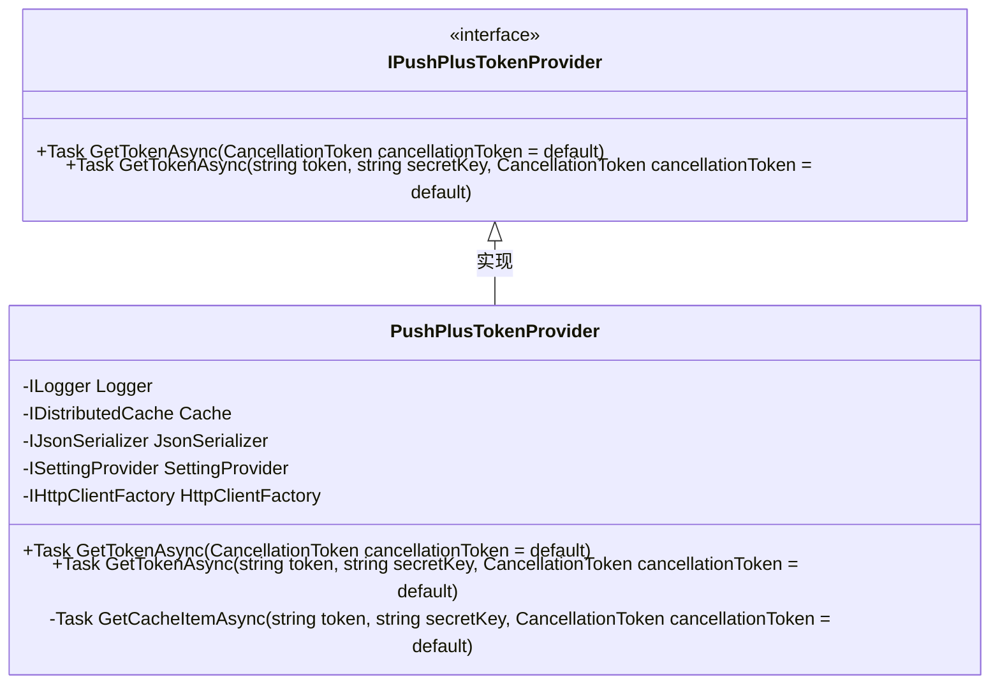
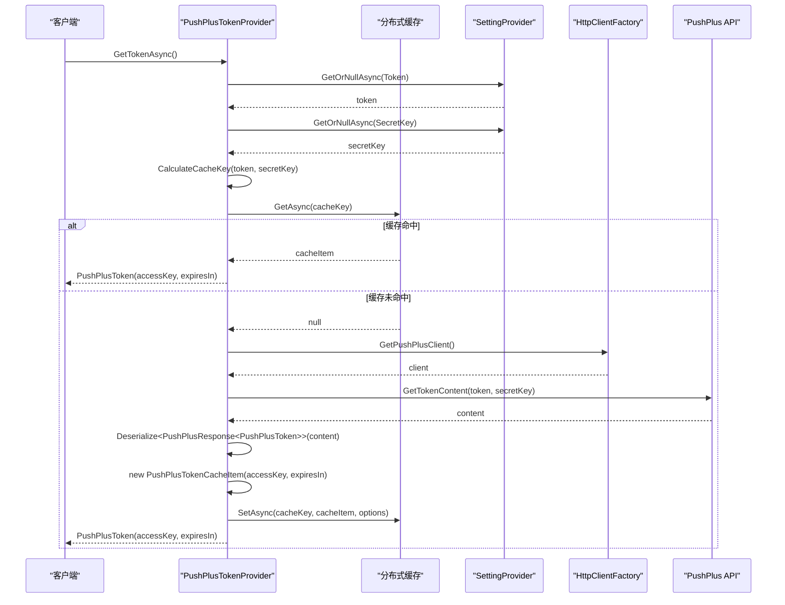
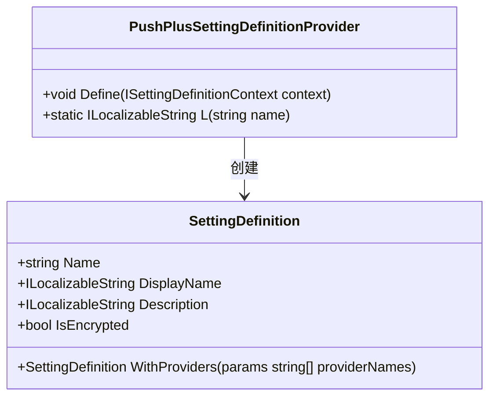
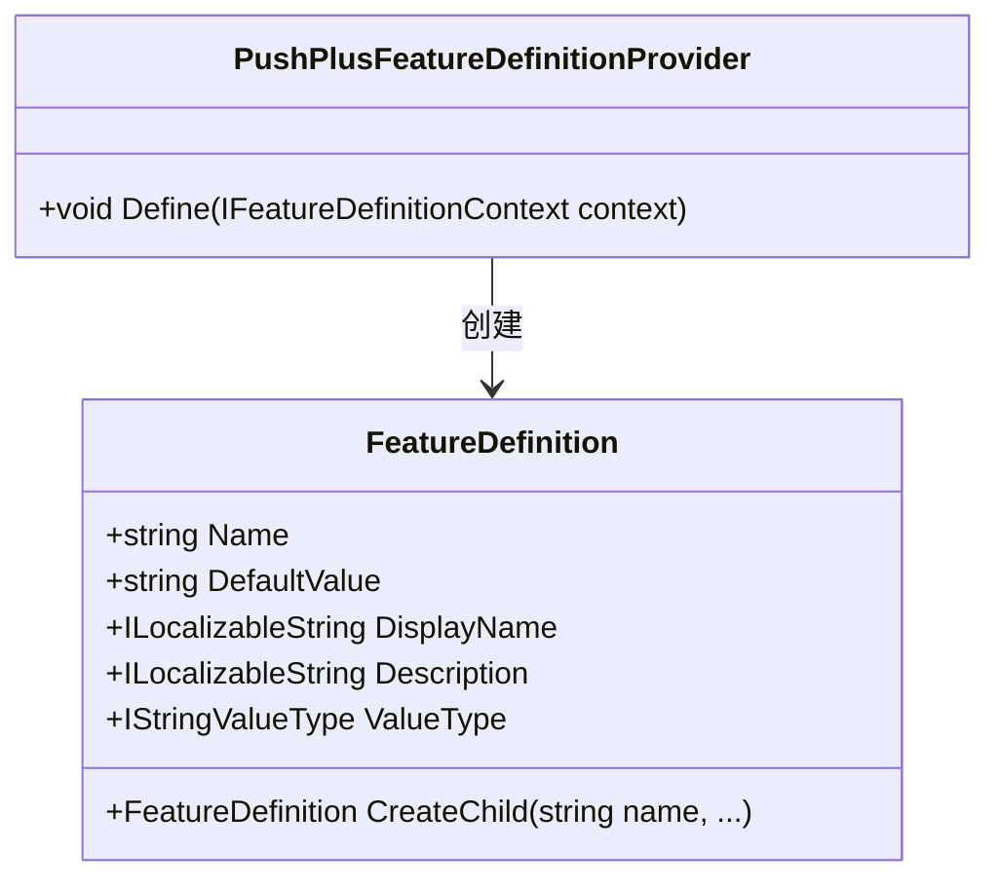
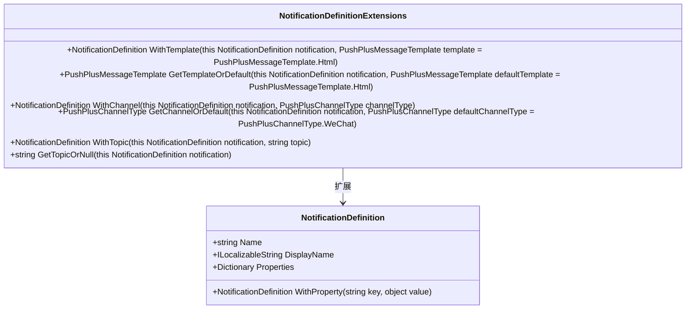
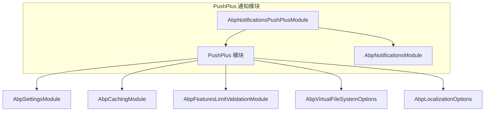

# PushPlus 集成

<cite>
**本文档引用的文件**
- [AbpPushPlusModule.cs](file://aspnet-core/framework/pushplus/LINGYUN.Abp.PushPlus/LINGYUN/Abp/PushPlus/AbpPushPlusModule.cs)
- [PushPlusMessageSender.cs](file://aspnet-core/framework/pushplus/LINGYUN.Abp.PushPlus/LINGYUN/Abp/PushPlus/Message/PushPlusMessageSender.cs)
- [PushPlusSettingDefinitionProvider.cs](file://aspnet-core/framework/pushplus/LINGYUN.Abp.PushPlus/LINGYUN/Abp/PushPlus/Settings/PushPlusSettingDefinitionProvider.cs)
- [PushPlusChannelType.cs](file://aspnet-core/framework/pushplus/LINGYUN.Abp.PushPlus/LINGYUN/Abp/PushPlus/Channel/PushPlusChannelType.cs)
- [PushPlusMessageTemplate.cs](file://aspnet-core/framework/pushplus/LINGYUN.Abp.PushPlus/LINGYUN/Abp/PushPlus/Message/PushPlusMessageTemplate.cs)
- [PushPlusTokenProvider.cs](file://aspnet-core/framework/pushplus/LINGYUN.Abp.PushPlus/LINGYUN/Abp/PushPlus/Token/PushPlusTokenProvider.cs)
- [PushPlusMessage.cs](file://aspnet-core/framework/pushplus/LINGYUN.Abp.PushPlus/LINGYUN/Abp/PushPlus/Message/PushPlusMessage.cs)
- [SendPushPlusMessageResult.cs](file://aspnet-core/framework/pushplus/LINGYUN.Abp.PushPlus/LINGYUN/Abp/PushPlus/Message/SendPushPlusMessageResult.cs)
- [NotificationDefinitionExtensions.cs](file://aspnet-core/modules/realtime-notifications/LINGYUN.Abp.Notifications.PushPlus/LINGYUN/Abp/Notifications/NotificationDefinitionExtensions.cs)
- [AbpNotificationsPushPlusModule.cs](file://aspnet-core/modules/realtime-notifications/LINGYUN.Abp.Notifications.PushPlus/LINGYUN/Abp/Notifications/PushPlus/AbpNotificationsPushPlusModule.cs)
- [PushPlusFeatureDefinitionProvider.cs](file://aspnet-core/framework/pushplus/LINGYUN.Abp.PushPlus/LINGYUN/Abp/PushPlus/Features/PushPlusFeatureDefinitionProvider.cs)
</cite>

## 目录
1. [简介](#简介)
2. [项目结构](#项目结构)
3. [核心组件](#核心组件)
4. [架构概述](#架构概述)
5. [详细组件分析](#详细组件分析)
6. [依赖分析](#依赖分析)
7. [性能考虑](#性能考虑)
8. [故障排除指南](#故障排除指南)
9. [结论](#结论)

## 简介
PushPlus 是一个消息推送服务集成模块，为 ABP 框架提供了与 PushPlus 服务的无缝集成。该模块支持多种消息类型和推送渠道，包括微信公众号、企业微信应用、邮件、短信和第三方 webhook。通过功能特性（Features）和设置管理，开发者可以灵活配置和控制 PushPlus 服务的使用。本模块还集成了通知系统，允许在 ABP 应用中使用 PushPlus 作为通知发布提供程序。

## 项目结构
PushPlus 集成模块位于 `aspnet-core/framework/pushplus` 目录下，包含核心功能实现和设置管理两个主要部分。核心功能实现在 `LINGYUN.Abp.PushPlus` 项目中，而设置管理界面则在 `LINGYUN.Abp.PushPlus.SettingManagement` 项目中。

**图示来源**
- [AbpPushPlusModule.cs](file://aspnet-core/framework/pushplus/LINGYUN.Abp.PushPlus/LINGYUN/Abp/PushPlus/AbpPushPlusModule.cs)
- [PushPlusSettingDefinitionProvider.cs](file://aspnet-core/framework/pushplus/LINGYUN.Abp.PushPlus/LINGYUN/Abp/PushPlus/Settings/PushPlusSettingDefinitionProvider.cs)
- [PushPlusFeatureDefinitionProvider.cs](file://aspnet-core/framework/pushplus/LINGYUN.Abp.PushPlus/LINGYUN/Abp/PushPlus/Features/PushPlusFeatureDefinitionProvider.cs)

**章节来源**
- [AbpPushPlusModule.cs](file://aspnet-core/framework/pushplus/LINGYUN.Abp.PushPlus/LINGYUN/Abp/PushPlus/AbpPushPlusModule.cs)
- [PushPlusSettingDefinitionProvider.cs](file://aspnet-core/framework/pushplus/LINGYUN.Abp.PushPlus/LINGYUN/Abp/PushPlus/Settings/PushPlusSettingDefinitionProvider.cs)

## 核心组件
PushPlus 集成模块的核心组件包括消息发送器、令牌提供程序、通道提供程序、消息提供程序、主题提供程序和用户提供程序。这些组件共同协作，实现了与 PushPlus 服务的完整集成。消息发送器负责实际的消息推送操作，令牌提供程序管理 PushPlus 的访问令牌，通道提供程序管理推送渠道，消息提供程序查询消息状态，主题提供程序管理群组消息，用户提供程序管理用户信息。

**章节来源**
- [PushPlusMessageSender.cs](file://aspnet-core/framework/pushplus/LINGYUN.Abp.PushPlus/LINGYUN/Abp/PushPlus/Message/PushPlusMessageSender.cs)
- [PushPlusTokenProvider.cs](file://aspnet-core/framework/pushplus/LINGYUN.Abp.PushPlus/LINGYUN/Abp/PushPlus/Token/PushPlusTokenProvider.cs)
- [PushPlusChannelProvider.cs](file://aspnet-core/framework/pushplus/LINGYUN.Abp.PushPlus/LINGYUN/Abp/PushPlus/Setting/PushPlusChannelProvider.cs)

## 架构概述
PushPlus 集成模块采用分层架构设计，分为模块层、服务层、HTTP 客户端层和数据模型层。模块层负责注册服务和配置选项，服务层提供业务逻辑实现，HTTP 客户端层封装了与 PushPlus API 的通信，数据模型层定义了请求和响应的数据结构。这种分层设计使得代码结构清晰，易于维护和扩展。

**图示来源**
- [AbpPushPlusModule.cs](file://aspnet-core/framework/pushplus/LINGYUN.Abp.PushPlus/LINGYUN/Abp/PushPlus/AbpPushPlusModule.cs)
- [PushPlusMessageSender.cs](file://aspnet-core/framework/pushplus/LINGYUN.Abp.PushPlus/LINGYUN/Abp/PushPlus/Message/PushPlusMessageSender.cs)
- [PushPlusTokenProvider.cs](file://aspnet-core/framework/pushplus/LINGYUN.Abp.PushPlus/LINGYUN/Abp/PushPlus/Token/PushPlusTokenProvider.cs)

## 详细组件分析

### PushPlus 消息发送器分析
PushPlus 消息发送器是核心组件之一，负责实际的消息推送操作。它通过特性（Attributes）来控制不同推送渠道的启用状态和发送限制。每个推送方法都带有相应的特性，确保只有在功能启用且未超过发送限制的情况下才能执行。

#### 对象导向组件：

**图示来源**
- [PushPlusMessageSender.cs](file://aspnet-core/framework/pushplus/LINGYUN.Abp.PushPlus/LINGYUN/Abp/PushPlus/Message/PushPlusMessageSender.cs)

#### API/服务组件：

**图示来源**
- [PushPlusMessageSender.cs](file://aspnet-core/framework/pushplus/LINGYUN.Abp.PushPlus/LINGYUN/Abp/PushPlus/Message/PushPlusMessageSender.cs)

**章节来源**
- [PushPlusMessageSender.cs](file://aspnet-core/framework/pushplus/LINGYUN.Abp.PushPlus/LINGYUN/Abp/PushPlus/Message/PushPlusMessageSender.cs)

### PushPlus 令牌提供程序分析
PushPlus 令牌提供程序负责管理 PushPlus 的访问令牌。它从设置中获取 token 和 secretKey，然后调用 PushPlus API 获取 accessKey，并将结果缓存以提高性能。令牌提供程序使用分布式缓存来存储令牌，避免频繁调用 API。

#### 对象导向组件：

**图示来源**
- [PushPlusTokenProvider.cs](file://aspnet-core/framework/pushplus/LINGYUN.Abp.PushPlus/LINGYUN/Abp/PushPlus/Token/PushPlusTokenProvider.cs)

#### API/服务组件：

**图示来源**
- [PushPlusTokenProvider.cs](file://aspnet-core/framework/pushplus/LINGYUN.Abp.PushPlus/LINGYUN/Abp/PushPlus/Token/PushPlusTokenProvider.cs)

**章节来源**
- [PushPlusTokenProvider.cs](file://aspnet-core/framework/pushplus/LINGYUN.Abp.PushPlus/LINGYUN/Abp/PushPlus/Token/PushPlusTokenProvider.cs)

### PushPlus 设置定义提供程序分析
PushPlus 设置定义提供程序负责定义 PushPlus 模块的设置项。它定义了安全相关的设置，如 token 和 secretKey，并将这些设置标记为加密存储，确保敏感信息的安全性。

#### 对象导向组件：

**图示来源**
- [PushPlusSettingDefinitionProvider.cs](file://aspnet-core/framework/pushplus/LINGYUN.Abp.PushPlus/LINGYUN/Abp/PushPlus/Settings/PushPlusSettingDefinitionProvider.cs)

**章节来源**
- [PushPlusSettingDefinitionProvider.cs](file://aspnet-core/framework/pushplus/LINGYUN.Abp.PushPlus/LINGYUN/Abp/PushPlus/Settings/PushPlusSettingDefinitionProvider.cs)

### PushPlus 功能定义提供程序分析
PushPlus 功能定义提供程序负责定义 PushPlus 模块的功能特性。它定义了全局的 PushPlus 启用功能，并为每种推送渠道（微信、企业微信、邮件、webhook、短信）定义了独立的启用功能和发送限制功能。

#### 对象导向组件：

**图示来源**
- [PushPlusFeatureDefinitionProvider.cs](file://aspnet-core/framework/pushplus/LINGYUN.Abp.PushPlus/LINGYUN/Abp/PushPlus/Features/PushPlusFeatureDefinitionProvider.cs)

**章节来源**
- [PushPlusFeatureDefinitionProvider.cs](file://aspnet-core/framework/pushplus/LINGYUN.Abp.PushPlus/LINGYUN/Abp/PushPlus/Features/PushPlusFeatureDefinitionProvider.cs)

### PushPlus 通知定义扩展分析
PushPlus 通知定义扩展提供了一组扩展方法，用于在通知定义中配置 PushPlus 相关的属性，如消息模板、推送渠道和群组编码。这些扩展方法使得在定义通知时可以方便地指定 PushPlus 特定的配置。

#### 对象导向组件：

**图示来源**
- [NotificationDefinitionExtensions.cs](file://aspnet-core/modules/realtime-notifications/LINGYUN.Abp.Notifications.PushPlus/LINGYUN/Abp/Notifications/NotificationDefinitionExtensions.cs)

**章节来源**
- [NotificationDefinitionExtensions.cs](file://aspnet-core/modules/realtime-notifications/LINGYUN.Abp.Notifications.PushPlus/LINGYUN/Abp/Notifications/NotificationDefinitionExtensions.cs)

## 依赖分析
PushPlus 集成模块依赖于多个 ABP 框架的核心模块，包括设置模块、缓存模块和特性限制验证模块。这些依赖关系确保了 PushPlus 模块能够充分利用 ABP 框架提供的基础设施服务。

**图示来源**
- [AbpPushPlusModule.cs](file://aspnet-core/framework/pushplus/LINGYUN.Abp.PushPlus/LINGYUN/Abp/PushPlus/AbpPushPlusModule.cs)
- [AbpNotificationsPushPlusModule.cs](file://aspnet-core/modules/realtime-notifications/LINGYUN.Abp.Notifications.PushPlus/LINGYUN/Abp/Notifications/PushPlus/AbpNotificationsPushPlusModule.cs)

**章节来源**
- [AbpPushPlusModule.cs](file://aspnet-core/framework/pushplus/LINGYUN.Abp.PushPlus/LINGYUN/Abp/PushPlus/AbpPushPlusModule.cs)
- [AbpNotificationsPushPlusModule.cs](file://aspnet-core/modules/realtime-notifications/LINGYUN.Abp.Notifications.PushPlus/LINGYUN/Abp/Notifications/PushPlus/AbpNotificationsPushPlusModule.cs)

## 性能考虑
PushPlus 集成模块在设计时考虑了性能优化，主要体现在以下几个方面：

1. **令牌缓存**：PushPlus 令牌提供程序使用分布式缓存来存储获取的 accessKey，避免了每次消息推送时都调用 API 获取令牌，大大减少了网络开销和 API 调用次数。

2. **异步操作**：所有与 PushPlus API 的交互都采用异步方式实现，避免了阻塞主线程，提高了应用程序的响应性和吞吐量。

3. **连接复用**：通过 IHttpClientFactory 获取 HTTP 客户端实例，实现了 HTTP 连接的复用，减少了连接建立和销毁的开销。

4. **批量操作**：虽然当前实现中没有直接的批量操作，但通过群组消息（topic）功能，可以实现一对多的消息推送，减少了 API 调用次数。

## 故障排除指南
在使用 PushPlus 集成模块时，可能会遇到以下常见问题：

1. **令牌获取失败**：检查 PushPlus 的 token 和 secretKey 是否正确配置，并确保它们在设置中已加密存储。

2. **消息发送失败**：确认相应的推送渠道功能是否已启用，并检查是否超过了发送限制。

3. **缓存问题**：如果遇到令牌过期或无效的问题，可以尝试清除分布式缓存中的相关条目。

4. **网络连接问题**：确保应用程序能够访问 PushPlus API 的地址，并检查防火墙设置。

**章节来源**
- [PushPlusTokenProvider.cs](file://aspnet-core/framework/pushplus/LINGYUN.Abp.PushPlus/LINGYUN/Abp/PushPlus/Token/PushPlusTokenProvider.cs)
- [PushPlusMessageSender.cs](file://aspnet-core/framework/pushplus/LINGYUN.Abp.PushPlus/LINGYUN/Abp/PushPlus/Message/PushPlusMessageSender.cs)

## 结论
PushPlus 集成模块为 ABP 框架提供了一个功能完整、易于使用的 PushPlus 服务集成方案。通过合理的架构设计和丰富的功能特性，开发者可以轻松地在应用程序中集成 PushPlus 消息推送服务。模块的可配置性和可扩展性使其能够适应不同的应用场景和需求。未来可以考虑增加更多的 PushPlus API 功能支持，如消息状态查询、用户管理等，进一步完善集成能力。