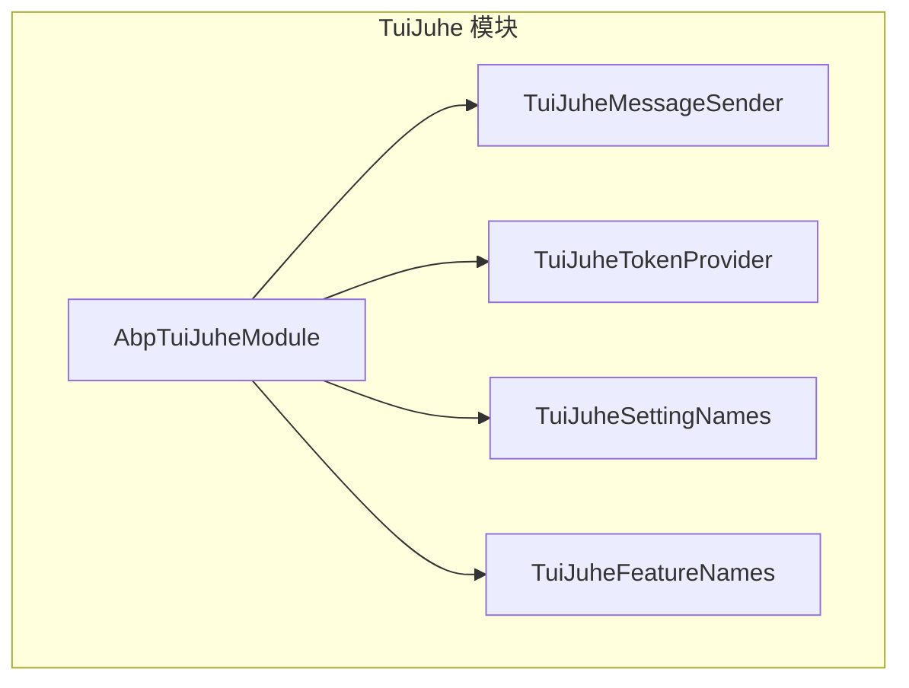
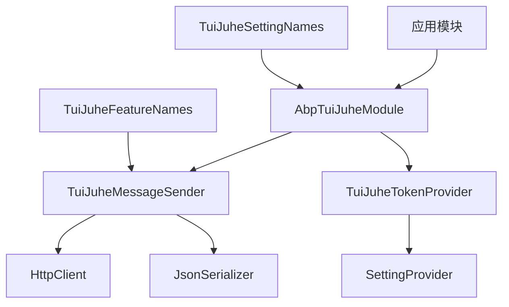
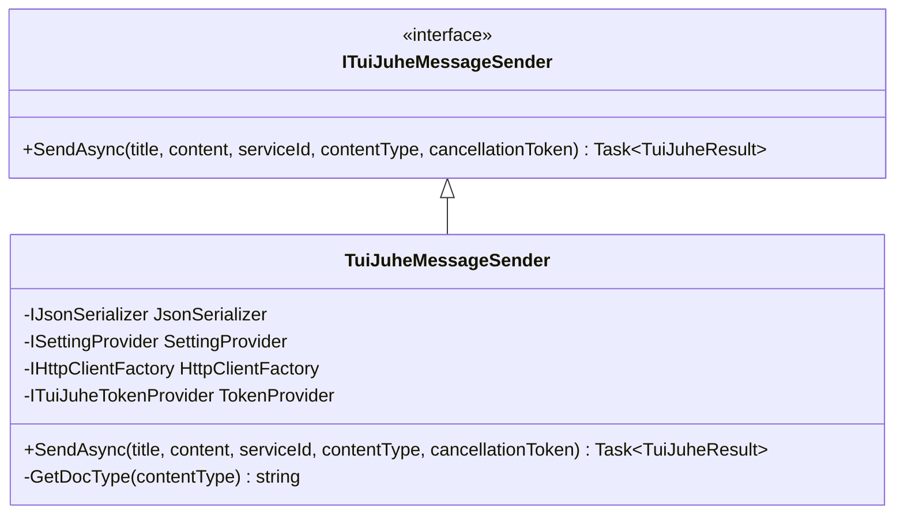
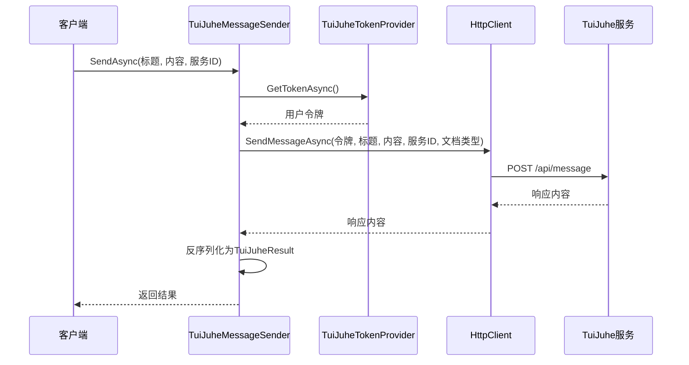
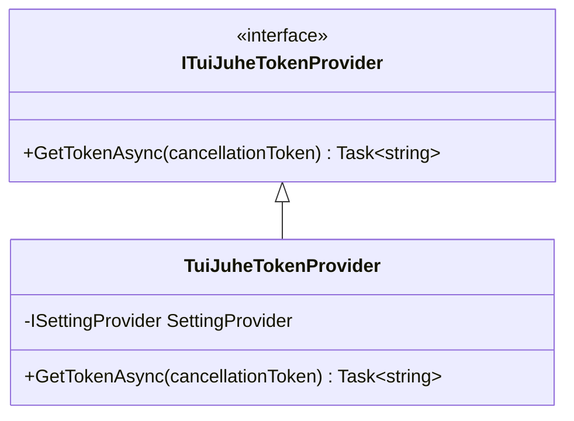
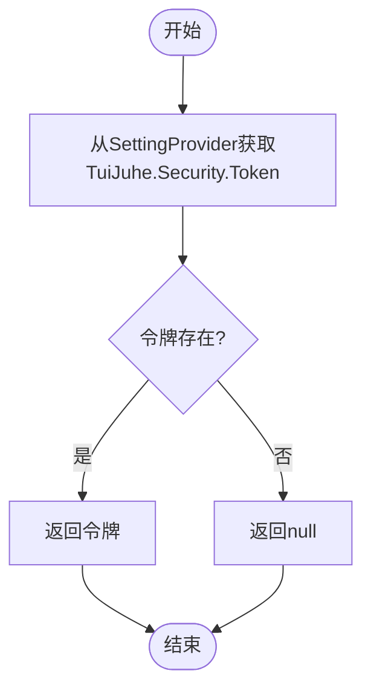
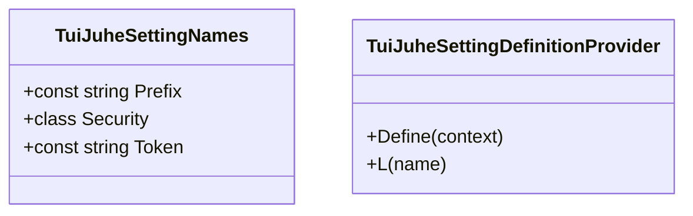
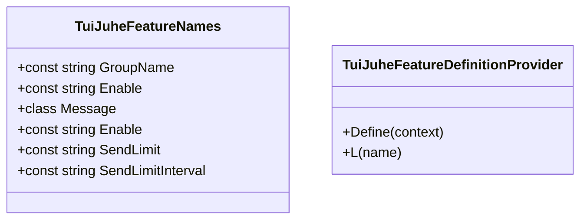
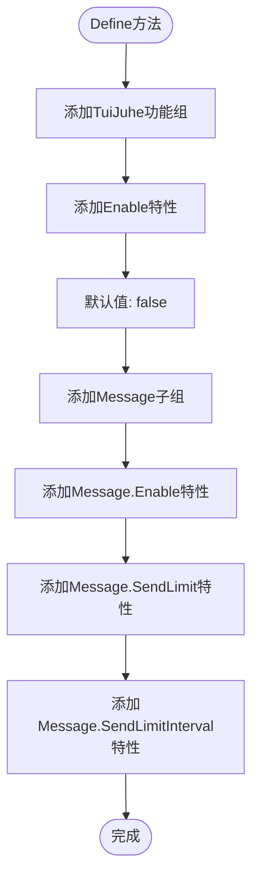
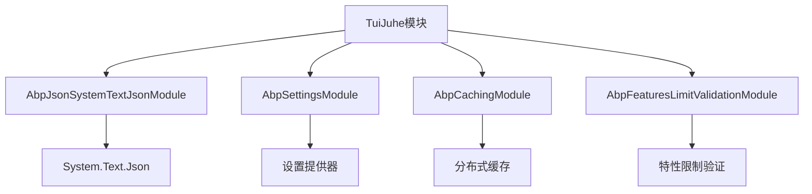

# TuiJuhe 集成

<cite>
**本文档中引用的文件**  
- [AbpTuiJuheModule.cs](file://aspnet-core\framework\tui-juhe\LINGYUN.Abp.TuiJuhe\LINGYUN\Abp\TuiJuhe\AbpTuiJuheModule.cs)
- [IServiceCollectionExtensions.cs](file://aspnet-core\framework\tui-juhe\LINGYUN.Abp.TuiJuhe\Microsoft\Extensions\DependencyInjection\IServiceCollectionExtensions.cs)
- [ITuiJuheMessageSender.cs](file://aspnet-core\framework\tui-juhe\LINGYUN.Abp.TuiJuhe\LINGYUN\Abp\TuiJuhe\Messages\ITuiJuheMessageSender.cs)
- [TuiJuheMessageSender.cs](file://aspnet-core\framework\tui-juhe\LINGYUN.Abp.TuiJuhe\LINGYUN\Abp\TuiJuhe\Messages\TuiJuheMessageSender.cs)
- [ITuiJuheTokenProvider.cs](file://aspnet-core\framework\tui-juhe\LINGYUN.Abp.TuiJuhe\LINGYUN\Abp\TuiJuhe\Token\ITuiJuheTokenProvider.cs)
- [TuiJuheTokenProvider.cs](file://aspnet-core\framework\tui-juhe\LINGYUN.Abp.TuiJuhe\LINGYUN\Abp\TuiJuhe\Token\TuiJuheTokenProvider.cs)
- [TuiJuheSettingNames.cs](file://aspnet-core\framework\tui-juhe\LINGYUN.Abp.TuiJuhe\LINGYUN\Abp\TuiJuhe\Settings\TuiJuheSettingNames.cs)
- [TuiJuheSettingDefinitionProvider.cs](file://aspnet-core\framework\tui-juhe\LINGYUN.Abp.TuiJuhe\LINGYUN\Abp\TuiJuhe\Settings\TuiJuheSettingDefinitionProvider.cs)
- [TuiJuheFeatureNames.cs](file://aspnet-core\framework\tui-juhe\LINGYUN.Abp.TuiJuhe\LINGYUN\Abp\TuiJuhe\Features\TuiJuheFeatureNames.cs)
- [TuiJuheFeatureDefinitionProvider.cs](file://aspnet-core\framework\tui-juhe\LINGYUN.Abp.TuiJuhe\LINGYUN\Abp\TuiJuhe\Features\TuiJuheFeatureDefinitionProvider.cs)
- [IHttpClientFactoryExtensions.cs](file://aspnet-core\framework\tui-juhe\LINGYUN.Abp.TuiJuhe\System\Net\Http\IHttpClientFactoryExtensions.cs)
- [MessageContentType.cs](file://aspnet-core\framework\tui-juhe\LINGYUN.Abp.TuiJuhe\LINGYUN\Abp\TuiJuhe\Messages\MessageContentType.cs)
- [TuiJuheResult.cs](file://aspnet-core\framework\tui-juhe\LINGYUN.Abp.TuiJuhe\LINGYUN\Abp\TuiJuhe\TuiJuheResult.cs)
</cite>

## 目录
1. [简介](#简介)
2. [项目结构](#项目结构)
3. [核心组件](#核心组件)
4. [架构概述](#架构概述)
5. [详细组件分析](#详细组件分析)
6. [依赖分析](#依赖分析)
7. [性能考虑](#性能考虑)
8. [故障排除指南](#故障排除指南)
9. [结论](#结论)

## 简介
本文档详细说明了TuiJuhe推送服务的集成方法，包括配置、初始化、API调用和回调处理机制。TuiJuhe服务支持短信、APP推送和语音通知等多种推送类型，适用于特定消息与人员通知场景（不支持群发）。文档涵盖了appkey配置、短信模板管理、推送策略设置、消息内容审核规则、推送成功率监控以及异常情况处理等内容，并对比了TuiJuhe与其他推送服务的优势。

## 项目结构
TuiJuhe集成模块位于`aspnet-core/framework/tui-juhe`目录下，包含两个主要子模块：`LINGYUN.Abp.TuiJuhe`和`LINGYUN.Abp.TuiJuhe.SettingManagement`。前者提供核心功能实现，后者提供设置管理接口。



**图示来源**
- [AbpTuiJuheModule.cs](file://aspnet-core\framework\tui-juhe\LINGYUN.Abp.TuiJuhe\LINGYUN\Abp\TuiJuhe\AbpTuiJuheModule.cs)
- [TuiJuheMessageSender.cs](file://aspnet-core\framework\tui-juhe\LINGYUN.Abp.TuiJuhe\LINGYUN\Abp\TuiJuhe\Messages\TuiJuheMessageSender.cs)

**章节来源**
- [AbpTuiJuheModule.cs](file://aspnet-core\framework\tui-juhe\LINGYUN.Abp.TuiJuhe\LINGYUN\Abp\TuiJuhe\AbpTuiJuheModule.cs)
- [README.md](file://aspnet-core\framework\tui-juhe\LINGYUN.Abp.TuiJuhe\README.md)

## 核心组件
TuiJuhe集成的核心组件包括消息发送器、令牌提供器、设置定义和特性管理。这些组件共同实现了TuiJuhe服务的完整功能，包括身份验证、消息发送、频率限制和配置管理。

**章节来源**
- [TuiJuheMessageSender.cs](file://aspnet-core\framework\tui-juhe\LINGYUN.Abp.TuiJuhe\LINGYUN\Abp\TuiJuhe\Messages\TuiJuheMessageSender.cs)
- [TuiJuheTokenProvider.cs](file://aspnet-core\framework\tui-juhe\LINGYUN.Abp.TuiJuhe\LINGYUN\Abp\TuiJuhe\Token\TuiJuheTokenProvider.cs)
- [TuiJuheSettingNames.cs](file://aspnet-core\framework\tui-juhe\LINGYUN.Abp.TuiJuhe\LINGYUN\Abp\TuiJuhe\Settings\TuiJuheSettingNames.cs)

## 架构概述
TuiJuhe集成采用分层架构设计，包括模块层、服务层、客户端层和设置管理层。模块层负责注册服务和配置，服务层实现业务逻辑，客户端层处理HTTP通信，设置管理层管理配置参数。



**图示来源**
- [AbpTuiJuheModule.cs](file://aspnet-core\framework\tui-juhe\LINGYUN.Abp.TuiJuhe\LINGYUN\Abp\TuiJuhe\AbpTuiJuheModule.cs)
- [TuiJuheMessageSender.cs](file://aspnet-core\framework\tui-juhe\LINGYUN.Abp.TuiJuhe\LINGYUN\Abp\TuiJuhe\Messages\TuiJuheMessageSender.cs)

## 详细组件分析

### 消息发送组件分析
TuiJuhe消息发送组件负责将消息推送到TuiJuhe服务。它通过依赖注入获取必要的服务实例，包括JSON序列化器、设置提供器、HTTP客户端工厂和令牌提供器。

#### 类图


**图示来源**
- [ITuiJuheMessageSender.cs](file://aspnet-core\framework\tui-juhe\LINGYUN.Abp.TuiJuhe\LINGYUN\Abp\TuiJuhe\Messages\ITuiJuheMessageSender.cs)
- [TuiJuheMessageSender.cs](file://aspnet-core\framework\tui-juhe\LINGYUN.Abp.TuiJuhe\LINGYUN\Abp\TuiJuhe\Messages\TuiJuheMessageSender.cs)

#### 消息发送流程


**图示来源**
- [TuiJuheMessageSender.cs](file://aspnet-core\framework\tui-juhe\LINGYUN.Abp.TuiJuhe\LINGYUN\Abp\TuiJuhe\Messages\TuiJuheMessageSender.cs)
- [TuiJuheTokenProvider.cs](file://aspnet-core\framework\tui-juhe\LINGYUN.Abp.TuiJuhe\LINGYUN\Abp\TuiJuhe\Token\TuiJuheTokenProvider.cs)

**章节来源**
- [TuiJuheMessageSender.cs](file://aspnet-core\framework\tui-juhe\LINGYUN.Abp.TuiJuhe\LINGYUN\Abp\TuiJuhe\Messages\TuiJuheMessageSender.cs)
- [TuiJuheTokenProvider.cs](file://aspnet-core\framework\tui-juhe\LINGYUN.Abp.TuiJuhe\LINGYUN\Abp\TuiJuhe\Token\TuiJuheTokenProvider.cs)

### 令牌提供组件分析
TuiJuhe令牌提供组件负责获取用户令牌，该令牌用于身份验证和访问TuiJuhe服务。

#### 类图


**图示来源**
- [ITuiJuheTokenProvider.cs](file://aspnet-core\framework\tui-juhe\LINGYUN.Abp.TuiJuhe\LINGYUN\Abp\TuiJuhe\Token\ITuiJuheTokenProvider.cs)
- [TuiJuheTokenProvider.cs](file://aspnet-core\framework\tui-juhe\LINGYUN.Abp.TuiJuhe\LINGYUN\Abp\TuiJuhe\Token\TuiJuheTokenProvider.cs)

#### 令牌获取流程


**图示来源**
- [TuiJuheTokenProvider.cs](file://aspnet-core\framework\tui-juhe\LINGYUN.Abp.TuiJuhe\LINGYUN\Abp\TuiJuhe\Token\TuiJuheTokenProvider.cs)

**章节来源**
- [TuiJuheTokenProvider.cs](file://aspnet-core\framework\tui-juhe\LINGYUN.Abp.TuiJuhe\LINGYUN\Abp\TuiJuhe\Token\TuiJuheTokenProvider.cs)

### 设置管理组件分析
TuiJuhe设置管理组件定义了系统设置项，包括安全令牌等配置参数。

#### 类图


**图示来源**
- [TuiJuheSettingNames.cs](file://aspnet-core\framework\tui-juhe\LINGYUN.Abp.TuiJuhe\LINGYUN\Abp\TuiJuhe\Settings\TuiJuheSettingNames.cs)
- [TuiJuheSettingDefinitionProvider.cs](file://aspnet-core\framework\tui-juhe\LINGYUN.Abp.TuiJuhe\LINGYUN\Abp\TuiJuhe\Settings\TuiJuheSettingDefinitionProvider.cs)

#### 设置定义流程
```mermaid
flowchart TD
Start([Define方法]) --> AddSetting["添加TuiJuhe.Security.Token设置"]
AddSetting --> SetName["名称: TuiJuhe.Security.Token"]
SetName --> SetDisplayName["显示名: L(\"Settings:Security.Token\")"]
SetDisplayName --> SetDescription["描述: L(\"Settings:Security.TokenDesc\")"]
SetDescription --> SetEncrypted["加密: true"]
SetEncrypted --> SetProviders["提供者: DefaultValue, Configuration, Global, Tenant"]
SetProviders --> End([完成])
```

**图示来源**
- [TuiJuheSettingDefinitionProvider.cs](file://aspnet-core\framework\tui-juhe\LINGYUN.Abp.TuiJuhe\LINGYUN\Abp\TuiJuhe\Settings\TuiJuheSettingDefinitionProvider.cs)

**章节来源**
- [TuiJuheSettingNames.cs](file://aspnet-core\framework\tui-juhe\LINGYUN.Abp.TuiJuhe\LINGYUN\Abp\TuiJuhe\Settings\TuiJuheSettingNames.cs)
- [TuiJuheSettingDefinitionProvider.cs](file://aspnet-core\framework\tui-juhe\LINGYUN.Abp.TuiJuhe\LINGYUN\Abp\TuiJuhe\Settings\TuiJuheSettingDefinitionProvider.cs)

### 特性管理组件分析
TuiJuhe特性管理组件定义了系统的功能特性，包括全局启用、消息推送启用、发送限制等。

#### 类图


**图示来源**
- [TuiJuheFeatureNames.cs](file://aspnet-core\framework\tui-juhe\LINGYUN.Abp.TuiJuhe\LINGYUN\Abp\TuiJuhe\Features\TuiJuheFeatureNames.cs)
- [TuiJuheFeatureDefinitionProvider.cs](file://aspnet-core\framework\tui-juhe\LINGYUN.Abp.TuiJuhe\LINGYUN\Abp\TuiJuhe\Features\TuiJuheFeatureDefinitionProvider.cs)

#### 特性定义流程


**图示来源**
- [TuiJuheFeatureDefinitionProvider.cs](file://aspnet-core\framework\tui-juhe\LINGYUN.Abp.TuiJuhe\LINGYUN\Abp\TuiJuhe\Features\TuiJuheFeatureDefinitionProvider.cs)

**章节来源**
- [TuiJuheFeatureNames.cs](file://aspnet-core\framework\tui-juhe\LINGYUN.Abp.TuiJuhe\LINGYUN\Abp\TuiJuhe\Features\TuiJuheFeatureNames.cs)
- [TuiJuheFeatureDefinitionProvider.cs](file://aspnet-core\framework\tui-juhe\LINGYUN.Abp.TuiJuhe\LINGYUN\Abp\TuiJuhe\Features\TuiJuheFeatureDefinitionProvider.cs)

## 依赖分析
TuiJuhe模块依赖于多个ABP框架组件，包括JSON序列化、设置管理、缓存和特性限制验证模块。这些依赖关系确保了TuiJuhe服务能够无缝集成到现有的ABP应用程序中。



**图示来源**
- [AbpTuiJuheModule.cs](file://aspnet-core\framework\tui-juhe\LINGYUN.Abp.TuiJuhe\LINGYUN\Abp\TuiJuhe\AbpTuiJuheModule.cs)

**章节来源**
- [AbpTuiJuheModule.cs](file://aspnet-core\framework\tui-juhe\LINGYUN.Abp.TuiJuhe\LINGYUN\Abp\TuiJuhe\AbpTuiJuheModule.cs)

## 性能考虑
TuiJuhe服务实施了严格的频率限制策略，每小时最多允许50次消息发送请求。这种限制有助于防止滥用并确保服务质量。建议在高并发场景下使用队列机制来平滑请求流量，避免触发频率限制。

## 故障排除指南
当遇到TuiJuhe集成问题时，请检查以下常见问题：

1. **令牌未配置**：确保已在系统设置中正确配置了TuiJuhe.Security.Token。
2. **功能未启用**：检查TuiJuhe.Enable和TuiJuhe.Message.Enable特性是否已启用。
3. **频率超限**：如果收到频率限制错误，请等待一段时间后重试。
4. **网络连接问题**：确认服务器可以访问https://tui.juhe.cn。

**章节来源**
- [TuiJuheResult.cs](file://aspnet-core\framework\tui-juhe\LINGYUN.Abp.TuiJuhe\LINGYUN\Abp\TuiJuhe\TuiJuheResult.cs)
- [TuiJuheRemoteCallException.cs](file://aspnet-core\framework\tui-juhe\LINGYUN.Abp.TuiJuhe\LINGYUN\Abp\TuiJuhe\TuiJuheRemoteCallException.cs)

## 结论
TuiJuhe推送服务集成提供了一套完整的解决方案，用于在ABP应用程序中实现消息推送功能。通过合理的配置和使用，可以有效地向特定用户发送通知消息。该集成具有良好的可扩展性和安全性，适合需要精确控制消息推送的应用场景。