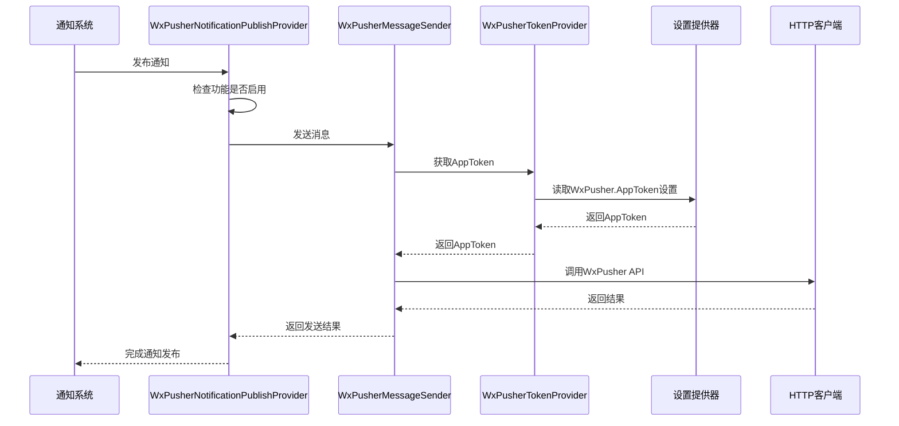
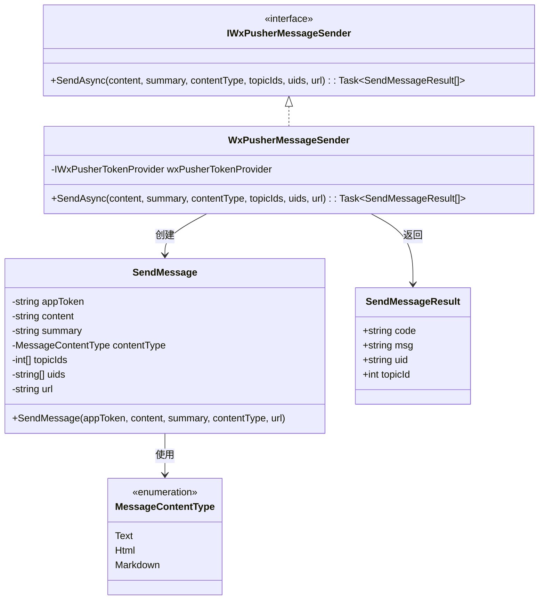
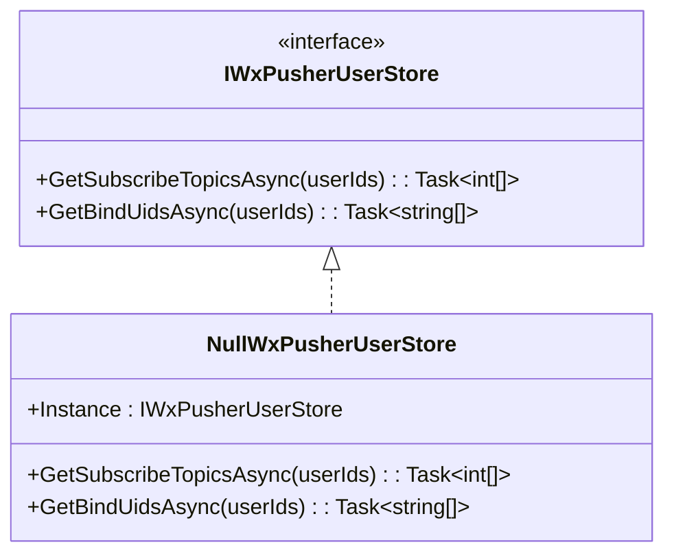
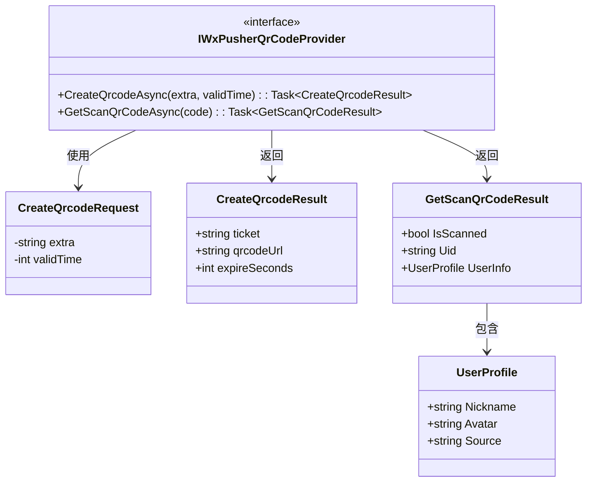
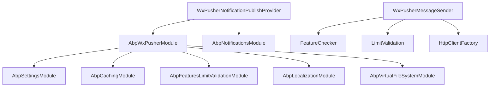

# WxPusher 集成

<cite>
**本文档中引用的文件**  
- [WxPusherNotificationPublishProvider.cs](file://aspnet-core/modules/realtime-notifications/LINGYUN.Abp.Notifications.WxPusher/LINGYUN/Abp/Notifications/WxPusher/WxPusherNotificationPublishProvider.cs)
- [AbpWxPusherModule.cs](file://aspnet-core/framework/wx-pusher/LINGYUN.Abp.WxPusher/LINGYUN/Abp/WxPusher/AbpWxPusherModule.cs)
- [WxPusherSettingNames.cs](file://aspnet-core/framework/wx-pusher/LINGYUN.Abp.WxPusher/LINGYUN/Abp/WxPusher/Settings/WxPusherSettingNames.cs)
- [WxPusherFeatureNames.cs](file://aspnet-core/framework/wx-pusher/LINGYUN.Abp.WxPusher/LINGYUN/Abp/WxPusher/Features/WxPusherFeatureNames.cs)
- [IWxPusherMessageSender.cs](file://aspnet-core/framework/wx-pusher/LINGYUN.Abp.WxPusher/LINGYUN/Abp/WxPusher/Messages/IWxPusherMessageSender.cs)
- [WxPusherMessageSender.cs](file://aspnet-core/framework/wx-pusher/LINGYUN.Abp.WxPusher/LINGYUN/Abp/WxPusher/Messages/WxPusherMessageSender.cs)
- [SendMessage.cs](file://aspnet-core/framework/wx-pusher/LINGYUN.Abp.WxPusher/LINGYUN/Abp/WxPusher/Messages/SendMessage.cs)
- [IWxPusherUserStore.cs](file://aspnet-core/framework/wx-pusher/LINGYUN.Abp.WxPusher/LINGYUN/Abp/WxPusher/User/IWxPusherUserStore.cs)
- [IWxPusherQrCodeProvider.cs](file://aspnet-core/framework/wx-pusher/LINGYUN.Abp.WxPusher/LINGYUN/Abp/WxPusher/QrCode/IWxPusherQrCodeProvider.cs)
- [WxPusherTokenProvider.cs](file://aspnet-core/framework/wx-pusher/LINGYUN.Abp.WxPusher/LINGYUN/Abp/WxPusher/Token/WxPusherTokenProvider.cs)
- [WxPusherMessageSenderTests.cs](file://aspnet-core/tests/LINGYUN.Abp.WxPusher.Tests/LINGYUN/Abp/WxPusher/Messages/WxPusherMessageSenderTests.cs)
</cite>

## 目录
1. [简介](#简介)
2. [项目结构](#项目结构)
3. [核心组件](#核心组件)
4. [架构概述](#架构概述)
5. [详细组件分析](#详细组件分析)
6. [依赖分析](#依赖分析)
7. [性能考虑](#性能考虑)
8. [故障排除指南](#故障排除指南)
9. [结论](#结论)

## 简介
本文档详细介绍了在ABP框架中集成WxPusher推送服务的方法。文档涵盖了WxPusher服务的配置、客户端初始化、消息推送API调用、用户扫码订阅流程等关键功能。通过本集成，系统能够实现向微信用户发送实时通知，支持多种消息类型和用户分组推送。

## 项目结构
WxPusher集成主要分布在框架的`wx-pusher`模块中，包含核心功能、身份验证和设置管理三个子模块。该集成与实时通知模块紧密协作，提供完整的消息推送解决方案。

```mermaid
graph TB
subgraph "WxPusher 模块"
A[AbpWxPusherModule] --> B[WxPusherSettingNames]
A --> C[WxPusherFeatureNames]
A --> D[IWxPusherMessageSender]
A --> E[IWxPusherUserStore]
A --> F[IWxPusherQrCodeProvider]
D --> G[WxPusherMessageSender]
G --> H[WxPusherTokenProvider]
H --> I[WxPusherSettingNames]
end
subgraph "通知模块"
J[AbpNotificationsWxPusherModule] --> K[WxPusherNotificationPublishProvider]
K --> D
K --> E
end
A < --> J
```

**图示来源**
- [AbpWxPusherModule.cs](file://aspnet-core/framework/wx-pusher/LINGYUN.Abp.WxPusher/LINGYUN/Abp/WxPusher/AbpWxPusherModule.cs)
- [WxPusherSettingNames.cs](file://aspnet-core/framework/wx-pusher/LINGYUN.Abp.WxPusher/LINGYUN/Abp/WxPusher/Settings/WxPusherSettingNames.cs)
- [WxPusherFeatureNames.cs](file://aspnet-core/framework/wx-pusher/LINGYUN.Abp.WxPusher/LINGYUN/Abp/WxPusher/Features/WxPusherFeatureNames.cs)
- [WxPusherNotificationPublishProvider.cs](file://aspnet-core/modules/realtime-notifications/LINGYUN.Abp.Notifications.WxPusher/LINGYUN/Abp/Notifications/WxPusher/WxPusherNotificationPublishProvider.cs)

**章节来源**
- [AbpWxPusherModule.cs](file://aspnet-core/framework/wx-pusher/LINGYUN.Abp.WxPusher/LINGYUN/Abp/WxPusher/AbpWxPusherModule.cs)
- [AbpNotificationsWxPusherModule.cs](file://aspnet-core/modules/realtime-notifications/LINGYUN.Abp.Notifications.WxPusher/LINGYUN/Abp/Notifications/WxPusher/AbpNotificationsWxPusherModule.cs)

## 核心组件
WxPusher集成的核心组件包括消息发送器、用户存储、二维码提供器和令牌提供器。这些组件共同实现了完整的推送服务功能，从配置管理到消息发送的全流程。

**章节来源**
- [WxPusherMessageSender.cs](file://aspnet-core/framework/wx-pusher/LINGYUN.Abp.WxPusher/LINGYUN/Abp/WxPusher/Messages/WxPusherMessageSender.cs)
- [WxPusherTokenProvider.cs](file://aspnet-core/framework/wx-pusher/LINGYUN.Abp.WxPusher/LINGYUN/Abp/WxPusher/Token/WxPusherTokenProvider.cs)
- [IWxPusherUserStore.cs](file://aspnet-core/framework/wx-pusher/LINGYUN.Abp.WxPusher/LINGYUN/Abp/WxPusher/User/IWxPusherUserStore.cs)

## 架构概述
WxPusher集成采用分层架构设计，上层为通知发布提供者，中层为业务逻辑处理，底层为HTTP客户端调用。这种设计确保了功能的可扩展性和维护性。



**图示来源**
- [WxPusherNotificationPublishProvider.cs](file://aspnet-core/modules/realtime-notifications/LINGYUN.Abp.Notifications.WxPusher/LINGYUN/Abp/Notifications/WxPusher/WxPusherNotificationPublishProvider.cs)
- [WxPusherMessageSender.cs](file://aspnet-core/framework/wx-pusher/LINGYUN.Abp.WxPusher/LINGYUN/Abp/WxPusher/Messages/WxPusherMessageSender.cs)
- [WxPusherTokenProvider.cs](file://aspnet-core/framework/wx-pusher/LINGYUN.Abp.WxPusher/LINGYUN/Abp/WxPusher/Token/WxPusherTokenProvider.cs)

## 详细组件分析
### 消息发送组件分析
WxPusher消息发送组件负责与WxPusher API进行交互，实现消息的推送功能。该组件通过依赖注入获取必要的服务，并在发送消息前进行功能检查和限流控制。

#### 类图


**图示来源**
- [IWxPusherMessageSender.cs](file://aspnet-core/framework/wx-pusher/LINGYUN.Abp.WxPusher/LINGYUN/Abp/WxPusher/Messages/IWxPusherMessageSender.cs)
- [WxPusherMessageSender.cs](file://aspnet-core/framework/wx-pusher/LINGYUN.Abp.WxPusher/LINGYUN/Abp/WxPusher/Messages/WxPusherMessageSender.cs)
- [SendMessage.cs](file://aspnet-core/framework/wx-pusher/LINGYUN.Abp.WxPusher/LINGYUN/Abp/WxPusher/Messages/SendMessage.cs)

**章节来源**
- [WxPusherMessageSender.cs](file://aspnet-core/framework/wx-pusher/LINGYUN.Abp.WxPusher/LINGYUN/Abp/WxPusher/Messages/WxPusherMessageSender.cs)
- [SendMessage.cs](file://aspnet-core/framework/wx-pusher/LINGYUN.Abp.WxPusher/LINGYUN/Abp/WxPusher/Messages/SendMessage.cs)

### 用户管理组件分析
用户管理组件负责处理WxPusher用户相关的操作，包括获取用户订阅的主题和绑定的UID列表。



**图示来源**
- [IWxPusherUserStore.cs](file://aspnet-core/framework/wx-pusher/LINGYUN.Abp.WxPusher/LINGYUN/Abp/WxPusher/User/IWxPusherUserStore.cs)

**章节来源**
- [IWxPusherUserStore.cs](file://aspnet-core/framework/wx-pusher/LINGYUN.Abp.WxPusher/LINGYUN/Abp/WxPusher/User/IWxPusherUserStore.cs)

### 二维码组件分析
二维码组件提供创建和扫描WxPusher二维码的功能，用于用户订阅流程。



**图示来源**
- [IWxPusherQrCodeProvider.cs](file://aspnet-core/framework/wx-pusher/LINGYUN.Abp.WxPusher/LINGYUN/Abp/WxPusher/QrCode/IWxPusherQrCodeProvider.cs)

**章节来源**
- [IWxPusherQrCodeProvider.cs](file://aspnet-core/framework/wx-pusher/LINGYUN.Abp.WxPusher/LINGYUN/Abp/WxPusher/QrCode/IWxPusherQrCodeProvider.cs)

## 依赖分析
WxPusher集成依赖于多个ABP框架模块，包括设置模块、缓存模块和特性限制验证模块。这些依赖关系确保了配置管理、性能优化和功能控制的完整性。



**图示来源**
- [AbpWxPusherModule.cs](file://aspnet-core/framework/wx-pusher/LINGYUN.Abp.WxPusher/LINGYUN/Abp/WxPusher/AbpWxPusherModule.cs)
- [AbpNotificationsWxPusherModule.cs](file://aspnet-core/modules/realtime-notifications/LINGYUN.Abp.Notifications.WxPusher/LINGYUN/Abp/Notifications/WxPusher/AbpNotificationsWxPusherModule.cs)
- [WxPusherMessageSender.cs](file://aspnet-core/framework/wx-pusher/LINGYUN.Abp.WxPusher/LINGYUN/Abp/WxPusher/Messages/WxPusherMessageSender.cs)

**章节来源**
- [AbpWxPusherModule.cs](file://aspnet-core/framework/wx-pusher/LINGYUN.Abp.WxPusher/LINGYUN/Abp/WxPusher/AbpWxPusherModule.cs)
- [AbpNotificationsWxPusherModule.cs](file://aspnet-core/modules/realtime-notifications/LINGYUN.Abp.Notifications.WxPusher/LINGYUN/Abp/Notifications/WxPusher/AbpNotificationsWxPusherModule.cs)

## 性能考虑
WxPusher集成在设计时考虑了性能优化，通过缓存机制减少重复的API调用，并使用异步编程模型提高响应速度。消息发送操作支持批量处理，可以同时向多个主题或用户发送消息，提高了推送效率。

## 故障排除指南
当WxPusher集成出现问题时，可以按照以下步骤进行排查：
1. 检查WxPusher功能是否已启用
2. 确认AppToken配置正确
3. 验证网络连接是否正常
4. 检查消息内容长度是否符合限制
5. 查看日志中的错误信息

**章节来源**
- [WxPusherNotificationPublishProvider.cs](file://aspnet-core/modules/realtime-notifications/LINGYUN.Abp.Notifications.WxPusher/LINGYUN/Abp/Notifications/WxPusher/WxPusherNotificationPublishProvider.cs)
- [WxPusherMessageSender.cs](file://aspnet-core/framework/wx-pusher/LINGYUN.Abp.WxPusher/LINGYUN/Abp/WxPusher/Messages/WxPusherMessageSender.cs)

## 结论
WxPusher集成提供了一套完整的微信消息推送解决方案，通过模块化设计和清晰的接口定义，实现了易于集成和维护的推送服务。该集成支持多种消息类型和灵活的用户管理，能够满足企业级应用的推送需求。