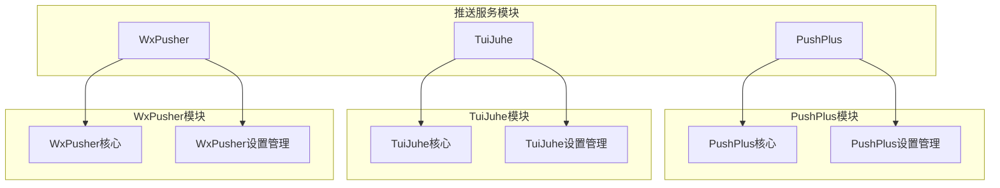
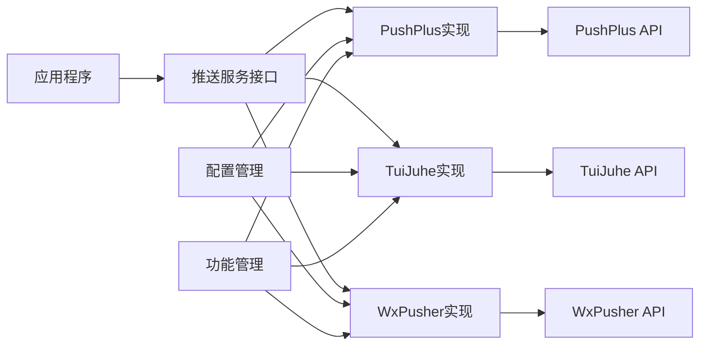
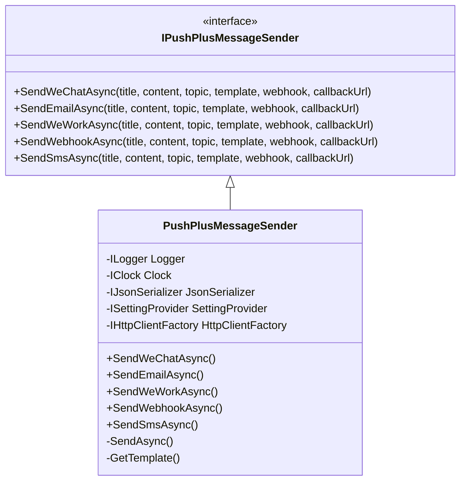
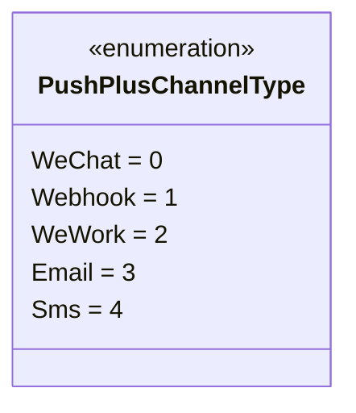
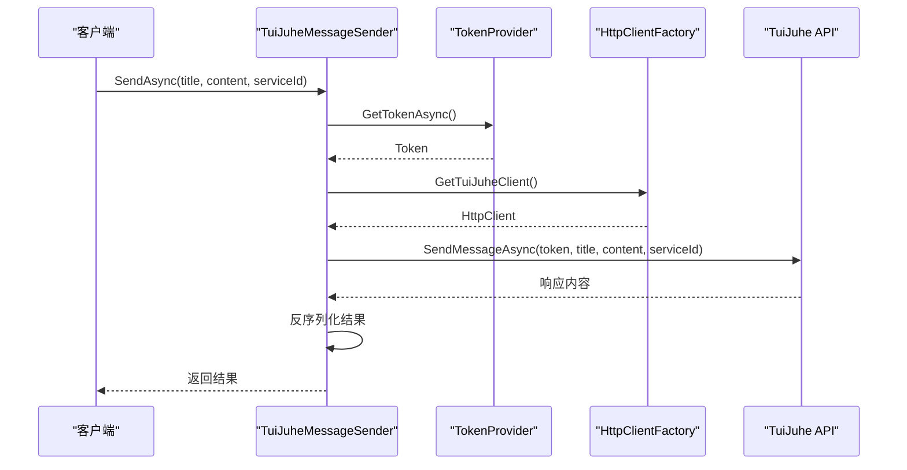
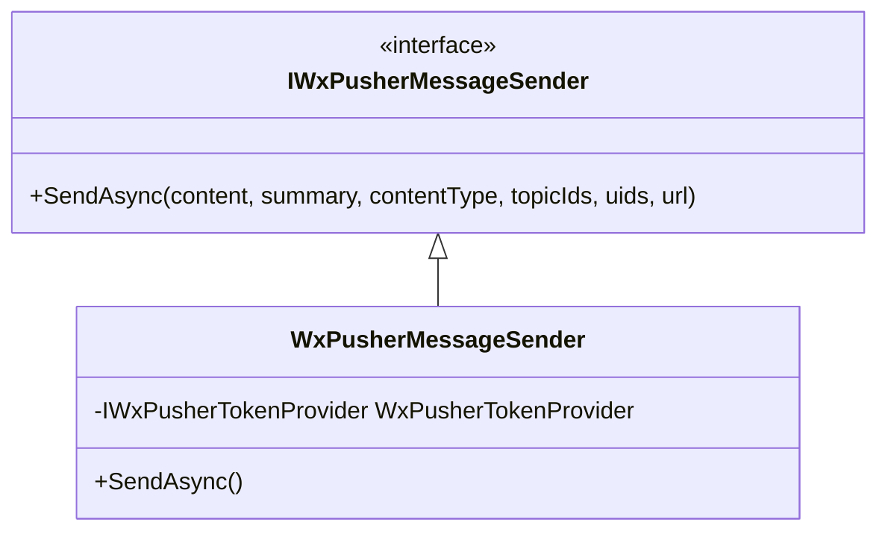
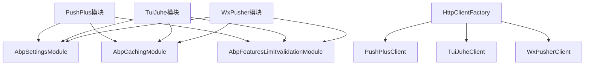

# 推送通知服务

<cite>
**本文档引用的文件**
- [AbpPushPlusModule.cs](file://aspnet-core/framework/pushplus/LINGYUN.Abp.PushPlus/LINGYUN/Abp/PushPlus/AbpPushPlusModule.cs)
- [PushPlusMessageSender.cs](file://aspnet-core/framework/pushplus/LINGYUN.Abp.PushPlus/LINGYUN/Abp/PushPlus/Message/PushPlusMessageSender.cs)
- [TuiJuheMessageSender.cs](file://aspnet-core/framework/tui-juhe/LINGYUN.Abp.TuiJuhe/LINGYUN/Abp/TuiJuhe/Messages/TuiJuheMessageSender.cs)
- [WxPusherMessageSender.cs](file://aspnet-core/framework/wx-pusher/LINGYUN.Abp.WxPusher/LINGYUN/Abp/WxPusher/Messages/WxPusherMessageSender.cs)
- [PushPlusSettingNames.cs](file://aspnet-core/framework/pushplus/LINGYUN.Abp.PushPlus/LINGYUN/Abp/PushPlus/Settings/PushPlusSettingNames.cs)
- [TuiJuheSettingNames.cs](file://aspnet-core/framework/tui-juhe/LINGYUN.Abp.TuiJuhe/LINGYUN/Abp/TuiJuhe/Settings/TuiJuheSettingNames.cs)
- [WxPusherSettingNames.cs](file://aspnet-core/framework/wx-pusher/LINGYUN.Abp.WxPusher/LINGYUN/Abp/WxPusher/Settings/WxPusherSettingNames.cs)
- [PushPlusFeatureNames.cs](file://aspnet-core/framework/pushplus/LINGYUN.Abp.PushPlus/LINGYUN/Abp/PushPlus/Features/PushPlusFeatureNames.cs)
- [TuiJuheFeatureNames.cs](file://aspnet-core/framework/tui-juhe/LINGYUN.Abp.TuiJuhe/LINGYUN/Abp/TuiJuhe/Features/TuiJuheFeatureNames.cs)
- [WxPusherFeatureNames.cs](file://aspnet-core/framework/wx-pusher/LINGYUN.Abp.WxPusher/LINGYUN/Abp/WxPusher/Features/WxPusherFeatureNames.cs)
</cite>

## 目录
1. [简介](#简介)
2. [项目结构](#项目结构)
3. [核心组件](#核心组件)
4. [架构概述](#架构概述)
5. [详细组件分析](#详细组件分析)
6. [依赖分析](#依赖分析)
7. [性能考虑](#性能考虑)
8. [故障排除指南](#故障排除指南)
9. [结论](#结论)

## 简介
本文档详细介绍了在ABP框架中集成推送通知服务的实现方式，重点涵盖PushPlus、TuiJuhe和WxPusher三种推送服务。文档内容包括各种推送服务的配置方法、消息格式定义、API调用机制以及状态反馈处理。同时提供了客户端初始化配置、消息推送代码示例和批量推送的最佳实践指导。

## 项目结构
推送通知服务模块在项目中按照不同的服务提供商进行组织，每个服务都有独立的模块和设置管理模块。

**图源**
- [pushplus目录结构](file://aspnet-core/framework/pushplus)
- [tui-juhe目录结构](file://aspnet-core/framework/tui-juhe)
- [wx-pusher目录结构](file://aspnet-core/framework/wx-pusher)

**节源**
- [pushplus目录结构](file://aspnet-core/framework/pushplus)
- [tui-juhe目录结构](file://aspnet-core/framework/tui-juhe)
- [wx-pusher目录结构](file://aspnet-core/framework/wx-pusher)

## 核心组件
推送通知服务的核心组件主要包括消息发送器、通道类型定义、功能特性管理和设置管理。每种推送服务都实现了统一的接口模式，但根据各自的服务特点进行了定制化实现。

**节源**
- [PushPlusMessageSender.cs](file://aspnet-core/framework/pushplus/LINGYUN.Abp.PushPlus/LINGYUN/Abp/PushPlus/Message/PushPlusMessageSender.cs)
- [TuiJuheMessageSender.cs](file://aspnet-core/framework/tui-juhe/LINGYUN.Abp.TuiJuhe/LINGYUN/Abp/TuiJuhe/Messages/TuiJuheMessageSender.cs)
- [WxPusherMessageSender.cs](file://aspnet-core/framework/wx-pusher/LINGYUN.Abp.WxPusher/LINGYUN/Abp/WxPusher/Messages/WxPusherMessageSender.cs)

## 架构概述
推送通知服务采用模块化设计，每个服务提供商都有独立的模块，通过依赖注入的方式集成到主应用程序中。服务间通过统一的接口进行交互，确保了系统的可扩展性和维护性。

**图源**
- [AbpPushPlusModule.cs](file://aspnet-core/framework/pushplus/LINGYUN.Abp.PushPlus/LINGYUN/Abp/PushPlus/AbpPushPlusModule.cs)
- [PushPlusMessageSender.cs](file://aspnet-core/framework/pushplus/LINGYUN.Abp.PushPlus/LINGYUN/Abp/PushPlus/Message/PushPlusMessageSender.cs)

## 详细组件分析

### PushPlus服务分析
PushPlus服务支持多种推送通道，包括微信公众号、企业微信应用、邮件、短信和第三方webhook。通过功能特性控制不同通道的启用状态和发送限制。

#### PushPlus消息发送器

**图源**
- [IPushPlusMessageSender.cs](file://aspnet-core/framework/pushplus/LINGYUN.Abp.PushPlus/LINGYUN/Abp/PushPlus/Message/IPushPlusMessageSender.cs)
- [PushPlusMessageSender.cs](file://aspnet-core/framework/pushplus/LINGYUN.Abp.PushPlus/LINGYUN/Abp/PushPlus/Message/PushPlusMessageSender.cs)

#### PushPlus通道类型

**图源**
- [PushPlusChannelType.cs](file://aspnet-core/framework/pushplus/LINGYUN.Abp.PushPlus/LINGYUN/Abp/PushPlus/Channel/PushPlusChannelType.cs)

### TuiJuhe服务分析
TuiJuhe服务提供简单高效的消息推送功能，主要通过API调用实现消息发送，支持多种内容类型。

#### TuiJuhe消息发送流程

**图源**
- [TuiJuheMessageSender.cs](file://aspnet-core/framework/tui-juhe/LINGYUN.Abp.TuiJuhe/LINGYUN/Abp/TuiJuhe/Messages/TuiJuheMessageSender.cs)

### WxPusher服务分析
WxPusher服务专注于微信生态的推送，支持向特定主题或用户列表发送消息。

#### WxPusher消息发送器

**图源**
- [IWxPusherMessageSender.cs](file://aspnet-core/framework/wx-pusher/LINGYUN.Abp.WxPusher/LINGYUN/Abp/WxPusher/Messages/IWxPusherMessageSender.cs)
- [WxPusherMessageSender.cs](file://aspnet-core/framework/wx-pusher/LINGYUN.Abp.WxPusher/LINGYUN/Abp/WxPusher/Messages/WxPusherMessageSender.cs)

## 依赖分析
推送通知服务模块依赖于ABP框架的核心功能，包括设置管理、缓存、特性管理和HTTP客户端工厂。

**图源**
- [AbpPushPlusModule.cs](file://aspnet-core/framework/pushplus/LINGYUN.Abp.PushPlus/LINGYUN/Abp/PushPlus/AbpPushPlusModule.cs)
- [IServiceCollectionExtensions.cs](file://aspnet-core/framework/pushplus/LINGYUN.Abp.PushPlus/System/Net/Http/IHttpClientFactoryExtensions.cs)

**节源**
- [AbpPushPlusModule.cs](file://aspnet-core/framework/pushplus/LINGYUN.Abp.PushPlus/LINGYUN/Abp/PushPlus/AbpPushPlusModule.cs)
- [IServiceCollectionExtensions.cs](file://aspnet-core/framework/pushplus/LINGYUN.Abp.PushPlus/System/Net/Http/IHttpClientFactoryExtensions.cs)

## 性能考虑
推送服务在设计时考虑了性能优化，通过以下方式提高系统效率：
- 使用缓存机制减少重复的API调用
- 实现异步非阻塞的API调用
- 通过特性管理控制功能开关，避免不必要的处理
- 支持批量推送，减少网络开销

## 故障排除指南
当推送服务出现问题时，可以按照以下步骤进行排查：

1. 检查相关服务的配置是否正确
2. 验证API密钥或令牌是否有效
3. 查看日志中的错误信息
4. 确认功能特性是否已启用
5. 检查网络连接是否正常

**节源**
- [PushPlusRequestException.cs](file://aspnet-core/framework/pushplus/LINGYUN.Abp.PushPlus/LINGYUN/Abp/PushPlus/PushPlusRequestException.cs)
- [TuiJuheRemoteCallException.cs](file://aspnet-core/framework/tui-juhe/LINGYUN.Abp.TuiJuhe/LINGYUN/Abp/TuiJuhe/TuiJuheRemoteCallException.cs)
- [WxPusherRemoteCallException.cs](file://aspnet-core/framework/wx-pusher/LINGYUN.Abp.WxPusher/LINGYUN/Abp/WxPusher/WxPusherRemoteCallException.cs)

## 结论
本文档详细介绍了PushPlus、TuiJuhe和WxPusher三种推送服务的集成方式。这些服务通过统一的架构模式实现了灵活的消息推送功能，支持多种通道和内容类型。开发者可以根据具体需求选择合适的推送服务，并通过配置和特性管理来控制服务行为。