现在我已经收集了足够的信息来创建关于消息服务集成的详细文档。让我开始编写文档：

<docs>
# 消息服务集成

<cite>
**本文档中引用的文件**
- [PushPlusMessageSender.cs](file://aspnet-core/framework/pushplus/LINGYUN.Abp.PushPlus/LINGYUN/Abp/PushPlus/Message/PushPlusMessageSender.cs)
- [WxPusherMessageSender.cs](file://aspnet-core/framework/wx-pusher/LINGYUN.Abp.WxPusher/LINGYUN/Abp/WxPusher/Messages/WxPusherMessageSender.cs)
- [AliyunSmsSender.cs](file://aspnet-core/framework/common/LINGYUN.Abp.Sms.Aliyun/LINGYUN/Abp/Sms/Aliyun/AliyunSmsSender.cs)
- [TencentCloudSmsSender.cs](file://aspnet-core/framework/cloud-tencent/LINGYUN.Abp.Sms.Tencent/LINGYUN/Abp/Sms/Tencent/TencentCloudSmsSender.cs)
- [TuiJuheMessageSender.cs](file://aspnet-core/framework/tui-juhe/LINGYUN.Abp.TuiJuhe/LINGYUN/Abp/TuiJuhe/Messages/TuiJuheMessageSender.cs)
- [PlatformSmsSender.cs](file://aspnet-core/services/LY.MicroService.PlatformManagement.HttpApi.Host/Messages/PlatformSmsSender.cs)
- [PlatformSmsMessageManager.cs](file://aspnet-core/services/LY.MicroService.PlatformManagement.HttpApi.Host/Messages/PlatformSmsMessageManager.cs)
- [PushPlusFeatureDefinitionProvider.cs](file://aspnet-core/framework/pushplus/LINGYUN.Abp.PushPlus/LINGYUN/Abp/PushPlus/Features/PushPlusFeatureDefinitionProvider.cs)
- [Message.cs](file://aspnet-core/modules/platform/LINGYUN.Platform.Domain/LINGYUN/Platform/Messages/Message.cs)
- [MessageStatus.cs](file://aspnet-core/modules/platform/LINGYUN.Platform.Domain.Shared/LINGYUN/Platform/Messages/MessageStatus.cs)
- [AliyunSmsResponse.cs](file://aspnet-core/framework/common/LINGYUN.Abp.Sms.Aliyun/LINGYUN/Abp/Sms/Aliyun/AliyunSmsResponse.cs)
</cite>

## 目录
1. [简介](#简介)
2. [项目结构](#项目结构)
3. [核心组件](#核心组件)
4. [架构概览](#架构概览)
5. [详细组件分析](#详细组件分析)
6. [消息模板管理](#消息模板管理)
7. [消息发送API](#消息发送API)
8. [发送状态跟踪](#发送状态跟踪)
9. [错误处理机制](#错误处理机制)
10. [限流策略与重试机制](#限流策略与重试机制)
11. [最佳实践](#最佳实践)
12. [故障排除指南](#故障排除指南)
13. [结论](#结论)

## 简介

本文档详细介绍了ABP Next Admin框架中的消息服务集成系统，重点涵盖短信、推送通知等多种消息通道的集成方式。该系统提供了完整的消息服务解决方案，包括阿里云短信、腾讯云短信、PushPlus、TuiJuhe和WxPusher等主流消息服务的配置和使用方法。

消息服务集成系统采用模块化设计，支持多种消息类型（短信、邮件、推送通知等）和多个消息提供商，具有完善的限流控制、错误处理和状态跟踪功能。系统通过统一的接口设计，实现了消息发送的标准化和可扩展性。

## 项目结构

消息服务集成系统的项目结构按照功能模块进行组织，主要包含以下几个层次：

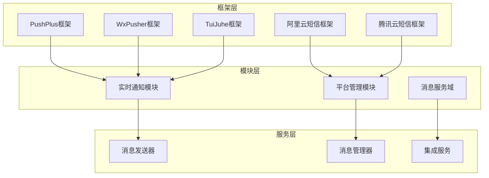

**图表来源**
- [PushPlusMessageSender.cs](file://aspnet-core/framework/pushplus/LINGYUN.Abp.PushPlus/LINGYUN/Abp/PushPlus/Message/PushPlusMessageSender.cs#L1-L215)
- [WxPusherMessageSender.cs](file://aspnet-core/framework/wx-pusher/LINGYUN.Abp.WxPusher/LINGYUN/Abp/WxPusher/Messages/WxPusherMessageSender.cs#L1-L63)

**章节来源**
- [PushPlusMessageSender.cs](file://aspnet-core/framework/pushplus/LINGYUN.Abp.PushPlus/LINGYUN/Abp/PushPlus/Message/PushPlusMessageSender.cs#L1-L215)
- [WxPusherMessageSender.cs](file://aspnet-core/framework/wx-pusher/LINGYUN.Abp.WxPusher/LINGYUN/Abp/WxPusher/Messages/WxPusherMessageSender.cs#L1-L63)

## 核心组件

消息服务集成系统的核心组件包括消息发送器、消息管理器和消息模板管理器。这些组件协同工作，提供完整的消息发送解决方案。

### 消息发送器

消息发送器是系统的核心组件，负责与各个消息提供商进行交互。每个消息提供商都有对应的发送器实现：

- **PushPlusMessageSender**: 支持微信、企业微信、邮件、Webhook和短信等多种渠道
- **WxPusherMessageSender**: 专注于微信推送服务
- **AliyunSmsSender**: 阿里云短信服务发送器
- **TencentCloudSmsSender**: 腾讯云短信服务发送器
- **TuiJuheMessageSender**: 推聚互动短信服务发送器

### 消息管理器

消息管理器负责消息的生命周期管理，包括消息创建、存储和发送协调：

- **PlatformSmsMessageManager**: 平台短信消息管理器
- **PlatformEmailMessageManager**: 平台邮件消息管理器

### 消息模板管理器

消息模板管理器负责消息模板的管理和渲染，支持多种消息内容类型。

**章节来源**
- [PushPlusMessageSender.cs](file://aspnet-core/framework/pushplus/LINGYUN.Abp.PushPlus/LINGYUN/Abp/PushPlus/Message/PushPlusMessageSender.cs#L18-L35)
- [WxPusherMessageSender.cs](file://aspnet-core/framework/wx-pusher/LINGYUN.Abp.WxPusher/LINGYUN/Abp/WxPusher/Messages/WxPusherMessageSender.cs#L13-L20)

## 架构概览

消息服务集成系统采用分层架构设计，通过抽象接口和具体实现分离的方式，实现了高度的可扩展性和可维护性。

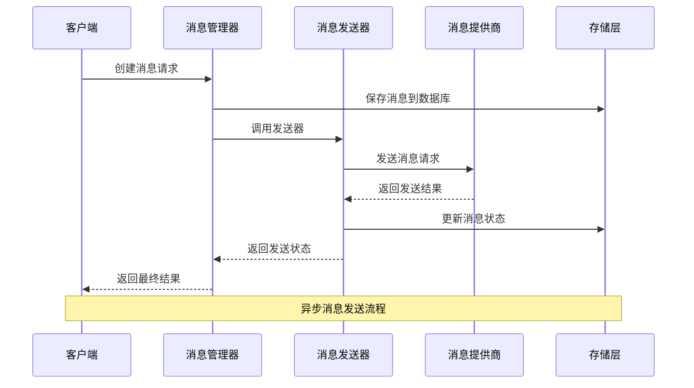

**图表来源**
- [PlatformSmsMessageManager.cs](file://aspnet-core/services/LY.MicroService.PlatformManagement.HttpApi.Host/Messages/PlatformSmsMessageManager.cs#L10-L22)
- [PushPlusMessageSender.cs](file://aspnet-core/framework/pushplus/LINGYUN.Abp.PushPlus/LINGYUN/Abp/PushPlus/Message/PushPlusMessageSender.cs#L149-L189)

## 详细组件分析

### PushPlus消息发送器

PushPlus消息发送器是最为全面的消息发送器之一，支持多种消息渠道和模板类型。

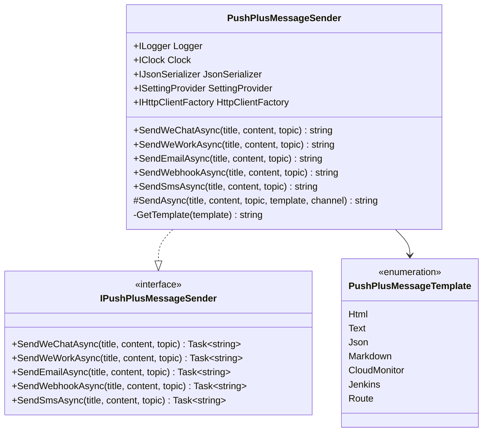

**图表来源**
- [PushPlusMessageSender.cs](file://aspnet-core/framework/pushplus/LINGYUN.Abp.PushPlus/LINGYUN/Abp/PushPlus/Message/PushPlusMessageSender.cs#L18-L215)
- [PushPlusMessageTemplate.cs](file://aspnet-core/framework/pushplus/LINGYUN.Abp.PushPlus/LINGYUN/Abp/PushPlus/Message/PushPlusMessageTemplate.cs#L1-L34)

PushPlus消息发送器的主要特点：

1. **多渠道支持**: 支持微信、企业微信、邮件、Webhook和短信等多种消息渠道
2. **模板化消息**: 提供多种消息模板类型，支持HTML、纯文本、JSON、Markdown等格式
3. **限流控制**: 每个渠道都配置了独立的发送限制和时间间隔
4. **异步发送**: 所有发送操作都是异步的，提高系统响应性能

### 阿里云短信发送器

阿里云短信发送器专门用于发送短信消息，集成了阿里云短信服务的各项功能。

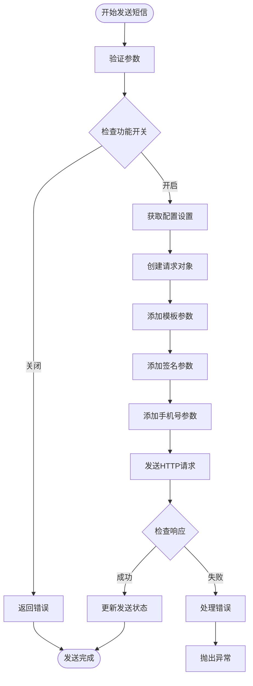

**图表来源**
- [AliyunSmsSender.cs](file://aspnet-core/framework/common/LINGYUN.Abp.Sms.Aliyun/LINGYUN/Abp/Sms/Aliyun/AliyunSmsSender.cs#L38-L153)

阿里云短信发送器的关键特性：

1. **配置驱动**: 通过设置提供程序动态获取阿里云配置
2. **模板化发送**: 支持短信模板和动态参数替换
3. **错误处理**: 完善的错误码映射和用户友好的错误信息
4. **限流控制**: 基于月度发送量的限流机制

**章节来源**
- [PushPlusMessageSender.cs](file://aspnet-core/framework/pushplus/LINGYUN.Abp.PushPlus/LINGYUN/Abp/PushPlus/Message/PushPlusMessageSender.cs#L149-L189)
- [AliyunSmsSender.cs](file://aspnet-core/framework/common/LINGYUN.Abp.Sms.Aliyun/LINGYUN/Abp/Sms/Aliyun/AliyunSmsSender.cs#L38-L72)

### 腾讯云短信发送器

腾讯云短信发送器提供了与腾讯云短信服务的完整集成，支持签名、模板和参数的灵活配置。

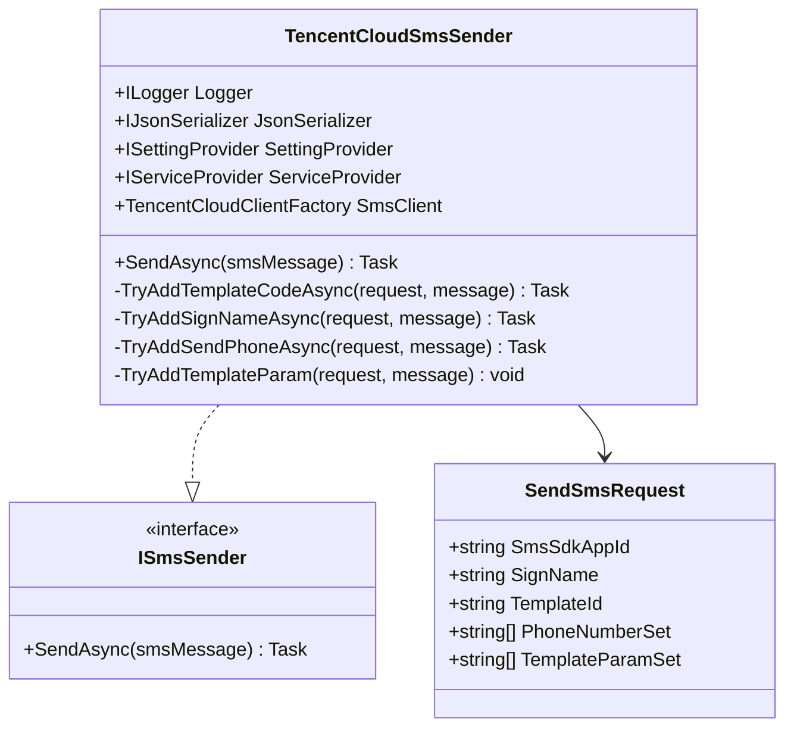

**图表来源**
- [TencentCloudSmsSender.cs](file://aspnet-core/framework/cloud-tencent/LINGYUN.Abp.Sms.Tencent/LINGYUN/Abp/Sms/Tencent/TencentCloudSmsSender.cs#L20-L68)

腾讯云短信发送器的特点：

1. **标准化接口**: 使用腾讯云官方SDK的标准接口
2. **灵活配置**: 支持动态设置签名和模板
3. **批量发送**: 支持向多个手机号批量发送短信
4. **错误码映射**: 将腾讯云错误码映射为可读的错误信息

**章节来源**
- [TencentCloudSmsSender.cs](file://aspnet-core/framework/cloud-tencent/LINGYUN.Abp.Sms.Tencent/LINGYUN/Abp/Sms/Tencent/TencentCloudSmsSender.cs#L34-L68)

### WxPusher消息发送器

WxPusher消息发送器专注于微信推送服务，提供了简洁而强大的消息发送功能。

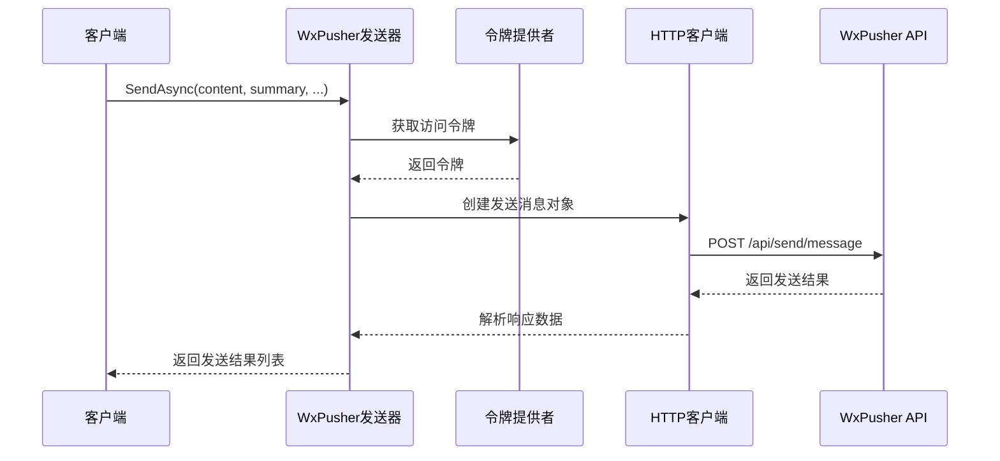

**图表来源**
- [WxPusherMessageSender.cs](file://aspnet-core/framework/wx-pusher/LINGYUN.Abp.WxPusher/LINGYUN/Abp/WxPusher/Messages/WxPusherMessageSender.cs#L25-L62)

WxPusher消息发送器的优势：

1. **简单易用**: 提供简洁的API接口
2. **主题支持**: 支持按主题ID或用户UID发送消息
3. **内容类型**: 支持多种消息内容类型
4. **批量发送**: 支持同时发送给多个接收者

**章节来源**
- [WxPusherMessageSender.cs](file://aspnet-core/framework/wx-pusher/LINGYUN.Abp.WxPusher/LINGYUN/Abp/WxPusher/Messages/WxPusherMessageSender.cs#L25-L62)

## 消息模板管理

消息模板管理系统负责管理不同类型的消息模板，支持HTML、纯文本、JSON、Markdown等多种模板格式。

### 模板类型定义

系统支持以下消息模板类型：

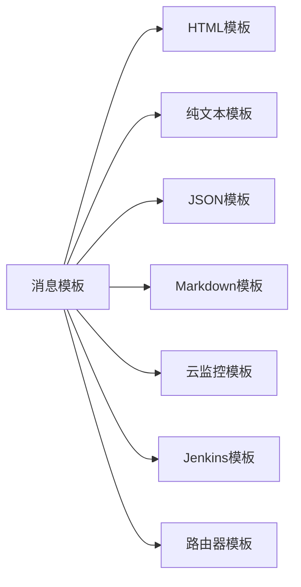

每种模板类型都有其特定的应用场景：
- **HTML模板**: 适用于富文本消息，支持样式和链接
- **纯文本模板**: 适用于简单文本消息，不进行HTML转义
- **JSON模板**: 适用于结构化数据传输
- **Markdown模板**: 适用于Markdown格式的消息
- **专用模板**: 适用于特定场景的定制模板

### 模板参数管理

消息模板支持动态参数替换，允许在发送时传入具体的参数值。例如：

```csharp
// 示例：阿里云短信模板参数
var templateParams = new Dictionary<string, object>
{
    { "code", "123456" },        // 验证码
    { "product", "ABC产品" },     // 产品名称
    { "expire", "5分钟" }         // 过期时间
};
```

**章节来源**
- [PushPlusMessageTemplate.cs](file://aspnet-core/framework/pushplus/LINGYUN.Abp.PushPlus/LINGYUN/Abp/PushPlus/Message/PushPlusMessageTemplate.cs#L1-L34)

## 消息发送API

消息发送API提供了统一的接口来发送各种类型的消息。所有消息发送器都实现了标准的发送接口。

### 基础发送接口

```csharp
// 基础消息发送接口
public interface ISmsSender
{
    Task SendAsync(SmsMessage smsMessage);
}

// 推送消息发送接口
public interface IPushPlusMessageSender
{
    Task<string> SendWeChatAsync(string title, string content, string topic = "");
    Task<string> SendEmailAsync(string title, string content, string topic = "");
    Task<string> SendWeWorkAsync(string title, string content, string topic = "");
    Task<string> SendWebhookAsync(string title, string content, string topic = "");
    Task<string> SendSmsAsync(string title, string content, string topic = "");
}
```

### 异步发送最佳实践

系统推荐使用异步发送模式，以提高系统性能和响应能力：

```csharp
// 异步发送示例
public async Task SendMessageAsync()
{
    try
    {
        var result = await messageSender.SendAsync(message);
        // 处理发送成功逻辑
    }
    catch (Exception ex)
    {
        // 处理发送失败逻辑
        Logger.LogError(ex, "消息发送失败");
    }
}
```

### 批量发送支持

对于需要同时发送多条消息的场景，系统提供了批量发送的支持：

```csharp
// 批量发送示例
public async Task SendBatchMessagesAsync(List<Message> messages)
{
    var tasks = messages.Select(async message => 
    {
        try
        {
            return await messageSender.SendAsync(message);
        }
        catch (Exception ex)
        {
            return new SendResult { Success = false, Error = ex.Message };
        }
    });
    
    var results = await Task.WhenAll(tasks);
    // 处理批量发送结果
}
```

**章节来源**
- [PushPlusMessageSender.cs](file://aspnet-core/framework/pushplus/LINGYUN.Abp.PushPlus/LINGYUN/Abp/PushPlus/Message/PushPlusMessageSender.cs#L40-L148)

## 发送状态跟踪

消息发送状态跟踪系统提供了完整的消息生命周期管理，包括消息创建、发送过程监控和发送结果记录。

### 消息状态定义

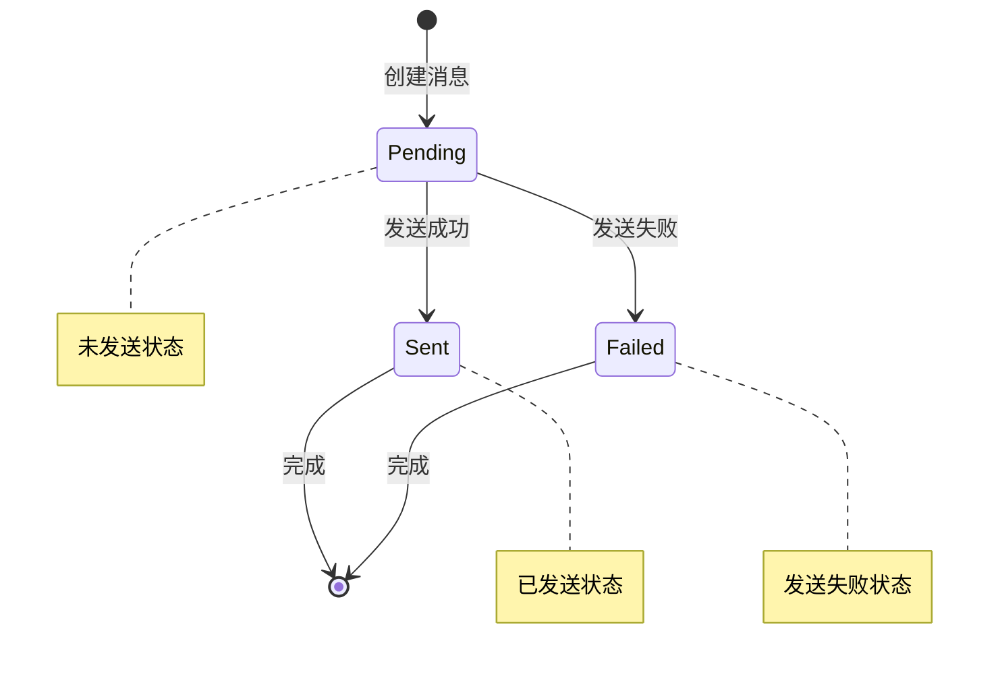

**图表来源**
- [MessageStatus.cs](file://aspnet-core/modules/platform/LINGYUN.Platform.Domain.Shared/LINGYUN/Platform/Messages/MessageStatus.cs#L1-L15)

消息状态包括：
- **Pending（待发送）**: 消息已创建但尚未发送
- **Sent（已发送）**: 消息发送成功
- **Failed（发送失败）**: 消息发送失败

### 状态更新机制

消息状态更新通过以下方式实现：

```csharp
// 状态更新示例
public class Message
{
    public void Sent(IClock clock)
    {
        SendCount += 1;
        SendTime = clock.Now;
        Status = MessageStatus.Sent;
        Reason = "";
    }

    public void Failed(string error, IClock clock)
    {
        SendTime = clock.Now;
        Status = MessageStatus.Failed;
        Reason = error.Truncate(MessageConsts.MaxReasonLength);
    }
}
```

### 发送历史记录

系统自动记录每次消息发送的历史记录，包括发送时间、发送次数和失败原因等信息。

**章节来源**
- [Message.cs](file://aspnet-core/modules/platform/LINGYUN.Platform.Domain/LINGYUN/Platform/Messages/Message.cs#L35-L55)

## 错误处理机制

消息服务集成系统实现了完善的错误处理机制，能够捕获和处理各种可能的错误情况。

### 错误分类

系统将错误分为以下几类：

1. **网络错误**: 包括连接超时、DNS解析失败等
2. **认证错误**: 包括API密钥无效、权限不足等
3. **参数错误**: 包括必填参数缺失、参数格式错误等
4. **业务错误**: 包括发送限制、内容违规等
5. **系统错误**: 包括服务不可用、内部异常等

### 错误处理策略

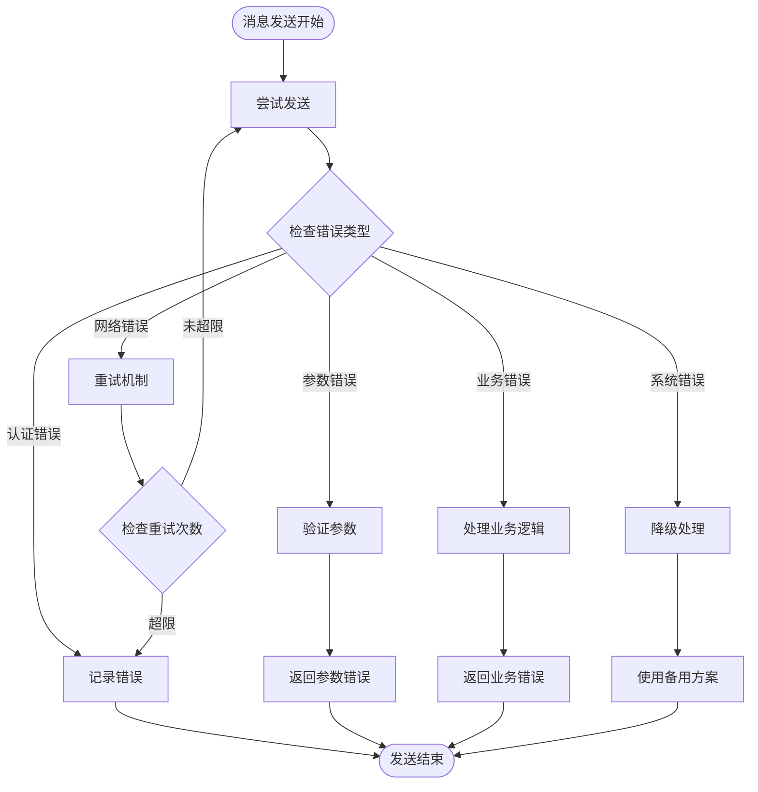

### 具体错误处理实现

以阿里云短信为例，系统实现了详细的错误处理：

```csharp
// 阿里云短信错误处理
try
{
    var client = await AcsClientFactory.CreateAsync();
    CommonResponse response = client.GetCommonResponse(request);
    var responseContent = Encoding.Default.GetString(response.HttpResponse.Content);
    var aliyunResponse = JsonSerializer.Deserialize<AliyunSmsResponse>(responseContent);
    
    if (!aliyunResponse.IsSuccess())
    {
        if (await SettingProvider.IsTrueAsync(AliyunSettingNames.Sms.VisableErrorToClient))
        {
            throw new UserFriendlyException(aliyunResponse.Code, aliyunResponse.Message);
        }
        throw new AliyunSmsException(aliyunResponse.Code, 
            $"Text message sending failed, code:{aliyunResponse.Code}, message:{aliyunResponse.Message}!");
    }
}
catch(ServerException se)
{
    throw new AliyunSmsException(se.ErrorCode, 
        $"Sending text messages to aliyun server is abnormal,type: {se.ErrorType}, error: {se.ErrorMessage}");
}
catch(ClientException ce)
{
    throw new AliyunSmsException(ce.ErrorCode, 
        $"A client exception occurred in sending SMS messages,type: {ce.ErrorType}, error: {ce.ErrorMessage}");
}
```

### 用户友好错误信息

系统将技术性的错误码转换为用户友好的错误信息，便于理解和处理：

```csharp
// 错误码映射示例
public static ILocalizableString GetErrorMessage(string code, string message)
{
    switch (code)
    {
        case "isv.SMS_SIGNATURE_SCENE_ILLEGAL":
            return LocalizableString.Create<AliyunResource>("SMS_SIGNATURE_SCENE_ILLEGAL");
        case "isv.DENY_IP_RANGE":
            return LocalizableString.Create<AliyunResource>("DENY_IP_RANGE");
        case "isv.MOBILE_COUNT_OVER_LIMIT":
            return LocalizableString.Create<AliyunResource>("MOBILE_COUNT_OVER_LIMIT");
        // ... 更多错误码映射
        default:
            throw new AbpException($"no error code: {code} define, message: {message}");
    }
}
```

**章节来源**
- [AliyunSmsSender.cs](file://aspnet-core/framework/common/LINGYUN.Abp.Sms.Aliyun/LINGYUN/Abp/Sms/Aliyun/AliyunSmsSender.cs#L65-L85)
- [AliyunSmsResponse.cs](file://aspnet-core/framework/common/LINGYUN.Abp.Sms.Aliyun/LINGYUN/Abp/Sms/Aliyun/AliyunSmsResponse.cs#L18-L124)

## 限流策略与重试机制

消息服务集成系统实现了完善的限流策略和重试机制，确保系统的稳定性和可靠性。

### 限流策略

系统为每个消息提供商和渠道都配置了独立的限流策略：

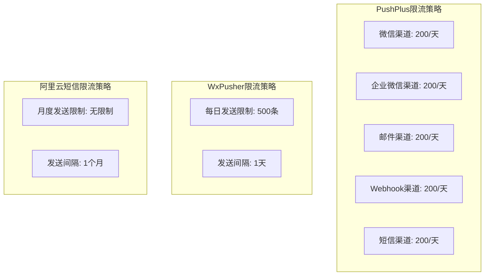

**图表来源**
- [PushPlusFeatureDefinitionProvider.cs](file://aspnet-core/framework/pushplus/LINGYUN.Abp.PushPlus/LINGYUN/Abp/PushPlus/Features/PushPlusFeatureDefinitionProvider.cs#L121-L147)

### 限流实现机制

限流通过特性装饰器和限制验证模块实现：

```csharp
[RequiresLimitFeature(
    PushPlusFeatureNames.Channel.WeChat.SendLimit,
    PushPlusFeatureNames.Channel.WeChat.SendLimitInterval, 
    LimitPolicy.Days)]
public async virtual Task<string> SendWeChatAsync(...)
{
    // 实际发送逻辑
}
```

### 重试机制

系统实现了智能的重试机制，包括指数退避算法和最大重试次数限制：

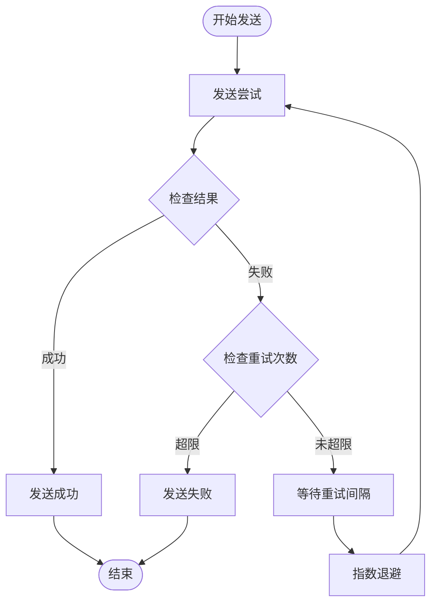

### 失败补偿方案

当消息发送失败时，系统提供了多种补偿方案：

1. **自动重试**: 对于临时性错误自动重试
2. **降级处理**: 使用备用消息提供商
3. **异步补偿**: 将失败消息放入队列进行后续处理
4. **人工干预**: 记录失败信息供人工处理

**章节来源**
- [PushPlusFeatureDefinitionProvider.cs](file://aspnet-core/framework/pushplus/LINGYUN.Abp.PushPlus/LINGYUN/Abp/PushPlus/Features/PushPlusFeatureDefinitionProvider.cs#L121-L147)

## 最佳实践

### 消息服务选择指南

根据不同的业务场景选择合适的消息服务：

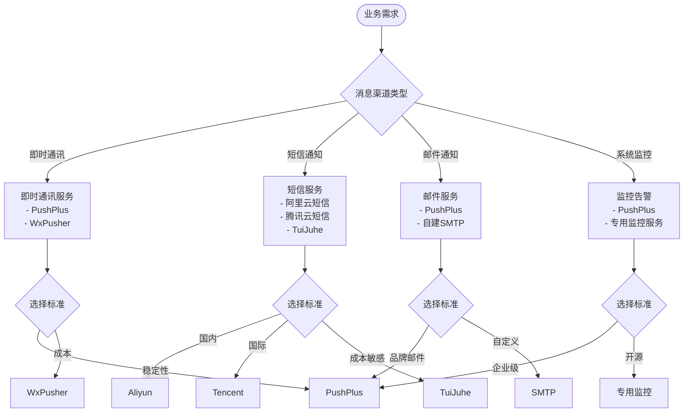

### 配置最佳实践

1. **环境隔离**: 不同环境使用不同的配置
2. **密钥管理**: 使用安全的密钥存储和轮换机制
3. **监控告警**: 设置发送成功率和延迟的监控告警
4. **日志记录**: 记录所有消息发送的详细日志

### 性能优化建议

1. **异步发送**: 所有消息发送都应使用异步模式
2. **批量处理**: 合理使用批量发送减少网络开销
3. **缓存策略**: 缓存频繁使用的配置和模板
4. **连接池**: 使用连接池管理HTTP连接

### 安全考虑

1. **API密钥保护**: 不要将API密钥硬编码在代码中
2. **网络通信**: 使用HTTPS加密通信
3. **输入验证**: 对所有外部输入进行严格验证
4. **访问控制**: 实施适当的访问控制和权限管理

## 故障排除指南

### 常见问题及解决方案

#### 1. 消息发送失败

**症状**: 消息发送返回失败状态

**排查步骤**:
1. 检查网络连接是否正常
2. 验证API密钥是否正确
3. 查看错误日志获取详细信息
4. 检查消息内容是否符合要求

**解决方案**:
```csharp
// 检查API密钥配置
var token = await SettingProvider.GetOrNullAsync(PushPlusSettingNames.Security.Token);
if (string.IsNullOrEmpty(token))
{
    throw new InvalidOperationException("PushPlus API Token未配置");
}
```

#### 2. 发送限流

**症状**: 收到限流错误或被拒绝发送

**排查步骤**:
1. 检查当前发送量是否超过限制
2. 查看剩余发送配额
3. 检查限流策略配置

**解决方案**:
- 实现指数退避重试机制
- 使用备用消息提供商
- 优化消息发送频率

#### 3. 模板参数错误

**症状**: 消息内容显示异常或参数替换失败

**排查步骤**:
1. 验证模板语法是否正确
2. 检查参数数量和类型是否匹配
3. 查看模板渲染结果

**解决方案**:
```csharp
// 参数验证示例
private void ValidateTemplateParams(Dictionary<string, object> params)
{
    if (params == null || params.Count == 0)
    {
        throw new ArgumentException("模板参数不能为空");
    }
    
    foreach (var param in params)
    {
        if (param.Value == null)
        {
            throw new ArgumentException($"参数 {param.Key} 的值不能为空");
        }
    }
}
```

### 监控和诊断工具

#### 日志监控

系统提供了详细的日志记录，包括：

- 消息发送请求和响应
- 错误详情和堆栈跟踪
- 性能指标和延迟统计
- 系统状态和健康检查

#### 性能监控

监控关键性能指标：

- 消息发送成功率
- 平均发送延迟
- 最大并发发送数
- 错误率和重试率

#### 健康检查

定期执行健康检查：

```csharp
public async Task<HealthCheckResult> CheckHealthAsync(CancellationToken cancellationToken)
{
    try
    {
        // 测试消息发送功能
        var testMessage = new SmsMessage("1234567890", "测试消息");
        await smsSender.SendAsync(testMessage);
        
        return HealthCheckResult.Healthy("消息服务正常");
    }
    catch (Exception ex)
    {
        return HealthCheckResult.Unhealthy($"消息服务异常: {ex.Message}");
    }
}
```

**章节来源**
- [AliyunSmsResponse.cs](file://aspnet-core/framework/common/LINGYUN.Abp.Sms.Aliyun/LINGYUN/Abp/Sms/Aliyun/AliyunSmsResponse.cs#L25-L124)

## 结论

ABP Next Admin框架的消息服务集成系统提供了完整而强大的消息发送解决方案。通过模块化的架构设计，系统支持多种消息提供商和消息类型，具备完善的限流控制、错误处理和状态跟踪功能。

### 主要优势

1. **统一接口**: 提供统一的消息发送接口，简化开发复杂度
2. **多提供商支持**: 支持主流的消息服务提供商，满足不同需求
3. **完善的错误处理**: 提供详细的错误信息和处理策略
4. **灵活的配置**: 支持动态配置和环境隔离
5. **高性能设计**: 采用异步发送和批量处理提升性能

### 应用建议

1. **根据业务需求选择合适的提供商**: 考虑稳定性、成本和功能需求
2. **实施监控和告警**: 建立完善的消息发送监控体系
3.