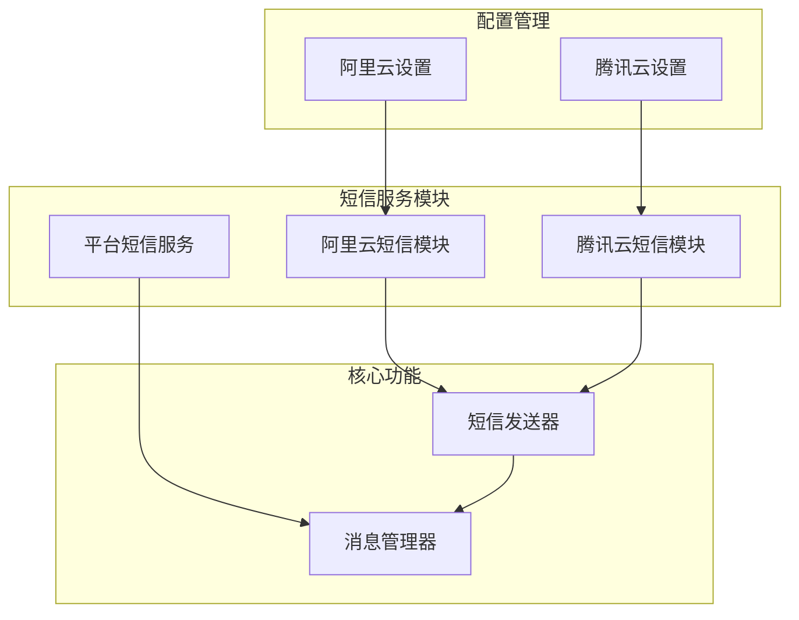
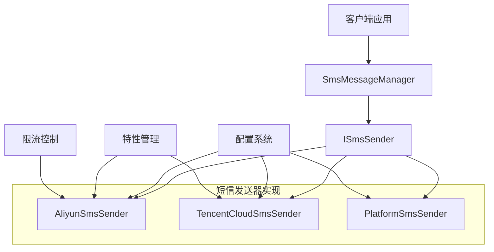
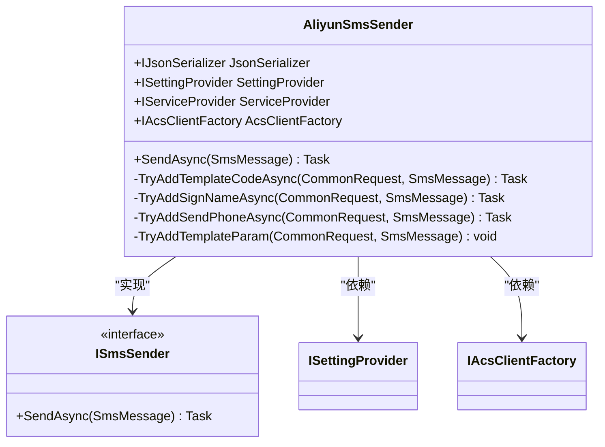
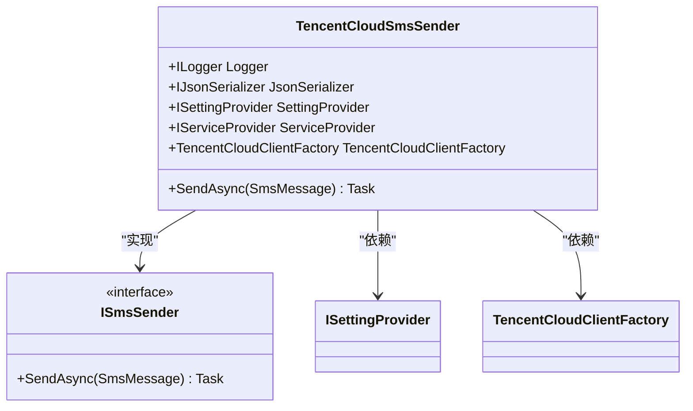
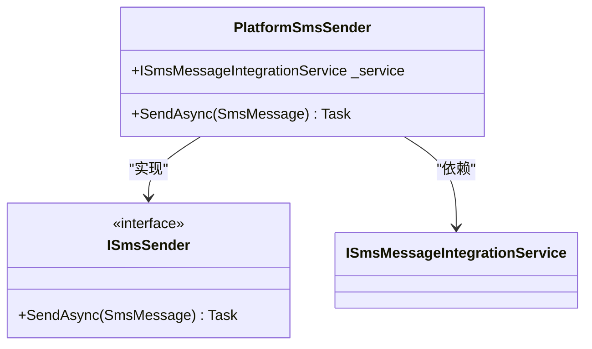
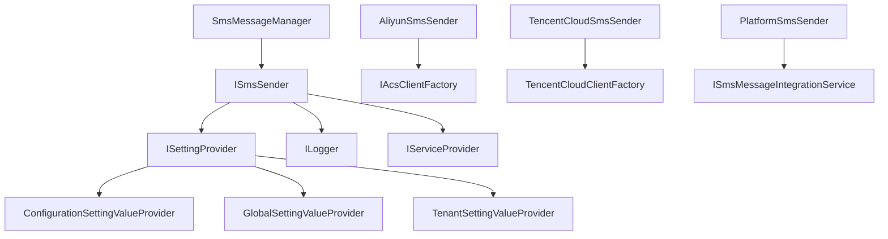

# 短信服务

<cite>
**本文档引用的文件**  
- [AliyunSmsSender.cs](file://aspnet-core/framework/common/LINGYUN.Abp.Sms.Aliyun/LINGYUN/Abp/Sms/Aliyun/AliyunSmsSender.cs)
- [TencentCloudSmsSender.cs](file://aspnet-core/framework/cloud-tencent/LINGYUN.Abp.Sms.Tencent/LINGYUN/Abp/Sms/Tencent/TencentCloudSmsSender.cs)
- [AliyunSettingProvider.cs](file://aspnet-core/framework/cloud-aliyun/LINGYUN.Abp.Aliyun/LINGYUN/Abp/Aliyun/Settings/AliyunSettingProvider.cs)
- [TencentCloudSettingDefinitionProvider.cs](file://aspnet-core/framework/cloud-tencent/LINGYUN.Abp.Tencent/LINGYUN/Abp/Tencent/Settings/TencentCloudSettingDefinitionProvider.cs)
- [AliyunSmsSenderExtensions.cs](file://aspnet-core/framework/common/LINGYUN.Abp.Sms.Aliyun/Volo/Abp/Sms/AliyunSmsSenderExtensions.cs)
- [PlatformSmsSender.cs](file://aspnet-core/modules/platform/LINGYUN.Abp.Sms.Platform/LINGYUN/Abp/Sms/Platform/PlatformSmsSender.cs)
- [SmsMessageManager.cs](file://aspnet-core/modules/platform/LINGYUN.Platform.Domain/LINGYUN/Platform/Messages/SmsMessageManager.cs)
</cite>

## 目录
1. [简介](#简介)
2. [项目结构](#项目结构)
3. [核心组件](#核心组件)
4. [架构概述](#架构概述)
5. [详细组件分析](#详细组件分析)
6. [依赖分析](#依赖分析)
7. [性能考虑](#性能考虑)
8. [故障排除指南](#故障排除指南)
9. [结论](#结论)

## 简介
本文档详细介绍了在ABP框架中集成阿里云短信和腾讯云短信服务的实现方式。文档涵盖了短信服务的配置参数、消息模板管理、短信发送API调用方法和发送状态跟踪机制。提供了短信服务客户端的初始化配置示例、同步和异步发送代码示例，以及错误处理和重试策略。同时说明了短信服务的限流控制、签名管理、模板审核流程，以及如何根据地区和运营商选择合适的短信服务商。文档还包含了短信发送的计费模式和成本优化建议。

## 项目结构
项目结构中包含了阿里云和腾讯云短信服务的独立模块，分别位于`cloud-aliyun`和`cloud-tencent`目录下。平台级别的短信服务集成位于`platform`模块中，通过统一的接口管理不同服务商的短信发送。

**图表来源**  
- [AliyunSmsSender.cs](file://aspnet-core/framework/common/LINGYUN.Abp.Sms.Aliyun/LINGYUN/Abp/Sms/Aliyun/AliyunSmsSender.cs)
- [TencentCloudSmsSender.cs](file://aspnet-core/framework/cloud-tencent/LINGYUN.Abp.Sms.Tencent/LINGYUN/Abp/Sms/Tencent/TencentCloudSmsSender.cs)
- [PlatformSmsSender.cs](file://aspnet-core/modules/platform/LINGYUN.Abp.Sms.Platform/LINGYUN/Abp/Sms/Platform/PlatformSmsSender.cs)

**章节来源**  
- [AliyunSmsSender.cs](file://aspnet-core/framework/common/LINGYUN.Abp.Sms.Aliyun/LINGYUN/Abp/Sms/Aliyun/AliyunSmsSender.cs)
- [TencentCloudSmsSender.cs](file://aspnet-core/framework/cloud-tencent/LINGYUN.Abp.Sms.Tencent/LINGYUN/Abp/Sms/Tencent/TencentCloudSmsSender.cs)

## 核心组件
系统的核心组件包括阿里云短信发送器、腾讯云短信发送器和平台短信服务。这些组件实现了统一的`ISmsSender`接口，提供了短信发送功能。平台短信服务通过`SmsMessageManager`管理短信的生命周期，包括发送状态跟踪和错误处理。

**章节来源**  
- [AliyunSmsSender.cs](file://aspnet-core/framework/common/LINGYUN.Abp.Sms.Aliyun/LINGYUN/Abp/Sms/Aliyun/AliyunSmsSender.cs)
- [TencentCloudSmsSender.cs](file://aspnet-core/framework/cloud-tencent/LINGYUN.Abp.Sms.Tencent/LINGYUN/Abp/Sms/Tencent/TencentCloudSmsSender.cs)
- [SmsMessageManager.cs](file://aspnet-core/modules/platform/LINGYUN.Platform.Domain/LINGYUN/Platform/Messages/SmsMessageManager.cs)

## 架构概述
系统采用模块化架构，将不同的短信服务商实现为独立的模块。通过依赖注入和特性开关机制，可以灵活地启用或禁用特定的短信服务。配置管理采用分层设置系统，支持默认值、配置文件、全局设置和租户设置等多种配置来源。

**图表来源**  
- [AliyunSmsSender.cs](file://aspnet-core/framework/common/LINGYUN.Abp.Sms.Aliyun/LINGYUN/Abp/Sms/Aliyun/AliyunSmsSender.cs)
- [TencentCloudSmsSender.cs](file://aspnet-core/framework/cloud-tencent/LINGYUN.Abp.Sms.Tencent/LINGYUN/Abp/Sms/Tencent/TencentCloudSmsSender.cs)
- [PlatformSmsSender.cs](file://aspnet-core/modules/platform/LINGYUN.Abp.Sms.Platform/LINGYUN/Abp/Sms/Platform/PlatformSmsSender.cs)

## 详细组件分析

### 阿里云短信服务分析
阿里云短信服务通过`AliyunSmsSender`类实现，该类实现了`ISmsSender`接口。服务使用阿里云SDK发送短信，支持通过配置系统管理各种参数。

**图表来源**  
- [AliyunSmsSender.cs](file://aspnet-core/framework/common/LINGYUN.Abp.Sms.Aliyun/LINGYUN/Abp/Sms/Aliyun/AliyunSmsSender.cs)

**章节来源**  
- [AliyunSmsSender.cs](file://aspnet-core/framework/common/LINGYUN.Abp.Sms.Aliyun/LINGYUN/Abp/Sms/Aliyun/AliyunSmsSender.cs)

### 腾讯云短信服务分析
腾讯云短信服务通过`TencentCloudSmsSender`类实现，该类同样实现了`ISmsSender`接口。服务使用腾讯云SDK发送短信，并通过特性开关控制服务的启用状态。

**图表来源**  
- [TencentCloudSmsSender.cs](file://aspnet-core/framework/cloud-tencent/LINGYUN.Abp.Sms.Tencent/LINGYUN/Abp/Sms/Tencent/TencentCloudSmsSender.cs)

**章节来源**  
- [TencentCloudSmsSender.cs](file://aspnet-core/framework/cloud-tencent/LINGYUN.Abp.Sms.Tencent/LINGYUN/Abp/Sms/Tencent/TencentCloudSmsSender.cs)

### 平台短信服务分析
平台短信服务通过`PlatformSmsSender`类实现，该类将短信发送请求转发到平台的消息系统，实现了短信发送的统一管理和跟踪。

**图表来源**  
- [PlatformSmsSender.cs](file://aspnet-core/modules/platform/LINGYUN.Abp.Sms.Platform/LINGYUN/Abp/Sms/Platform/PlatformSmsSender.cs)

**章节来源**  
- [PlatformSmsSender.cs](file://aspnet-core/modules/platform/LINGYUN.Abp.Sms.Platform/LINGYUN/Abp/Sms/Platform/PlatformSmsSender.cs)

## 依赖分析
系统依赖关系清晰，各组件通过接口进行通信，实现了良好的解耦。短信发送器依赖于配置系统和日志系统，而消息管理器依赖于短信发送器和仓储系统。

**图表来源**  
- [AliyunSmsSender.cs](file://aspnet-core/framework/common/LINGYUN.Abp.Sms.Aliyun/LINGYUN/Abp/Sms/Aliyun/AliyunSmsSender.cs)
- [TencentCloudSmsSender.cs](file://aspnet-core/framework/cloud-tencent/LINGYUN.Abp.Sms.Tencent/LINGYUN/Abp/Sms/Tencent/TencentCloudSmsSender.cs)
- [PlatformSmsSender.cs](file://aspnet-core/modules/platform/LINGYUN.Abp.Sms.Platform/LINGYUN/Abp/Sms/Platform/PlatformSmsSender.cs)

**章节来源**  
- [AliyunSmsSender.cs](file://aspnet-core/framework/common/LINGYUN.Abp.Sms.Aliyun/LINGYUN/Abp/Sms/Aliyun/AliyunSmsSender.cs)
- [TencentCloudSmsSender.cs](file://aspnet-core/framework/cloud-tencent/LINGYUN.Abp.Sms.Tencent/LINGYUN/Abp/Sms/Tencent/TencentCloudSmsSender.cs)
- [PlatformSmsSender.cs](file://aspnet-core/modules/platform/LINGYUN.Abp.Sms.Platform/LINGYUN/Abp/Sms/Platform/PlatformSmsSender.cs)

## 性能考虑
系统在性能方面考虑了多个方面，包括连接池管理、异步发送、错误处理和重试策略。阿里云短信服务实现了月度发送限制，防止滥用。腾讯云短信服务在部分发送失败时记录警告日志，而不是抛出异常，提高了系统的容错性。

**章节来源**  
- [AliyunSmsSender.cs](file://aspnet-core/framework/common/LINGYUN.Abp.Sms.Aliyun/LINGYUN/Abp/Sms/Aliyun/AliyunSmsSender.cs)
- [TencentCloudSmsSender.cs](file://aspnet-core/framework/cloud-tencent/LINGYUN.Abp.Sms.Tencent/LINGYUN/Abp/Sms/Tencent/TencentCloudSmsSender.cs)

## 故障排除指南
当短信发送出现问题时，可以按照以下步骤进行排查：

1. 检查配置是否正确，包括API密钥、应用ID、签名和模板ID
2. 检查特性开关是否已启用
3. 查看日志中的错误信息
4. 检查发送限制是否已达到
5. 验证手机号码格式是否正确

**章节来源**  
- [AliyunSmsSender.cs](file://aspnet-core/framework/common/LINGYUN.Abp.Sms.Aliyun/LINGYUN/Abp/Sms/Aliyun/AliyunSmsSender.cs)
- [TencentCloudSmsSender.cs](file://aspnet-core/framework/cloud-tencent/LINGYUN.Abp.Sms.Tencent/LINGYUN/Abp/Sms/Tencent/TencentCloudSmsSender.cs)

## 结论
本文档详细介绍了ABP框架中短信服务的集成方式，包括阿里云和腾讯云短信服务的实现。系统采用模块化设计，通过统一的接口管理不同的短信服务商，提供了灵活的配置和强大的错误处理机制。通过合理的架构设计和性能优化，确保了短信服务的稳定性和可靠性。