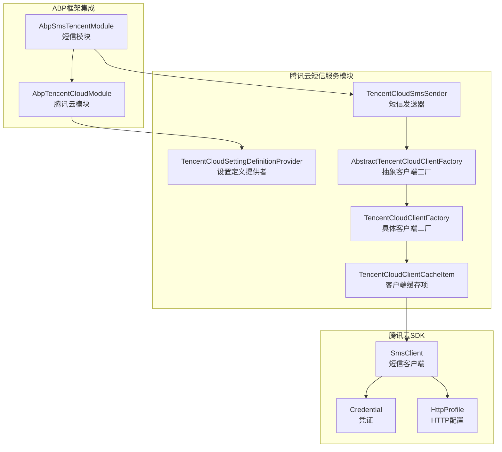
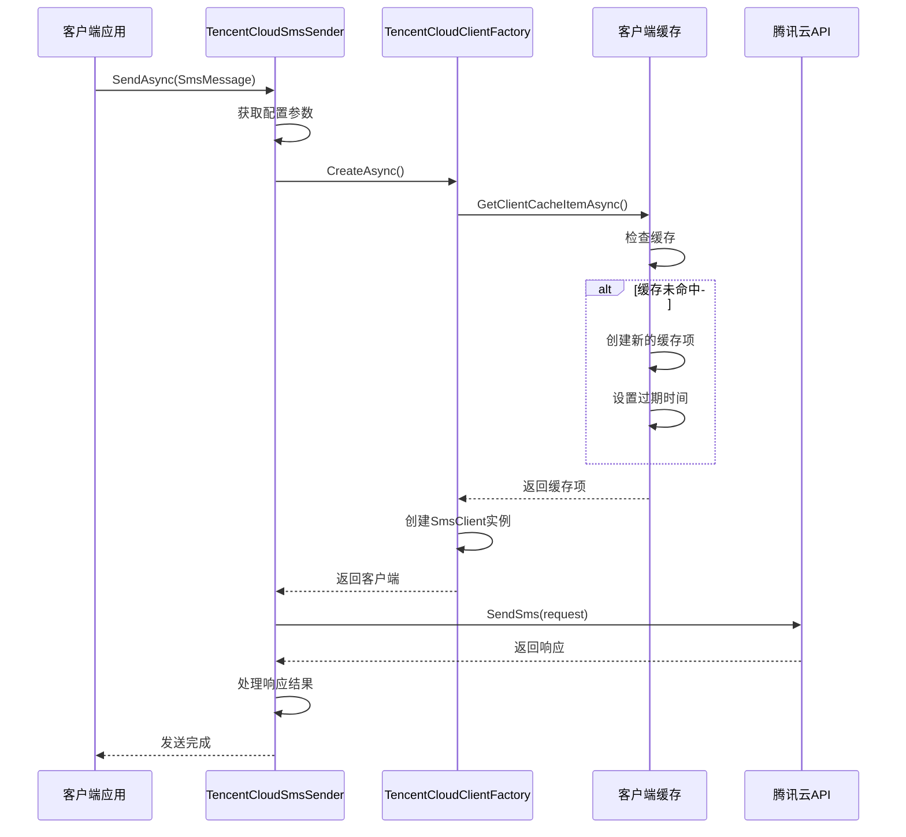
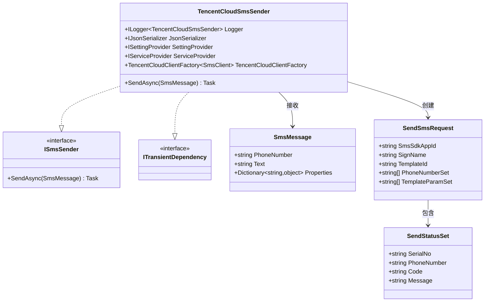
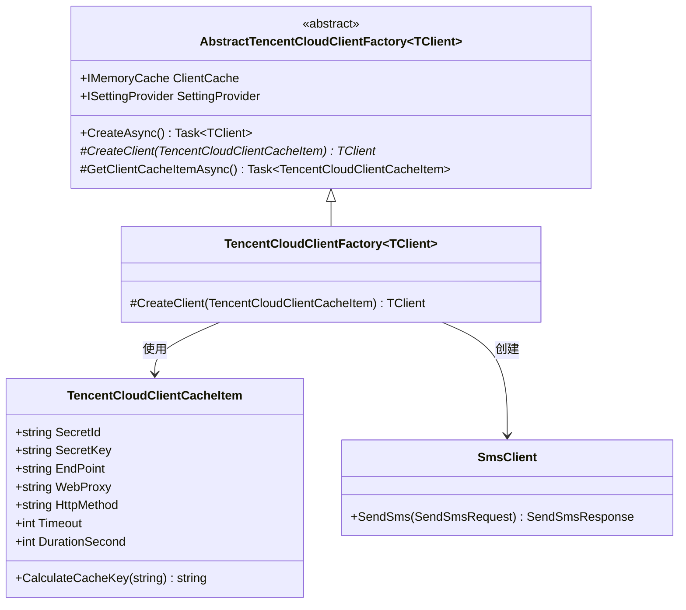
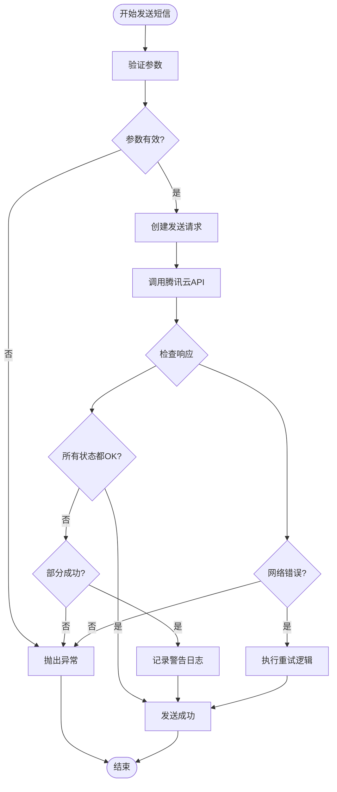
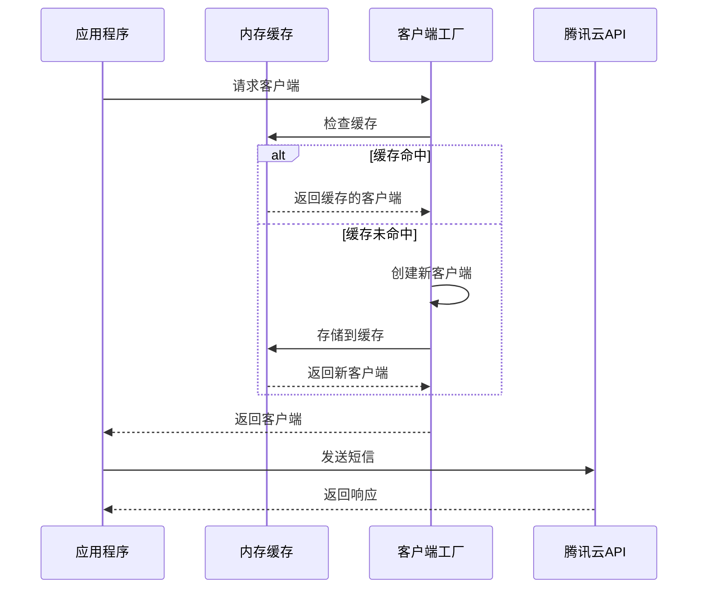

# 腾讯云短信服务集成文档

<cite>
**本文档中引用的文件**
- [TencentCloudSmsSender.cs](file://aspnet-core/framework/cloud-tencent/LINGYUN.Abp.Sms.Tencent/LINGYUN/Abp/Sms/Tencent/TencentCloudSmsSender.cs)
- [TencentCloudSettingDefinitionProvider.cs](file://aspnet-core/framework/cloud-tencent/LINGYUN.Abp.Tencent/LINGYUN/Abp/Tencent/Settings/TencentCloudSettingDefinitionProvider.cs)
- [TencentCloudSettingNames.cs](file://aspnet-core/framework/cloud-tencent/LINGYUN.Abp.Tencent/LINGYUN/Abp/Tencent/Settings/TencentCloudSettingNames.cs)
- [AbstractTencentCloudClientFactory.cs](file://aspnet-core/framework/cloud-tencent/LINGYUN.Abp.Tencent/LINGYUN/Abp/Tencent/AbstractTencentCloudClientFactory.cs)
- [TencentCloudClientFactory.cs](file://aspnet-core/framework/cloud-tencent/LINGYUN.Abp.Tencent/LINGYUN/Abp/Tencent/TencentCloudClientFactory.cs)
- [TencentCloudClientCacheItem.cs](file://aspnet-core/framework/cloud-tencent/LINGYUN.Abp.Tencent/LINGYUN/Abp/Tencent/TencentCloudClientCacheItem.cs)
- [AbpSmsTencentModule.cs](file://aspnet-core/framework/cloud-tencent/LINGYUN.Abp.Sms.Tencent/LINGYUN/Abp/Sms/Tencent/AbpSmsTencentModule.cs)
- [AbpTencentCloudModule.cs](file://aspnet-core/framework/cloud-tencent/LINGYUN.Abp.Tencent/LINGYUN/Abp/Tencent/AbpTencentCloudModule.cs)
- [README.md](file://aspnet-core/framework/cloud-tencent/LINGYUN.Abp.Sms.Tencent/README.md)
- [README.EN.md](file://aspnet-core/framework/cloud-tencent/LINGYUN.Abp.Sms.Tencent/README.EN.md)
</cite>

## 目录
1. [简介](#简介)
2. [项目结构](#项目结构)
3. [核心组件](#核心组件)
4. [架构概览](#架构概览)
5. [详细组件分析](#详细组件分析)
6. [配置参数详解](#配置参数详解)
7. [初始化配置示例](#初始化配置示例)
8. [发送短信代码示例](#发送短信代码示例)
9. [错误处理与重试机制](#错误处理与重试机制)
10. [限流控制机制](#限流控制机制)
11. [腾讯云控制台管理](#腾讯云控制台管理)
12. [计费模式与成本优化](#计费模式与成本优化)
13. [故障排除指南](#故障排除指南)
14. [总结](#总结)

## 简介

腾讯云短信服务是基于ABP框架开发的短信服务模块，提供了完整的腾讯云短信服务集成解决方案。该模块支持多租户配置、默认签名和模板配置、批量发送、模板参数传递等功能，并内置了完善的错误处理和日志记录机制。

## 项目结构

腾讯云短信服务模块采用分层架构设计，主要包含以下核心组件：



**图表来源**
- [TencentCloudSmsSender.cs](file://aspnet-core/framework/cloud-tencent/LINGYUN.Abp.Sms.Tencent/LINGYUN/Abp/Sms/Tencent/TencentCloudSmsSender.cs#L1-L103)
- [AbpSmsTencentModule.cs](file://aspnet-core/framework/cloud-tencent/LINGYUN.Abp.Sms.Tencent/LINGYUN/Abp/Sms/Tencent/AbpSmsTencentModule.cs#L1-L30)
- [AbpTencentCloudModule.cs](file://aspnet-core/framework/cloud-tencent/LINGYUN.Abp.Tencent/LINGYUN/Abp/Tencent/AbpTencentCloudModule.cs#L1-L41)

## 核心组件

### 1. TencentCloudSmsSender - 短信发送器

这是腾讯云短信服务的核心组件，负责实际的短信发送操作。它实现了`ISmsSender`接口，提供了异步发送短信的功能。

**关键特性：**
- 多手机号批量发送支持
- 模板参数动态替换
- 完整的错误处理机制
- 日志记录和警告输出

### 2. 设置管理系统

系统提供了完整的设置管理功能，支持全局设置和租户级设置。

**图表来源**
- [TencentCloudSmsSender.cs](file://aspnet-core/framework/cloud-tencent/LINGYUN.Abp.Sms.Tencent/LINGYUN/Abp/Sms/Tencent/TencentCloudSmsSender.cs#L34-L103)
- [TencentCloudSettingDefinitionProvider.cs](file://aspnet-core/framework/cloud-tencent/LINGYUN.Abp.Tencent/LINGYUN/Abp/Tencent/Settings/TencentCloudSettingDefinitionProvider.cs#L1-L164)

## 架构概览

腾讯云短信服务采用工厂模式和缓存机制，确保高效的客户端管理和资源复用：



**图表来源**
- [TencentCloudSmsSender.cs](file://aspnet-core/framework/cloud-tencent/LINGYUN.Abp.Sms.Tencent/LINGYUN/Abp/Sms/Tencent/TencentCloudSmsSender.cs#L40-L95)
- [TencentCloudClientFactory.cs](file://aspnet-core/framework/cloud-tencent/LINGYUN.Abp.Tencent/LINGYUN/Abp/Tencent/TencentCloudClientFactory.cs#L1-L55)

## 详细组件分析

### TencentCloudSmsSender 实现分析



**图表来源**
- [TencentCloudSmsSender.cs](file://aspnet-core/framework/cloud-tencent/LINGYUN.Abp.Sms.Tencent/LINGYUN/Abp/Sms/Tencent/TencentCloudSmsSender.cs#L20-L103)

**章节来源**
- [TencentCloudSmsSender.cs](file://aspnet-core/framework/cloud-tencent/LINGYUN.Abp.Sms.Tencent/LINGYUN/Abp/Sms/Tencent/TencentCloudSmsSender.cs#L1-L103)

### 客户端工厂模式



**图表来源**
- [AbstractTencentCloudClientFactory.cs](file://aspnet-core/framework/cloud-tencent/LINGYUN.Abp.Tencent/LINGYUN/Abp/Tencent/AbstractTencentCloudClientFactory.cs#L1-L125)
- [TencentCloudClientFactory.cs](file://aspnet-core/framework/cloud-tencent/LINGYUN.Abp.Tencent/LINGYUN/Abp/Tencent/TencentCloudClientFactory.cs#L1-L55)
- [TencentCloudClientCacheItem.cs](file://aspnet-core/framework/cloud-tencent/LINGYUN.Abp.Tencent/LINGYUN/Abp/Tencent/TencentCloudClientCacheItem.cs#L1-L20)

**章节来源**
- [AbstractTencentCloudClientFactory.cs](file://aspnet-core/framework/cloud-tencent/LINGYUN.Abp.Tencent/LINGYUN/Abp/Tencent/AbstractTencentCloudClientFactory.cs#L1-L125)
- [TencentCloudClientFactory.cs](file://aspnet-core/framework/cloud-tencent/LINGYUN.Abp.Tencent/LINGYUN/Abp/Tencent/TencentCloudClientFactory.cs#L1-L55)

## 配置参数详解

### 基础配置参数

| 参数名 | 类型 | 默认值 | 描述 |
|--------|------|--------|------|
| `Abp.TencentCloud.SecretId` | string | 必填 | 腾讯云访问密钥ID |
| `Abp.TencentCloud.SecretKey` | string | 必填 | 腾讯云访问密钥Key |
| `Abp.TencentCloud.EndPoint` | string | ap-guangzhou | 腾讯云服务区域 |
| `Abp.TencentCloud.DurationSecond` | int | 600 | 会话持续时间（秒） |

### 连接配置参数

| 参数名 | 类型 | 默认值 | 描述 |
|--------|------|--------|------|
| `Abp.TencentCloud.Connection.HttpMethod` | string | POST | HTTP请求方法 |
| `Abp.TencentCloud.Connection.Timeout` | int | 60 | 请求超时时间（秒） |
| `Abp.TencentCloud.Connection.WebProxy` | string | null | Web代理地址 |

### 短信服务配置参数

| 参数名 | 类型 | 默认值 | 描述 |
|--------|------|--------|------|
| `Abp.TencentCloud.Sms.AppId` | string | 必填 | 短信应用ID |
| `Abp.TencentCloud.Sms.DefaultSignName` | string | 必填 | 默认短信签名 |
| `Abp.TencentCloud.Sms.DefaultTemplateId` | string | 必填 | 默认短信模板ID |

**章节来源**
- [TencentCloudSettingDefinitionProvider.cs](file://aspnet-core/framework/cloud-tencent/LINGYUN.Abp.Tencent/LINGYUN/Abp/Tencent/Settings/TencentCloudSettingDefinitionProvider.cs#L1-L164)
- [TencentCloudSettingNames.cs](file://aspnet-core/framework/cloud-tencent/LINGYUN.Abp.Tencent/LINGYUN/Abp/Tencent/Settings/TencentCloudSettingNames.cs#L1-L64)

## 初始化配置示例

### JSON配置示例

```json
{
  "Settings": {
    "Abp.TencentCloud": {
      "SecretId": "你的腾讯云SecretId",
      "SecretKey": "你的腾讯云SecretKey",
      "DurationSecond": "600",
      "EndPoint": "ap-guangzhou"
    },
    "Abp.TencentCloud.Connection": {
      "HttpMethod": "POST",
      "Timeout": "60",
      "WebProxy": ""
    },
    "Abp.TencentCloud.Sms": {
      "AppId": "短信应用ID",
      "DefaultSignName": "默认短信签名",
      "DefaultTemplateId": "默认短信模板ID"
    }
  }
}
```

### 代码配置示例

```csharp
// 在模块的ConfigureServices方法中配置
public override void ConfigureServices(ServiceConfigurationContext context)
{
    Configure<AbpTencentCloudOptions>(options =>
    {
        options.SecretId = "你的SecretId";
        options.SecretKey = "你的SecretKey";
        options.EndPoint = "ap-guangzhou";
        options.DurationSecond = 600;
        
        // 连接配置
        options.Connection.HttpMethod = "POST";
        options.Connection.Timeout = 60;
        
        // 短信配置
        options.Sms.AppId = "短信应用ID";
        options.Sms.DefaultSignName = "默认短信签名";
        options.Sms.DefaultTemplateId = "默认短信模板ID";
    });
}
```

**章节来源**
- [README.md](file://aspnet-core/framework/cloud-tencent/LINGYUN.Abp.Sms.Tencent/README.md#L1-L42)
- [README.EN.md](file://aspnet-core/framework/cloud-tencent/LINGYUN.Abp.Sms.Tencent/README.EN.md#L1-L42)

## 发送短信代码示例

### 同步发送短信

```csharp
public class SmsService
{
    private readonly ISmsSender _smsSender;
    
    public SmsService(ISmsSender smsSender)
    {
        _smsSender = smsSender;
    }
    
    public async Task SendVerificationCodeAsync(string phoneNumber, string code)
    {
        var smsMessage = new SmsMessage
        {
            PhoneNumber = phoneNumber,
            Text = $"您的验证码是：{code}"
        };
        
        // 添加模板参数
        smsMessage.Properties["TemplateCode"] = "SMS_12345678";
        smsMessage.Properties["SignName"] = "您的签名";
        smsMessage.Properties["code"] = code;
        
        await _smsSender.SendAsync(smsMessage);
    }
}
```

### 异步发送短信

```csharp
public async Task SendNotificationAsync(List<string> phoneNumbers, string templateId, Dictionary<string, object> templateParams)
{
    var smsMessage = new SmsMessage
    {
        PhoneNumber = string.Join(";", phoneNumbers),
        Text = "批量发送测试"
    };
    
    // 设置模板ID
    smsMessage.Properties["TemplateCode"] = templateId;
    
    // 添加模板参数
    foreach (var param in templateParams)
    {
        smsMessage.Properties[param.Key] = param.Value;
    }
    
    await _smsSender.SendAsync(smsMessage);
}
```

### 批量发送示例

```csharp
public async Task SendBatchMessagesAsync()
{
    var phoneNumbers = new List<string> { "13800138000", "13800138001", "13800138002" };
    var templateId = "SMS_12345678";
    var templateParams = new Dictionary<string, object>
    {
        { "product", "产品名称" },
        { "time", DateTime.Now.ToString("yyyy-MM-dd HH:mm:ss") }
    };
    
    foreach (var phoneNumber in phoneNumbers)
    {
        var smsMessage = new SmsMessage
        {
            PhoneNumber = phoneNumber,
            Text = "单个发送测试"
        };
        
        smsMessage.Properties["TemplateCode"] = templateId;
        
        foreach (var param in templateParams)
        {
            smsMessage.Properties[param.Key] = param.Value;
        }
        
        await _smsSender.SendAsync(smsMessage);
    }
}
```

**章节来源**
- [TencentCloudSmsSender.cs](file://aspnet-core/framework/cloud-tencent/LINGYUN.Abp.Sms.Tencent/LINGYUN/Abp/Sms/Tencent/TencentCloudSmsSender.cs#L40-L95)

## 错误处理与重试机制

### 错误处理流程



**图表来源**
- [TencentCloudSmsSender.cs](file://aspnet-core/framework/cloud-tencent/LINGYUN.Abp.Sms.Tencent/LINGYUN/Abp/Sms/Tencent/TencentCloudSmsSender.cs#L80-L103)

### 错误码处理

系统支持多种错误状态的处理：

1. **成功状态** (`ok`)：短信发送成功
2. **失败状态**：记录失败原因并继续处理其他号码
3. **网络错误**：自动重试机制
4. **系统错误**：抛出异常并终止发送

### 日志记录机制

```csharp
// 成功发送的日志
Logger.LogInformation("短信发送成功，手机号：{PhoneNumber}", phoneNumber);

// 失败发送的日志
Logger.LogWarning("短信发送失败，手机号：{PhoneNumber}，错误代码：{ErrorCode}，错误信息：{ErrorMessage}", 
    phoneNumber, errorCode, errorMessage);

// 部分成功的警告日志
Logger.LogWarning("部分短信发送失败，详情：{FailedMessages}", failedMessages);
```

**章节来源**
- [TencentCloudSmsSender.cs](file://aspnet-core/framework/cloud-tencent/LINGYUN.Abp.Sms.Tencent/LINGYUN/Abp/Sms/Tencent/TencentCloudSmsSender.cs#L80-L103)

## 限流控制机制

### 客户端缓存机制

系统通过内存缓存实现客户端复用，减少重复创建连接的开销：



**图表来源**
- [AbstractTencentCloudClientFactory.cs](file://aspnet-core/framework/cloud-tencent/LINGYUN.Abp.Tencent/LINGYUN/Abp/Tencent/AbstractTencentCloudClientFactory.cs#L31-L58)
- [TencentCloudClientFactory.cs](file://aspnet-core/framework/cloud-tencent/LINGYUN.Abp.Tencent/LINGYUN/Abp/Tencent/TencentCloudClientFactory.cs#L19-L55)

### 缓存配置

```csharp
// 缓存项配置
public class TencentCloudClientCacheItem
{
    public string SecretId { get; set; }
    public string SecretKey { get; set; }
    public string EndPoint { get; set; }
    public int DurationSecond { get; set; } // 缓存持续时间
    public int Timeout { get; set; } // 请求超时
}

// 缓存键格式
public const string CacheKeyFormat = "pn:tenant-cloud,n:{0}";
```

**章节来源**
- [AbstractTencentCloudClientFactory.cs](file://aspnet-core/framework/cloud-tencent/LINGYUN.Abp.Tencent/LINGYUN/Abp/Tencent/AbstractTencentCloudClientFactory.cs#L31-L58)
- [TencentCloudClientCacheItem.cs](file://aspnet-core/framework/cloud-tencent/LINGYUN.Abp.Tencent/LINGYUN/Abp/Tencent/TencentCloudClientCacheItem.cs#L1-L20)

## 腾讯云控制台管理

### 短信模板管理

1. **登录腾讯云控制台**：https://console.cloud.tencent.com/smsv2
2. **创建短信应用**：
   - 进入短信控制台
   - 点击"新建应用"
   - 填写应用名称和描述
   - 获取AppId

3. **创建短信模板**：
   - 在应用下创建模板
   - 填写模板内容和签名
   - 提交审核
   - 审核通过后获取TemplateId

### 短信签名管理

1. **申请短信签名**：
   - 在控制台申请签名
   - 提供企业资质或个人身份证明
   - 等待审核通过

2. **配置签名**：
   - 将审核通过的签名配置到系统中
   - 确保签名与模板内容匹配

### 权限管理

1. **创建CAM用户**：
   - 创建专用的CAM用户用于短信服务
   - 分配最小权限原则的策略
   - 获取SecretId和SecretKey

2. **安全配置**：
   - 启用访问密钥轮换
   - 配置IP白名单
   - 启用MFA双重认证

## 计费模式与成本优化

### 计费模式

腾讯云短信服务采用按条计费模式：

1. **国内短信**：按发送数量收费
2. **国际短信**：按发送数量和目标国家收费
3. **特殊套餐**：可购买预付费套餐包

### 成本优化建议

#### 1. 选择合适的套餐包

```csharp
// 根据业务量选择套餐
public enum SmsPackageType
{
    Small = 1000,    // 1000条/月
    Medium = 5000,   // 5000条/月
    Large = 20000,   // 20000条/月
    Enterprise = 100000 // 100000条/月起
}
```

#### 2. 优化发送策略

```csharp
// 批量发送优化
public async Task OptimizeSendStrategy(List<SmsMessage> messages)
{
    // 按手机号分组，避免重复发送
    var groupedMessages = messages.GroupBy(m => m.PhoneNumber);
    
    foreach (var group in groupedMessages)
    {
        // 合并相同内容的消息
        var mergedMessage = MergeMessages(group.ToList());
        await _smsSender.SendAsync(mergedMessage);
    }
}
```

#### 3. 使用模板减少成本

```csharp
// 使用模板减少字数
var template = "尊敬的用户，您的验证码是：{code}，请在{minutes}分钟内使用。";
var params = new Dictionary<string, object>
{
    { "code", verificationCode },
    { "minutes", "5" }
};
```

#### 4. 监控和告警

```csharp
// 配置监控指标
public class SmsCostMonitor
{
    public decimal MonthlyQuota { get; set; }
    public decimal CurrentUsage { get; set; }
    public decimal WarningThreshold { get; set; }
    
    public bool IsOverBudget => CurrentUsage > MonthlyQuota;
    public bool NeedsAlert => CurrentUsage > MonthlyQuota * WarningThreshold;
}
```

### 费用计算示例

```csharp
// 费用计算器
public class SmsCostCalculator
{
    public decimal CalculateCost(int messageCount, SmsRegion region = SmsRegion.China)
    {
        // 国内短信单价：0.03元/条
        // 国际短信单价：根据目的地不同
        decimal pricePerMessage = region == SmsRegion.China ? 0.03m : GetInternationalPrice(region);
        return messageCount * pricePerMessage;
    }
}
```

## 故障排除指南

### 常见问题及解决方案

#### 1. 配置参数错误

**问题症状**：
- 抛出`AbpException`异常
- 提示"AppId不能为空"

**解决方案**：
```csharp
// 检查配置是否正确
var appId = await SettingProvider.GetOrNullAsync(TencentCloudSettingNames.Sms.AppId);
if (string.IsNullOrWhiteSpace(appId))
{
    throw new AbpException("请检查短信应用ID配置");
}
```

#### 2. 网络连接问题

**问题症状**：
- 请求超时
- 网络不可达

**解决方案**：
```csharp
// 配置合理的超时时间
Configure<AbpTencentCloudOptions>(options =>
{
    options.Connection.Timeout = 30; // 30秒超时
    options.Connection.HttpMethod = "POST"; // 使用POST方法
});
```

#### 3. 短信模板审核问题

**问题症状**：
- 模板ID无效
- 签名不匹配

**解决方案**：
1. 检查模板是否已审核通过
2. 确认签名与模板内容匹配
3. 验证模板参数格式

#### 4. 客户端创建失败

**问题症状**：
- 抛出构造函数异常
- 客户端无法创建

**解决方案**：
```csharp
// 检查客户端工厂配置
protected override TClient CreateClient(TencentCloudClientCacheItem cloudCache)
{
    // 确保构造函数参数正确
    return (TClient)clientCtr.Invoke(new object[] { 
        cred, 
        cloudCache.EndPoint, 
        clientProfile 
    });
}
```

### 调试技巧

#### 1. 启用详细日志

```csharp
// 在appsettings.json中启用详细日志
{
  "Logging": {
    "LogLevel": {
      "Default": "Information",
      "LINGYUN.Abp.Sms.Tencent": "Debug",
      "TencentCloud": "Debug"
    }
  }
}
```

#### 2. 检查网络连接

```csharp
// 测试网络连通性
public async Task<bool> TestNetworkConnection()
{
    try
    {
        var client = await TencentCloudClientFactory.CreateAsync();
        // 执行简单的API调用测试
        return true;
    }
    catch (Exception ex)
    {
        Logger.LogError(ex, "网络连接测试失败");
        return false;
    }
}
```

#### 3. 验证凭证有效性

```csharp
// 验证SecretId和SecretKey
public async Task<bool> ValidateCredentials()
{
    var secretId = await SettingProvider.GetOrNullAsync(TencentCloudSettingNames.SecretId);
    var secretKey = await SettingProvider.GetOrNullAsync(TencentCloudSettingNames.SecretKey);
    
    return !string.IsNullOrWhiteSpace(secretId) && !string.IsNullOrWhiteSpace(secretKey);
}
```

**章节来源**
- [TencentCloudSmsSender.cs](file://aspnet-core/framework/cloud-tencent/LINGYUN.Abp.Sms.Tencent/LINGYUN/Abp/Sms/Tencent/TencentCloudSmsSender.cs#L40-L103)
- [AbstractTencentCloudClientFactory.cs](file://aspnet-core/framework/cloud-tencent/LINGYUN.Abp.Tencent/LINGYUN/Abp/Tencent/AbstractTencentCloudClientFactory.cs#L31-L58)

## 总结

腾讯云短信服务集成模块提供了完整的短信服务解决方案，具有以下优势：

### 主要特性

1. **完整的配置体系**：支持多层级配置管理
2. **高效的客户端管理**：通过缓存机制提升性能
3. **强大的错误处理**：完善的异常处理和重试机制
4. **灵活的模板支持**：支持动态参数和批量发送
5. **多租户兼容**：支持多租户环境下的独立配置

### 最佳实践建议

1. **合理配置缓存**：根据业务需求调整缓存时间和策略
2. **监控成本**：定期检查短信发送费用和使用情况
3. **优化模板**：使用标准化模板减少字数和成本
4. **完善监控**：建立完善的监控和告警机制
5. **定期维护**：及时更新配置和模板内容

### 扩展方向

1. **支持更多区域**：扩展到腾讯云其他区域的服务
2. **增强限流**：实现更精细的流量控制
3. **多渠道支持**：扩展到其他短信服务商
4. **智能路由**：根据地区和运营商选择最优路径

通过本文档的详细介绍，开发者可以快速理解和使用腾讯云短信服务集成模块，构建稳定可靠的短信发送功能。