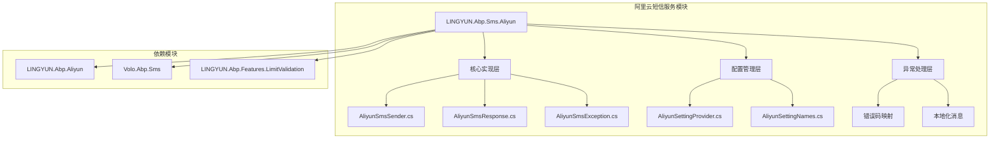
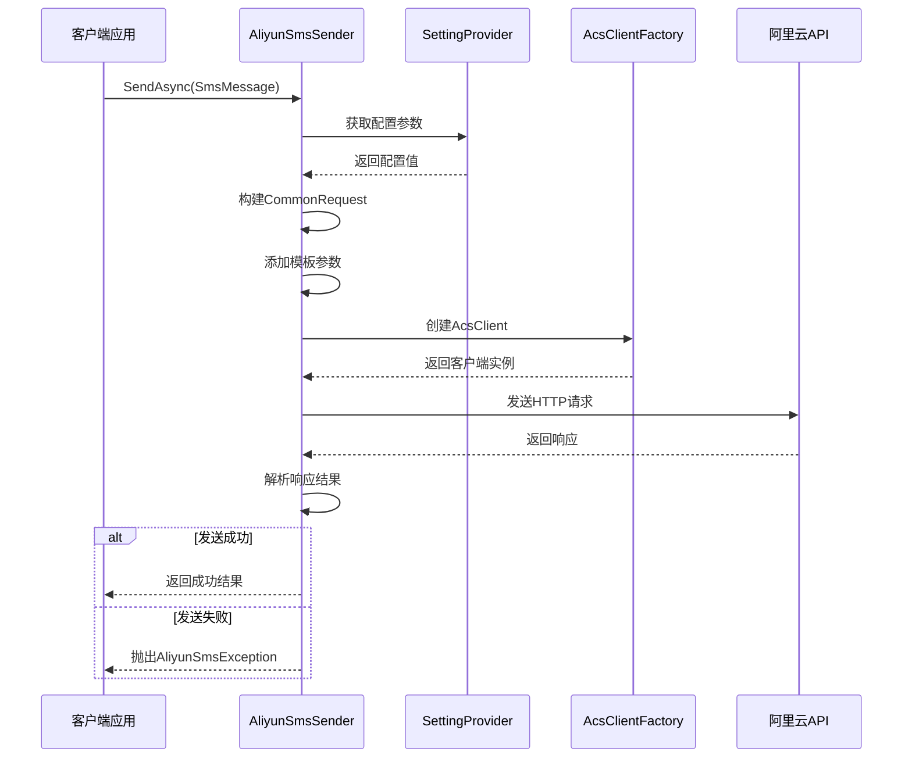
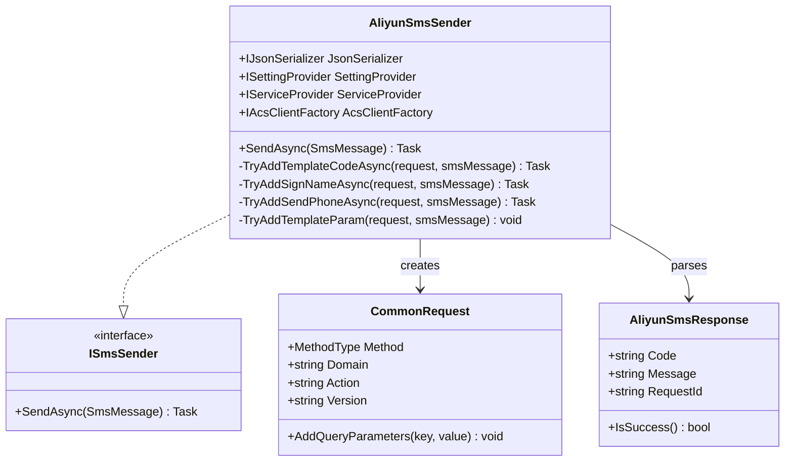
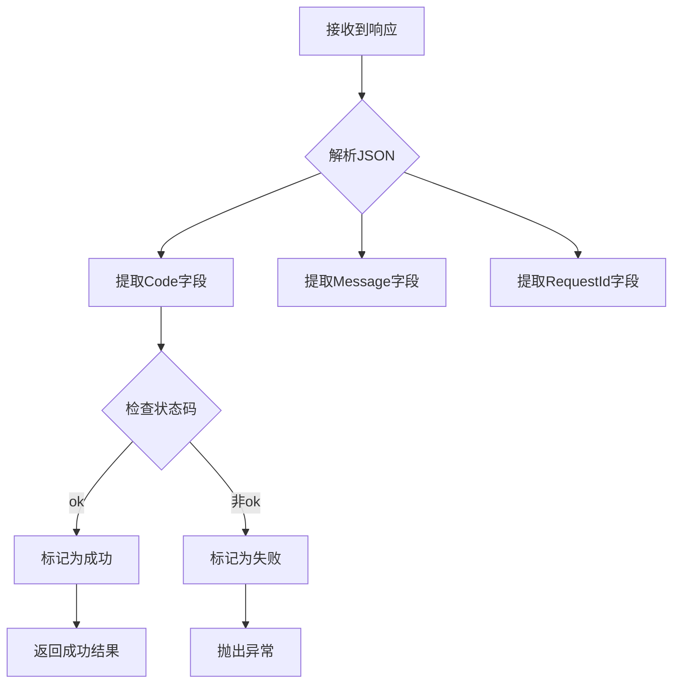
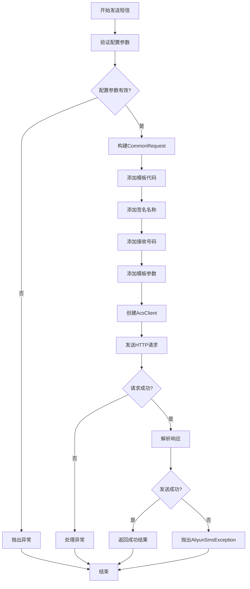
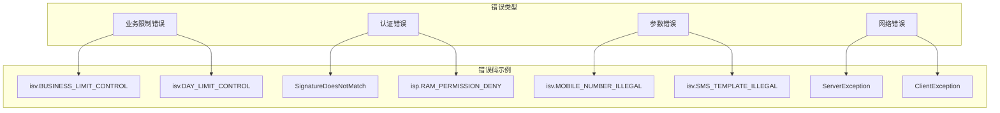
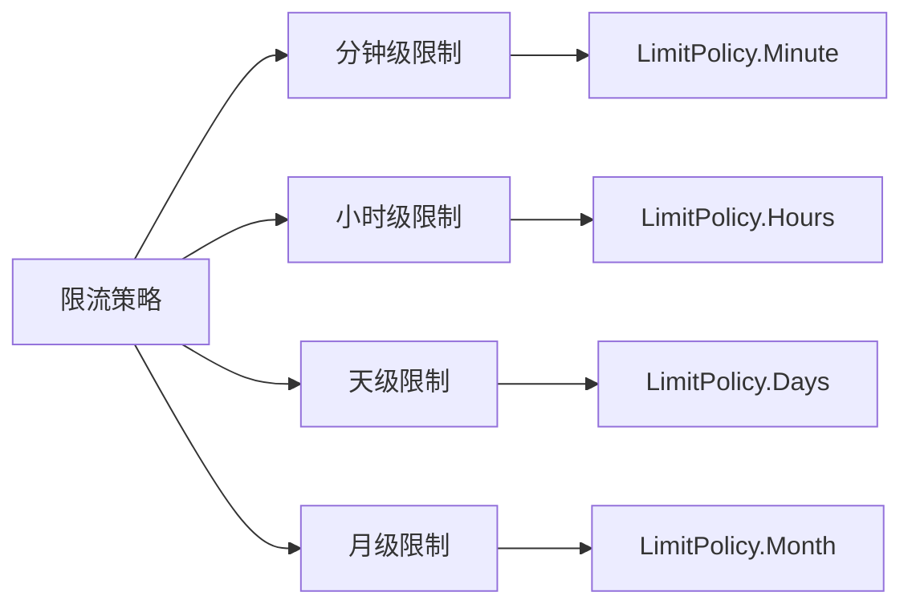

# 阿里云短信服务集成文档

<cite>
**本文档中引用的文件**
- [AliyunSmsSender.cs](file://aspnet-core/framework/common/LINGYUN.Abp.Sms.Aliyun/LINGYUN/Abp/Sms/Aliyun/AliyunSmsSender.cs)
- [AliyunSmsResponse.cs](file://aspnet-core/framework/common/LINGYUN.Abp.Sms.Aliyun/LINGYUN/Abp/Sms/Aliyun/AliyunSmsResponse.cs)
- [AliyunSmsException.cs](file://aspnet-core/framework/common/LINGYUN.Abp.Sms.Aliyun/LINGYUN/Abp/Sms/Aliyun/AliyunSmsException.cs)
- [AliyunSettingProvider.cs](file://aspnet-core/framework/cloud-aliyun/LINGYUN.Abp.Aliyun/LINGYUN/Abp/Aliyun/Settings/AliyunSettingProvider.cs)
- [AliyunSettingNames.cs](file://aspnet-core/framework/cloud-aliyun/LINGYUN.Abp.Aliyun/LINGYUN/Abp/Aliyun/Settings/AliyunSettingNames.cs)
- [AbpAliyunSmsModule.cs](file://aspnet-core/framework/common/LINGYUN.Abp.Sms.Aliyun/LINGYUN/Abp/Sms/Aliyun/AbpAliyunSmsModule.cs)
- [AliyunSmsSenderTests.cs](file://aspnet-core/tests/LINGYUN.Abp.Sms.Aliyun.Tests/LINGYUN/Abp/Sms/Aliyun/AliyunSmsSenderTests.cs)
- [README.md](file://aspnet-core/framework/cloud-aliyun/LINGYUN.Abp.Aliyun/README.md)
</cite>

## 目录
1. [简介](#简介)
2. [项目结构](#项目结构)
3. [核心组件](#核心组件)
4. [架构概览](#架构概览)
5. [详细组件分析](#详细组件分析)
6. [配置参数详解](#配置参数详解)
7. [短信发送流程](#短信发送流程)
8. [错误处理与重试策略](#错误处理与重试策略)
9. [限流控制机制](#限流控制机制)
10. [性能优化建议](#性能优化建议)
11. [故障排除指南](#故障排除指南)
12. [结论](#结论)

## 简介

阿里云短信服务集成模块是一个基于ABP框架的短信服务解决方案，专门用于集成阿里云的短信发送功能。该模块提供了完整的短信发送能力，包括同步和异步发送、模板管理、签名配置、错误处理和限流控制等功能。

该模块的核心特性包括：
- 支持阿里云短信服务的所有标准功能
- 提供灵活的配置管理机制
- 实现了完善的错误处理和重试策略
- 集成了功能限流控制机制
- 支持多种短信模板和签名配置
- 提供了完整的单元测试覆盖

## 项目结构

阿里云短信服务模块采用分层架构设计，主要包含以下核心目录结构：



**图表来源**
- [AliyunSmsSender.cs](file://aspnet-core/framework/common/LINGYUN.Abp.Sms.Aliyun/LINGYUN/Abp/Sms/Aliyun/AliyunSmsSender.cs#L1-L154)
- [AliyunSettingProvider.cs](file://aspnet-core/framework/cloud-aliyun/LINGYUN.Abp.Aliyun/LINGYUN/Abp/Aliyun/Settings/AliyunSettingProvider.cs#L1-L212)

**章节来源**
- [README.md](file://aspnet-core/framework/cloud-aliyun/LINGYUN.Abp.Aliyun/README.md#L1-L145)

## 核心组件

阿里云短信服务模块包含以下核心组件：

### 1. AliyunSmsSender - 主要发送器
负责处理短信发送的核心逻辑，实现了ISmsSender接口，提供同步和异步发送功能。

### 2. AliyunSmsResponse - 响应模型
封装阿里云短信服务的响应数据，包含状态码、消息和请求ID等信息。

### 3. AliyunSmsException - 异常处理
继承自AbpAliyunException，专门处理阿里云短信服务相关的异常情况。

### 4. AliyunSettingProvider - 设置提供者
定义和管理所有与阿里云短信服务相关的配置参数。

**章节来源**
- [AliyunSmsSender.cs](file://aspnet-core/framework/common/LINGYUN.Abp.Sms.Aliyun/LINGYUN/Abp/Sms/Aliyun/AliyunSmsSender.cs#L1-L154)
- [AliyunSmsResponse.cs](file://aspnet-core/framework/common/LINGYUN.Abp.Sms.Aliyun/LINGYUN/Abp/Sms/Aliyun/AliyunSmsResponse.cs#L1-L92)
- [AliyunSmsException.cs](file://aspnet-core/framework/common/LINGYUN.Abp.Sms.Aliyun/LINGYUN/Abp/Sms/Aliyun/AliyunSmsException.cs#L1-L10)

## 架构概览

阿里云短信服务集成采用了模块化的架构设计，确保了良好的可扩展性和维护性：



**图表来源**
- [AliyunSmsSender.cs](file://aspnet-core/framework/common/LINGYUN.Abp.Sms.Aliyun/LINGYUN/Abp/Sms/Aliyun/AliyunSmsSender.cs#L38-L72)

## 详细组件分析

### AliyunSmsSender 组件分析

AliyunSmsSender是整个模块的核心组件，负责处理所有的短信发送逻辑：



**图表来源**
- [AliyunSmsSender.cs](file://aspnet-core/framework/common/LINGYUN.Abp.Sms.Aliyun/LINGYUN/Abp/Sms/Aliyun/AliyunSmsSender.cs#L20-L154)

#### 关键方法分析

1. **SendAsync方法** - 主要发送入口
   - 从配置中获取API域名、动作名称和版本号
   - 构建CommonRequest对象
   - 添加模板代码、签名名称、手机号码和模板参数
   - 发送请求并处理响应

2. **参数添加方法** - 处理各种配置参数
   - TryAddTemplateCodeAsync - 处理模板代码
   - TryAddSignNameAsync - 处理短信签名
   - TryAddSendPhoneAsync - 处理接收号码
   - TryAddTemplateParam - 处理模板参数

**章节来源**
- [AliyunSmsSender.cs](file://aspnet-core/framework/common/LINGYUN.Abp.Sms.Aliyun/LINGYUN/Abp/Sms/Aliyun/AliyunSmsSender.cs#L38-L154)

### AliyunSmsResponse 组件分析

AliyunSmsResponse类负责解析和处理阿里云短信服务的响应：



**图表来源**
- [AliyunSmsResponse.cs](file://aspnet-core/framework/common/LINGYUN.Abp.Sms.Aliyun/LINGYUN/Abp/Sms/Aliyun/AliyunSmsResponse.cs#L1-L34)

**章节来源**
- [AliyunSmsResponse.cs](file://aspnet-core/framework/common/LINGYUN.Abp.Sms.Aliyun/LINGYUN/Abp/Sms/Aliyun/AliyunSmsResponse.cs#L1-L92)

## 配置参数详解

阿里云短信服务的配置参数通过SettingProvider进行管理，主要包括以下几个方面：

### 基础配置参数

| 参数名称 | 默认值 | 描述 |
|---------|--------|------|
| Domain | dysmsapi.aliyuncs.com | 阿里云短信服务API域名 |
| ActionName | SendSms | API调用方法名称 |
| Version | 2017-05-25 | API版本号 |
| VisableErrorToClient | false | 是否向客户端显示错误信息 |

### 短信模板配置

| 参数名称 | 描述 |
|---------|------|
| DefaultSignName | 默认短信签名 |
| DefaultTemplateCode | 默认短信模板代码 |
| DefaultPhoneNumber | 默认接收短信的手机号码 |

### 认证配置参数

| 参数名称 | 描述 |
|---------|------|
| AccessKeyId | 阿里云RAM账号的AccessKey ID |
| AccessKeySecret | RAM账号的AccessKey Secret |
| UseSecurityTokenService | 是否使用STS Token访问 |
| RamRoleArn | RAM角色ARN |
| RoleSessionName | 用户自定义令牌名称 |
| DurationSeconds | 令牌过期时间（秒） |
| Policy | 权限策略 |

### 配置示例

```json
{
  "Settings": {
    "Abp.Aliyun.Sms": {
      "Domain": "dysmsapi.aliyuncs.com",
      "Version": "2017-05-25",
      "ActionName": "SendSms",
      "DefaultSignName": "您的应用名称",
      "DefaultTemplateCode": "SMS_12345678",
      "DefaultPhoneNumber": "13800138000",
      "VisableErrorToClient": "false"
    },
    "Abp.Aliyun.Authorization": {
      "AccessKeyId": "your-access-key-id",
      "AccessKeySecret": "your-access-key-secret",
      "UseSecurityTokenService": "true",
      "RegionId": "cn-hangzhou"
    }
  }
}
```

**章节来源**
- [AliyunSettingProvider.cs](file://aspnet-core/framework/cloud-aliyun/LINGYUN.Abp.Aliyun/LINGYUN/Abp/Aliyun/Settings/AliyunSettingProvider.cs#L170-L212)
- [AliyunSettingNames.cs](file://aspnet-core/framework/cloud-aliyun/LINGYUN.Abp.Aliyun/LINGYUN/Abp/Aliyun/Settings/AliyunSettingNames.cs#L1-L83)

## 短信发送流程

短信发送流程遵循标准的请求-响应模式，具体步骤如下：



**图表来源**
- [AliyunSmsSender.cs](file://aspnet-core/framework/common/LINGYUN.Abp.Sms.Aliyun/LINGYUN/Abp/Sms/Aliyun/AliyunSmsSender.cs#L38-L72)

### 同步发送示例

```csharp
// 基本发送示例
var smsSender = GetRequiredService<ISmsSender>();
await smsSender.SendAsync(new SmsMessage
{
    PhoneNumber = "13800138000",
    Text = "您的验证码是：123456"
});

// 带模板参数的发送示例
await smsSender.SendAsync(new SmsMessage
{
    PhoneNumber = "13800138000",
    TemplateCode = "SMS_12345678",
    SignName = "应用名称",
    Properties = new Dictionary<string, object>
    {
        { "code", "123456" },
        { "product", "产品名称" }
    }
});
```

### 异步发送示例

```csharp
// 异步发送任务
var sendTask = smsSender.SendAsync(new SmsMessage
{
    PhoneNumber = "13800138000",
    Text = "异步短信内容"
});

// 继续执行其他业务逻辑
await SomeOtherOperationAsync();

// 等待发送完成
await sendTask;
```

**章节来源**
- [AliyunSmsSender.cs](file://aspnet-core/framework/common/LINGYUN.Abp.Sms.Aliyun/LINGYUN/Abp/Sms/Aliyun/AliyunSmsSender.cs#L38-L72)
- [AliyunSmsSenderTests.cs](file://aspnet-core/tests/LINGYUN.Abp.Sms.Aliyun.Tests/LINGYUN/Abp/Sms/Aliyun/AliyunSmsSenderTests.cs#L20-L42)

## 错误处理与重试策略

阿里云短信服务实现了完善的错误处理机制，能够识别和处理各种类型的错误：

### 错误码分类

系统根据阿里云短信服务的标准错误码，提供了详细的错误处理：



**图表来源**
- [AliyunSmsResponse.cs](file://aspnet-core/framework/common/LINGYUN.Abp.Sms.Aliyun/LINGYUN/Abp/Sms/Aliyun/AliyunSmsResponse.cs#L18-L92)

### 错误处理策略

1. **业务限制错误** - 如超出日发送限额
2. **认证错误** - 如签名不匹配或权限不足
3. **参数错误** - 如手机号格式错误或模板不存在
4. **网络错误** - 如服务器异常或客户端异常

### 重试机制

虽然当前实现没有内置的自动重试机制，但可以通过以下方式实现：

```csharp
public async Task SendWithRetryAsync(SmsMessage message, int maxRetries = 3)
{
    for (int i = 0; i < maxRetries; i++)
    {
        try
        {
            await smsSender.SendAsync(message);
            return;
        }
        catch (AliyunSmsException ex) when (ex.Code == "isv.BUSINESS_LIMIT_CONTROL")
        {
            if (i == maxRetries - 1) throw;
            
            // 等待一段时间后重试
            await Task.Delay(TimeSpan.FromMinutes(1));
        }
    }
}
```

**章节来源**
- [AliyunSmsResponse.cs](file://aspnet-core/framework/common/LINGYUN.Abp.Sms.Aliyun/LINGYUN/Abp/Sms/Aliyun/AliyunSmsResponse.cs#L18-L92)
- [AliyunSmsSender.cs](file://aspnet-core/framework/common/LINGYUN.Abp.Sms.Aliyun/LINGYUN/Abp/Sms/Aliyun/AliyunSmsSender.cs#L60-L72)

## 限流控制机制

阿里云短信服务集成了功能限流控制机制，防止过度使用导致的费用增加或服务限制：

### 限流策略



### 限流配置

```csharp
[RequiresLimitFeature(
    AliyunFeatureNames.Sms.SendLimit,
    AliyunFeatureNames.Sms.SendLimitInterval,
    LimitPolicy.Month,
    AliyunFeatureNames.Sms.DefaultSendLimit,
    AliyunFeatureNames.Sms.DefaultSendLimitInterval)]
public async virtual Task SendAsync(SmsMessage smsMessage)
{
    // 限流检查逻辑
    // ...
}
```

### 限流参数说明

| 参数名称 | 描述 |
|---------|------|
| SendLimit | 每个时间段内的最大发送次数 |
| SendLimitInterval | 限流时间间隔 |
| DefaultSendLimit | 默认每月发送次数限制 |
| DefaultSendLimitInterval | 默认限流时间间隔 |

**章节来源**
- [AliyunSmsSender.cs](file://aspnet-core/framework/common/LINGYUN.Abp.Sms.Aliyun/LINGYUN/Abp/Sms/Aliyun/AliyunSmsSender.cs#L32-L37)

## 性能优化建议

为了获得最佳的性能表现，建议采取以下优化措施：

### 1. 缓存配置参数
- 配置参数可以缓存以减少重复读取
- 使用分布式缓存提高高并发场景下的性能

### 2. 连接池优化
- 配置合理的连接池大小
- 设置适当的超时时间

### 3. 并发控制
- 使用SemaphoreSlim控制并发请求数量
- 实现优雅的降级策略

### 4. 监控和告警
- 监控发送成功率
- 设置发送延迟告警
- 跟踪错误率变化

### 5. 成本优化
- 选择合适的短信套餐
- 根据业务需求调整发送频率
- 使用模板减少重复内容

## 故障排除指南

### 常见问题及解决方案

1. **签名不匹配错误**
   - 检查AccessKeyId和AccessKeySecret是否正确
   - 确认签名算法配置
   - 验证请求参数编码

2. **模板不存在错误**
   - 确认模板代码是否正确
   - 检查模板是否已审核通过
   - 验证模板参数格式

3. **手机号格式错误**
   - 确认手机号码格式符合要求
   - 检查是否包含国际区号
   - 验证手机号长度

4. **发送限额超限**
   - 检查当前发送配额
   - 联系阿里云客服申请提升限额
   - 优化发送策略

### 调试技巧

```csharp
// 启用详细日志记录
ConfigureLogging(builder =>
{
    builder.AddFilter("LINGYUN.Abp.Sms.Aliyun", LogLevel.Debug);
});

// 添加自定义中间件
app.Use(async (context, next) =>
{
    var logger = context.RequestServices.GetRequiredService<ILogger<Startup>>();
    logger.LogInformation("处理短信发送请求");
    await next();
});
```

**章节来源**
- [AliyunSmsSender.cs](file://aspnet-core/framework/common/LINGYUN.Abp.Sms.Aliyun/LINGYUN/Abp/Sms/Aliyun/AliyunSmsSender.cs#L60-L72)

## 结论

阿里云短信服务集成模块提供了一个完整、可靠的短信发送解决方案。通过模块化的架构设计、完善的错误处理机制和灵活的配置选项，该模块能够满足各种业务场景的需求。

### 主要优势

1. **功能完整** - 支持阿里云短信服务的所有核心功能
2. **易于配置** - 提供清晰的配置参数和默认值
3. **错误处理完善** - 详细的错误码映射和异常处理
4. **性能优化** - 内置限流控制和性能监控
5. **易于扩展** - 模块化设计便于功能扩展

### 最佳实践建议

1. 合理配置限流参数，避免超出免费额度
2. 使用模板而非纯文本，提高发送效率
3. 实施完善的错误处理和重试机制
4. 定期监控发送成功率和成本
5. 根据业务需求选择合适的短信套餐

通过遵循这些最佳实践，您可以充分利用阿里云短信服务的强大功能，为用户提供稳定可靠的短信通知服务。