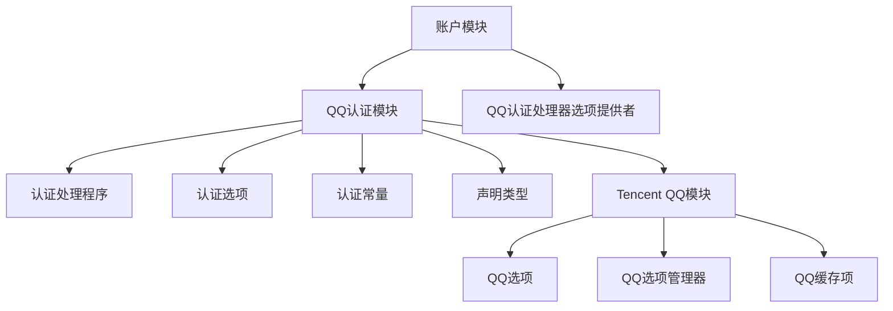
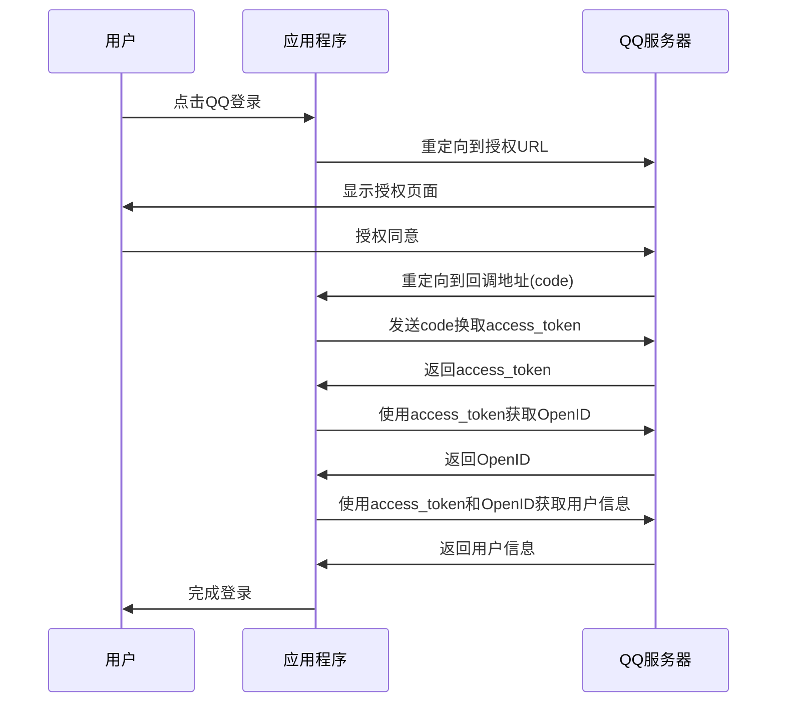
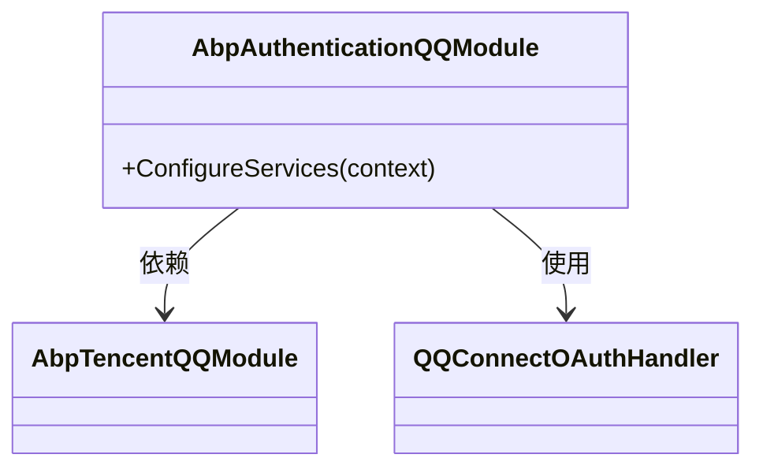
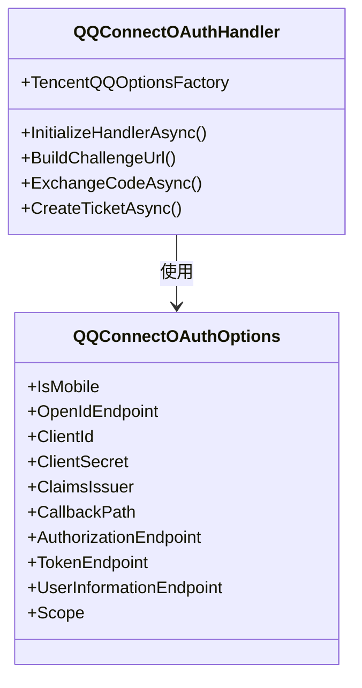
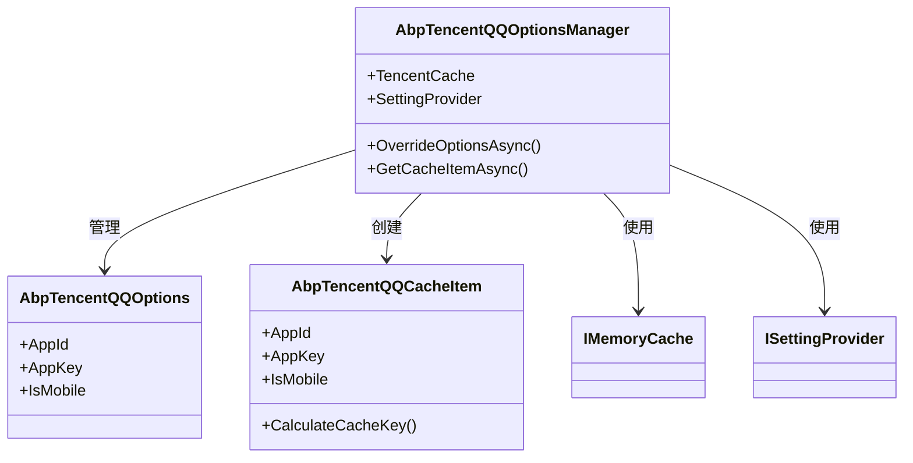
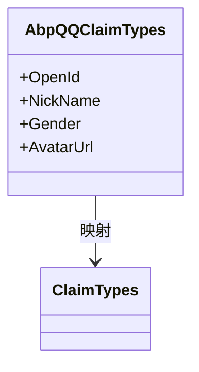
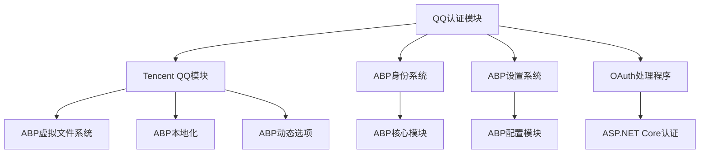

# QQ认证

<cite>
**本文档中引用的文件**  
- [AbpAuthenticationQQModule.cs](file://aspnet-core/framework/authentication/LINGYUN.Abp.Authentication.QQ/LINGYUN/Abp/Authentication/QQ/AbpAuthenticationQQModule.cs)
- [QQConnectOAuthOptions.cs](file://aspnet-core/framework/authentication/LINGYUN.Abp.Authentication.QQ/Microsoft/AspNetCore/Authentication/QQ/QQConnectOAuthOptions.cs)
- [QQConnectOAuthHandler.cs](file://aspnet-core/framework/authentication/LINGYUN.Abp.Authentication.QQ/Microsoft/AspNetCore/Authentication/QQ/QQConnectOAuthHandler.cs)
- [AbpQQClaimTypes.cs](file://aspnet-core/framework/authentication/LINGYUN.Abp.Authentication.QQ/LINGYUN/Abp/Authentication/QQ/AbpQQClaimTypes.cs)
- [AbpAuthenticationQQConsts.cs](file://aspnet-core/framework/authentication/LINGYUN.Abp.Authentication.QQ/LINGYUN/Abp/Authentication/QQ/AbpAuthenticationQQConsts.cs)
- [AbpTencentQQOptions.cs](file://aspnet-core/framework/cloud-tencent/LINGYUN.Abp.Tencent.QQ/LINGYUN/Abp/Tencent/QQ/AbpTencentQQOptions.cs)
- [TencentQQSettingNames.cs](file://aspnet-core/framework/cloud-tencent/LINGYUN.Abp.Tencent.QQ/LINGYUN/Abp/Tencent/QQ/Settings/TencentQQSettingNames.cs)
- [AbpTencentQQOptionsManager.cs](file://aspnet-core/framework/cloud-tencent/LINGYUN.Abp.Tencent.QQ/LINGYUN/Abp/Tencent/QQ/AbpTencentQQOptionsManager.cs)
- [AbpTencentQQCacheItem.cs](file://aspnet-core/framework/cloud-tencent/LINGYUN.Abp.Tencent.QQ/LINGYUN/Abp/Tencent/QQ/AbpTencentQQCacheItem.cs)
- [QQAuthHandlerOptionsProvider.cs](file://aspnet-core/modules/account/LINGYUN.Abp.Account.Web.OAuth/ExternalProviders/QQ/QQAuthHandlerOptionsProvider.cs)
- [AccountOAuthFeatureNames.cs](file://aspnet-core/modules/account/LINGYUN.Abp.Account.OAuth/LINGYUN/Abp/Account/OAuth/Features/AccountOAuthFeatureNames.cs)
</cite>

## 目录
1. [简介](#简介)
2. [项目结构](#项目结构)
3. [核心组件](#核心组件)
4. [架构概述](#架构概述)
5. [详细组件分析](#详细组件分析)
6. [依赖分析](#依赖分析)
7. [性能考虑](#性能考虑)
8. [故障排除指南](#故障排除指南)
9. [结论](#结论)

## 简介
本文档详细说明了在ABP框架中集成QQ认证的实现机制。文档涵盖了QQ OAuth2.0认证流程的各个方面，包括QQ开放平台应用注册、AppId和AppKey配置、回调地址设置等。同时解释了认证中间件的配置方式、认证事件处理流程以及用户信息映射策略，并提供了实际配置示例和代码片段。文档还包含了安全最佳实践，如令牌存储、会话管理、CSRF防护等，并说明了常见问题如回调失败、用户信息获取异常的排查方法。

## 项目结构
QQ认证功能主要分布在`aspnet-core/framework/authentication/LINGYUN.Abp.Authentication.QQ`目录下，该模块依赖于`aspnet-core/framework/cloud-tencent/LINGYUN.Abp.Tencent.QQ`模块。认证配置通过ABP的设置系统进行管理，相关设置名称定义在`TencentQQSettingNames`类中。

**图示来源**
- [AbpAuthenticationQQModule.cs](file://aspnet-core/framework/authentication/LINGYUN.Abp.Authentication.QQ/LINGYUN/Abp/Authentication/QQ/AbpAuthenticationQQModule.cs)
- [AbpTencentQQModule.cs](file://aspnet-core/framework/cloud-tencent/LINGYUN.Abp.Tencent.QQ/LINGYUN/Abp/Tencent/QQ/AbpTencentQQModule.cs)
- [QQAuthHandlerOptionsProvider.cs](file://aspnet-core/modules/account/LINGYUN.Abp.Account.Web.OAuth/ExternalProviders/QQ/QQAuthHandlerOptionsProvider.cs)

**本节来源**
- [AbpAuthenticationQQModule.cs](file://aspnet-core/framework/authentication/LINGYUN.Abp.Authentication.QQ/LINGYUN/Abp/Authentication/QQ/AbpAuthenticationQQModule.cs)
- [AbpTencentQQModule.cs](file://aspnet-core/framework/cloud-tencent/LINGYUN.Abp.Tencent.QQ/LINGYUN/Abp/Tencent/QQ/AbpTencentQQModule.cs)

## 核心组件
QQ认证的核心组件包括认证模块、认证处理程序、认证选项、声明类型和常量定义。这些组件共同实现了QQ OAuth2.0认证流程，从用户授权到获取用户信息的完整过程。

**本节来源**
- [AbpAuthenticationQQModule.cs](file://aspnet-core/framework/authentication/LINGYUN.Abp.Authentication.QQ/LINGYUN/Abp/Authentication/QQ/AbpAuthenticationQQModule.cs)
- [QQConnectOAuthHandler.cs](file://aspnet-core/framework/authentication/LINGYUN.Abp.Authentication.QQ/Microsoft/AspNetCore/Authentication/QQ/QQConnectOAuthHandler.cs)
- [QQConnectOAuthOptions.cs](file://aspnet-core/framework/authentication/LINGYUN.Abp.Authentication.QQ/Microsoft/AspNetCore/Authentication/QQ/QQConnectOAuthOptions.cs)

## 架构概述
QQ认证架构基于ABP框架的模块化设计，通过依赖注入和设置系统实现配置管理。认证流程遵循OAuth2.0标准，包括授权码获取、访问令牌交换和用户信息获取三个主要阶段。

**图示来源**
- [QQConnectOAuthHandler.cs](file://aspnet-core/framework/authentication/LINGYUN.Abp.Authentication.QQ/Microsoft/AspNetCore/Authentication/QQ/QQConnectOAuthHandler.cs)
- [QQConnectOAuthOptions.cs](file://aspnet-core/framework/authentication/LINGYUN.Abp.Authentication.QQ/Microsoft/AspNetCore/Authentication/QQ/QQConnectOAuthOptions.cs)

## 详细组件分析

### 认证模块分析
`AbpAuthenticationQQModule`是QQ认证的主模块，通过`DependsOn`特性依赖于`AbpTencentQQModule`。在`ConfigureServices`方法中，通过`AddAuthentication().AddQQConnect()`方法注册QQ认证服务。

**图示来源**
- [AbpAuthenticationQQModule.cs](file://aspnet-core/framework/authentication/LINGYUN.Abp.Authentication.QQ/LINGYUN/Abp/Authentication/QQ/AbpAuthenticationQQModule.cs)
- [AbpTencentQQModule.cs](file://aspnet-core/framework/cloud-tencent/LINGYUN.Abp.Tencent.QQ/LINGYUN/Abp/Tencent/QQ/AbpTencentQQModule.cs)

### 认证处理器分析
`QQConnectOAuthHandler`是QQ认证的核心处理程序，继承自`OAuthHandler<QQConnectOAuthOptions>`。它重写了`InitializeHandlerAsync`、`BuildChallengeUrl`、`ExchangeCodeAsync`和`CreateTicketAsync`等关键方法来实现QQ认证流程。

**图示来源**
- [QQConnectOAuthHandler.cs](file://aspnet-core/framework/authentication/LINGYUN.Abp.Authentication.QQ/Microsoft/AspNetCore/Authentication/QQ/QQConnectOAuthHandler.cs)
- [QQConnectOAuthOptions.cs](file://aspnet-core/framework/authentication/LINGYUN.Abp.Authentication.QQ/Microsoft/AspNetCore/Authentication/QQ/QQConnectOAuthOptions.cs)

### 配置管理分析
QQ认证的配置通过`AbpTencentQQOptionsManager`进行管理，该类从ABP的设置系统中获取`AppId`、`AppKey`和`IsMobile`等配置项，并使用内存缓存提高性能。

**图示来源**
- [AbpTencentQQOptionsManager.cs](file://aspnet-core/framework/cloud-tencent/LINGYUN.Abp.Tencent.QQ/LINGYUN/Abp/Tencent/QQ/AbpTencentQQOptionsManager.cs)
- [AbpTencentQQOptions.cs](file://aspnet-core/framework/cloud-tencent/LINGYUN.Abp.Tencent.QQ/LINGYUN/Abp/Tencent/QQ/AbpTencentQQOptions.cs)
- [AbpTencentQQCacheItem.cs](file://aspnet-core/framework/cloud-tencent/LINGYUN.Abp.Tencent.QQ/LINGYUN/Abp/Tencent/QQ/AbpTencentQQCacheItem.cs)

### 声明类型分析
`AbpQQClaimTypes`类定义了QQ认证相关的声明类型，用于映射QQ用户信息到系统声明中。

**图示来源**
- [AbpQQClaimTypes.cs](file://aspnet-core/framework/authentication/LINGYUN.Abp.Authentication.QQ/LINGYUN/Abp/Authentication/QQ/AbpQQClaimTypes.cs)

**本节来源**
- [AbpAuthenticationQQModule.cs](file://aspnet-core/framework/authentication/LINGYUN.Abp.Authentication.QQ/LINGYUN/Abp/Authentication/QQ/AbpAuthenticationQQModule.cs)
- [QQConnectOAuthHandler.cs](file://aspnet-core/framework/authentication/LINGYUN.Abp.Authentication.QQ/Microsoft/AspNetCore/Authentication/QQ/QQConnectOAuthHandler.cs)
- [QQConnectOAuthOptions.cs](file://aspnet-core/framework/authentication/LINGYUN.Abp.Authentication.QQ/Microsoft/AspNetCore/Authentication/QQ/QQConnectOAuthOptions.cs)
- [AbpQQClaimTypes.cs](file://aspnet-core/framework/authentication/LINGYUN.Abp.Authentication.QQ/LINGYUN/Abp/Authentication/QQ/AbpQQClaimTypes.cs)
- [AbpTencentQQOptionsManager.cs](file://aspnet-core/framework/cloud-tencent/LINGYUN.Abp.Tencent.QQ/LINGYUN/Abp/Tencent/QQ/AbpTencentQQOptionsManager.cs)

## 依赖分析
QQ认证模块依赖于多个其他模块和组件，形成了一个完整的认证生态系统。

**图示来源**
- [AbpAuthenticationQQModule.cs](file://aspnet-core/framework/authentication/LINGYUN.Abp.Authentication.QQ/LINGYUN/Abp/Authentication/QQ/AbpAuthenticationQQModule.cs)
- [AbpTencentQQModule.cs](file://aspnet-core/framework/cloud-tencent/LINGYUN.Abp.Tencent.QQ/LINGYUN/Abp/Tencent/QQ/AbpTencentQQModule.cs)

**本节来源**
- [AbpAuthenticationQQModule.cs](file://aspnet-core/framework/authentication/LINGYUN.Abp.Authentication.QQ/LINGYUN/Abp/Authentication/QQ