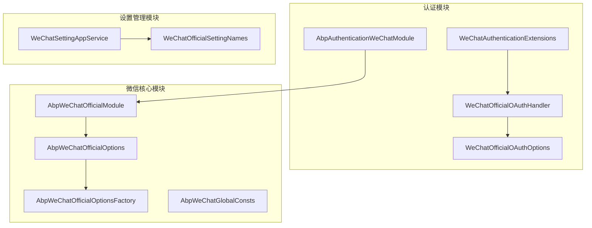
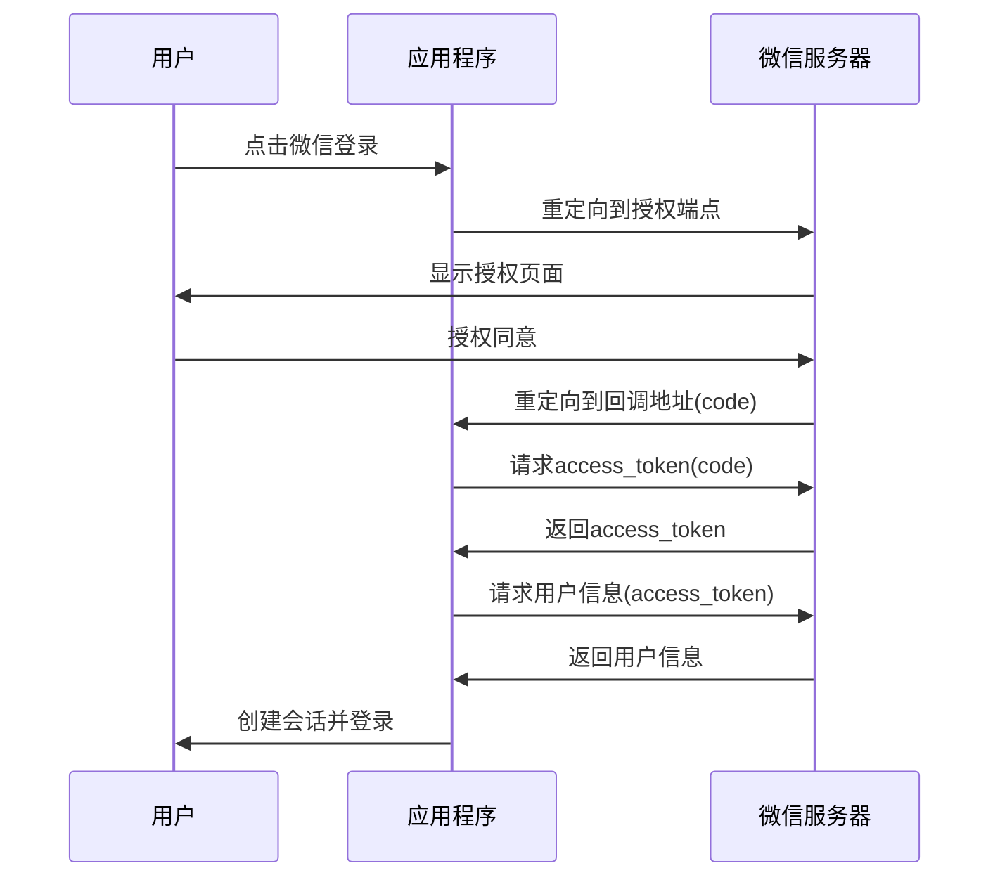
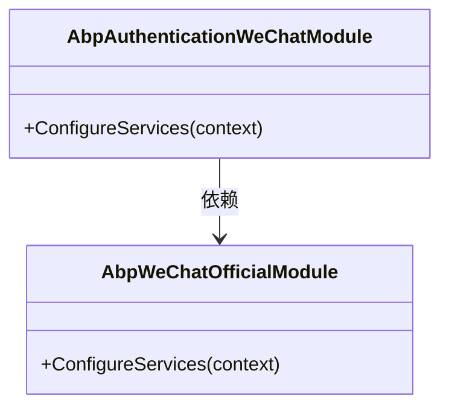
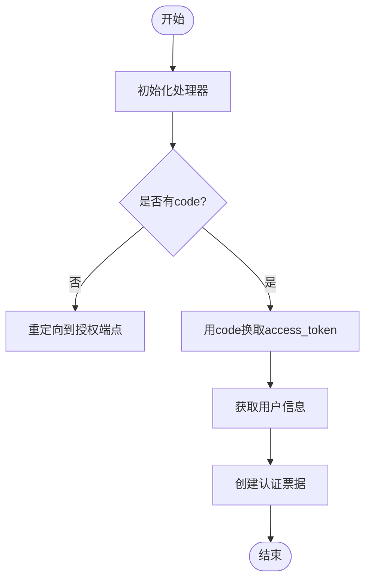
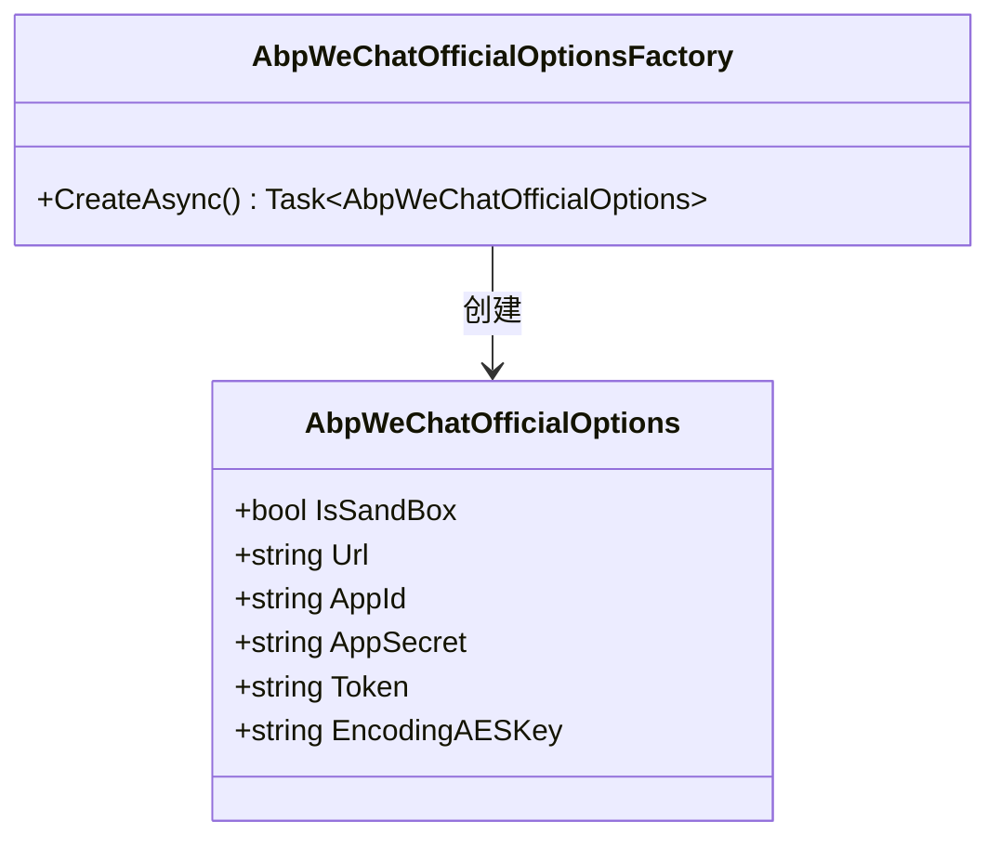
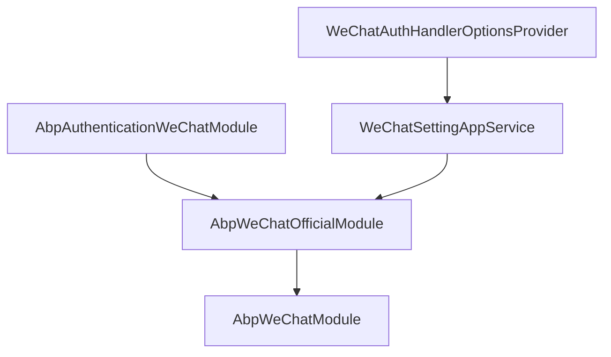

# 微信认证

<cite>
**本文档引用的文件**
- [WeChatAuthenticationExtensions.cs](file://aspnet-core/framework/authentication/LINGYUN.Abp.Authentication.WeChat/Microsoft/AspNetCore/Authentication/WeChatAuthenticationExtensions.cs)
- [WeChatOfficialOAuthHandler.cs](file://aspnet-core/framework/authentication/LINGYUN.Abp.Authentication.WeChat/Microsoft/AspNetCore/Authentication/WeChat/Official/WeChatOfficialOAuthHandler.cs)
- [WeChatOfficialOAuthOptions.cs](file://aspnet-core/framework/authentication/LINGYUN.Abp.Authentication.WeChat/Microsoft/AspNetCore/Authentication/WeChat/Official/WeChatOfficialOAuthOptions.cs)
- [AbpAuthenticationWeChatModule.cs](file://aspnet-core/framework/authentication/LINGYUN.Abp.Authentication.WeChat/LINGYUN/Abp/Authentication/WeChat/AbpAuthenticationWeChatModule.cs)
- [AbpAuthenticationWeChatConsts.cs](file://aspnet-core/framework/authentication/LINGYUN.Abp.Authentication.WeChat/LINGYUN/Abp/Authentication/WeChat/AbpAuthenticationWeChatConsts.cs)
- [AbpWeChatGlobalConsts.cs](file://aspnet-core/framework/wechat/LINGYUN.Abp.WeChat/LINGYUN/Abp/WeChat/AbpWeChatGlobalConsts.cs)
- [AbpWeChatOfficialOptions.cs](file://aspnet-core/framework/wechat/LINGYUN.Abp.WeChat.Official/LINGYUN/Abp/WeChat/Official/AbpWeChatOfficialOptions.cs)
- [AbpWeChatOfficialOptionsFactory.cs](file://aspnet-core/framework/wechat/LINGYUN.Abp.WeChat.Official/LINGYUN/Abp/WeChat/Official/AbpWeChatOfficialOptionsFactory.cs)
- [WeChatOfficialSettingNames.cs](file://aspnet-core/framework/wechat/LINGYUN.Abp.WeChat.Official/LINGYUN/Abp/WeChat/Official/Settings/WeChatOfficialSettingNames.cs)
- [WeChatAuthHandlerOptionsProvider.cs](file://aspnet-core/modules/account/LINGYUN.Abp.Account.Web.OAuth/ExternalProviders/WeChat/WeChatAuthHandlerOptionsProvider.cs)
- [WeChatSettingAppService.cs](file://aspnet-core/framework/wechat/LINGYUN.Abp.WeChat.SettingManagement/LINGYUN/Abp/WeChat/SettingManagement/WeChatSettingAppService.cs)
</cite>

## 目录
1. [简介](#简介)
2. [项目结构](#项目结构)
3. [核心组件](#核心组件)
4. [架构概述](#架构概述)
5. [详细组件分析](#详细组件分析)
6. [依赖分析](#依赖分析)
7. [性能考虑](#性能考虑)
8. [故障排除指南](#故障排除指南)
9. [结论](#结论)

## 简介
本文档详细说明了在ABP框架中集成微信OAuth2.0认证的实现机制。文档涵盖了微信开放平台或公众平台应用注册、AppId和AppSecret配置、授权回调域名设置等关键步骤。重点介绍了微信认证中间件的配置方式、认证事件处理流程以及用户信息映射策略，并详细描述了与IdentityServer和OpenIddict的集成方式。同时提供了安全最佳实践，包括令牌存储、会话管理和CSRF防护，并说明了常见问题如扫码失败、用户信息获取异常的排查方法。

## 项目结构
本项目的微信认证功能主要分布在`aspnet-core/framework/authentication`和`aspnet-core/framework/wechat`目录下。认证相关的扩展方法和处理器位于`LINGYUN.Abp.Authentication.WeChat`模块，而微信官方账号的核心配置和选项则位于`LINGYUN.Abp.WeChat.Official`模块。设置管理功能通过`LINGYUN.Abp.WeChat.SettingManagement`模块提供，允许在运行时动态配置微信认证参数。

**图示来源**
- [AbpAuthenticationWeChatModule.cs](file://aspnet-core/framework/authentication/LINGYUN.Abp.Authentication.WeChat/LINGYUN/Abp/Authentication/WeChat/AbpAuthenticationWeChatModule.cs)
- [AbpWeChatOfficialModule.cs](file://aspnet-core/framework/wechat/LINGYUN.Abp.WeChat.Official/LINGYUN/Abp/WeChat/Official/AbpWeChatOfficialModule.cs)
- [WeChatSettingAppService.cs](file://aspnet-core/framework/wechat/LINGYUN.Abp.WeChat.SettingManagement/LINGYUN/Abp/WeChat/SettingManagement/WeChatSettingAppService.cs)

**章节来源**
- [AbpAuthenticationWeChatModule.cs](file://aspnet-core/framework/authentication/LINGYUN.Abp.Authentication.WeChat/LINGYUN/Abp/Authentication/WeChat/AbpAuthenticationWeChatModule.cs)
- [AbpWeChatOfficialModule.cs](file://aspnet-core/framework/wechat/LINGYUN.Abp.WeChat.Official/LINGYUN/Abp/WeChat/Official/AbpWeChatOfficialModule.cs)

## 核心组件
微信认证的核心组件包括认证模块、OAuth处理器、配置选项和常量定义。`AbpAuthenticationWeChatModule`是主要的认证模块，它依赖于`AbpWeChatOfficialModule`并注册了微信认证服务。`WeChatOfficialOAuthHandler`负责处理OAuth2.0认证流程，而`WeChatOfficialOAuthOptions`定义了认证过程中的各种配置选项。全局常量类`AbpWeChatGlobalConsts`和`AbpAuthenticationWeChatConsts`提供了认证过程中使用的固定值，如端点URL和作用域。

**章节来源**
- [AbpAuthenticationWeChatModule.cs](file://aspnet-core/framework/authentication/LINGYUN.Abp.Authentication.WeChat/LINGYUN/Abp/Authentication/WeChat/AbpAuthenticationWeChatModule.cs)
- [WeChatOfficialOAuthHandler.cs](file://aspnet-core/framework/authentication/LINGYUN.Abp.Authentication.WeChat/Microsoft/AspNetCore/Authentication/WeChat/Official/WeChatOfficialOAuthHandler.cs)
- [WeChatOfficialOAuthOptions.cs](file://aspnet-core/framework/authentication/LINGYUN.Abp.Authentication.WeChat/Microsoft/AspNetCore/Authentication/WeChat/Official/WeChatOfficialOAuthOptions.cs)

## 架构概述
微信认证的架构基于ASP.NET Core的认证系统，采用模块化设计。整个认证流程从用户点击微信登录按钮开始，系统重定向到微信的授权端点。用户授权后，微信服务器将用户重定向回应用的回调地址，并附带一个临时的code。应用使用这个code向微信服务器请求access_token，然后使用access_token获取用户的基本信息。这些信息被映射到Claims中，用于创建用户的认证票据。

**图示来源**
- [WeChatOfficialOAuthHandler.cs](file://aspnet-core/framework/authentication/LINGYUN.Abp.Authentication.WeChat/Microsoft/AspNetCore/Authentication/WeChat/Official/WeChatOfficialOAuthHandler.cs)
- [AbpAuthenticationWeChatConsts.cs](file://aspnet-core/framework/authentication/LINGYUN.Abp.Authentication.WeChat/LINGYUN/Abp/Authentication/WeChat/AbpAuthenticationWeChatConsts.cs)

## 详细组件分析

### 认证模块分析
`AbpAuthenticationWeChatModule`是微信认证的主模块，它通过`[DependsOn(typeof(AbpWeChatOfficialModule))]`属性声明了对微信官方模块的依赖。在`ConfigureServices`方法中，它调用`AddAuthentication().AddWeChat()`来注册微信认证服务。这种设计模式确保了所有必要的服务都被正确注册和配置。

**图示来源**
- [AbpAuthenticationWeChatModule.cs](file://aspnet-core/framework/authentication/LINGYUN.Abp.Authentication.WeChat/LINGYUN/Abp/Authentication/WeChat/AbpAuthenticationWeChatModule.cs)
- [AbpWeChatOfficialModule.cs](file://aspnet-core/framework/wechat/LINGYUN.Abp.WeChat.Official/LINGYUN/Abp/WeChat/Official/AbpWeChatOfficialModule.cs)

**章节来源**
- [AbpAuthenticationWeChatModule.cs](file://aspnet-core/framework/authentication/LINGYUN.Abp.Authentication.WeChat/LINGYUN/Abp/Authentication/WeChat/AbpAuthenticationWeChatModule.cs)

### OAuth处理器分析
`WeChatOfficialOAuthHandler`继承自`OAuthHandler<WeChatOfficialOAuthOptions>`，负责处理完整的OAuth2.0认证流程。它在`InitializeHandlerAsync`方法中初始化微信官方选项，并通过`AbpWeChatOfficialOptionsFactory`获取配置。处理器使用预定义的端点URL（如授权端点、令牌端点和用户信息端点）与微信服务器进行通信。

**图示来源**
- [WeChatOfficialOAuthHandler.cs](file://aspnet-core/framework/authentication/LINGYUN.Abp.Authentication.WeChat/Microsoft/AspNetCore/Authentication/WeChat/Official/WeChatOfficialOAuthHandler.cs)
- [AbpAuthenticationWeChatConsts.cs](file://aspnet-core/framework/authentication/LINGYUN.Abp.Authentication.WeChat/LINGYUN/Abp/Authentication/WeChat/AbpAuthenticationWeChatConsts.cs)

**章节来源**
- [WeChatOfficialOAuthHandler.cs](file://aspnet-core/framework/authentication/LINGYUN.Abp.Authentication.WeChat/Microsoft/AspNetCore/Authentication/WeChat/Official/WeChatOfficialOAuthHandler.cs)

### 配置选项分析
`AbpWeChatOfficialOptions`类定义了微信官方账号的所有配置选项，包括AppId、AppSecret、Token和EncodingAESKey等。这些选项通过依赖注入系统提供给应用程序的其他部分。`AbpWeChatOfficialOptionsFactory`负责创建和管理这些选项的实例，确保它们在需要时可用。

**图示来源**
- [AbpWeChatOfficialOptions.cs](file://aspnet-core/framework/wechat/LINGYUN.Abp.WeChat.Official/LINGYUN/Abp/WeChat/Official/AbpWeChatOfficialOptions.cs)
- [AbpWeChatOfficialOptionsFactory.cs](file://aspnet-core/framework/wechat/LINGYUN.Abp.WeChat.Official/LINGYUN/Abp/WeChat/Official/AbpWeChatOfficialOptionsFactory.cs)

**章节来源**
- [AbpWeChatOfficialOptions.cs](file://aspnet-core/framework/wechat/LINGYUN.Abp.WeChat.Official/LINGYUN/Abp/WeChat/Official/AbpWeChatOfficialOptions.cs)

## 依赖分析
微信认证模块与其他模块有明确的依赖关系。`AbpAuthenticationWeChatModule`直接依赖于`AbpWeChatOfficialModule`，后者又依赖于基础的`AbpWeChatModule`。这种分层设计使得各个功能模块可以独立开发和测试。设置管理模块`LINGYUN.Abp.WeChat.SettingManagement`为微信认证提供了运行时配置能力，允许管理员通过UI界面修改AppId和AppSecret等敏感信息。

**图示来源**
- [AbpAuthenticationWeChatModule.cs](file://aspnet-core/framework/authentication/LINGYUN.Abp.Authentication.WeChat/LINGYUN/Abp/Authentication/WeChat/AbpAuthenticationWeChatModule.cs)
- [AbpWeChatOfficialModule.cs](file://aspnet-core/framework/wechat/LINGYUN.Abp.WeChat.Official/LINGYUN/Abp/WeChat/Official/AbpWeChatOfficialModule.cs)
- [WeChatSettingAppService.cs](file://aspnet-core/framework/wechat/LINGYUN.Abp.WeChat.SettingManagement/LINGYUN/Abp/WeChat/SettingManagement/WeChatSettingAppService.cs)

**章节来源**
- [AbpAuthenticationWeChatModule.cs](file://aspnet-core/framework/authentication/LINGYUN.Abp.Authentication.WeChat/LINGYUN/Abp/Authentication/WeChat/AbpAuthenticationWeChatModule.cs)

## 性能考虑
微信认证的性能主要受网络延迟和API调用次数的影响。为了优化性能，建议启用HTTP客户端池化，复用与微信服务器的连接。此外，可以考虑缓存access_token，避免频繁的令牌获取请求。对于高并发场景，应确保`AbpWeChatOfficialOptionsFactory`的线程安全性，并考虑异步加载配置以减少请求延迟。

## 故障排除指南
常见的微信认证问题包括扫码失败、用户信息获取异常和回调地址错误。扫码失败通常是由于AppId或AppSecret配置错误导致的，应检查`WeChatOfficialSettingNames.AppId`和`WeChatOfficialSettingNames.AppSecret`的设置。用户信息获取异常可能是由于access_token过期或权限不足引起的，需要验证`UserInfoScope`是否正确设置为`snsapi_userinfo`。回调地址错误通常是由于`CallbackPath`配置不匹配造成的，应确保前端重定向URL与后端配置一致。

**章节来源**
- [WeChatOfficialSettingNames.cs](file://aspnet-core/framework/wechat/LINGYUN.Abp.WeChat.Official/LINGYUN/Abp/WeChat/Official/Settings/WeChatOfficialSettingNames.cs)
- [AbpAuthenticationWeChatConsts.cs](file://aspnet-core/framework/authentication/LINGYUN.Abp.Authentication.WeChat/LINGYUN/Abp/Authentication/WeChat/AbpAuthenticationWeChatConsts.cs)

## 结论
本文档全面介绍了在ABP框架中集成微信认证的各个方面。通过模块化的设计和清晰的依赖关系，实现了灵活且可扩展的认证系统。开发者可以根据具体需求调整配置，利用提供的设置管理功能动态修改认证参数。遵循文档中的最佳实践，可以确保认证过程的安全性和可靠性，为用户提供流畅的登录体验。