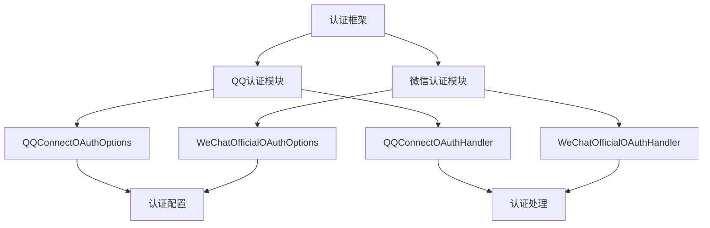
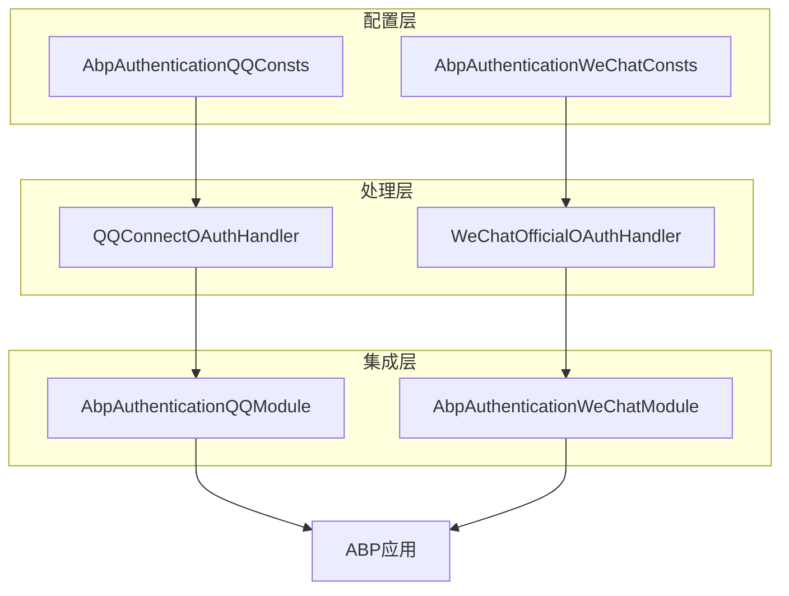
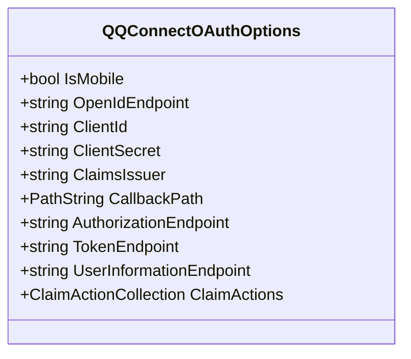
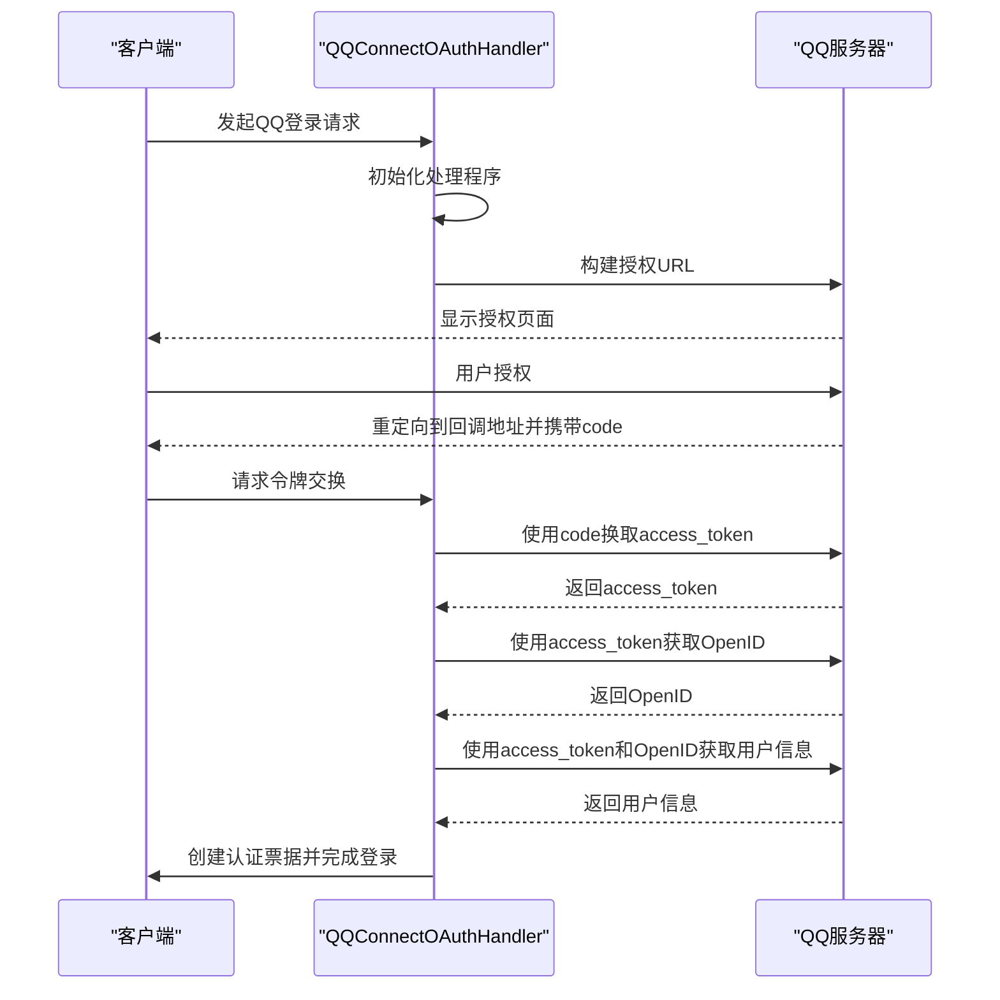
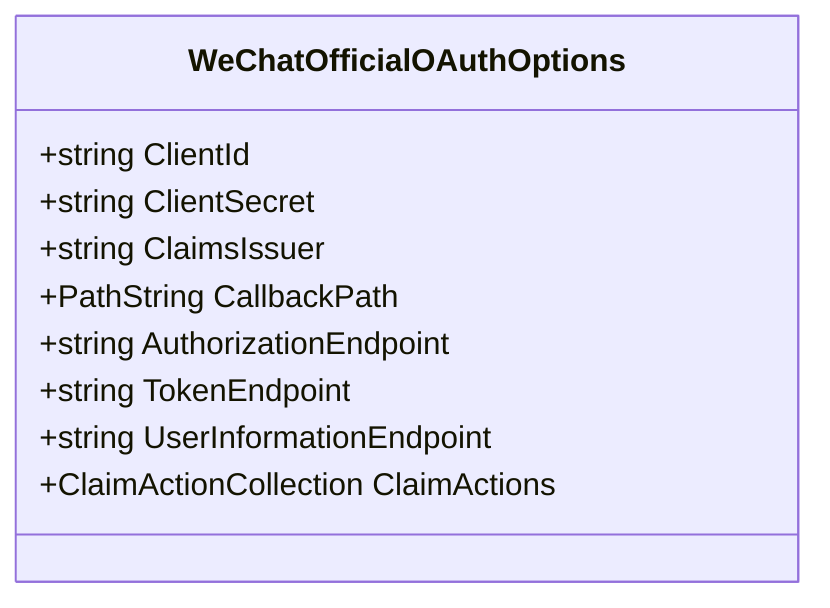
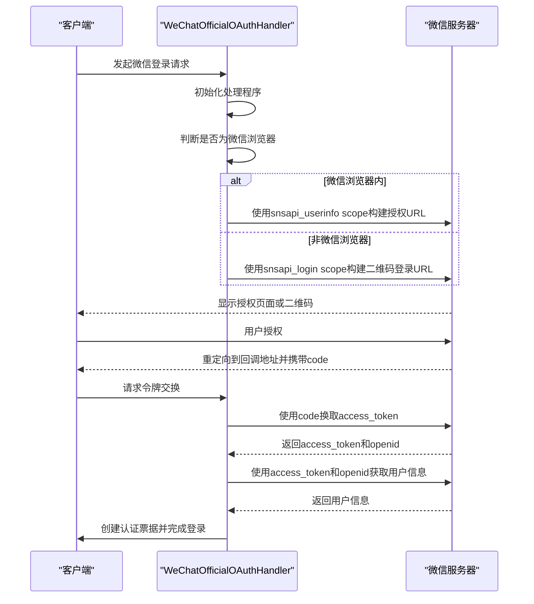
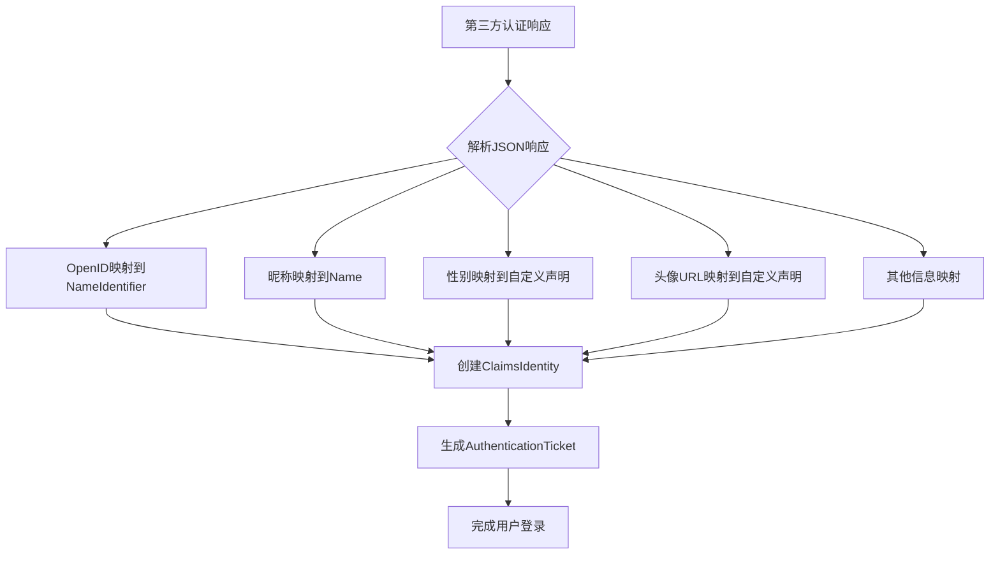
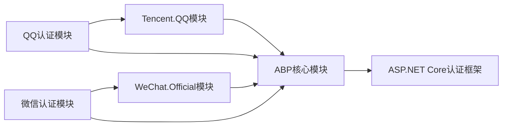

# 认证集成

<cite>
**本文档引用的文件**
- [AbpAuthenticationQQModule.cs](file://aspnet-core/framework/authentication/LINGYUN.Abp.Authentication.QQ/LINGYUN/Abp/Authentication/QQ/AbpAuthenticationQQModule.cs)
- [AbpAuthenticationWeChatModule.cs](file://aspnet-core/framework/authentication/LINGYUN.Abp.Authentication.WeChat/LINGYUN/Abp/Authentication/WeChat/AbpAuthenticationWeChatModule.cs)
- [QQConnectOAuthOptions.cs](file://aspnet-core/framework/authentication/LINGYUN.Abp.Authentication.QQ/Microsoft/AspNetCore/Authentication/QQ/QQConnectOAuthOptions.cs)
- [QQConnectOAuthHandler.cs](file://aspnet-core/framework/authentication/LINGYUN.Abp.Authentication.QQ/Microsoft/AspNetCore/Authentication/QQ/QQConnectOAuthHandler.cs)
- [WeChatOfficialOAuthOptions.cs](file://aspnet-core/framework/authentication/LINGYUN.Abp.Authentication.WeChat/Microsoft/AspNetCore/Authentication/WeChat/Official/WeChatOfficialOAuthOptions.cs)
- [WeChatOfficialOAuthHandler.cs](file://aspnet-core/framework/authentication/LINGYUN.Abp.Authentication.WeChat/Microsoft/AspNetCore/Authentication/WeChat/Official/WeChatOfficialOAuthHandler.cs)
- [AbpAuthenticationQQConsts.cs](file://aspnet-core/framework/authentication/LINGYUN.Abp.Authentication.QQ/LINGYUN/Abp/Authentication/QQ/AbpAuthenticationQQConsts.cs)
- [AbpAuthenticationWeChatConsts.cs](file://aspnet-core/framework/authentication/LINGYUN.Abp.Authentication.WeChat/LINGYUN/Abp/Authentication/WeChat/AbpAuthenticationWeChatConsts.cs)
- [QQAuthenticationExtensions.cs](file://aspnet-core/framework/authentication/LINGYUN.Abp.Authentication.QQ/Microsoft/AspNetCore/Authentication/QQAuthenticationExtensions.cs)
- [WeChatAuthenticationExtensions.cs](file://aspnet-core/framework/authentication/LINGYUN.Abp.Authentication.WeChat/Microsoft/AspNetCore/Authentication/WeChatAuthenticationExtensions.cs)
</cite>

## 目录
1. [简介](#简介)
2. [项目结构](#项目结构)
3. [核心组件](#核心组件)
4. [架构概述](#架构概述)
5. [详细组件分析](#详细组件分析)
6. [依赖分析](#依赖分析)
7. [性能考虑](#性能考虑)
8. [故障排除指南](#故障排除指南)
9. [结论](#结论)

## 简介
本文档详细介绍了ABP Next Admin项目中QQ和微信第三方认证的集成机制。文档重点阐述了OAuth2.0/OpenID Connect协议的集成流程，包括认证服务器配置、客户端注册、授权码获取、令牌交换和用户信息获取等环节。同时，文档还解释了认证中间件的配置方式、认证事件的处理以及用户信息的映射策略，并提供了实际配置示例和代码片段。此外，文档包含了安全最佳实践，如令牌存储、会话管理、CSRF防护等，并说明了常见问题的排查方法。

## 项目结构
ABP Next Admin项目中的第三方认证功能主要集中在`aspnet-core/framework/authentication`目录下，该目录包含了QQ和微信认证的独立模块。每个模块都遵循了ABP框架的模块化设计原则，具有清晰的职责划分和依赖关系。

**图示来源**
- [AbpAuthenticationQQModule.cs](file://aspnet-core/framework/authentication/LINGYUN.Abp.Authentication.QQ/LINGYUN/Abp/Authentication/QQ/AbpAuthenticationQQModule.cs)
- [AbpAuthenticationWeChatModule.cs](file://aspnet-core/framework/authentication/LINGYUN.Abp.Authentication.WeChat/LINGYUN/Abp/Authentication/WeChat/AbpAuthenticationWeChatModule.cs)

## 核心组件
本项目的核心认证组件包括QQ和微信的OAuth选项类和处理程序类。这些组件实现了OAuth2.0协议的核心流程，包括授权码获取、令牌交换和用户信息获取。

**组件来源**
- [QQConnectOAuthOptions.cs](file://aspnet-core/framework/authentication/LINGYUN.Abp.Authentication.QQ/Microsoft/AspNetCore/Authentication/QQ/QQConnectOAuthOptions.cs)
- [QQConnectOAuthHandler.cs](file://aspnet-core/framework/authentication/LINGYUN.Abp.Authentication.QQ/Microsoft/AspNetCore/Authentication/QQ/QQConnectOAuthHandler.cs)
- [WeChatOfficialOAuthOptions.cs](file://aspnet-core/framework/authentication/LINGYUN.Abp.Authentication.WeChat/Microsoft/AspNetCore/Authentication/WeChat/Official/WeChatOfficialOAuthOptions.cs)
- [WeChatOfficialOAuthHandler.cs](file://aspnet-core/framework/authentication/LINGYUN.Abp.Authentication.WeChat/Microsoft/AspNetCore/Authentication/WeChat/Official/WeChatOfficialOAuthHandler.cs)

## 架构概述
ABP Next Admin的第三方认证架构基于ASP.NET Core的认证框架，通过扩展OAuthHandler来实现QQ和微信的认证功能。架构分为配置层、处理层和集成层三个主要部分。

**图示来源**
- [AbpAuthenticationQQConsts.cs](file://aspnet-core/framework/authentication/LINGYUN.Abp.Authentication.QQ/LINGYUN/Abp/Authentication/QQ/AbpAuthenticationQQConsts.cs)
- [AbpAuthenticationWeChatConsts.cs](file://aspnet-core/framework/authentication/LINGYUN.Abp.Authentication.WeChat/LINGYUN/Abp/Authentication/WeChat/AbpAuthenticationWeChatConsts.cs)
- [AbpAuthenticationQQModule.cs](file://aspnet-core/framework/authentication/LINGYUN.Abp.Authentication.QQ/LINGYUN/Abp/Authentication/QQ/AbpAuthenticationQQModule.cs)
- [AbpAuthenticationWeChatModule.cs](file://aspnet-core/framework/authentication/LINGYUN.Abp.Authentication.WeChat/LINGYUN/Abp/Authentication/WeChat/AbpAuthenticationWeChatModule.cs)

## 详细组件分析
### QQ认证分析
QQ认证组件实现了QQ互联的OAuth2.0认证流程，包括移动端和PC端的不同样式支持。

#### QQ认证选项类

**图示来源**
- [QQConnectOAuthOptions.cs](file://aspnet-core/framework/authentication/LINGYUN.Abp.Authentication.QQ/Microsoft/AspNetCore/Authentication/QQ/QQConnectOAuthOptions.cs)

#### QQ认证处理流程

**图示来源**
- [QQConnectOAuthHandler.cs](file://aspnet-core/framework/authentication/LINGYUN.Abp.Authentication.QQ/Microsoft/AspNetCore/Authentication/QQ/QQConnectOAuthHandler.cs)

### 微信认证分析
微信认证组件实现了微信公众号和小程序的OAuth2.0认证流程，支持在微信客户端内外的不同登录方式。

#### 微信认证选项类

**图示来源**
- [WeChatOfficialOAuthOptions.cs](file://aspnet-core/framework/authentication/LINGYUN.Abp.Authentication.WeChat/Microsoft/AspNetCore/Authentication/WeChat/Official/WeChatOfficialOAuthOptions.cs)

#### 微信认证处理流程

**图示来源**
- [WeChatOfficialOAuthHandler.cs](file://aspnet-core/framework/authentication/LINGYUN.Abp.Authentication.WeChat/Microsoft/AspNetCore/Authentication/WeChat/Official/WeChatOfficialOAuthHandler.cs)

### 认证映射策略
系统通过ClaimActions实现了从第三方认证信息到ABP系统用户信息的映射。

**图示来源**
- [QQConnectOAuthHandler.cs](file://aspnet-core/framework/authentication/LINGYUN.Abp.Authentication.QQ/Microsoft/AspNetCore/Authentication/QQ/QQConnectOAuthHandler.cs)
- [WeChatOfficialOAuthHandler.cs](file://aspnet-core/framework/authentication/LINGYUN.Abp.Authentication.WeChat/Microsoft/AspNetCore/Authentication/WeChat/Official/WeChatOfficialOAuthHandler.cs)

## 依赖分析
第三方认证模块与其他ABP模块存在明确的依赖关系，确保了功能的完整性和一致性。

**图示来源**
- [AbpAuthenticationQQModule.cs](file://aspnet-core/framework/authentication/LINGYUN.Abp.Authentication.QQ/LINGYUN/Abp/Authentication/QQ/AbpAuthenticationQQModule.cs)
- [AbpAuthenticationWeChatModule.cs](file://aspnet-core/framework/authentication/LINGYUN.Abp.Authentication.WeChat/LINGYUN/Abp/Authentication/WeChat/AbpAuthenticationWeChatModule.cs)

## 性能考虑
在第三方认证集成中，性能主要受网络请求延迟和令牌处理效率的影响。建议在生产环境中使用缓存机制来存储access_token和用户信息，减少对第三方服务器的频繁请求。同时，应合理设置令牌的过期时间，平衡