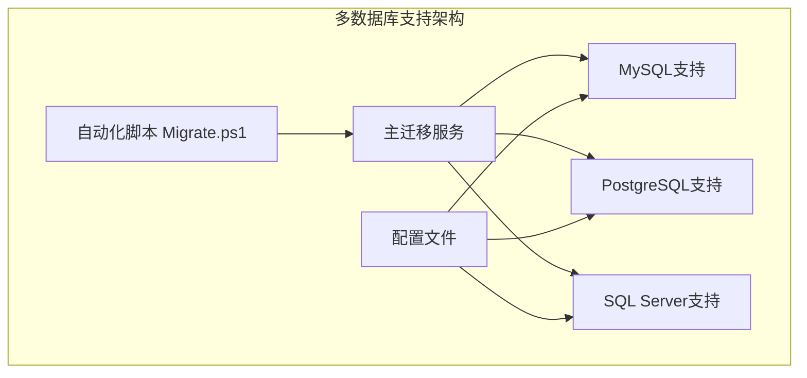
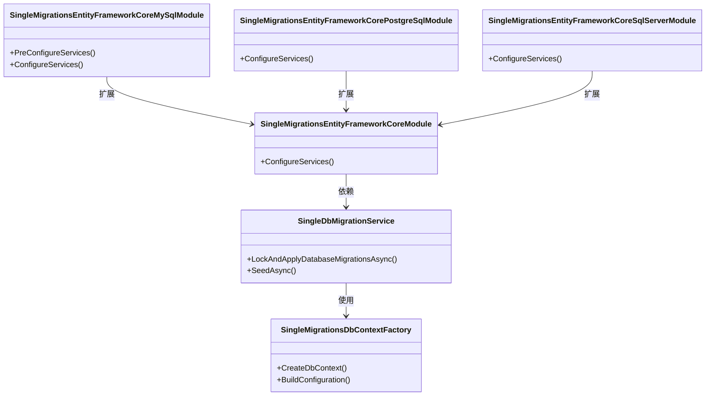
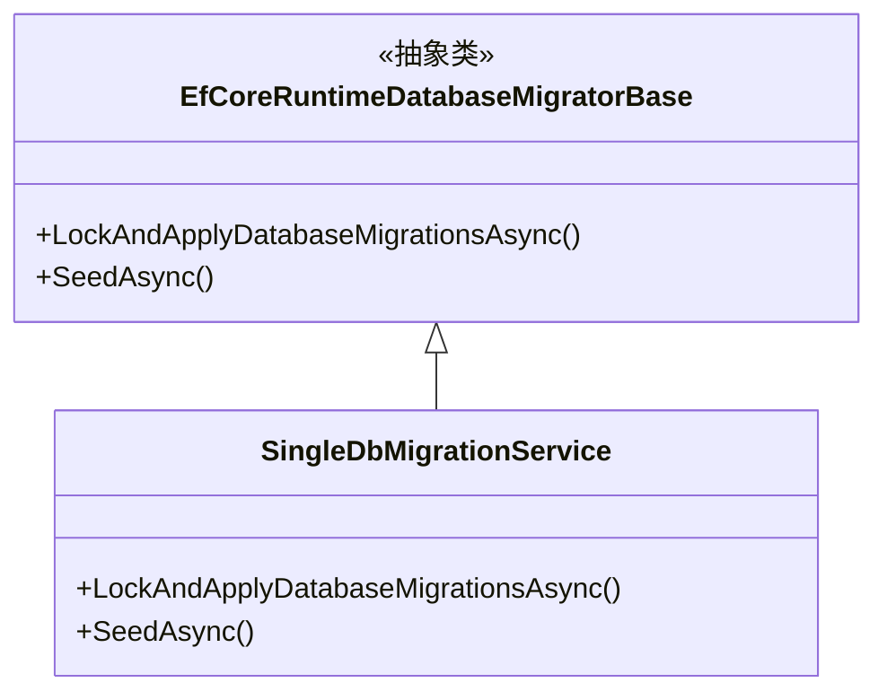
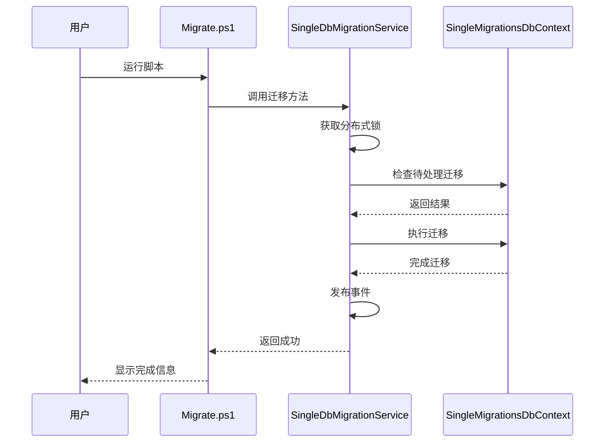
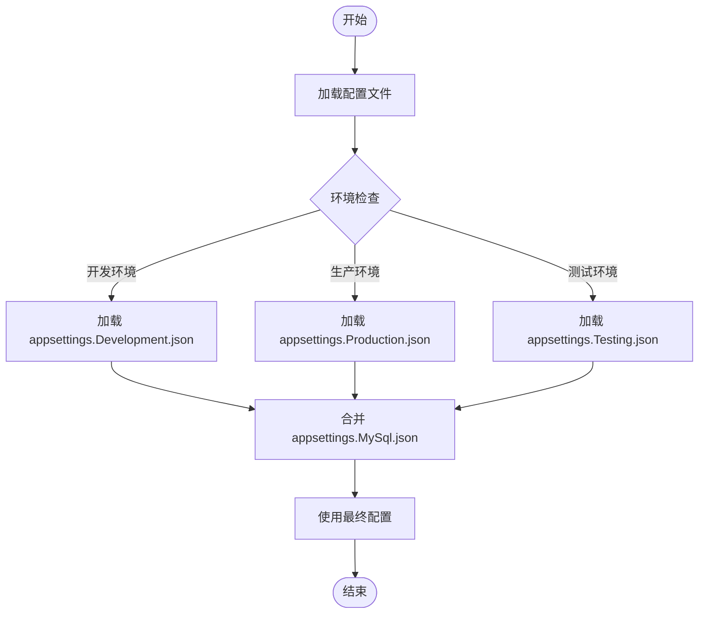

# 多数据库支持

<cite>
**本文档中引用的文件**
- [Migrate.ps1](file://aspnet-core/migrations/Migrate.ps1)
- [appsettings.MySql.json](file://aspnet-core/migrations/LY.MicroService.Applications.Single.DbMigrator/appsettings.MySql.json)
- [appsettings.PostgreSql.json](file://aspnet-core/migrations/LY.MicroService.Applications.Single.DbMigrator/appsettings.PostgreSql.json)
- [appsettings.SqlServer.json](file://aspnet-core/migrations/LY.MicroService.Applications.Single.DbMigrator/appsettings.SqlServer.json)
- [SingleDbMigrationService.cs](file://aspnet-core/migrations/LY.MicroService.Applications.Single.EntityFrameworkCore/SingleDbMigrationService.cs)
- [SingleMigrationsDbContextFactory.cs](file://aspnet-core/migrations/LY.MicroService.Applications.Single.EntityFrameworkCore.MySql/SingleMigrationsDbContextFactory.cs)
- [SingleMigrationsEntityFrameworkCoreModule.cs](file://aspnet-core/migrations/LY.MicroService.Applications.Single.EntityFrameworkCore/SingleMigrationsEntityFrameworkCoreModule.cs)
- [SingleMigrationsEntityFrameworkCoreMySqlModule.cs](file://aspnet-core/migrations/LY.MicroService.Applications.Single.EntityFrameworkCore.MySql/SingleMigrationsEntityFrameworkCoreMySqlModule.cs)
- [SingleMigrationsEntityFrameworkCorePostgreSqlModule.cs](file://aspnet-core/migrations/LY.MicroService.Applications.Single.EntityFrameworkCore.PostgreSql/SingleMigrationsEntityFrameworkCorePostgreSqlModule.cs)
- [SingleMigrationsEntityFrameworkCoreSqlServerModule.cs](file://aspnet-core/migrations/LY.MicroService.Applications.Single.EntityFrameworkCore.SqlServer/SingleMigrationsEntityFrameworkCoreSqlServerModule.cs)
</cite>

## 目录
1. [项目结构](#项目结构)
2. [核心组件](#核心组件)
3. [架构概述](#架构概述)
4. [详细组件分析](#详细组件分析)
5. [依赖关系分析](#依赖关系分析)
6. [性能考虑](#性能考虑)
7. [故障排除指南](#故障排除指南)
8. [结论](#结论)

## 项目结构

该项目采用模块化设计，支持多种数据库系统（MySQL、PostgreSQL和SQL Server）。核心迁移功能位于`aspnet-core/migrations`目录下，通过独立的模块实现不同数据库的支持。

**图表来源**
- [Migrate.ps1](file://aspnet-core/migrations/Migrate.ps1)
- [SingleMigrationsEntityFrameworkCoreModule.cs](file://aspnet-core/migrations/LY.MicroService.Applications.Single.EntityFrameworkCore/SingleMigrationsEntityFrameworkCoreModule.cs)

**章节来源**
- [Migrate.ps1](file://aspnet-core/migrations/Migrate.ps1)
- [SingleMigrationsEntityFrameworkCoreModule.cs](file://aspnet-core/migrations/LY.MicroService.Applications.Single.EntityFrameworkCore/SingleMigrationsEntityFrameworkCoreModule.cs)

## 核心组件

项目的核心组件包括数据库迁移服务、上下文工厂和数据库特定的模块。`SingleDbMigrationService`负责执行实际的数据库迁移操作，而各个数据库特定的模块则提供了相应的配置和扩展。

**章节来源**
- [SingleDbMigrationService.cs](file://aspnet-core/migrations/LY.MicroService.Applications.Single.EntityFrameworkCore/SingleDbMigrationService.cs)
- [SingleMigrationsDbContextFactory.cs](file://aspnet-core/migrations/LY.MicroService.Applications.Single.EntityFrameworkCore.MySql/SingleMigrationsDbContextFactory.cs)

## 架构概述

系统的架构基于ABP框架，利用Entity Framework Core作为ORM层，实现了对多种数据库的支持。通过条件编译和模块化设计，系统能够无缝切换不同的数据库提供程序。

**图表来源**
- [SingleDbMigrationService.cs](file://aspnet-core/migrations/LY.MicroService.Applications.Single.EntityFrameworkCore/SingleDbMigrationService.cs)
- [SingleMigrationsDbContextFactory.cs](file://aspnet-core/migrations/LY.MicroService.Applications.Single.EntityFrameworkCore.MySql/SingleMigrationsDbContextFactory.cs)
- [SingleMigrationsEntityFrameworkCoreModule.cs](file://aspnet-core/migrations/LY.MicroService.Applications.Single.EntityFrameworkCore/SingleMigrationsEntityFrameworkCoreModule.cs)

## 详细组件分析

### 数据库迁移服务分析

`SingleDbMigrationService`是整个迁移过程的核心，它继承自`EfCoreRuntimeDatabaseMigratorBase`，并实现了分布式锁机制来确保在集群环境下的安全迁移。

#### 对象导向组件：

**图表来源**
- [SingleDbMigrationService.cs](file://aspnet-core/migrations/LY.MicroService.Applications.Single.EntityFrameworkCore/SingleDbMigrationService.cs)

#### API/服务组件：

**图表来源**
- [Migrate.ps1](file://aspnet-core/migrations/Migrate.ps1)
- [SingleDbMigrationService.cs](file://aspnet-core/migrations/LY.MicroService.Applications.Single.EntityFrameworkCore/SingleDbMigrationService.cs)

### 配置管理分析

系统使用分层配置文件来管理不同数据库的连接字符串，通过`appsettings.*.json`文件实现环境隔离。

#### 复杂逻辑组件：

**图表来源**
- [SingleMigrationsDbContextFactory.cs](file://aspnet-core/migrations/LY.MicroService.Applications.Single.EntityFrameworkCore.MySql/SingleMigrationsDbContextFactory.cs)

**章节来源**
- [appsettings.MySql.json](file://aspnet-core/migrations/LY.MicroService.Applications.Single.DbMigrator/appsettings.MySql.json)
- [appsettings.PostgreSql.json](file://aspnet-core/migrations/LY.MicroService.Applications.Single.DbMigrator/appsettings.PostgreSql.json)
- [appsettings.SqlServer.json](file://aspnet-core/migrations/LY.MicroService.Applications.Single.DbMigrator/appsettings.SqlServer.json)

## 依赖关系分析

系统通过模块化设计实现了清晰的依赖关系，每个数据库特定的模块都依赖于核心迁移模块，并添加了特定于数据库的配置。

```mermaid
graph TD
A[SingleMigrationsEntityFrameworkCoreModule] --> B[AbpSaasEntityFrameworkCoreModule]
A --> C[AbpAuditLoggingEntityFrameworkCoreModule]
A --> D[AbpSettingManagementEntityFrameworkCoreModule]
A --> E[AbpPermissionManagementEntityFrameworkCoreModule]
A --> F[AbpFeatureManagementEntityFrameworkCoreModule]
A --> G[AbpNotificationsEntityFrameworkCoreModule]
A --> H[PlatformEntityFrameworkCoreModule]
A --> I[AbpLocalizationManagementEntityFrameworkCoreModule]
A --> J[AbpIdentityEntityFrameworkCoreModule]
A --> K[AbpDataDbMigratorModule]
L[SingleMigrationsEntityFrameworkCoreMySqlModule] --> A
L --> M[AbpEntityFrameworkCoreMySQLPomeloModule]
L --> N[AbpQuartzMySqlInstallerModule]
L --> O[AbpElsaEntityFrameworkCoreMySqlModule]
P[SingleMigrationsEntityFrameworkCorePostgreSqlModule] --> A
P --> Q[AbpEntityFrameworkCorePostgreSqlModule]
P --> R[AbpElsaEntityFrameworkCorePostgreSqlModule]
S[SingleMigrationsEntityFrameworkCoreSqlServerModule] --> A
S --> T[AbpEntityFrameworkCoreSqlServerModule]
S --> U[AbpElsaEntityFrameworkCoreSqlServerModule]
```

**图表来源**
- [SingleMigrationsEntityFrameworkCoreModule.cs](file://aspnet-core/migrations/LY.MicroService.Applications.Single.EntityFrameworkCore/SingleMigrationsEntityFrameworkCoreModule.cs)
- [SingleMigrationsEntityFrameworkCoreMySqlModule.cs](file://aspnet-core/migrations/LY.MicroService.Applications.Single.EntityFrameworkCore.MySql/SingleMigrationsEntityFrameworkCoreMySqlModule.cs)
- [SingleMigrationsEntityFrameworkCorePostgreSqlModule.cs](file://aspnet-core/migrations/LY.MicroService.Applications.Single.EntityFrameworkCore.PostgreSql/SingleMigrationsEntityFrameworkCorePostgreSqlModule.cs)
- [SingleMigrationsEntityFrameworkCoreSqlServerModule.cs](file://aspnet-core/migrations/LY.MicroService.Applications.Single.EntityFrameworkCore.SqlServer/SingleMigrationsEntityFrameworkCoreSqlServerModule.cs)

**章节来源**
- [SingleMigrationsEntityFrameworkCoreModule.cs](file://aspnet-core/migrations/LY.MicroService.Applications.Single.EntityFrameworkCore/SingleMigrationsEntityFrameworkCoreModule.cs)

## 性能考虑

系统在设计时充分考虑了性能因素，特别是在多租户环境下使用分布式锁来避免并发问题。同时，通过预编译查询和适当的索引策略优化数据库访问性能。

对于大规模数据迁移，建议使用`Migrate.ps1`脚本生成SQL脚本，然后在维护窗口期间手动执行，以减少对生产系统的影响。

## 故障排除指南

当遇到数据库迁移问题时，可以按照以下步骤进行排查：

1. 检查连接字符串是否正确配置
2. 确认目标数据库服务器是否可达
3. 查看日志文件中的详细错误信息
4. 验证是否有足够的权限执行迁移操作
5. 检查是否存在锁竞争问题

**章节来源**
- [SingleDbMigrationService.cs](file://aspnet-core/migrations/LY.MicroService.Applications.Single.EntityFrameworkCore/SingleDbMigrationService.cs)
- [Migrate.ps1](file://aspnet-core/migrations/Migrate.ps1)

## 结论

该项目通过精心设计的模块化架构和自动化脚本，成功实现了对MySQL、PostgreSQL和SQL Server三种主流数据库系统的支持。开发者可以根据具体需求选择合适的数据库，并通过简单的配置切换实现无缝迁移。这种设计不仅提高了系统的灵活性，也为未来的扩展留下了充足的空间。